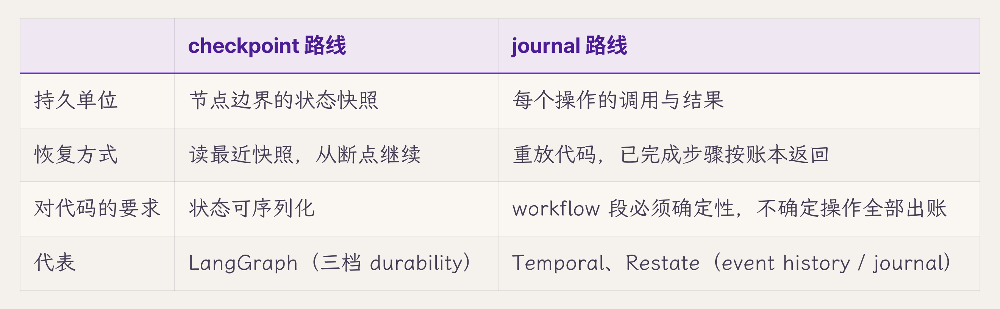
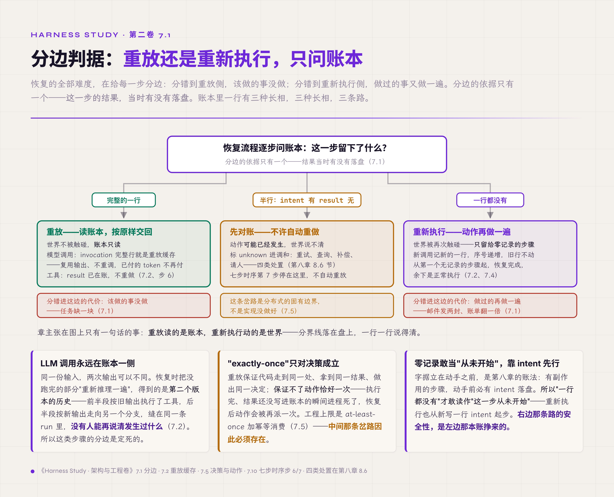
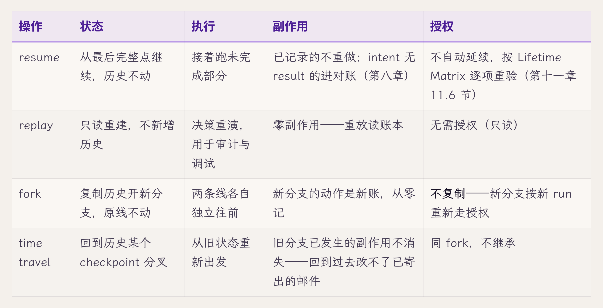
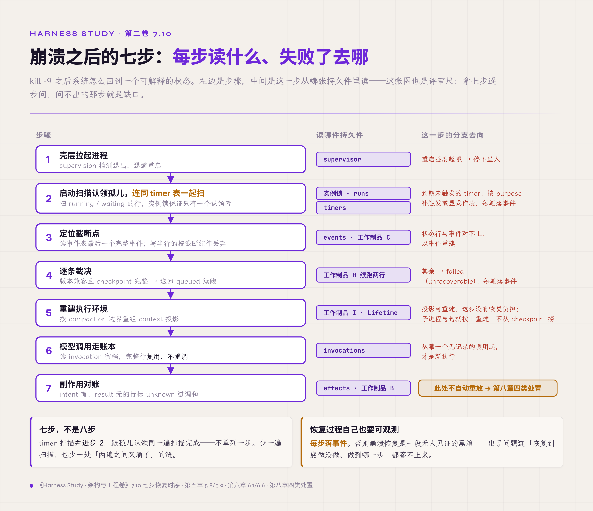

# 七、Durable Execution 与重放

> v1.0 · 2026-07-23 · 依据 SPEC.md §十四 章 spec（恢复章：重放/重新执行之辨＋checkpoint/journal 两路线＋四操作四后果＋kill -9 七步时序主场）· 四维评审四路已落实 · **用户过审（2026-07-23，"过审，进入下一章"）**
> （本版本注与"审稿日志""引用来源"两节同属编辑工作区，出版前整体删除。）

第六章把账本立全了：状态有归属，事件有秩序，投影有契约。收尾时留下的四个问题全部指向同一个时刻——进程崩溃重启之后。事件表的最后完整行怎么定位？已经付过钱的模型调用怎么不再付第二次？"重放记录"与"重新执行"差在哪里？两个 worker 同时来恢复怎么办？第五章的启动扫描已经能把孤儿 run 裁决为"续跑或终态化"，第五章的转移表（工作制品 H）也给续跑立了 guard——state_machine_version 兼容且 checkpoint 完整——但从"裁决续跑"到"真的跑起来"，中间隔着本章的全部内容。

崩溃恢复是对 runtime 最严格的一次检验，理由第一章 1.1 节就埋了：执行跨越故障边界，进程活不满全程是常态。本章的主张压成一句：durable execution＝落盘点＋重放，而**重放读的是账本，重新执行动的是世界**——两者的分界线必须落在盘上，一行一行说得清。读完本章，手里应当多三样东西：一张七步恢复时序、一张四操作后果表、一份 durability 选型记录。

## 7.1 重放与重新执行：每一步先分边

两个词在日常语言里混用，在恢复语义里是两回事。**重放**：读已经落盘的记录，把当时的结果按原样交回执行流——世界不被触碰，账本只读。**重新执行**：把动作再做一遍——模型再调一次、命令再跑一次，世界可能被第二次改变。恢复的全部难度就在给每一步分边：分错到重放侧，该做的事没做，任务缺一块；分错到重新执行侧，做过的事又做一遍——邮件发两封、文件改两次、账单翻一倍，第一章 1.1 节那个"重试无害"默认值的失效现场原样重演。

分边的依据只有一个：这一步的结果当时有没有落盘。落了，走重放；没落，才轮得到重新执行的讨论——而其中有副作用的那些，连重新执行都要先过对账（第八章）。所以本章反复回到同一个动作：把分界线钉在持久层上，让恢复流程照账本行事，不靠猜。

## 7.2 LLM 调用永远在账本一侧

有一类步骤的分边是定死的。模型调用不能重新执行并期待相同输出——同一份输入，两次输出可以不同，这是第一章立的第三个本质变量。恢复时把没跑完的部分"重新推理一遍"，得到的是第二个版本的历史：前半段按旧输出执行了工具、写了文件，后半段按新输出走向另一个分支，两个版本在同一条 run 里缝合，没有人能再说清发生过什么。第一章 1.4 节从这条失效推出了 model adapter 的约束——每次调用完整留档，复用记录、永不重调——第六章的 invocation 行落实了留档，本章补上它的恢复语义：invocation 记录就是**重放缓存**。恢复流程读到一行完整的 invocation，直接把它的输出交回执行流；读到半行或没有，才发起新调用——并且这次调用记的是新的一行，序号递增，旧行不动。

顺带把账算了：留档复用省下的还有钱和时间。恢复即重跑的系统，每次崩溃都把已付费的 token 再付一遍；长任务崩在第九步，前八步的模型开销全部重付。账本一侧的纪律，同时是成本纪律。

## 7.3 checkpoint 路线：存档点，与它不管的三件事

业界把"落盘点＋重放"做成了两条路线，先看第一条。checkpoint 路线的代表是图编排框架 LangGraph：图的每个节点边界存一份状态快照，恢复时从最近的快照继续。它把持久的力度做成了三档显式参数——exit（只在执行结束时存，最快，中途崩溃无从恢复）、async（异步存，下一步先跑，崩溃窗口里的 checkpoint 可能丢）、sync（同步存完再走，最稳最慢）【规范/官方文档，LangGraph durability 文档】。三档的价值在明码标价：async 的丢失窗口写在文档里，选它的人知道自己拿性能换了什么——第一章 1.1 节"进程可弃"默认值的残留形态，在这里成了一个自觉的选项。

这条路线有一处必须讲清楚的边界，来自一篇竞争方的批评文章【厂商实践，durable workflow 厂商 Diagrid，利益相关】：checkpoint 只是存档点，恢复系统还差三件事——谁检测到进程死了？谁触发恢复？两个实例同时来恢复同一条线程怎么协调？框架把这三件全部留给使用者。立场归立场，这三问本身成立——而且读者应当眼熟：失败检测是第五章的启动扫描与看门狗，恢复触发是壳层把进程拉起来之后的第一件事，跨实例协调是第五章 5.8 节的双重认领与 fencing。本卷把这三件放在恢复语义之前讲，顺序就是答案：存档点要补成恢复系统，缺的三件一件都绕不开。

## 7.4 journal 路线：账本重放，动作出账

第二条路线不存状态快照，存事件账本。代表是 workflow 引擎 Temporal 与 Restate：workflow 代码要求确定性，全部执行历史进 event history；崩溃后把代码从头重放一遍，已完成步骤的结果从账本按原样返回、不重新执行，走到第一个没有记录的步骤，恢复完成【规范/官方文档，Temporal/Restate 文档】。有副作用的外部操作——模型调用、工具执行——必须收进 Activity（Restate 以 ctx.run 承载），在账本上占一行。取时间、取随机数不进 Activity，走的是 SDK 备好的确定性 API：Temporal 各 SDK 的 replay-safe 时钟与随机数接口，结果一样进 event history；Restate 的 ctx.date 与 ctx.rand 另走一路，后者按 invocation ID 播种，重放时算出同一个值。纪律是同一条——凡不确定，皆留痕；区别只在外部副作用要跨进程出账，时间与随机数定住一个值就够。决策靠重放重建，动作靠账本免重做。

这条路线与 agent 的契合度，有一个工业实例可以量出来：Temporal 与 OpenAI Agents SDK 的集成把 Runner 改成抽象基类、由 Temporal 提供实现，agent 定义与编排代码基本不动，每次 agent 调用被隐式包成 Activity（当前文档口径是模型调用）【厂商实践，Temporal 官方博客】。工具不在隐式之列：要走 Activity 必须逐个显式包装（Python 的 activity_as_tool、TypeScript 的 activityAsTool），留在 workflow 内的内联工具受确定性约束、不得做 I/O【规范/官方文档，Temporal OpenAI Agents SDK 集成文档】。agentic loop 在 workflow 里就是普通的 while 循环——编排一侧"把 agent loop 变 durable 的最小改动面"就是这个量级；工具那一侧要逐个重写，才是迁移成本里最大的一块。本卷第一章 1.4 节引 Temporal 当 model adapter 的工业先例，出处即此。

两条路线摆在一起，差异一句话：checkpoint 存"走到哪了"，journal 存"每步拿到了什么"。

本卷的单机参考实现走哪条？7.10 节给答案——两条都不整套照搬，只取两者共用的那几件。

## 7.5 决策可重放，动作可能执行多次

journal 路线有一句承诺容易被读宽："重放保证 exactly-once。"它保证的是**决策**恰好一次：重放时代码走到同一处、拿到同一结果、做出同一决定。它保证不了**动作**恰好一次：Activity 执行完、结果还没写进账本的瞬间进程死了，恢复后账本里没有这一行，动作会被再派一次——外部世界被改了第二次。这属于分布式的固有边界，与实现好坏无关：跨越进程与网络边界的副作用，工程上能做到的是 at-least-once（至少一次）执行加幂等消费。所以重放的安全前提是副作用不重复，而这道保证要靠账本之外的一套纪律——幂等 key、去重和对账，第八章的全部内容。本章先把边界钉牢：账本管决策，账本外的世界另有账法。

*图 7.1 · 分边判据：账本里一行的三种长相，三条路*

## 7.6 心跳、超时与失败检测

副作用的账交给第八章；回到恢复机器自身，它先得判断一条 run 是死是活——这就要兑付第五章看门狗欠下的那个定义：它扫"超过 deadline 再无活跃事件"的 run，活跃事件是什么？单机参考实现不设专门的心跳信号——step 与 effect 的事件本身就是心跳：每个事件都带落盘时刻，最近一个事件的时刻就是这条 run 最后的生命体征。工具在跑、模型在流式输出，事件就在追加；事件停了超过阈值，看门狗按第五章的转移表送它去 failed（infra_failure）。分布式引擎把这件事做成显式协议——Temporal 的 Activity heartbeat、超时分层（调度超时、执行超时、心跳超时各管一段）——单机降维后只剩一条纪律：执行中的组件必须持续留下事件，沉默即失联嫌疑——工具僵死、流断在半空却不再落任何 step 事件，看门狗凭的就是这段沉默。

超时之后是重试，重试策略与第五章 5.4 节的终结原因四类直接接线：基础设施失败值得按退避重试，业务失败重试无意义，策略拒绝重试是浪费甚至攻击信号，用户取消不重试。重试预算的完整治理（几次、多久、谁出钱）是运行策略，进第三卷；本章只立接口：每次重试是新的 invocation 行或新的 attempt_no，账本上看得见第几次。

## 7.7 durable timer：定时唤醒也是状态

恢复语义里最容易漏的一件：时间。排队超时、waiting 的 deadline、看门狗的扫描周期、"三天后提醒我"——全是定时唤醒。朴素做法把它们放进进程内定时器（setTimeout 一类），失效方式无声：进程死了，定时器随进程蒸发，重启后没有任何代码知道"本该有个三天后的闹钟"。waiting 的 run 从此真的永远 waiting——第五章给它的 deadline 形同虚设。

所以 timer 是持久状态：工作制品 A（State Registry，状态注册表）的 timer 行早已登记（fire_at、purpose、status），本章兑现语义——定时唤醒写进库，进程内定时器只是它的运行时投影；重启后启动扫描连同 timer 表一起扫，到期未触发的按既定 purpose 补触发或显式作废，每笔落事件。第五章的排队超时、挂起过期、看门狗周期，全部踩在这张表上。

## 7.8 四种操作，四种后果

恢复语义走到这里，可以把整族操作摆开了。resume、replay、fork、time travel 四个词经常混说，分开的办法是问四个后果：对状态、对执行、对副作用、对授权，各自发生什么。

表里最重的一格是 fork 与 time travel 的副作用列：状态可以回卷，世界不能。LangGraph 把 time travel 做成了 checkpoint 分叉的正式能力、Agent SDK 把 fork 做成 session 的第三种恢复语义【规范/官方文档】——两家都只承诺对话与状态层面的分叉，谁也没承诺撤销外部动作，第六章 6.10 节"删除三义"的边界在这里原样适用。授权列同理：state continuity 推不出 authority continuity，四种操作没有一种自动携带旧授权——这条铁律的完整展开在第十一章。托管方案还多一个保存期限问题：OpenAI 的 Responses 单独存在时有默认保存期限、挂进 Conversation 则不设到期上限【规范/官方文档】。真相能活多久，本身就是恢复契约的一部分——继第六章 Agent SDK 那个按工作目录编码的隐式键之后，保存期限是又一个。

## 7.9 两个 worker 同时来恢复

多实例部署下，恢复自己会互相冲突：两个实例同时扫到同一条 interrupted 的 run，同时裁决续跑，历史被写成两份。这个问题第五章 5.8 节已经立过解法——认领即取租约、写入带 fencing 编号，慢者被状态层拒之门外；本章只补两条路线各自的形态：journal 引擎靠中心 server 唯一派发任务，天然单认领；checkpoint 路线（Diagrid 批评的第三问）框架不管，要么自建 lease，要么保持单实例。单机参考实现的答案最便宜：实例锁，第二个进程根本起不来。

## 7.10 单机最低充分解：七步恢复时序

两条路线都看完了，回到本卷的参考实现。单机不需要整套引擎——需要的四件前六章已经全部立完：事件表（第六章）、effect 的 intent/result 两段账（第一章立、第八章展开）、启动扫描（第五章）、timer 扫描（7.7 节）。四件拼起来，就是单机的最低充分解。它的运行形态是一条七步时序——kill -9 之后进程重启，逐步走：

1. **壳层拉起进程**（第五章 5.9 节）：supervision 检测退出、退避重启；重启强度超限则停下呈现给人。
2. **启动扫描认领孤儿，连同 timer 表一起扫**（第五章 5.8 节、7.7 节）：扫出 running/waiting 的行，单机凭实例锁保证只有一个认领者；同一遍扫描过 timer 表，到期未触发的按既定 purpose 补触发或显式作废，每笔落事件。
3. **定位截断点**（第六章 6.1 节）：读事件表最后一个完整事件——写到一半的行按工作制品 C（Event Schema）的截断纪律丢弃；状态行与事件对不上的，按仲裁规则以事件重建。
4. **逐条裁决**：工作制品 H 的续跑裁决两行——state_machine_version 兼容且 checkpoint 完整的送回 queued 续跑，其余终态化 failed（unrecoverable）；每笔裁决落事件。
5. **重建执行环境**：按 compaction 边界重组 context 投影（第六章 6.6 节）——投影可重建，这一步没有恢复负担；工具子进程、沙箱句柄按 Lifetime Matrix 重建，不从 checkpoint 里捞。
6. **模型调用走账本**：续跑的 run 读 invocation 留档，完整行复用、不重调（7.2 节）；从第一个无记录的调用起才是新执行。
7. **副作用对账**：effect 账本里 intent 有、result 无的行，标 unknown 进调和流程——重试、查询、补偿还是请人，按第八章的四类处置，此处不自动重放。

七步走完，系统回到一个可解释的状态：每条 run 有归宿，每笔账有着落，没有任何一步靠"大概没问题"。第四章 4.5 节的恢复动线概览在此兑现为全文；这条时序也是本章带走的那张图——评审任何系统的恢复设计，拿七步逐步问"这一步读什么、失败了去哪"，问不出的步就是缺口。

*图 7.10 · 崩溃之后的七步：每步读什么、失败了去哪*

## 7.11 什么时候需要引擎

最低充分解够用到什么时候？判断条件沿第四章 4.7 节的切换信号再加两条本章专属的：编排要跨进程、跨服务时（工具在远端 worker 执行、多 agent 分布式协调），journal 引擎的账本一致性开始值回票价；durable timer 密度高、精度要求上来时（成百上千个定时唤醒、错过成本高），自建扫描的维护成本超过引擎接入成本。反过来，单机单实例、副作用集中在本地文件与少量 API 的场景——本卷的参考画像——四件套加七步时序就是全部，引擎的确定性约束（workflow 代码不许有不确定操作）反而是一笔不小的改造税。选型记录的完整对照表住工作制品 L 的 L2 节，深潜章不再回头讨论。另有一类托管长任务形态——轮询式后台执行（background=true 一类）——它解决的是断连与长等待，归交互面管，账法交第九章，不在本章 durability 谱系内。

## 7.12 边界声明

本章的依据构成要如实交代。durable execution 的产品生态已经成熟——Temporal、Restate、LangGraph、DBOS 各有生产部署——但 **agent 专属**的运行时持久化问题：LLM 结果复用、副作用对账与压缩边界即 checkpoint 边界的组合问题，截至 2026-07 的检索几乎没有同行评审研究（检索范围：arXiv 及 OSDI/SOSP/NSDI/EuroSys 2026，记录见编辑工作区指针）。本章通篇是传统持久化理论的降维借用加产品契约的转述，没有一篇权威论文背书这套组合——读者不必等它，它暂时不存在。反过来读，这块空白正是本章的位置：七步时序与四操作表，是在这块空白上给出的第一份可操作答案。相应地，本章结论的确定性档位是第二章的"推断"档居多，破坏实验就是给它们升档的路径。

## 破坏实验：副作用已发生、账本未记下时杀进程

按四步测量协议执行：

1. **破坏动作**：让一个有真实副作用的工具（写文件、发请求）执行完成，在 result 落盘之前 kill -9；重启走七步恢复。
2. **观测点**：effect 账本该行的状态；恢复后的调和事件；副作用是否被第二次执行；最终 run 的终态与对账记录。
3. **判定**：通过＝该行停在 intent 有、result 无，恢复流程将其标 unknown 并进入调和，未自动重放；外部世界恰好一份副作用。失败＝恢复流程重新执行该动作（两份副作用），或该行被静默标成功/失败（无调和记录）。
4. **复跑**：三种工具类型（本地文件写、幂等 API、非幂等 API）各 N=3。

实证状态照实分层【经验】：思想实验，判定口径先立——参考实现与完整矩阵是第十四章标准故障包工单；桌面案例项目现状是最近的对照物：其内部审计已把"首期 durable intent/result 只覆盖写文件、编辑、git 三类高副作用动作"定为实施路线，partial/unknown 禁自动重放、交人工调和——增量铺开的工程节奏与本章口径一致。

## L 级自检

按第一章的成熟度尺（L1 能跑、L2 能看，全表见第一章 1.3 节）。本章机制的 L2 有个容易漏的侧面：恢复过程自己也要可观测——扫描、裁决、复用、对账每步落事件，否则崩溃恢复就是一段无人见证的黑箱，恢复引入的错误比崩溃本身更难查。七步时序每步的"落事件"要求就是这条底线。桌面案例现状照第三章的账："[已中断]"标记是恢复裁决可见的最小形态，已实测；invocation 留档复用、timer 表、对账流程未实现——照实标注，第十四章工单。坐标系落位补一句：本章与第五章分守转移契约——第五章管"状态怎么合法地变"，本章管"崩溃后这些变化怎么照账本重演"，第一章 1.3 节矩阵里"恢复即重放转移"那格在此兑现。四问落位：可观测由七步时序每步落事件兑现，稳定由破坏实验三类工具 N=3 复跑兑现；可控押在"分边只认落盘、重放只走账本"上；闭环的消融数据——最低充分解对比引擎——留给第十四章参考实现。

## 交付物

1. **恢复语义表**（四操作×四后果，7.8 节全表；工作制品 L 收录）——第九章讲断线重连、第十一章讲授权重验时都回指此表；
2. **durability 选型记录**（工作制品 L）——两条路线的取舍条件与单机最低充分解的适用边界；
3. **replay fixture**（第十四章工单）——七步时序的可执行验证，含破坏实验三类工具矩阵。

近道读者可单取 7.8 节四操作表与七步时序作评审尺——问被评系统"resume 时授权跟不跟着回来"，一问见底。

## 立即可做的一个动作（五分钟）

builder 版本：在测试环境对自己的系统 kill -9 一次——run 正在跑的时候（用一次性副本或测试库，别对连着真实邮件、账单的实例动手）。重启后数三样东西：卡在 running 的行谁收敛了？已经完成的模型调用重新付费了吗？已经执行的工具动作重放了吗？三问有一问答不出，七步时序里对应的那一步就是自己系统的缺口。

assessor 版本：不用动手，问一个问题——"上一次生产环境进程崩溃之后，发生了什么？"拿七步时序对照对方的叙述：说不清哪一步的，按该步缺失记；答"没崩溃过"的，按第五章那条 SQL 查一次 running 超过 24 小时的行，再决定信不信。

## 下一章

七步时序的第七步停在"标 unknown 进调和"——重放安全的前提是副作用不重复，而这个前提本章只是引用，没有兑现。intent 无 result 的账到底怎么对？幂等 key 从哪来、管多久？"超时但远端已经成功"怎么调和？工具返回成功、外部世界却没变，谁来戳穿？副作用的完整账法，第八章。

## 审稿日志

> （编辑工作区：本节与"引用来源"节出版前整体删除。）

| 轮 | 检查 | 命中与修改 |
|---|---|---|
| 版本史 | — | v1.0（2026-07-23）：依 SPEC §十四 spec 首写。大纲条目映射：7.1-7.12 与大纲同号（7.10 含 timer 扫描并列为第 8 步；对照素材 LangGraph/Temporal/Restate/Agent SDK/Responses 分散入 7.3/7.4/7.8）。三张欠条兑付：H 第 16 行 resume guard（步 4）、第五章看门狗 heartbeat（7.6）、kill -9 七步时序（7.10 主场，第四章 4.5 概览兑现） |
| 章级验收自测 | SPEC §十四 清单 | 正文表格 2（两路线对照＋四操作四后果）＋配图占位 1（七步时序图）；新概念约 9（≤10 达标）；前向引用实计约 13 处/4 章（第八章 6＋第九/十一/十四——超 ≤8 预警线，SPEC §七.1 照记不拦稿，集中于第八章债务脊）；一手证据 2 处（桌面案例 [已中断] 回指、内部审计增量铺开路线）；外部权威 ≥5（LangGraph／Temporal／Restate／Diagrid（利益相关标注）／Agent SDK＋Responses）；业界对照带失效点 ✓；破坏实验四步协议＋实证分层 ✓；L 级自检（恢复自身可观测＋坐标系落位句）✓；双读者动作（builder 含安全垫句）✓；文字化引用零 § ✓ |
| 四维评审 | **四路已跑齐并全部落实（2026-07-23）：technical A-／style B+→A-（P1 清零）／cybernetic A-（方法论比例实测 62%）／business A-，零 P0 遗留** | technical/style/cyber 共同 P1：七步时序实列 8 项→timer 扫描并入步 2、删第 8 项，标签与列表自洽。style P1：7.5 段过载（两处"不是X是Y"＋"挨了两下"身体化＋巨句）→按成品句重写；P2：整句加粗漏网 1 处去粗（恢复可观测）、7.1 节名去刀比喻改"每一步先分边"、"5.8 节"补章名、7.8 末巨句拆分、H 行号引用改语义命名（两处）；P3："C 节"→工作制品 C、"骨头"→"共用件"、各家补身份定性词（图编排框架/workflow 引擎/durable workflow 厂商）。business P2：内联"终稿前回核"6 处全部移入编辑区、Diagrid 标签去"折价"指令语（立场由散文承载）、Responses 30 天 TTL 降定性＋待补官方指针；P3：7.12 补正面锚点句（空白即本章位置）、builder 动作加安全垫。cyber P1：坐标系落位句（与第五章分守转移契约＋"恢复即重放转移"格兑现）；P2：7.5→7.6 补桥接句、7.6 补失效现场半句；P3：审稿日志前向引用自测更正（"第十"系"第九"之误）。technical P2：background mode 补归属句（交互面，账法第九章）；P3："两栏"→L2 对照表、"长期保存"→"不设到期上限" |
| 终稿回核清单 | — | LangGraph durability 参数名（1.0 后变动）；Temporal×OpenAI 集成时效；Restate durable 原语准确称谓（ctx.run 口径已按素材，官方术语再核）；Responses 保存期限数值＋官方指针（补上后可恢复具体数字）；Fowler/Agent SDK 沿第六章清单 |
| R1 grep 红线 | 首稿自查（四维评审后复跑） | "你"系 0（含引号内评审问句改"这一步读什么"）；元叙述 0；模糊词 0；显式禁形 0；广义对比 1 处（主张句"重放读的是账本，重新执行动的是世界"——平行对举，motivated）；整句加粗自查预清 5 处（存档点/账本管决策/持续留事件/状态可回卷/重放缓存收窄至术语），仅余章主张句；语域自查："打架"→"互相冲突"、"死亡嫌疑"→"失联嫌疑"；体量首稿 157 行 |
| 终稿回核清单 | 2026-07-27 正文【】标注清理（用户指令） | OpenAI Responses／Conversation 保存期限数值待补官方指针（托管方案段） |

## 引用来源

> （编辑工作区：本节出版前整体删除。）

- 【规范/官方文档】LangGraph durable execution／durability 三档（exit/async/sync）、checkpoint 分叉 time travel（7.3、7.8；终稿前回核当前文档，注意 LangGraph 1.0 后参数名变动）。指针 research/volume2/05。
- 【规范/官方文档】Temporal（event history、确定性约束、Activity、heartbeat/超时分层）、Restate（journal、durable step、单派发）（7.4、7.6、7.9；终稿前回核）。指针 research/volume2/05、07。
- 【厂商实践】Temporal 官方博客——OpenAI Agents SDK 集成（Runner 抽象基类、每次 agent 调用隐式 Activity 化）（7.4；终稿前回核）。指针 research/volume2/07 §1。
- 【规范/官方文档】Temporal OpenAI Agents SDK 集成文档（AI cookbook 与 TypeScript 集成页）——模型调用走 Activity、工具需显式包装（activity_as_tool／activityAsTool）、内联工具不得做 I/O（7.4；终稿前回核）。
- 【厂商实践，利益相关】Diagrid——"checkpoints are not durable execution"批评（失败检测/恢复触发/跨实例协调三问）（7.3、7.9；竞争方立场已在正文标注，终稿前回核原文）。指针 research/volume2/05。
- 【规范/官方文档】Agent SDK session fork（7.8，回指第六章）；OpenAI Responses TTL（Response 默认 30 天、挂 Conversation 无 TTL）（7.8；终稿前回核）。指针 research/volume2/03、04。
- 【经验】桌面案例项目：\[已中断\] 恢复裁决实测（回指第三章）；内部审计的 durable intent/result 增量铺开路线（破坏实验实证分层；指针 research/volume2/11 条 10/30）。
- 【经验/推导】"agent 专属运行时持久化几乎无评审研究"边界声明——检索范围 arXiv 及 OSDI/SOSP/NSDI/EuroSys 2026，记录指针 research/volume2/02（7.12）。
- 回指素材：第一章 1.1 节（三默认值）、1.4 节（model adapter 推导、Temporal 先例）；第二章（四档确定性）；第四章 4.5/4.7 节；第五章 5.4/5.8/5.9 节、工作制品 H 第 16/17 行；第六章 6.1/6.6/6.10 节、工作制品 A timer 行、Lifetime Matrix。
