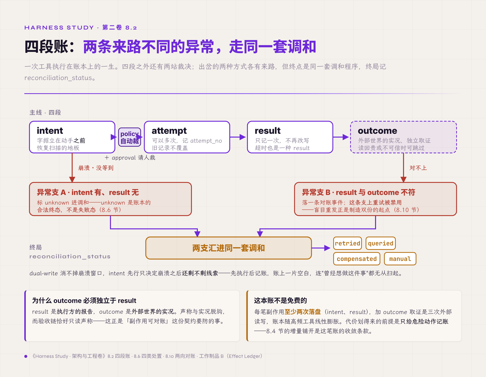

# 八、工具执行与副作用

> v1.0 · 2026-07-23 · 依据 SPEC.md §十五 章 spec（副作用章：Effect System＋四段账＋提交点纪律＋幂等与对账＋Guarded Commit/Plan Lease）· 四维评审四路已落实 · **用户过审（2026-07-23，"继续第九章"）**
> （本版本注与"审稿日志""引用来源"两节同属编辑工作区，出版前整体删除。）

第七章的七步恢复时序，最后一步停在一行奇特的账上。那一章的破坏实验立过现场：一个写文件的工具执行完成，result 落盘之前进程被 kill -9——重启之后，effect 账本里这一行只有意图，没有结果。恢复流程的裁决是把它标成 unknown、送进调和，不自动重放。可是调和是什么、怎么调，第七章按下没讲，遗留问题记了四条：intent 无 result 的账怎么对？幂等 key 从哪来、管多久？"超时但远端已经成功"怎么调和？工具返回成功、外部世界却没变，谁来戳穿？

四条其实是同一本账的四页。工具调用是模型触碰真实世界的唯一通道——写盘、发信、改库，每一笔都出了系统的门，出了门就收不回。本章的主张压成一句：**先立字据，再动世界**——每个副作用在执行之前先落盘意图，账走四段；重复靠幂等挡住，丢失靠对账收回；工具的返回值只是执行方的报告，作数的是外部世界的独立证据。读完本章，手里应当多三样东西：一张四段账状态机、一份工具契约模板、一套让计划随世界变化而失效的机制。

## 8.1 函数语义装不下副作用

先看不设防的系统怎么执行工具，多数代码的起点都是它：组装参数、发起调用、拿到返回值、塞回 context、进下一轮。工具调用长得和函数调用一模一样，常常就是一次 await。

失效方式有三个现场。现场一：网络抖动，调用超时，重试一次——收件人收到两封邮件。超时只证明"响应没有回来"，证明不了"动作没有发生"，重试把一次不确定变成了两次确定。现场二就是开场那行账：动作做完、记录未落，进程死在两者之间，重启后没有任何代码知道这件事做没做过。现场三：工具返回 success，指定的文件却不在盘上——包装脚本吞掉了错误码，或者远端收下请求又在后台失败，返回值与世界各说各话。

三个现场背后是同一个失效根因。函数调用的心智模型默认三件事：调用与返回是一体的；失败等于没发生；返回值等于事实。在进程内这三条近似成立，编译器和运行时替它们担保。跨出进程与网络的边界，三条逐一失效：调用与返回之间隔着崩溃窗口；"失败"常常只是"不知道"；返回值是执行方的一面之词。第一章 1.1 节拆过的"重试无害"默认值，落到工具层就是这三条的合谋。

设计从这里出场：把工具层当作一个 Effect System 对待——副作用是一等公民，每一笔有账（四段记录，8.2 节）、有权（谁批准、谁有权提交，8.3 节）、有调和（账与世界对不上时的收敛程序，8.6 节起）。第四章 tool executor 的组件卡写着"副作用唯一大门：先落盘意图→执行→落盘结果"，那是卡面的一句话，本章把它展开成完整机制。

## 8.2 四段账：从意图到实况

账的结构第一章就登记了——工作制品 B（Effect Ledger，副作用账本）：一次工具执行一行，账分四段，intent→attempt→result→outcome。四段各由一种失效逼出，逐段看。

**intent 先行**。字据必须立在动手之前。写账本与改世界分属两个系统，无法一次原子提交——这个结构就是教科书里的 dual-write，哪个顺序都躲不掉。intent 先行消不掉两写之间的崩溃窗口，它只决定崩溃之后还剩不剩线索：先执行、后记账，世界已经变了、账上一片空白，连"曾经想做这件事"都无从扫起；intent 先行，开场那行 unknown 账至少还知道"有人想写这个文件"。intent 落盘是恢复扫描的地板：从此崩溃后最坏的处境是"做没做过存疑"，被排除的是"根本不知道该疑什么"。

**attempt 可以多次**。重试是常态，但每次重试记新的 attempt_no，旧记录不覆盖——第几次尝试、各自何时发生，账上看得见。第七章 7.6 节立过这个接口，这里是它的落座处。

**result 只记一次**。工具返回什么照实记：成功、失败、超时各是一种 result——超时也是 result（内容是"没等到"），空白只属于还没返回的行。result 一旦记下不再改写，重试的结果记在新 attempt 名下。

**outcome 独立于 result**。result 是执行方的报告，outcome 是外部世界的实况，两者为什么必须分开记，8.10 节专门说。

四段之外，完整的流水线还有两站：intent → policy → approval → attempt → result → outcome。policy 与 approval 站在字据与动手之间——意图立了字据，还要过裁决：policy 自动裁（规则允许吗、预算够吗），approval 请人裁（这一笔要不要人签字）。两站的位置本章立定，内容各有主场：审批怎么挂起、挂多久，第九章；规则怎么写、谁能改，第十一章。

*图 8.2 · 四段账：两条来路不同的异常，走同一套调和*

到这里，一次工具执行在账本上的一生完整了。这本账不是免费的：每笔副作用至少两次落盘（intent、result），加 outcome 取证就是三次外部读写，账本随高频工具线性膨胀——代价划得来的前提是只给危险动作记账，8.4 节的增量铺开正是这笔账的收敛条款。接下来的问题是：立了字据、过了裁决，动手的那一刻，凭据还作数吗？

## 8.3 提交点：授权在动手那一刻还算数吗

第六章 6.0 冻结实体链时留过一句裁决：执行权不进实体链——租约、副作用许可是授权账，答"谁现在有权动手"，与 run 的状态账分开记，主场在本章。现在兑付，用的是一次真实的工程改造。

背景两句：第三章解剖过桌面案例项目的"数据丢失"事故，那轮摸底之后约两周（2026-07 下旬），该项目做了第二轮内部审计——这次的对象从单场事故换成修复路线本身，审计把最高优先级指给了副作用许可：run 的抢占互斥修好了，工具的写入却还没有跟执行权绑死【经验】。

失效场景是这样的：权限检查放在工具调用入口——进门验一次证，进了门随便走。可是入口校验与实际写盘之间隔着 await、用户确认框、文件 I/O，一段可能以秒计的窗口。窗口里世界会变：会话被新意图抢占，旧 run 被裁决让路——而旧 run 的工具调用早已过了入口检查，正在窗口里飞行，落地时把文件写进了已经易主的工作区。第五章 5.7 节的 TOCTOU 出在准入层，这里是它的工具层深水版：检查与提交之间的距离，就是并发写坏世界的窗口。

修复裁决一句话（脱敏转述）："仅在工具调用入口校验不算完成"——写文件、改文件、git 操作，在实际提交前复核同一份执行权。校验搬到提交点，窗口就关上了：无论中间隔了多少 await，动手那一刻的凭据必须是活的。Effect Gateway 这个名字由此有了准确释义：它指 tool executor 的提交面——intent 落盘加执行权校验，共同构成副作用的唯一出口；第四章的组件图不为它新增箱子。第六章按下的另外半句也在这里交代：多实例阶段，租约授予携带 fencing 编号，编号高水位随授权账落进持久存储，状态层在 effects 写入点校验编号、拒绝旧编号——提交点复核的分布式形态，第五章 5.7 节三件装备的最后一件在工具层就位。

同一现场还逼出三条配套纪律。

第一，**等待阈值只是等待阈值**。该项目原实现里，抢占等待旧 run 收尾至多十秒，超时静默放行新 run——而写文件一类工具不接受中途放弃，半个文件写不得，旧 run 卡过十秒，新旧两个 run 就并发写同一工作区。修复裁决的原话值得留着："10 秒只是可观测性阈值，不是 safety timeout"——观察等待可以设上限（超时报警、呈现给人），放行必须等到执行权真正交还。第五章 5.5 节"抢占必须先收尾"由此多一条失效变体：等待上限一到就放行，等于给收尾的闸门设了一个自动打开的倒计时。

第二，**派生副作用归属原 action**。写文件触发的自动快照、索引更新、通知推送——这些派生动作记在原 effect 名下（B 表的 derived_from_effect_id 字段），纳入同一 barrier、过同一份执行权校验。放任派生动作 fire-and-forget，等于在唯一大门旁边开了第二个出口：主动作等到了收尾，派生动作还在门外排队，run 结束之后才落地。

第三，**被拒的写入也留证**。执行权已收回之后到达的旧写入，拒绝，并落一条 zombie trace 事件——僵尸写者被挡下这件事本身是证据。第十三章的证据面要靠它回答"系统挡住过什么"：只记录放行的系统，说不清自己拦截过谁。这里与 8.12 节的反例事件是两种闭环：反例事件是"检测到矛盾必须改控制流"，zombie trace 是"控制流已经改了（拒绝），再把这次拒绝留成证据"——拒绝本身是纠正动作，trace 只负责让它可见。

分层的代价此刻看得见实物：租约的生效、停止中、已收回三态，与 run 的七状态，谁也不映射谁，追账要追两条线。换来的是两问各有各的答：任务到哪了，问 run；谁有权动手，问租约。

## 8.4 重复与丢失只能二选一

账与权立完，回到开场四问里最老的一问：怎么保证不重复不丢失？先把一个没有商量余地的结构说清楚。请求发出去、回答没等到，此刻的选择只有两个：不再发，接受可能丢失（at-most-once）；再发一次，接受可能重复（at-least-once）。exactly-once 没有第三个按钮可按——它是前两个的工程合成：按 at-least-once 执行，靠幂等消费把重发无害化。第七章 7.5 节钉过这条边界（重放的恰好一次只覆盖决策，跨进程的动作做不到），本章把它落成工具层的纪律：每个有副作用的工具，要么幂等（天然的或靠 key），重发无害；要么可补偿，做过了还能收回；要么显式登记为不可重放——没有第四种。

登记的形态是给工具标 action class，四类：**read_only**（无副作用，重复零成本）、**idempotent**（重发无害，天然或靠 key）、**compensatable**（有逆操作可收回）、**non_replayable**（发出即定局，邮件、支付、不可逆删除）。分类出自桌面案例项目内部审计的同一批裁决，配套的还有节奏：durable intent/result 首期只覆盖写文件、编辑、git 三类高副作用工具，读类工具不铺——账本是给危险动作记的，增量铺开，先记最怕重复的【经验】。

## 8.5 幂等 key 的来源、作用域与保留期

"靠 key 幂等"四个字里藏着三个工程问题，逐个答。

**来源**。key 必须派生自持久坐标——工作制品 B 登记的裁决是 run_id 加 step 序号，再加该 step 内的 effect 序号（第三维也可直接用模型返回的 tool_call_id）：一个 step 挂多笔工具调用时，各自要能分开。反面有两个：内存计数器，重启归零，崩溃后重发的 key 对不上崩溃前的账；随机数，每次重试生成新值，而幂等 key 的全部意义恰恰在重试之间保持不变——同一逻辑动作，无论试几次，key 唯一。

**作用域**。key 在谁的范围内查重？工具层的 key 挡的是同一笔工具调用的重试；用户重发同一意图（双击、客户端超时重发）由第五章 5.6 节的入口幂等挡在准入处。两层各管一段，混用会漏：入口 key 挡不住内核自己的重试，工具 key 挡不住用户开的第二个 run。

**保留期与冲突**。去重表不能无限长，总有一天要清——清掉的那一刻，保证就到期了。业界把这件事写成了明码契约：支付基础设施商 Stripe 的 idempotency key 保留二十四小时，过期后同 key 到达按新请求处理；同 key 携带不同参数按冲突拒绝，去重只认"同一动作的重发"，冒名顶替不算【规范/官方文档】。这份契约的失效点在边界上：重试窗口一旦横跨保留期——排队三天的补偿任务带着当年的 key 醒来——同一动作照样执行两次。所以保留期的选择有硬约束：必须覆盖系统里最长的重试窗口，包括第七章那种崩溃三天后才恢复的重试。

## 8.6 intent 无 result：四类处置

现在可以接住第七章送来的那行账了。intent 有、result 无，处置空间恰好四种，判据是目标系统给了什么能力、这个工具登记的是哪类 action class。

| 处置 | 适用条件 | 动作 | 账的终局 |
|---|---|---|---|
| 重试 | action class 为 idempotent，key 在保留期内 | 同 key 重发，记新 attempt_no | retried——result 补齐，最坏也只是"再确认一次" |
| 查询 | 目标系统提供读接口 | 查远端实况，回填 outcome | queried——账收平，动作一次没多做 |
| 补偿 | action class 为 compensatable | 执行逆操作，记一笔新 effect | compensated——补偿也是副作用，也走四段账 |
| 未知 | 以上都不可用 | 标 unknown，呈现给人 | manual——诚实交给人裁决 |

表里最重要的一行是最后一行。unknown 是账本的合法终态，工作制品 B 第四条不变量在此兑现：超时且远端不可查、动作不可逆——这样的处境真实存在，系统能做的最好的事是承认不知道。假装能自动收敛的系统会把"不知道"写成"成功"或"失败"，两个都是编造；编造的代价第二章算过——评测器说谎时没有报警器会响。

## 8.7 长运行工具与任务句柄

秒级工具的四段账一页讲完，分钟级、小时级的工具把四件新事带进来。执行中的工具要证明自己活着——heartbeat 沿第七章 7.6 节的定义，工具执行落的事件本身就是心跳，账本记里程碑，沉默超阈值由看门狗接管。要能报告进度——progress 是投影，走事件与流的通道给人看，不进账本：百分比没有恢复价值，账本只记"哪一步完成了"。要能被取消——取消的传播路径（UI 到 server 到工具到子进程）是第九章的内容，本章只立账面要求：取消成功也是一种 result，被取消的 effect 同样要关账，result 写"已取消"。部分产出要有归宿——跑到一半被取消的工具吐出的半份产物，落 artifact 还是丢弃，按工具契约（8.11 节）事先声明，不靠事后即兴。

业界正把这件事标准化一层，方向却是往核心之外挪。MCP（Model Context Protocol，模型上下文协议）的 Tasks 在 2025-11-25 版规范里以 experimental 身份进了核心；定于 2026-07-28 定稿的这一轮修订把它移出核心协议，改为官方扩展 io.modelcontextprotocol/tasks。扩展版的形态是：tools/call 可以返回一个 durable handle，调用方用 tasks/get 轮询、tasks/cancel 取消，任务在 working、input_required、completed、failed、cancelled 五态之间走；句柄只发给在每个请求里声明了该扩展的客户端（草案口径）【规范/官方文档，RC】。对照的失效点看五态列表就能发现：句柄管的是交互面——问进度、要结果、发取消；五态里没有 unknown，没有对账态，副作用的重复与丢失一行账都没替调用方记。扩展给了长任务一个把手，账还得自己立：handle 的终态映射回四段账，failed 之后 intent 无 result 的行照旧走 8.6 节的四类处置。

## 8.8 子进程不能比 run 活得久

长运行工具常以子进程为执行体，这里埋着一个容易漏的绑定。朴素做法 spawn 完就不管，失效方式：run 已经 cancelled，子进程还在写文件——账已关，手还在动。第五章 5.5 节立的"抢占必须先收尾"、本章 8.3 节立的提交点校验，都拦不住一个根本不在账上的写者：它的写入不走 Effect Gateway，在操作系统层面直接落盘、不经任何登记。

绑定的做法两件。子进程生命周期与 run 绑死：工具起子进程一律进进程组，run 终态化时按组收割——这是第五章 5.9 节"子进程随父进程收割"在工具层的收紧版：那里绑进程存活，这里绑 run 终态，run 先于进程结束时同样按组收割。取消语义按工具声明：接受信号的，发信号加宽限期；写文件、git 一类不接受中途放弃的（半个文件写不得），取消的正确形态是"让它跑到提交点，在提交点拒绝"——8.3 节的提交点校验此刻兼任取消的执行器，工具自己不必是取消专家，大门守住就够。

## 8.9 不同的世界，不同的对账法

四类处置哪类可用，不由 harness 的意愿决定，由目标系统的能力决定。对账方式因此是工具契约的一栏，逐类看一遍，差异一目了然。

| 目标系统 | 天然能力 | 首选调和 | 陷阱 |
|---|---|---|---|
| 本地文件 | 可读回校验（存在性、checksum） | 查询对账 | 旁路写：不经工具的写入不进账（8.10 节） |
| HTTP API | 取决于对端：幂等 key？查询端点？ | 幂等重试，或查询回填 | "超时但远端已成功"且对端不可查——只能 unknown |
| 数据库 | 事务 | 事务边界内天然原子 | 跨库、跨事务的写退回 dual-write 处境 |
| 消息队列 | 至少一次投递＋消费端去重 | 幂等消费 | broker 承诺的 exactly-once 只覆盖 broker 内部 |
| 支付 | 双边记账，有对账单 | 定期对账 | 实时接口的成败与日终对账单可能不一致 |

本地文件那行的陷阱有官方实证。第六章数过 Agent SDK 的两条契约缝，其中文件 checkpoint 那条在这里换个角度再用：checkpoint 只追踪经 Write/Edit/NotebookEdit 工具的改动，官方文档明说经 Bash 的改动（echo 重定向、sed -i）不被捕获、无法回滚【规范/官方文档】。这段坦白的价值在于承认了一件事：唯一大门的"唯一"是脆弱的，任何给模型开 shell 的系统都天然存在旁路写。对策沿两向对账走（8.10 节），把旁路写从"不知道"变成"能查出来"。

支付那行则是整张表的地板：当目标系统自己也记账，最终真相既在 result 里也在远端账里，两本账定期对——这是"对账"一词的出身，金融系统用它对了几百年，agent runtime 只是把同一门手艺搬到了工具层。

## 8.10 报告与实况分开记

第六章 6.9 节立过一条根本限制，当时是给状态层立的：数据库说成功，不等于外部世界成功。工具层的对应形态：result 是报告，outcome 是实况——tool result 说成功，不等于动作真的成了。返回码是执行方的自我报告：工具作者忘了检查子命令的退出码、包装层把异常吞成 0、远端返回 200 而业务层拒绝——第一章 1.3 节的假通过、第二章的评测器谎报，同一族病在工具层的成员。

outcome 段的存在理由由此成立：**独立取证**。写文件的，读回来校验存在性与 checksum；调 API 的，查对端实况；生成 artifact 的，对 artifact 表——证据来源必须独立于被检验的报告方，第二章"检查器不能信任被检查者"在工具层的落地。独立取证的代价是每笔副作用多一次外部读写——写文件多一次 checksum 读回，调 API 多一次查询，个别目标的取证本身还可能带副作用或同样不可靠。所以取证只铺在读回廉价且可信的副作用上，能力弱、代价高的目标退回 unknown（8.6 节）。取证结果写进 outcome_status，与 result_status 分列：两者一致，账面干净；不一致，result 说成、世界说没成，落对账事件、进调和——走的是 8.6 节四类处置里的查询、补偿或未知，重试除外（result 已声称成功，盲目重发正是制造双份效果的起点），账终局同样收在调和记录里；工具的谎报被账本自己对了出来。

取证的完整形态是**两向对账**，工作制品 A（State Registry，状态注册表）artifact 行登记过的机制在此展开：账上有 effect、盘上无 artifact——执行虚报，方向一；盘上有文件、账上无 effect——旁路写入，方向二。8.9 节 Bash 的口子靠方向二收：定期拿文件系统实况对 artifact 登记，多出来的文件就是绕过大门的证据。两向都对得上，"唯一大门"四个字才配得上唯一。

## 8.11 工具契约：三层校验与防呆

前十节都在管"动了之后怎么办"，这一节管"动之前怎么少出错"。校验分三层，各有归属。schema 层管参数结构：类型、必填、取值范围，JSON Schema 挡在工具入口，拦得住形状错误。语义层管前置条件：路径存在吗、目标可写吗、状态允许吗，挡在工具实现里。编排层管时机：这个工具此刻该不该被调——预算还剩吗、policy 允许吗、执行权在手吗，挡在内核。三层错位是常见缺口：只有 schema 校验的系统，拦得住格式错误，拦不住格式完美的灾难——参数合法、时机致命。

比校验更前一步的是 poka-yoke——防呆：把危险从接口形态里消除，让错误无法被表达出来【厂商实践，Anthropic 工具设计指引】。两个可直接搬用的动作：强制绝对路径——相对路径依赖 cwd，而 cwd 是隐式状态，第六章刚数过它引发的契约缝；多步合一——把"查列表、挑一个、创建"合成单个工具，组合调用的中间态是幂等的敌人，单工具单 key 一次记账。第三个动作是防呆的补角，错误报文结构化——错误对象带 code、layer、retryable，尤其带 sideEffectState（none/unknown/partial/committed 四值）：防呆消除能被表达出来的错误，结构化报文接住剩下真的发生了的错误，调和流程不必从文本里猜副作用停在哪一步。这份错误协议的字段设计参照桌面案例项目同批审计的结构化错误 schema【经验】。防呆的代价是牺牲灵活：强制绝对路径挡掉相对路径的便利，多步合一挡掉工具自由组合的表达力——换来隐式状态与中间态两个幂等杀手从接口上消失。这笔代价在高副作用工具上划得来，在只读工具上未必，防呆同样按副作用等级增量施加。

以上各节的声明——action class、幂等来源、调和方式、取消语义、派生清单、错误报文——收进一份模板：工作制品 M（Tool Contract，工具契约模板），每个工具一份，本章交付。评审场景直接用：逐工具索要契约，拿不出的工具，它的每一项副作用语义都悬在空中。

## 8.12 计划的字据：Plan Lease

最后把镜头从单笔副作用拉远到多步计划。先分清两种 graph——第一章按下的一件下沉件：workflow graph 的节点是任务与 agent，边管 branch、join、retry，是编排层的控制流；world-state graph 的节点是对世界状态的表示，边是动作与它预测的转移，是 planner 的搜索对象。两种 graph 位于不同层，可以嵌套——workflow 的一个节点内部完全可以跑一套基于模型的搜索；"工程从 loop 进化到 graph"的流行叙事把两层混成了一层。

多步计划把副作用问题升了一维。模型在自己的世界模型里搜出一条五步计划，逐步执行到第三步，观察与预测不符——朴素做法照单执行完，后两步建立在已经失效的前提上，每一步都在对着幻觉认真执行。单笔副作用的字据（intent）管不到这里：五个 intent 每个都合法，作废的是它们共同依据的那张地图。

有一手参照。第六章 6.12 节的信念工件裁决，素材出自一个把世界理解写成可执行程序的 model-based harness 项目，它把"计划对着幻觉执行"做成了机制【项目自述，公开保留轨迹】：内部与外部分账——编辑模型、回放历史、搜索候选计划都不触碰环境，只有 commit 动作产生真实交互；每个真实动作之后对比预测与观察，一旦不符，立即废止剩余动作队列，差异作为反例回到建模循环。公开轨迹证明这套机制真的在跑：对其一条完整轨迹逐行统计，78 个动作、15 次提交、9 次误预测——每次误预测之后，轨迹都重新进入建模与提交流程，剩余队列没有一次被照单执行【公开工件】。15 次提交里 9 次误预测，也顺带标出了这套机制的价签：世界模型越粗，计划作废越频，重新建模的开销越高——它划得来的前提是作废比对着失效前提执行完剩余每一步便宜。

通用化成两件交付物，登记为工作制品 N（Plan Lease 与 Counterexample Event Contract，计划租约与反例事件契约）。**Plan Lease**：计划自带适用前提——model_version、history_cursor、policy_version 三个坐标，坐标任一变化、或一次真实 observation 与预测不符，计划即失效；resume 尤其要过这道检查：恢复的 run 手里攥着崩溃前的动作队列，世界在它沉睡时早就变了，第七章的恢复语义在计划层的延伸就是这一句——恢复动作队列之前，先验计划的租约。**Counterexample Event**：预测与观察的差异是控制流事件——它触发废止、触发重新建模，并把反例写进工作制品 K（Belief/World Model Registry，信念工件登记模板）的已知反例栏；只把差异记进日志的系统，等于看见了矛盾却不改主意。

Guarded Commit 与 8.3 节的提交点由此拼成同一道门的两层检查：提交点验执行权——谁有权动手；Plan Lease 验前提——凭什么这么动。权在人不对时挡住，前提在世界变了时挡住，两层都过，动作才出门。

## 破坏实验

按四步测量协议执行，四个场景共用观测点：effect 账本行状态、effect.* 与反例事件、外部世界实况。

1. **超时但远端实际成功**：对幂等 API 制造响应超时（远端已执行）。判定：同 key 重试后外部世界恰好一份效果、result 补齐；对无幂等无查询能力的目标重跑同场景，判定改为该行标 unknown 进调和、不自动重试。失败＝两份效果，或 unknown 被静默写成成败。
2. **返回成功但 artifact 不存在**：拦截返回值让工具谎报 success。判定：outcome 取证对出矛盾——该行 outcome 标失败、落对账事件。失败＝result_recorded 被直接当成终局，无独立取证。
3. **计划后改变 policy**：搜出多步计划后改一条 policy。判定：下一次 commit 拒绝过期租约、剩余队列废止。失败＝旧计划继续执行。
4. **单步预测落空**：制造一步 prediction mismatch。判定：反例事件落盘、剩余队列废止、回到建模。失败＝照单执行到底。

复跑 N=3。实证状态照实分层【经验】：场景 1/2 思想实验，判定口径先立——桌面案例项目的崩溃对账设计（先对 workspace、进程、数据库三方实况，再决定标已提交、补偿还是请人）已冻结、尚未实施，路线与本章口径一致；8.3 节的提交点纪律有产品级红测——该项目的修复批次先提交复现"副作用许可重叠"的失败测试、再修复转绿，含派生副作用归属两笔，owner 已验收；场景 3/4 的外部佐证是那个 model-based 项目的公开轨迹统计（9 次误预测，每次之后均重新进入建模与提交，剩余队列无一被照单执行），参考实现进第十四章标准故障包工单。

## L 级自检

按第一章的成熟度尺（L1 能跑、L2 能看，全表见第一章 1.3 节）。本章机制的 L2 底线：四段账每段落事件——工作制品 C（Event Schema，事件信封与类型表）的 effect 五类事件第一章就为此留好了位；调和与拒绝同样落账，zombie trace 是"拒绝也要可见"的极端形态。假落地在本章的形态照第一章的诊断公式量：effect 事件在工作制品 C 里有类型名（L1 在），四段账某一段在 trajectory 里查不到对应事件（L2 缺）——该段按未接线处理；最常缺的是 outcome 取证事件，因为它最费工。

四问落位：可观测由四段账加 zombie trace 兑现；可控押在提交点唯一——一切真实动作过 Effect Gateway 一个出口；稳定由幂等 key 与四类处置兑现（破坏实验的复跑口径）；闭环在本章有两处机制级兑现，都不是贴标签——对账环从 outcome 取证的检测起，走四类处置的纠正，收在调和终局的验证；反例环从预测与观察的差异检测起，走废止剩余队列与重新建模的纠正，收在反例回填工作制品 K 的验证。第一章 1.3 节的矩阵拿副作用契约那行做过四问示范，"管得住吗：对不上硬门拒绝""改进有数据吗：机制调整前后可对比"——可控与闭环两格都押在本章，两格都在此落地。留给第三卷的只是两环的运行时收敛指标——unknown 存量趋势、对账收敛率——机制成环与指标收敛是两件事，本章交前者，消融数据仍留第十四章参考实现。

坐标系落位补一句：本章是副作用契约的主场——第五章管状态怎么合法地变，第七章管崩溃后怎么照账重演，本章管伸向世界的每只手怎么记账、怎么收敛；第一章 1.3 节矩阵里"副作用外泄"那格在此兑现。桌面案例现状照实记账：提交点复核与派生归属已修复验收，四段账按增量路线铺开中（写文件、编辑、git 三类先行），四类处置的自动化尚未实施——照第三章的口径，这是记录在案的半格，补格工单在第十四章。

## 交付物

1. **Effect Ledger v2**（工作制品 B）——新增 action_class、derived_from_effect_id、committed_under 字段与提交点三纪律，四类处置表并入；
2. **Tool Contract 模板**（工作制品 M，新增）——三层校验、幂等与调和声明、取消语义、派生清单、错误报文契约，评审逐工具索要；
3. **Plan Lease 与 Counterexample Event Contract**（工作制品 N，新增）——计划失效机制的登记版，第十三章证据边、第七章 resume 检查回指；
4. **reconciliation fixture**（第十四章工单）——破坏实验四场景的可执行验证。

近道读者可单取 8.6 节四类处置表与工作制品 M 作评审尺——问被评系统"上一次工具超时，账是怎么收的"，一问见底。

## 立即可做的一个动作（五分钟）

builder 版本：挑出系统里最怕重复执行的那个工具，在纸上回答三问（别真去对生产里的不可逆工具重发）：幂等 key 从哪来？同样的参数重发一次本该发生什么？超时之后怎么知道它到底执行没执行？三问有一问答不出，这个工具的每一次超时都是一次赌博——答案顺手填进工具契约，工作制品 M 的模板五分钟够填出第一版。

assessor 版本：索要 Effect Ledger；拿不出的，换一个问题——"上个月有没有工具调用超时过？后来怎么确认它执行没执行？"答"重试了一次、没报错"的，按 8.4 节记账：at-least-once、无幂等声明，重复风险挂在账上。

## 遗留问题

四段账管住了系统伸向世界的手。执行中途还有另一只手会伸进来——人的。长运行工具的 progress 要流给人看，人看到一半会按 Stop，网络会断在流的中间，审批一挂就是三天。断连算取消吗？Stop 落下的那一刻，半轮文本与已完成的 tool result 归哪？挂起怎么持久化，恢复之后审批还作数吗？交互面的语义——流、中断、挂起——第九章。

## 审稿日志

> （编辑工作区：本节与"引用来源"节出版前整体删除。）

| 轮 | 检查 | 命中与修改 |
|---|---|---|
| 版本史 | — | v1.0（2026-07-23）：依 SPEC §十五 spec 首写。大纲条目映射：8.1/8.2 同大纲；8.3 提交点为新增主场节（lease 分层裁决兑付），大纲 8.3"三层校验"并入 8.11 与 poka-yoke 合节；8.4-8.10、8.12 与大纲同号。四张欠条兑付：第七章 7.5 边界（8.4）、第六章 6.9 工具层形态（8.10）、lease 分层主场含 fencing 高水位落点（8.3）、工作制品 B 主场展开（8.2） |
| 章级验收自测 | SPEC §十五 清单 | 正文表格 2（四类处置＋分系统调和）＋配图占位 1（四段账状态机）；新概念实计约 11（Effect System、提交点/Effect Gateway 释义、zombie trace、action class 四类、幂等 key 三要素、四类处置、两向对账、三层校验、poka-yoke、两种 graph、Plan Lease/Counterexample Event——后两者合一件登记，≤12 达标）；前向引用约 10 处/4 章＋卷三（第九章 4、第十一章 2、第十三章 2、第十四章 3——超 ≤8 预警线，SPEC §七.1 照记不拦稿，第九章为遗留问题主承接）；一手证据 5 处（提交点改造＋十秒阈值＋派生归属＋红测验收＋错误协议参照）；外部权威 ≥4（Stripe／MCP Tasks RC／Agent SDK file checkpointing／Anthropic 工具设计指引／model-based 项目公开工件）；业界对照带失效点 ✓（Stripe 保留期边界＋MCP Tasks 五态无对账态）；破坏实验四步协议＋实证分层 ✓；L 级自检＋坐标系落位 ✓；双读者动作 ✓；文字化引用零 § ✓；工作制品引用带名称（B/A/C/K/M/N 首现全部带括注）✓ |
| R1 grep 红线 | 首稿自查（复跑通过）＋四维评审后复跑 | "你"系 0；元叙述 0（自查抓到"在这个层面上"1 处已改）；模糊词 0；显式禁形 0（自查抓到"不是消失，是关账"1 处已改）；广义对比 2 处（"result 是报告，outcome 是实况"平行对举——8.10 主张句；"10 秒只是可观测性阈值，不是 safety timeout"——引用裁决原话，均 motivated）；标题超长 2 处已缩（8.10/8.12 节名）；整句加粗仅章主张句＋标签词（评审后 8.10 整句去粗）；语域自查（"骨架""定时拆除""裸手""动真手""链路""戳穿"×2 已改；"僵尸写者"为技术术语 zombie 的转写，沿 zombie trace 术语保留；"赌博"为中性比喻保留；"进程死在两者之间"沿第七章"进程死了"已过审口径保留；"戳穿"仅余开场问句钩子 1 处）；禁形 grep 跨子句误报 2 处（"不是免费的…就是三次读写""不是贴标签…是两件事"——非对比修辞，人工判定通过）；体量落实后全文 203 行、正文 180 行（编辑工作区两节 23 行出版前删除） |
| 四维评审 | **四路已跑齐并全部落实（2026-07-23）：technical A-／style B+→A-（P1/P2 清零）／cybernetic A-（方法论比例实测约 80%，章题判定为方法论题目）／business A-，零 P0 遗留** | technical P1：四段账状态机漏"result 与 outcome 不符"分支→配图占位与 B 状态机补第二异常分支；P2：reconciliation_status 枚举补 queried 并与处置表/正文表终局统一、poka-yoke 第三动作改"防呆的补角"（错误处理不冒充防呆）、"一个月"改"约两周"（与 business 同题）、MCP Tasks 零语料底稿→引用来源补直接研读口径＋正文加"（草案口径）"；P3：NotebookEdit 补齐、"9 次重新建模"改"均触发"（推断降精度）、A 表两向对账指针补 8.10、Plan Lease 失效条件与 N1 对齐（补 observation 不符）、子进程 5.9 回指改"收紧版"、交付物摘要补 committed_under（SPEC 同步）。style P1：8.10"result 是报告，outcome 是实况"整句去粗（仅余章主张句）；P2："裸手"改"直接落盘、不经任何登记"、8.1"有对账"改"有调和"（对齐 8.6 调和语义）；P3："戳穿"保留开场 1 处余 2 处改写、"动真手"改"认真执行"、"链路"改"路径"、L 级自检拆三段。cybernetic P1：闭环格接回——对账环＋反例环两处机制级兑现写入四问落位，"机制成环与指标收敛是两件事，本章交前者"；P2：四段账/独立取证/防呆三处补代价句、8.10"进调和"路由到 8.6 处置（重试除外）、L2 底线补第一章假落地诊断公式；P3：zombie trace 与反例事件两种闭环区分句、Plan Lease 价签句（15 提交 9 误预测）。business P1：正文"（匿名口径沿第六章，实名悬案待终稿）"编辑指令删除（悬案留编辑工作区）；P2："一个月"数字修正、builder 动作补安全垫（纸上作答＋别对生产不可逆工具重发）；P3：MCP"标准化了"改"正把……标准化"（RC 时态）、轨迹推断降精度 |
| 终稿回核清单 | — | Stripe idempotency key 保留期数值与冲突应答（官方文档指针待补）；MCP Tasks 五态与接口名（2026-07-28 定稿后回核，RC 标注届时撤）；Anthropic 工具设计指引（writing effective tools/ACI）出处指针；model-based 项目实名悬案随第六章统一裁决；Agent SDK file checkpointing 行为沿第六章清单 |

## 引用来源

> （编辑工作区：本节出版前整体删除。）

- 【规范/官方文档】Stripe idempotency key（保留期、同 key 不同参数冲突应答）（8.5；终稿前回核官方文档并补指针）。
- 【规范/官方文档，RC】MCP Tasks（2025-11-25 版规范引入并标 experimental；2026-07-28 修订移出核心、改为官方扩展 io.modelcontextprotocol/tasks——durable handle、tasks/get、tasks/cancel、五态）（8.7；按大纲事实纪律第 8 条标 RC）。来源系 MCP 规范修订草案直接研读，未进 research 语料；2026-07-28 定稿后逐字回核五态名与接口名，届时撤 RC 标注与正文"（草案口径）"限定。
- 【规范/官方文档】Agent SDK file checkpointing——Bash 改动不被捕获（8.9；回指第六章契约缝，换"旁路写"用途）。指针 research/volume2/03。
- 【厂商实践】Anthropic 工具设计指引——ACI/poka-yoke（强制绝对路径）、writing effective tools（多步合一、错误消息可操作）（8.11）。指针 research/volume2/03。
- 【项目自述＋公开工件】model-based harness 项目（匿名口径沿第六章悬案）：内部搜索/外部提交分账、mismatch 废止队列；公开轨迹逐行统计（78 动作/15 提交/9 误预测）（8.12、破坏实验）。指针 research/volume2/10，引用纪律照该笔记 §八（分数不引、不写已开源）。
- 【经验】桌面案例项目 2026-07 第二次内部审计与修复批次：提交点复核裁决、十秒阈值裁决、派生副作用归属、zombie trace、action class 四类与增量铺开、结构化错误协议、崩溃对账设计（8.3/8.4/8.11/破坏实验）。指针 research/volume2/11 条 1/7/8/9/10/29/30。
- 回指素材：第一章 1.1 节（重试无害默认值）、1.3 节（假通过）、1.5 节（地图）；第二章（检查器不能信任被检查者、评测器谎报）；第三章（事故与摸底）；第四章（tool executor 卡）；第五章 5.5/5.6/5.7/5.9 节；第六章 6.0/6.9/6.12 节、契约缝两条；第七章 7.5/7.6 节、破坏实验现场、七步时序第七步；工作制品 A artifact 行、B 五条不变量、C effect 事件、K 反例栏。
