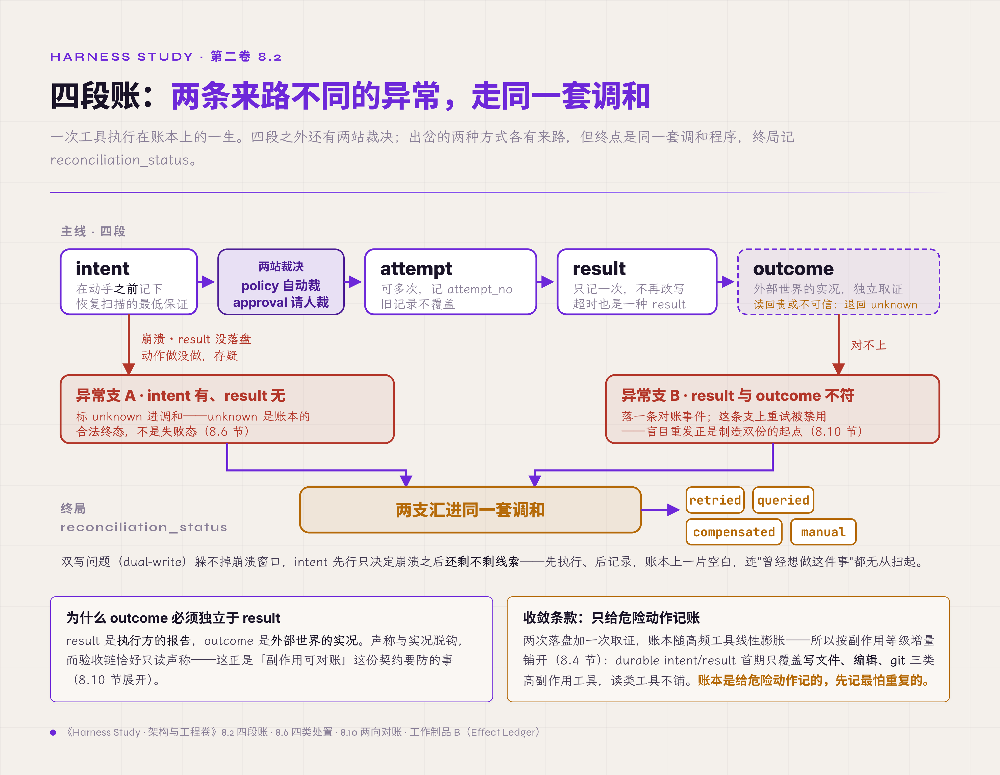
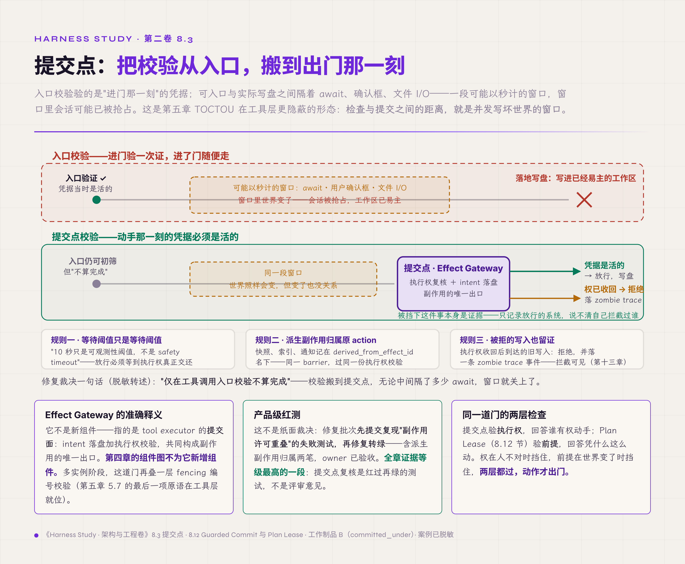
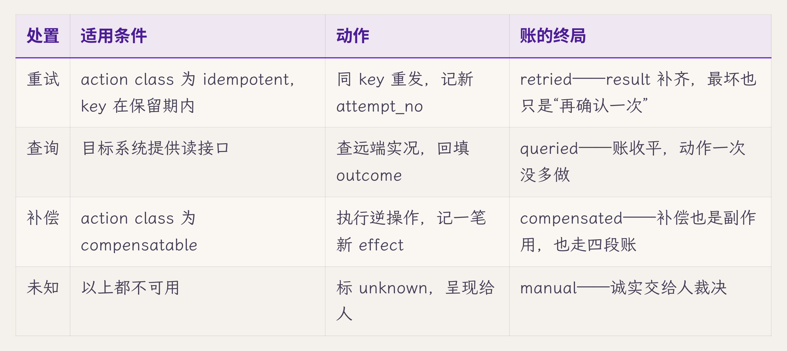
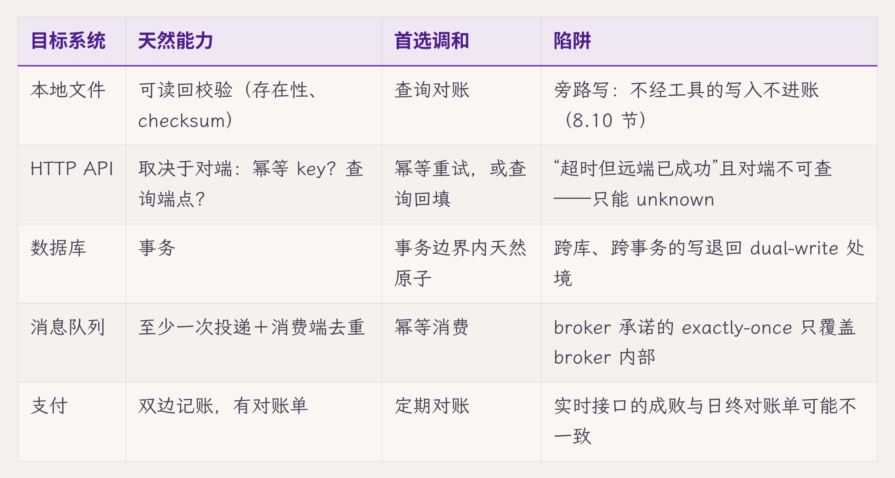

# 八、工具执行与副作用

> v1.0 · 2026-07-23 · 依据 SPEC.md §十五 章 spec（副作用章：Effect System＋四段账＋提交点纪律＋幂等与对账＋Guarded Commit/Plan Lease）· 四维评审四路已落实 · **用户过审（2026-07-23，"继续第九章"）**
> （本版本注与"审稿日志""引用来源"两节同属编辑工作区，出版前整体删除。）

第七章的七步恢复时序，最后一步停在一条奇特的记录上。那一章的破坏实验留过现场：一个写文件的工具执行完成，result 落盘之前进程被 kill -9；重启之后，effect 账本里这一行只有意图，没有结果。恢复流程把它标成 unknown、送进调和，不自动重放。可是调和是什么、怎么调，第七章没有展开，只把问题记成四条留给本章：intent 有、result 无的记录怎么处置？幂等 key 从哪来、管多久？"超时但远端已经成功"怎么调和？工具返回成功、外部世界却没变，谁来戳穿？

四个问题其实是同一个问题的四个方面。工具调用是模型触碰真实世界的唯一通道：写盘、发信、改库，每一次都出了系统的门，出了门就收不回。本章的核心原则是：**先记下意图，再改动外部世界**。每个副作用在执行之前先落盘意图，记录分四段；重复靠幂等挡住，丢失靠对账找回；工具的返回值只是执行方的报告，算数的是外部世界的独立证据。本章给出三样东西：一张四段记录的状态机、一份工具契约模板、一套让计划随外部世界变化而失效的机制。

## 8.1 函数语义装不下副作用

先看不设防的系统怎么执行工具，多数代码的起点都是它：组装参数、发起调用、拿到返回值、塞回 context、进入下一轮。工具调用长得和函数调用一模一样，常常就是一次 await。

失效方式有三个现场。现场一：网络抖动，调用超时，重试一次，收件人收到两封邮件。超时只证明"响应没有回来"，证明不了"动作没有发生"，重试把一次不确定变成了两次确定。现场二就是开场那条记录：动作做完、记录未落，进程死在两者之间，重启后没有任何代码知道这件事做没做过。现场三：工具返回 success，指定的文件却不在盘上。可能是包装脚本吞掉了错误码，也可能是远端收下请求又在后台失败，返回值与外部世界各说各话。

三个现场背后是同一个失效根因。函数调用的心智模型默认了三件事：调用与返回是一体的；失败等于没发生；返回值等于事实。在进程内这三条近似成立，编译器和运行时替它们担保。跨出进程与网络的边界，三条逐一失效：调用与返回之间隔着崩溃窗口；"失败"常常只是"不知道"；返回值是执行方的一面之词。第一章 1.1 拆过的"重试无害"默认假设，落到工具层就是这三条共同作用的结果。

设计从这里开始：把工具层当作一个副作用管理层来设计。程序语言里有效应系统（effect system）的说法，指在类型层静态追踪副作用；这里只借用它的思路，指的是运行时的登记与网关。副作用是需要单独设计的对象，每一次都有记录（四段记录，8.2）、有授权（谁批准、谁有权提交，8.3）、有调和（记录与外部世界对不上时的收敛程序，8.6 起）。第四章 tool executor 的组件卡写着：它是副作用的唯一入口，顺序固定为先落盘意图、再执行、再落盘结果。那是卡面上的一句话，本章把它展开成完整机制。

## 8.2 四段账：从意图到实况

账本的结构第一章就登记了，即工作制品 B（Effect Ledger，副作用账本）：一次工具执行一行，每行分四段，intent→attempt→result→outcome，下文简称"四段账"。每一段都是被一种失效逼出来的，逐段看。

**intent 先行**。意图必须在动手之前记下。写账本与改外部世界分属两个系统，无法一次原子提交，这就是教科书里的双写问题（dual-write），哪个顺序都躲不掉。intent 先行消不掉两次写入之间的崩溃窗口，它只决定崩溃之后还剩不剩线索。先执行、后记录，外部世界已经变了，账本上却一片空白，连"曾经想做这件事"都无从扫起；intent 先行，开场那条 unknown 记录至少还知道"有人想写这个文件"。intent 落盘是恢复扫描的最低保证：有了它，崩溃后最坏的处境是"做没做过存疑"，而不会是"根本不知道该怀疑什么"。

**attempt 可以多次**。重试是常态，但每次重试记新的 attempt_no，旧记录不覆盖，第几次尝试、各自何时发生，账本上看得见。第七章 7.6 规定过这个接口（每次重试是新的 invocation 行或新的 attempt_no），这里是它在工具层的实现。

**result 只记一次**。工具返回什么就照实记什么：成功、失败、超时各是一种 result。超时也是 result（内容是"没等到"），空白只属于还没返回的行。result 一旦记下不再改写，重试的结果记在新 attempt 名下。

**outcome 独立于 result**。result 是执行方的报告，outcome 是外部世界的实况，两者为什么必须分开记，8.10 专门讨论。

四段之外，完整的流水线还有两站：intent → policy → approval → attempt → result → outcome。policy 与 approval 位于记下意图与动手之间：意图记下之后还要过裁决，policy 自动裁决（规则允许吗、预算够吗），approval 由人裁决（这一次要不要人签字）。两站的位置由本章确定，内容各有专章：审批怎么挂起、挂多久，在第九章；规则怎么写、谁能改，在第十一章。

到这里，一次工具执行在账本上的完整生命周期就齐了。这本账本不是免费的：每个副作用至少写两次账本（intent、result），做 outcome 取证时还要再读一次外部世界；账本随高频工具线性膨胀。这项代价划得来的前提是只给危险动作记账，8.4 的增量铺开就是控制这项成本的条件。接下来的问题是：意图记下了、裁决也过了，动手的那一刻，授权还有效吗？

*图 8.2 · 四段账：两条来路不同的异常，走同一套调和*

## 8.3 提交点：授权在动手那一刻还算数吗

第六章 6.0 确定实体链时留过一条裁决：执行权不进实体链。租约、副作用许可属于授权记录，回答"谁现在有权动手"，与 run 的状态记录分开，具体在本章展开。下面借一次真实的工程改造来讲。

先交代背景：第三章解剖过桌面案例项目的"数据丢失"事故，那轮摸底之后约两周（2026-07 下旬），该项目做了第二轮内部审计。这次的对象从单场事故换成了修复路线本身，审计把最高优先级指给了副作用许可：run 的抢占互斥修好了，工具的写入却还没有跟执行权绑定【经验】。

失效场景是这样的：权限检查放在工具调用入口，进门验一次证，进了门随便走。可是入口校验与实际写盘之间隔着 await、用户确认框、文件 I/O，一段可能以秒计的窗口。窗口里外部世界会变：会话被新意图抢占，旧 run 被判定让路；而旧 run 的工具调用早已过了入口检查，正在窗口里执行，落地时把文件写进了已经易主的工作区。这就是 TOCTOU（time-of-check to time-of-use，检查时刻与使用时刻不一致）。第五章 5.7 的 TOCTOU 出在准入层，这里是它在工具层更隐蔽的形态：检查与提交之间的距离，就是并发写坏外部世界的窗口。

修复裁决一句话（脱敏转述）："仅在工具调用入口校验不算完成"。写文件、改文件、git 操作，在实际提交前复核同一份执行权。这个位置就是本章所说的**提交点**（commit point）。数据库里的提交点指事务变为持久、不可撤回的时刻；本书借用这个词，指副作用真正发往外部之前的最后一刻。在提交点复核授权，就是在使用时检查，TOCTOU 窗口随之关闭：无论中间隔了多少 await，动手那一刻的凭据必须仍然有效。Effect Gateway 这个名字由此有了准确释义：它指 tool executor 的提交面，intent 落盘加执行权校验，共同构成副作用的唯一出口；第四章的组件图不为它新增组件。第六章留下的另外半句也在这里交代：多实例阶段，租约授予时携带 fencing 编号（围栏令牌），编号的高水位随授权记录写进持久存储，状态层在 effects 写入点校验编号、拒绝旧编号。这是提交点复核的分布式形态，第五章 5.7 三项原语中的最后一项在工具层就位。

同一现场还逼出三条配套规则。

第一，**等待阈值只是等待阈值**。该项目原来的实现里，抢占时等待旧 run 收尾至多十秒，超时后静默放行新 run。而写文件一类工具不接受中途放弃（半个文件写不得），旧 run 卡过十秒，新旧两个 run 就并发写同一工作区。修复裁决的原话值得留着："10 秒只是可观测性阈值，不是 safety timeout"。观察等待可以设上限（超时报警、呈现给人），放行必须等到执行权真正交还。第五章 5.5"抢占必须先收尾"由此多了一种失效变体：等待上限一到就放行，等于给收尾这道检查设了一个自动打开的倒计时。

第二，**派生副作用归属原 action**。写文件触发的自动快照、索引更新、通知推送，这些派生动作记在原 effect 名下（B 表的 derived_from_effect_id 字段），纳入同一 barrier（收尾等待屏障），过同一份执行权校验。放任派生动作 fire-and-forget（发出后不再跟踪），等于在唯一出口旁边开了第二个出口：主动作等到了收尾，派生动作还在门外排队，run 结束之后才落地。

第三，**被拒的写入也留证**。执行权收回之后到达的旧写入，一律拒绝，并写一条 zombie trace 事件：僵尸写者被挡下这件事本身就是证据。第十三章的证据面要靠它回答"系统挡住过什么"：只记录放行的系统，说不清自己拦截过谁。它与 8.12 的反例事件是两种不同的闭环：反例事件是"检测到矛盾，必须改控制流"；zombie trace 是"控制流已经改了（拒绝），再把这次拒绝留成证据"。拒绝本身是纠正动作，trace 只负责让它可见。

分层的代价此刻看得见实物：租约的生效、停止中、已收回三态，与 run 的七状态互不映射，追查时要追两条线。换来的是两个问题各有答案：任务到哪了，问 run；谁有权动手，问租约。

*图 8.3 · 提交点：把校验从入口，搬到出门那一刻*

## 8.4 重复与丢失只能二选一

记录与授权都讲完了，回到开场四问里最老的一问：怎么保证不重复、不丢失？先把一个没有商量余地的结构说清楚。请求发出去、回答没等到，此刻的选择只有两个：不再发，接受可能丢失，即至多一次（at-most-once）；再发一次，接受可能重复，即至少一次（at-least-once）。恰好一次（exactly-once）没有第三个按钮可按，它是前两者的工程合成：按至少一次执行，靠幂等消费让重发无害。第七章 7.5 说明过这条边界（重放的恰好一次只覆盖决策，跨进程的动作做不到），本章把它落实为工具层的规则：每个有副作用的工具，要么幂等（天然幂等或靠 key），重发无害；要么可补偿，做过了还能收回；要么显式登记为不可重放。没有第四种。

登记的形态是给工具标 action class，共四类：**read_only**（无副作用，重复零成本）、**idempotent**（重发无害，天然幂等或靠 key）、**compensatable**（有逆操作可以收回）、**non_replayable**（发出即定局，如邮件、支付、不可逆删除）。分类出自桌面案例项目内部审计的同一批裁决，配套的还有节奏：durable intent/result 首期只覆盖写文件、编辑、git 三类高副作用工具，读类工具不铺。账本是给危险动作记的，增量铺开，先记最怕重复的【经验】。

## 8.5 幂等 key 的来源、作用域与保留期

"靠 key 幂等"几个字里藏着三个工程问题，逐个回答。

**来源**。key 必须派生自持久坐标。工作制品 B 登记的裁决是 run_id 加 step 序号，再加该 step 内的 effect 序号（第三维也可以直接用模型返回的 tool_call_id）：一个 step 挂多个工具调用时，各自要能分开。反面做法有两个。一是内存计数器，重启归零，崩溃后重发的 key 对不上崩溃前的记录；二是随机数，每次重试生成新值，而幂等 key 的全部意义恰恰在于重试之间保持不变：同一个逻辑动作，无论试几次，key 唯一。

**作用域**。key 在谁的范围内查重？工具层的 key 挡的是同一个工具调用的重试；用户重发同一意图（双击、客户端超时重发）由第五章 5.6 的入口幂等挡在准入处。两层各管一段，混用会漏：入口 key 挡不住内核自己的重试，工具 key 挡不住用户开的第二个 run。

**保留期与冲突**。去重表不能无限增长，总有一天要清理，清掉的那一刻，保证就到期了。业界把这件事写成了明确的契约：支付基础设施商 Stripe 的 idempotency key 保留二十四小时，过期后同 key 到达按新请求处理；同 key 携带不同参数按冲突拒绝，去重只认"同一动作的重发"，冒名顶替不算【规范/官方文档】。这份契约的失效点在边界上：重试窗口一旦横跨保留期（例如排队三天的补偿任务带着当初的 key 醒来），同一动作照样执行两次。所以保留期的选择有硬约束：必须覆盖系统里最长的重试窗口，包括第七章那种崩溃三天后才恢复的重试。

## 8.6 intent 有、result 无：四类处置

现在可以接住第七章送来的那条记录了。intent 有、result 无，处置方式恰好四种，选哪一种取决于目标系统提供什么能力、这个工具登记的是哪类 action class：

- **目标幂等**（天然幂等，或支持幂等 key）：用同一个 key 重试，补齐 result；
- **目标可查询**：先查询远端实况，再按查到的结果补记；
- **动作可逆**（compensatable）：执行补偿操作，把外部世界收回到动作之前；
- **以上都不行**：标为 unknown，交人工处理。

下表按 action class 与目标能力列出完整的处置对照。

表里最重要的一行是最后一行。unknown 是账本的合法终态，工作制品 B 的第四条不变量在此落实：超时且远端不可查、动作又不可逆，这样的处境真实存在，系统能做的最好的事是承认不知道。假装能自动收敛的系统会把"不知道"写成"成功"或"失败"，两个都是编造。编造的代价第二章讲过：评测器说谎时，没有报警器会响。

## 8.7 长运行工具与任务句柄

秒级工具的四段账一页就能讲完，分钟级、小时级的工具则带来四个新问题。一是执行中的工具要证明自己活着：heartbeat 沿用第七章 7.6 的定义，工具执行写下的事件本身就是心跳，账本记里程碑，沉默超过阈值由看门狗接管。二是要能报告进度：progress 属于投影，走事件与流的通道给人看，不进账本；百分比没有恢复价值，账本只记"哪一步完成了"。三是要能被取消：取消的传播路径（UI 到 server 到工具到子进程）是第九章的内容，本章只规定账面要求：取消成功也是一种 result，被取消的 effect 同样要关账，result 写"已取消"。四是部分产出要有归宿：跑到一半被取消的工具吐出的半份产物，是登记为 artifact 还是丢弃，按工具契约（8.11）事先声明，不靠事后临时决定。

业界正在把这件事再标准化一层，方向却是往核心之外挪。MCP（Model Context Protocol，模型上下文协议）的 Tasks 在 2025-11-25 版规范里以 experimental 身份进了核心；定于 2026-07-28 定稿的这一轮修订把它移出核心协议，改为官方扩展 io.modelcontextprotocol/tasks。扩展版的形态是：tools/call 可以返回一个 durable handle，调用方用 tasks/get 轮询、用 tasks/cancel 取消，任务在 working、input_required、completed、failed、cancelled 五态之间转换；句柄只发给在每个请求里声明了该扩展的客户端（按草案的说法）【规范/官方文档，RC】。它的失效点看五态列表就能发现：句柄管的是交互面，即问进度、要结果、发取消；五态里没有 unknown，没有对账态，副作用的重复与丢失一条都没有替调用方记。扩展给了长任务一个把手，记账还得自己做：handle 的终态要映射回四段账，failed 之后 intent 有、result 无的行照旧走 8.6 的四类处置。

## 8.8 子进程不能比 run 活得久

长运行工具常以子进程为执行体，这里有一个容易漏的绑定。朴素做法是 spawn 完就不管，失效方式是：run 已经 cancelled，子进程还在写文件，记录已经关闭，写入还在继续。第五章 5.5 规定的"抢占必须先收尾"、本章 8.3 规定的提交点校验，都拦不住一个根本不在账本上的写者：它的写入不走 Effect Gateway，在操作系统层面直接落盘，不经任何登记。

绑定的做法有两项。其一，子进程生命周期与 run 绑定：工具起的子进程一律进入进程组，run 终态化时按组收割。这是第五章 5.9"子进程随父进程收割"在工具层的收紧版：那里绑的是进程存活，这里绑的是 run 终态，run 先于进程结束时同样按组收割。其二，取消语义按工具声明：接受信号的，发信号加宽限期；写文件、git 一类不接受中途放弃的（半个文件写不得），取消的正确形态是"让它跑到提交点，在提交点拒绝"。8.3 的提交点校验此刻兼任取消的执行者，工具自己不必精通取消，出口守住就够了。

## 8.9 不同的世界，不同的对账法

四类处置哪类可用，不由 harness 的意愿决定，由目标系统的能力决定。对账方式因此是工具契约的一栏，逐类看一遍，差异一目了然。

本地文件那一行的陷阱有官方文档佐证。第六章指出过 Agent SDK 的两处契约缝隙，其中文件 checkpoint 那一处在这里换个角度再用：checkpoint 只追踪经 Write/Edit/NotebookEdit 工具的改动，官方文档明说经 Bash 的改动（echo 重定向、sed -i）不被捕获、无法回滚【规范/官方文档】。这段说明的价值在于承认了一件事：唯一出口的"唯一"是脆弱的，任何给模型开 shell 的系统都天然存在旁路写入。对策是两向对账（8.10），把旁路写入从"不知道"变成"能查出来"。

支付那一行则是整张表的原型：目标系统自己也记账时，最终真相既在 result 里也在远端的账里，两本账定期核对。这就是"对账"一词的来历，金融系统用它对了几百年，agent runtime 只是把同一套办法搬到了工具层。

## 8.10 报告与实况分开记

第六章 6.9 提出过一条根本限制，当时针对的是状态层：数据库说成功，不等于外部世界成功。它在工具层的对应形态是：result 是报告，outcome 是实况，tool result 说成功，不等于动作真的成了。返回码是执行方的自我报告：工具作者忘了检查子命令的退出码、包装层把异常吞成 0、远端返回 200 而业务层拒绝。第一章 1.3 的假通过、第二章的评测器谎报，和它是同一类问题在不同层的表现。

outcome 段存在的理由由此而来：**独立取证**。写文件的，读回来校验存在性与 checksum；调 API 的，查对端实况；生成 artifact 的，对照 artifact 表。证据来源必须独立于被检验的报告方，这是第二章"检查器不能信任被检查者"在工具层的应用。独立取证的代价是每个副作用多一次外部读取：写文件多一次 checksum 读回，调 API 多一次查询；个别目标的取证本身还可能带副作用，或同样不可靠。所以取证只用在读回廉价且可信的副作用上，能力弱、代价高的目标退回 unknown（8.6）。取证结果写进 outcome_status，与 result_status 分列：两者一致，账面干净；不一致（result 说成了、外部世界说没成），就写对账事件、进入调和。可走的是 8.6 四类处置里的查询后补记、补偿，或标 unknown 交人工；重试除外，因为 result 已声称成功，盲目重发正是制造双份效果的起点。最终结论同样记在调和记录里，工具的谎报就这样被账本自己核对了出来。

取证的完整形态是**两向对账**，工作制品 A（State Registry，状态注册表）artifact 行登记过的机制在此展开。方向一：账上有 effect、盘上无 artifact，是执行虚报。方向二：盘上有文件、账上无 effect，是旁路写入。8.9 说的 Bash 缺口靠方向二补上：定期拿文件系统实况对照 artifact 登记，多出来的文件就是绕过出口的证据。两个方向都对得上，"唯一出口"的"唯一"才名副其实。

## 8.11 工具契约：三层校验与防呆

前十节都在管"动了之后怎么办"，这一节管"动之前怎么少出错"。校验分三层，各有归属。schema 层管参数结构：类型、必填、取值范围，JSON Schema 挡在工具入口，拦得住形状错误。语义层管前置条件：路径存在吗、目标可写吗、状态允许吗，挡在工具实现里。编排层管时机：这个工具此刻该不该被调用（预算还剩吗、policy 允许吗、执行权在手吗），挡在内核。三层错位是常见缺口：只有 schema 校验的系统，拦得住格式错误，拦不住格式完美的灾难，即参数合法、时机致命。

比校验更前一步的是防呆（poka-yoke）：把危险从接口形态里消除，让错误根本无法被表达出来【厂商实践，Anthropic 工具设计指引】。两个可直接搬用的做法：一是强制绝对路径，因为相对路径依赖 cwd，而 cwd 是隐式状态，第六章刚指出过它引发的契约缝隙；二是多步合一，把"查列表、挑一个、创建"合成单个工具，组合调用的中间态最容易破坏幂等，单工具单 key 只记一次账。第三个做法是防呆的补充：错误报文结构化。错误对象带 code、layer、retryable，尤其带 sideEffectState（none/unknown/partial/committed 四值）。防呆消除能被表达出来的错误，结构化报文接住剩下真的发生了的错误，调和流程不必从文本里猜副作用停在哪一步。这份错误协议的字段设计参照了桌面案例项目同批审计的结构化错误 schema【经验】。防呆的代价是牺牲灵活性：强制绝对路径挡掉了相对路径的便利，多步合一挡掉了工具自由组合的表达力；换来的是隐式状态与中间态这两个幂等破坏源从接口上消失。这项代价在高副作用工具上划得来，在只读工具上未必，所以防呆同样按副作用等级逐步施加。

以上各节的声明（action class、幂等来源、调和方式、取消语义、派生清单、错误报文）收进一份模板：工作制品 M（Tool Contract，工具契约模板），每个工具一份，由本章交付。评审时可以直接用：逐个工具索要契约，拿不出契约的工具，它的每一项副作用语义都悬在空中。

## 8.12 计划的前提：Plan Lease

最后把镜头从单个副作用拉远到多步计划。先分清两种 graph，这是第四章在 agent loop 组件卡上提到、留到本节细讲的问题。workflow graph 的节点是任务与 agent，边管 branch、join、retry，是编排层的控制流；world-state graph 的节点是对世界状态的表示，边是动作与它预测的转移，是 planner 的搜索对象。两种 graph 位于不同层，可以嵌套：workflow 的一个节点内部完全可以跑一套基于模型的搜索。"工程从 loop 进化到 graph"的流行叙事把两层混成了一层。

多步计划让副作用问题多了一个维度。模型在自己的世界模型里搜出一条五步计划，逐步执行到第三步，观察与预测不符。朴素做法是照单执行完，后两步建立在已经失效的前提上，每一步都在对着幻觉认真执行。单个副作用的意图记录（intent）管不到这里：五个 intent 每个都合法，作废的是它们共同依据的那个世界模型。

有一个一手参照。第六章 6.12 关于信念工件的裁决，素材出自一个把世界理解写成可执行程序的 model-based harness 项目，它把"计划对着幻觉执行"这个问题做成了机制【项目自述，公开保留轨迹】：内部与外部分开，编辑模型、回放历史、搜索候选计划都不触碰环境，只有 commit 动作产生真实交互；每个真实动作之后对比预测与观察，一旦不符，立即废止剩余动作队列，差异作为反例回到建模循环。公开轨迹证明这套机制确实在运行：对其中一条完整轨迹逐行统计，78 个动作、15 次提交、9 次误预测，每次误预测之后，轨迹都重新进入建模与提交流程，剩余队列没有一次被照单执行【公开工件】。15 次提交里有 9 次误预测，也顺带标出了这套机制的代价：世界模型越粗，计划作废越频繁，重新建模的开销越高。它划得来的前提是：作废计划，比对着失效前提把剩余每一步执行完更便宜。

通用化之后是两项交付物，登记为工作制品 N（Plan Lease 与 Counterexample Event Contract，计划租约与反例事件契约）。

**Plan Lease**（计划租约）：计划自带适用前提，即 model_version、history_cursor、policy_version 三个坐标；坐标任一变化，或一次真实 observation 与预测不符，计划即失效。本书借用"租约"一词，但这里的租约没有过期时间，按版本前提失效，作用类似 HTTP If-Match 的乐观校验：提交前比对前提版本，不符即拒。resume 尤其要过这道检查：恢复的 run 手里攥着崩溃前的动作队列，外部世界在它中断期间早就变了。第七章的恢复语义延伸到计划层，就是这一句：恢复动作队列之前，先校验计划的前提。

**Counterexample Event**（反例事件）：预测与观察的差异是控制流事件，它触发废止、触发重新建模，并把反例写进工作制品 K（Belief/World Model Registry，信念工件登记模板）的已知反例栏。只把差异记进日志的系统，等于看见了矛盾却不改主意。

**Guarded Commit**（带门禁的提交）指副作用出门前必须同时通过两项检查的提交方式，它由 8.3 的提交点与 Plan Lease 组成同一道门的两层：提交点验执行权，回答谁有权动手；Plan Lease 验前提，回答凭什么这么动。动手的主体不对时第一层挡住，外部世界变了时第二层挡住，两层都通过，动作才出门。

## 破坏实验

按四步测量协议执行，四个场景共用观测点：effect 账本行状态、effect.* 与反例事件、外部世界实况。

1. **超时但远端实际成功**：对幂等 API 制造响应超时（远端已执行）。判定：同 key 重试后外部世界恰好一份效果、result 补齐；对无幂等、无查询能力的目标重跑同一场景，判定改为该行标 unknown 进入调和、不自动重试。失败＝两份效果，或 unknown 被静默写成成功或失败。
2. **返回成功但 artifact 不存在**：拦截返回值，让工具谎报 success。判定：outcome 取证对出矛盾，该行 outcome 标为失败、写对账事件。失败＝result_recorded 被直接当成终局，没有独立取证。
3. **计划后改变 policy**：搜出多步计划后改一条 policy。判定：下一次 commit 拒绝过期的计划租约、剩余队列废止。失败＝旧计划继续执行。
4. **单步预测落空**：制造一步 prediction mismatch。判定：反例事件落盘、剩余队列废止、回到建模。失败＝照单执行到底。

复跑 N=3。实证状态分层如下【经验】：场景 1、2 按思想实验执行，先给出判定标准。桌面案例项目的崩溃对账设计（先核对 workspace、进程、数据库三方实况，再决定标为已提交、补偿还是交人工处理）已经定稿、尚未实施，路线与本章一致；8.3 的提交点复核有产品级红测：该项目的修复批次先提交复现"副作用许可重叠"的失败测试，再修复转绿，其中两项涉及派生副作用归属，owner 已验收。场景 3、4 的外部佐证是那个 model-based 项目的公开轨迹统计（9 次误预测，每次之后都重新进入建模与提交，剩余队列无一被照单执行），参考实现列入第十四章标准故障包的工单。

## L 级自检

按第一章的成熟度尺（L1 能跑、L2 能看，全表见第一章 1.3）。本章机制的 L2 底线：四段账每段都写事件，工作制品 C（Event Schema，事件信封与类型表）中 effect 的五类事件，第一章就为此预留好了；调和与拒绝同样写入账本，zombie trace 是"拒绝也要可见"的极端形态。"假落地"（名义上有、实际没接上）在本章的表现，用第一章的诊断公式衡量：effect 事件在工作制品 C 里有类型名（L1 在），四段账某一段在 trajectory 里查不到对应事件（L2 缺），该段按未接线处理。最常缺的是 outcome 取证事件，因为它最费工。

对应到第一章的四个问题：可观测由四段账加 zombie trace 落实；可控依托提交点唯一，一切真实动作都只经过 Effect Gateway 这一个出口；稳定由幂等 key 与四类处置落实（见破坏实验的复跑设计）；闭环在本章有两处机制层面的实现，都不是贴标签。对账环从 outcome 取证的检测开始，经四类处置纠正，以调和终局验证；反例环从预测与观察的差异检测开始，经废止剩余队列与重新建模纠正，以反例回填工作制品 K 验证。第一章 1.3 的矩阵拿副作用契约那一行做过四问示范（"管得住吗：对不上由硬性检查拒绝""改进有数据吗：机制调整前后可对比"），可控与闭环两项都在本章落实。留给第三卷的只是两个环的运行时收敛指标，即 unknown 存量趋势与对账收敛率。机制成环与指标收敛是两回事，本章交付前者，消融数据仍留给第十四章的参考实现。

对应到第一章的坐标系：本章是副作用契约的主要章节。第五章管状态怎么合法地变，第七章管崩溃后怎么按记录重演，本章管伸向外部世界的每一个动作怎么记录、怎么收敛；第一章 1.3 矩阵里"副作用外泄"这一项在此落实。桌面案例的现状：提交点复核与派生归属已修复并验收，四段账按增量路线铺开中（写文件、编辑、git 三类先行），四类处置的自动化尚未实施。按第三章的标准，这一项只完成了一部分，补齐的工单在第十四章。

## 交付物

1. **Effect Ledger v2**（工作制品 B）：新增 action_class、derived_from_effect_id、committed_under 字段与提交点的三条配套规则，并入四类处置表；
2. **Tool Contract 模板**（工作制品 M，新增）：三层校验、幂等与调和声明、取消语义、派生清单、错误报文契约，评审时逐个工具索要；
3. **Plan Lease 与 Counterexample Event Contract**（工作制品 N，新增）：计划失效机制的登记版，第十三章的证据边、第七章的 resume 检查都回指它；
4. **reconciliation fixture**（第十四章工单）：破坏实验四个场景的可执行验证。

只想拿评审工具的读者，可以只取 8.6 的四类处置表与工作制品 M。问被评系统一句"上一次工具超时，后来是怎么处理的"，往往就能看出它的副作用管理做到了哪一步。

## 立即可做的一个动作（五分钟）

builder 版本：挑出系统里最怕重复执行的那个工具，在纸上回答三个问题（别真去对生产环境里的不可逆工具重发）：幂等 key 从哪来？同样的参数重发一次，本该发生什么？超时之后怎么知道它到底执行了没有？三个问题有一个答不出，这个工具的每一次超时都是一次赌博。答案顺手填进工具契约，工作制品 M 的模板五分钟就能填出第一版。

assessor 版本：索要 Effect Ledger；拿不出的，换一个问题："上个月有没有工具调用超时过？后来怎么确认它执行了没有？"回答"重试了一次、没报错"的，按 8.4 的分类记下：at-least-once、没有幂等声明，重复风险记入风险清单。

## 下一章

四段账管住了系统伸向外部世界的动作。执行中途还有另一方会介入：人。长运行工具的 progress 要流给人看，人看到一半会按 Stop，网络会断在流的中间，审批一挂就是三天。断连算取消吗？Stop 按下的那一刻，半轮文本与已完成的 tool result 归到哪里？挂起怎么持久化，恢复之后审批还作数吗？交互面的语义（流、中断、挂起），在第九章。

## 审稿日志

> （编辑工作区：本节与"引用来源"节出版前整体删除。）

| 轮 | 检查 | 命中与修改 |
|---|---|---|
| 版本史 | — | v1.0（2026-07-23）：依 SPEC §十五 spec 首写。大纲条目映射：8.1/8.2 同大纲；8.3 提交点为新增主场节（lease 分层裁决兑付），大纲 8.3"三层校验"并入 8.11 与 poka-yoke 合节；8.4-8.10、8.12 与大纲同号。四张欠条兑付：第七章 7.5 边界（8.4）、第六章 6.9 工具层形态（8.10）、lease 分层主场含 fencing 高水位落点（8.3）、工作制品 B 主场展开（8.2） |
| 章级验收自测 | SPEC §十五 清单 | 正文表格 2（四类处置＋分系统调和）＋配图占位 1（四段账状态机）；新概念实计约 11（Effect System、提交点/Effect Gateway 释义、zombie trace、action class 四类、幂等 key 三要素、四类处置、两向对账、三层校验、poka-yoke、两种 graph、Plan Lease/Counterexample Event——后两者合一件登记，≤12 达标）；前向引用约 10 处/4 章＋卷三（第九章 4、第十一章 2、第十三章 2、第十四章 3——超 ≤8 预警线，SPEC §七.1 照记不拦稿，第九章为遗留问题主承接）；一手证据 5 处（提交点改造＋十秒阈值＋派生归属＋红测验收＋错误协议参照）；外部权威 ≥4（Stripe／MCP Tasks RC／Agent SDK file checkpointing／Anthropic 工具设计指引／model-based 项目公开工件）；业界对照带失效点 ✓（Stripe 保留期边界＋MCP Tasks 五态无对账态）；破坏实验四步协议＋实证分层 ✓；L 级自检＋坐标系落位 ✓；双读者动作 ✓；文字化引用零 § ✓；工作制品引用带名称（B/A/C/K/M/N 首现全部带括注）✓ |
| R1 grep 红线 | 首稿自查（复跑通过）＋四维评审后复跑 | "你"系 0；元叙述 0（自查抓到"在这个层面上"1 处已改）；模糊词 0；显式禁形 0（自查抓到"不是消失，是关账"1 处已改）；广义对比 2 处（"result 是报告，outcome 是实况"平行对举——8.10 主张句；"10 秒只是可观测性阈值，不是 safety timeout"——引用裁决原话，均 motivated）；标题超长 2 处已缩（8.10/8.12 节名）；整句加粗仅章主张句＋标签词（评审后 8.10 整句去粗）；语域自查（"骨架""定时拆除""裸手""动真手""链路""戳穿"×2 已改；"僵尸写者"为技术术语 zombie 的转写，沿 zombie trace 术语保留；"赌博"为中性比喻保留；"进程死在两者之间"沿第七章"进程死了"已过审口径保留；"戳穿"仅余开场问句钩子 1 处）；禁形 grep 跨子句误报 2 处（"不是免费的…就是三次读写""不是贴标签…是两件事"——非对比修辞，人工判定通过）；体量落实后全文 203 行、正文 180 行（编辑工作区两节 23 行出版前删除） |
| 四维评审 | **四路已跑齐并全部落实（2026-07-23）：technical A-／style B+→A-（P1/P2 清零）／cybernetic A-（方法论比例实测约 80%，章题判定为方法论题目）／business A-，零 P0 遗留** | technical P1：四段账状态机漏"result 与 outcome 不符"分支→配图占位与 B 状态机补第二异常分支；P2：reconciliation_status 枚举补 queried 并与处置表/正文表终局统一、poka-yoke 第三动作改"防呆的补角"（错误处理不冒充防呆）、"一个月"改"约两周"（与 business 同题）、MCP Tasks 零语料底稿→引用来源补直接研读口径＋正文加"（草案口径）"；P3：NotebookEdit 补齐、"9 次重新建模"改"均触发"（推断降精度）、A 表两向对账指针补 8.10、Plan Lease 失效条件与 N1 对齐（补 observation 不符）、子进程 5.9 回指改"收紧版"、交付物摘要补 committed_under（SPEC 同步）。style P1：8.10"result 是报告，outcome 是实况"整句去粗（仅余章主张句）；P2："裸手"改"直接落盘、不经任何登记"、8.1"有对账"改"有调和"（对齐 8.6 调和语义）；P3："戳穿"保留开场 1 处余 2 处改写、"动真手"改"认真执行"、"链路"改"路径"、L 级自检拆三段。cybernetic P1：闭环格接回——对账环＋反例环两处机制级兑现写入四问落位，"机制成环与指标收敛是两件事，本章交前者"；P2：四段账/独立取证/防呆三处补代价句、8.10"进调和"路由到 8.6 处置（重试除外）、L2 底线补第一章假落地诊断公式；P3：zombie trace 与反例事件两种闭环区分句、Plan Lease 价签句（15 提交 9 误预测）。business P1：正文"（匿名口径沿第六章，实名悬案待终稿）"编辑指令删除（悬案留编辑工作区）；P2："一个月"数字修正、builder 动作补安全垫（纸上作答＋别对生产不可逆工具重发）；P3：MCP"标准化了"改"正把……标准化"（RC 时态）、轨迹推断降精度 |
| 终稿回核清单 | — | Stripe idempotency key 保留期数值与冲突应答（官方文档指针待补）；MCP Tasks 五态与接口名（2026-07-28 定稿后回核，RC 标注届时撤）；Anthropic 工具设计指引（writing effective tools/ACI）出处指针；model-based 项目实名悬案随第六章统一裁决；Agent SDK file checkpointing 行为沿第六章清单 |

## 引用来源

> （编辑工作区：本节出版前整体删除。）

- 【规范/官方文档】Stripe idempotency key（保留期、同 key 不同参数冲突应答）（8.5；终稿前回核官方文档并补指针）。
- 【规范/官方文档，RC】MCP Tasks（2025-11-25 版规范引入并标 experimental；2026-07-28 修订移出核心、改为官方扩展 io.modelcontextprotocol/tasks——durable handle、tasks/get、tasks/cancel、五态）（8.7；按大纲事实纪律第 8 条标 RC）。来源系 MCP 规范修订草案直接研读，未进 research 语料；2026-07-28 定稿后逐字回核五态名与接口名，届时撤 RC 标注与正文"（草案口径）"限定。
- 【规范/官方文档】Agent SDK file checkpointing——Bash 改动不被捕获（8.9；回指第六章契约缝，换"旁路写"用途）。指针 research/volume2/03。
- 【厂商实践】Anthropic 工具设计指引——ACI/poka-yoke（强制绝对路径）、writing effective tools（多步合一、错误消息可操作）（8.11）。指针 research/volume2/03。
- 【项目自述＋公开工件】model-based harness 项目（匿名口径沿第六章悬案）：内部搜索/外部提交分账、mismatch 废止队列；公开轨迹逐行统计（78 动作/15 提交/9 误预测）（8.12、破坏实验）。指针 research/volume2/10，引用纪律照该笔记 §八（分数不引、不写已开源）。
- 【经验】桌面案例项目 2026-07 第二次内部审计与修复批次：提交点复核裁决、十秒阈值裁决、派生副作用归属、zombie trace、action class 四类与增量铺开、结构化错误协议、崩溃对账设计（8.3/8.4/8.11/破坏实验）。指针 research/volume2/11 条 1/7/8/9/10/29/30。
- 回指素材：第一章 1.1 节（重试无害默认值）、1.3 节（假通过）、1.5 节（地图）；第二章（检查器不能信任被检查者、评测器谎报）；第三章（事故与摸底）；第四章（tool executor 卡）；第五章 5.5/5.6/5.7/5.9 节；第六章 6.0/6.9/6.12 节、契约缝两条；第七章 7.5/7.6 节、破坏实验现场、七步时序第七步；工作制品 A artifact 行、B 五条不变量、C effect 事件、K 反例栏。
