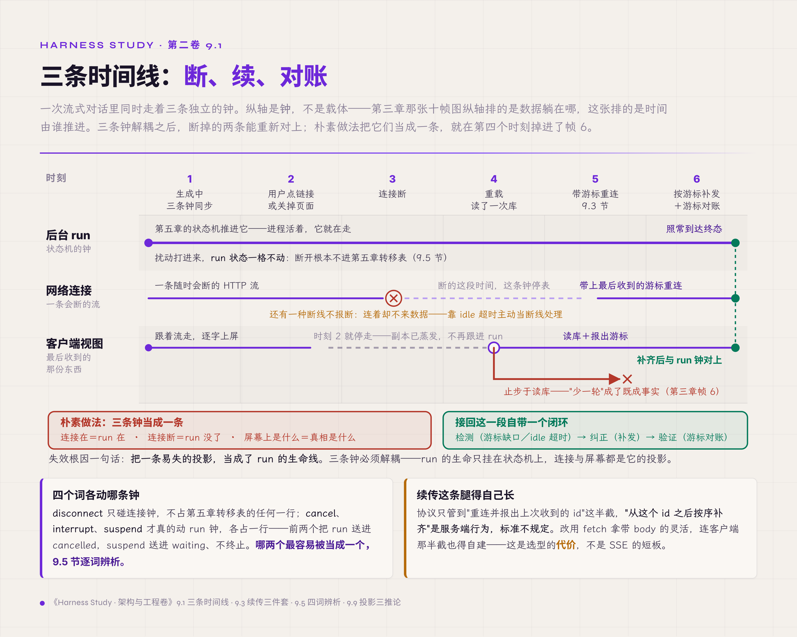

# 九、Streaming、中断与人机挂起

> v1.0 · 2026-07-23 · 依据 SPEC.md §十六 章 spec（交互章：三条时间线＋四词辨析＋流终结真值表＋半轮归宿＋HITL 持久化）· 四维评审四路已落实 · **用户认可推进（2026-07-23，"继续写正文"）**
> （本版本注与"审稿日志""引用来源"两节同属编辑工作区，出版前整体删除。）

第八章管住了系统伸向世界的手——每个副作用先立字据、走四段账。可账本管不到另一只手：从外面伸进来的、人的手。回到第三章那场事故最容易被略过的三帧。用户正看着回答逐字出现，点了答案里的一个链接，整个窗口直接跳到那个网页（帧 4，前端副本当场丢失）；连接随之断开，后台的 run 依设计继续跑（帧 5）；用户按"后退"，单页应用重载、读了一次数据库，屏幕上少了一轮（帧 6，用户判定"丢了"）。三帧里，系统其实只做错了一件事，而且不在后台——后台的 run 一直好好的。做错的是交互面：它把一次连接断开，当成了一轮对话的终点。

第三章诊断出"运行中的对话没有真相源"，第五章立了 run 状态机、第六章立了 SSOT 与投影契约，那半轮消息现在有自己的载体了。可即便半轮消息落了库，帧 6 仍然会发生——只要交互面还以为"连接断了＝run 没了＝屏幕上该显示的就是库里这些"。本章补最后一环：连接会断、人会打断、审批一挂可能就是三天，交互面怎么在这些扰动下不破坏前几章立好的恢复机器。主张压成一句：**交互面是投影，不是生命线**——run 的生死只由状态机管；断流不等于断 run，UI 掉线不等于任务取消。读完本章，手里应当多两张表：一张流终结真值表，一张把 disconnect、cancel、interrupt、suspend 四件事分开的交互语义表。

## 9.1 三条时间线

先把帧 4-6 的乱象拆成它的成因。一次流式对话里同时走着三条独立的时间线，各有各的钟。**后台 run**：从 queued 到终态，由第五章的状态机推进，进程活着它就在走。**网络连接**：一条随时会断的 HTTP 流，用户关页面、切网络、手机锁屏都会把它切断。**客户端视图**：浏览器里那块屏幕，显示的是它最后一次收到的东西。

朴素做法把三条钟当成一条：连接在，就以为 run 在；连接断，就以为 run 没了；屏幕上是什么，就以为真相是什么。第三章的事故正是这个假设的现场——连接断（帧 5），交互面顺着假设推导"这轮结束了"，用户重载看到库里的旧状态（帧 6），把"少一轮"当成事实，重问一次把半轮覆盖掉。失效根因一句话：把一条易失的投影，当成了 run 的生命线。

三条钟必须解耦。run 的生命只挂在状态机上，连接与屏幕都是它的投影——投影可以断、可以旧、可以重建，run 不受影响。这一节剩下的每一节，都是这条解耦在某个具体裂缝上的落实：连接断了怎么接回（9.2、9.3），流怎么才算真的结束（9.4），"断开"和"取消"怎么不混为一谈（9.5）。

*图 9.1 · 三条时间线：断在第三个时刻，对上在第六个*

## 9.2 SSE 给什么、还缺什么

流式下推的常见载体是 SSE（server-sent events）。它给了三样现成的东西：服务端单向推事件、连接断了浏览器自动重连、每条事件可带一个 id，重连时通过 `Last-Event-ID` 头告诉服务端"我收到这里了"。用好了，重连这一步近乎免费——仅限重连，补发要服务端另建。

问题是 agent 场景常常用不上这套现成语义。SSE 的自动重连绑在 EventSource（浏览器内建的 SSE 客户端）上，而 EventSource 只支持 GET、不能带请求体；agent 的一次对话要 POST 一大包 message 上去，于是工程上多改用 fetch 的流式响应自己读。这一改，自动重连和 `Last-Event-ID` 都不再由浏览器代劳。要分清协议栈本来管的是哪半截：它只管重连、把上次收到的 id 报回去；"从这个 id 之后把漏掉的事件按序补齐"是服务端行为，SSE 标准不规定，用不用 EventSource 都得自己实现。所以改用 fetch 挪走的是客户端那半截，服务端那半截本来就在应用层。这是选型的代价，不算 SSE 的短板：换来带 body 的灵活，付出的是连客户端这半截也得自建。

## 9.3 续传的责任在应用层

补发本就不在协议肩上，改用 fetch 之后连客户端那半截也没了。问题只能自己答：断线之后，客户端从哪儿接着拉？

有人指望协议层的会话 id 兜底——连接断了，靠会话 id 找回上下文。这条路不能依赖，业界正在拿掉它：MCP 一份处于候选定稿（RC）阶段、预定 2026-07-28 落定的规范修订拟移除 `Mcp-Session-Id`【规范/官方文档，RC】，协议层将不再承诺替应用记住会话。续传只能自己搭，三件套：给每条下行事件编一个单调序号（cursor），客户端记住最后收到的号；重连时带上这个号，服务端从号之后补发（replay window）；补发之前先给一份当前状态快照，之后接增量（snapshot + delta）。

续传只解决"观察到断线"这一半。还有一种断线不报断：连接开着、数据却停了（工具僵死、上游卡住，既不吐新事件也不给 EOF 结束信号）。靠等是等不出游标缺口的——所以检测这一步得给客户端配一条 idle 超时，静默停顿到阈值就主动当断线处理、带游标重连，否则闭环的"检测"一步会在这种挂而不断的流上失灵。

这正是第三章"接回没做"的补法。第二章 2.4 节拿那条 SSE 契约示范过契约六要素，evidence 那一格填不出来；第三章点明它是**半途设计**——断开确实安全（流死了 run 照跑完），但"接回"从来没实现，后台跑完无人知晓。半途设计比没有设计更危险，因为它制造"已保障"的假象。cursor＋replay window 就是给那个空格补上的 evidence：断线重连时，客户端报出游标，服务端把这中间落盘的事件按序补齐，帧 6 的"少一轮"不再发生——屏幕缺的那部分是从账本补回来的，不是靠重问重造的。

## 9.4 流什么时候算真的结束

断线接回解决了"连接中途断"，还有一种更隐蔽的失效：连接没断，流却谎报自己成功结束了。

这来自一份中继服务的内部审计，配套的模型请求中继层出过一个 P0【经验】。它在已经回了 HTTP 200 的 SSE 流里，写进一帧 `{"error": {...}}`；下游的客户端解析器只认带 `choices` 的帧，遇到没有 `choices` 的帧就 `continue` 跳过，循环自然结束后无条件产出一个"完成"。合起来的后果：一个空回复、或半截回复，以"成功"的姿态收场，客户端的重试分类根本没有机会执行——它以为一切正常。这是第一章 1.3 节"假通过"、第二章评测器谎报、第八章"result 是报告、outcome 是实况"在传输层的同一族成员：执行方报告成功，接收方照单全收，没有人独立判定这份成功是真的。

失效根因藏在一个词的误用上：`finish_reason`。它是模型停止生成的原因（说完了、到长度上限了、被内容过滤了），不是传输成功的提交点。把"模型说完了"当成"这份回答完整交付了"，中间那段传输可能已经断在半空、可能塞进了错误帧，全被跳过。

设计的解法：给流的结束立一张真值表，每一种可能的收尾各占一行，判定是"成功交付"还是"失败关闭"。typed done（一个明确的结束事件）算成功；legacy `[DONE]`（旧式哨兵）按兼容规则算成功；typed error（错误帧）失败；EOF 却没见过任何结束标记失败；半帧、格式错乱、非法信封，全部失败。默认一律 fail closed——没有明确读到"成功结束"的信号，就当它失败，绝不因为"循环跑完了"而推定成功。fail closed 也有代价：它把"漏判成功"换成了"错判失败"——一种没被枚举进表、其实成功的收尾会被当失败，触发多余重试、让用户看到一份好回答被标失败。所以这张表的成本落在穷举上：成功路径少列一行，就多拒一批好流。这张表交付为工作制品 O（Stream Terminal Table，流终结真值表），评审时逐行照填：被评系统的流，每一种结束方式落在哪一格、判成功还是失败。

同一份审计里还有一个同构现场，值得并读："成功"在哪一刻算数。那个中继层的熔断器，收到上游 2xx 响应头就调 `recordSuccess()` 把失败计数清零——于是一个"连续三次回 200、却每次都在流里中断"的上游，永远打不开断路器，因为在熔断器眼里它每次都成功了。

修法与第八章的提交点、第五章的租约同一个形状：成功不在响应头到达时提交，在完整内容真正写到下游之后才提交；熔断许可带世代号、half-open 只发一个探测。"成功在哪一刻算数"这个问题，本卷已经在三个层面上遇到它——第二章的验收层、第八章的工具提交点、这里的传输层——答案每次都一样：往后挪，挪到有独立证据为止。

## 9.5 四个被混用的词

前几节反复出现"断开""取消""抢占""挂起"，它们常被当同义词，其实是四件不同的事，对 run 的影响各不相同。分不开，就会犯第三章那个错——把一次断开，当成一次终止。

**disconnect（断开）**：网络连接断了。这件事根本不该触碰 run——它不在第五章转移表里占任何一行，run 照跑，交互面只是剥离那条流、等客户端带游标回来。第三章的系统这一步做对了。

**cancel（取消）**：用户按了 Stop，要终止这个 run。这是真的动 run——第五章转移表里 running 经"用户 Stop"到 cancelled（user_cancelled）那一行，guard 是半轮内容已终态化落盘。

**interrupt（抢占）**：用户发来新意图，旧 run 让路。也动 run，但走的是另一行——running 经"新意图抢占"到 cancelled（preempted），第五章 5.5 节抢占先收尾的那条。

**suspend（挂起）**：run 主动停下等一个外部输入（审批、追问的回答）。它不终止 run，把 run 送进 waiting（第五章那个"等人不占执行额度"的状态），等输入到了再回 running。

四个词落在第五章转移表的四个不同位置——一个根本不进表，三个各占一行。把它们收进一张交互语义表交付为工作制品 P（Interaction Semantics Table，交互语义表）：每个词一行，记它对 run 做什么、触发哪条转移、半轮内容归哪。这张表是本章最该带走的东西——因为交互面所有的混乱，追到根上几乎都是这四个词里两个被当成了一个。

## 9.6 取消要一路传到底

四个词分清之后，单看 cancel 一件就够复杂。用户按下 Stop，取消信号要从 UI 一路传到 server、到正在跑的模型调用、到模型触发的工具、再到工具起的子进程——任何一环断了，上游以为取消了，下游还在跑。第八章 8.8 节那个"run 已 cancelled、子进程还在写文件"的僵尸写者，源头往往就在这里：取消令牌传到 server 就停了，没往下贯穿到子进程。

所以取消得当成一条贯穿所有边界的传播链，而不能只当一个就地置位的布尔标志。每跨一层边界（进程、子进程、网络调用），取消都要能传到、且被承接：模型调用要能中止连接，工具要能收到取消、跑到自己的提交点再拒绝（第八章 8.8 的口径），子进程要按进程组收割。传播链末端与第八章的账本接上：被取消的动作照样关账，result 记"已取消"。

## 9.7 半轮内容落在哪一格

cancel、interrupt、suspend 三件事都会在一轮对话进行到一半时打断它。那半轮已经生成的文本、已经拿到的 tool result、已经产出的 artifact，落在哪儿？这是工作制品 A（State Registry，状态注册表）message 行一直挂着的那笔裁决（半轮内容归宿，即本节）。

裁决是：半轮内容在打断落下的那一刻终态化落盘，不丢弃、不伪造完成。丢弃就是第三章帧 8 的老路——"跳过持久化"，用户的半轮成果无声丢失。伪造完成更糟：把一段被 Stop 打断的文本记成一条正常的助手消息，历史里就多了一句模型其实没说完的话，之后所有基于这段历史的推理都建在这句假话上。

正确形态是照实记：这条 message 的状态是"被取消时到此为止"，tool result 记它当时的真实结果（成、败或已取消），artifact 若已落地就登记、没落地就不登记。第五章 5.5 节抢占先收尾那条 guard——"旧 run 半轮内容已终态化落盘"——依赖的正是这一格：先把半轮落成终态，抢占才允许发生。这一格的代价也摆明：每次打断都压上一次同步落盘，抢占要等半轮真正终态化才允许发生，第五章那条 guard 的执行成本正落在这里；历史里也从此长期留着"没说完"的消息，凡读历史的下游都得学会认这条中途终态、不能当正常助手消息用。付这份代价，换的是历史永不含一句模型没说过的话。

## 9.8 挂起要能扛住重启

suspend 把 run 送进 waiting，可 waiting 可能一等就是三天——这期间进程会重启、会部署、会崩溃。挂起因此必须落成持久状态——内存里的一个 promise 扛不住重启。工作制品 A 的 approval 行登记的就是它：挂起即持久化，重启后待决审批仍在，带着自己的 deadline，过期是显式终态（第五章那条 hitl_expired）。

业界的常见形态是把挂起做成 checkpoint：LangGraph 的 human-in-the-loop 就是在图的某个节点上 interrupt、存 checkpoint、等输入到了从 checkpoint 恢复【规范/官方文档】。名字撞车提醒：LangGraph 的 `interrupt()` 做的是本章 9.5 节的挂起——暂停、存 checkpoint、原地恢复，run 不终止；与那个终止 run 的抢占同名而不同事。这套机制存住了"停在哪、等什么"，但有一处它不管：恢复的时候，当初那个审批还作数吗？停的这三天里，授权可能已经变了——批准这个操作的人权限被收回了，或者策略改了。

第七章 7.8 节立过铁律：state continuity 推不出 authority continuity，恢复状态不等于恢复旧授权。挂起恢复正是这条铁律极易被违反的地方——checkpoint 若把授权一起存进了图状态，恢复时就会连三天前那份早已不该继续有效的授权一起搭车回来（此失效点系对照分析，非 LangGraph 文档明述）。完整的重验规则是第十一章的内容，本章只立接口：挂起恢复时，授权要重新过一遍，不能随 checkpoint 白搭车回来。代价也要摆上台面：挂起一旦持久化，系统就多背一批带 deadline 的待决状态，得有人扫描、到点显式判过期（第五章那条 hitl_expired），不能任其无限悬着；恢复也不再免费——每次都要重走一遍授权。换来的，是三天前那份可能早已失效的授权不会随 checkpoint 白搭车回来。

## 9.9 掉线的只是 UI

前面各节的共同底座，是第六章立的投影三契约（工作制品 J，Projection Contract）在交互面的一次完整应用。UI 是投影，不是真相——这句话有三个可操作的推论。

**可以重拉**：UI 丢了状态，从服务端重新拉一份就是，不必自己攒、自己记；第三章缺口二那个"拿本地缓存当会话真相"的 localStorage 恢复线，正是把投影当了真相源的违约——本地状态与数据库分叉时，一律以数据库为准。**可以熔断**：某个后台 run 出了问题，UI 该做的是显示错误、给重试入口，别让整块界面跟着一起崩；一块屏幕的 ErrorBoundary（局部错误兜底组件）兜住的是这块屏幕，不牵连 run。**可以逃逸**：用户导航离开、关掉页面，这些都是 UI 的事件，与 run 无关——run 该继续的继续、该等待的等待，等用户回来再重新投影一份给他看。

这三条推论合起来，就是帧 6 的正解。帧 6 里 UI 重载后读了一次库、发现少一轮、把"少一轮"当成了既成事实。正确的 UI 不这么推：它知道自己只是投影，重载后除了读库，还要按游标向服务端要一次续传（9.3），把库里还没落全的、或刚落进来的补上；补到哪一号为止，客户端拿服务端的最新游标与自己补全后的游标对一次，对齐了这次续传才算闭合——闭环的"验证"一步落在这次游标对账上，不是补发完就默认一致。即使真的缺了什么，它也不会拿"我看到的"去覆盖"库里记的"——投影不回写，是这里的铁律。

## 9.10 上游给 runtime 的反馈接口

交互面朝下还连着一层：模型 provider。上游的流也会出状况——半截断掉、429 限流、5xx 出错，这些要能反馈给 runtime，让它决定重试还是放弃。这里有一条容易踩的线：可重试性会随交付进度降级。一次调用刚发出、还没产出任何 token，整段重试是安全的；可一旦已经把一部分 delta 交付给了下游，即便上游标记这次错误"可重试"，也不能再整段重发——重发会让用户先看到半截、再看到从头重来的一整段。那份中继审计里的裁决是：delta 已交付后，把"可重试"强制降为"不可重试"，只保留"提交任何输出之前可重试"这一段窗口【经验】。

还有一条要留的接口，不在本章展开：跨层重试放大。中继层对同一个上游模型最多重试若干次，agent 侧又套一层重试，两层相乘，一次用户请求可能在上游放大成几十次调用——中继最多 11 次乘 agent 最多 3 次那个量级。这里只把接口留出来：每一层的重试次数、总预算、谁出钱，是运行策略，完整治理在第三卷。

## 9.11 边界声明

本章四个词的语义边界，学术上没有现成靠山。中断研究这两年明显扩张，但语义没变：InterruptBench 把中断三分类（增补、修改、撤回）——它这个"中断"对应的正是本章 9.5 节的抢占，明说只覆盖用户主动发起的那一半；后续的 IHBench、SentinelBench 也都是"用户或环境输入型"中断【预印】。它们研究的是"用户改了主意，agent 怎么接住新需求"这一层；"进程崩了、连接断了、run 被抢占之后，状态怎么接续"这后半截，它们不覆盖。工程实践里最难的恰是这后半截，这条研究线几乎没碰过它（检索范围：arXiv 及主要系统会议 2026 年发表的中断类研究）。这不等于崩溃恢复没人研究过：rollback-recovery 与 checkpoint-restart 是一脉评审级文献，综述二十多年前就有【评审，Elnozahy 等，ACM Computing Surveys 34(3)，2002】，第五章那条 crash-only 也来自崩溃恢复这个领域。这脉文献的对象是进程与消息；disconnect、cancel、interrupt、suspend 四个词对一次 run 各自意味着什么，它不处理。所以本章的四词辨析与两张表，依据落在工程实践与产品契约上，学术定论暂时缺席——这块空白正是本章的位置。相应地，本章结论的确定性档位以第二章的"推断"档为主。

## 破坏实验：断、刷、抢、挂四场景

按四步测量协议执行，四场景共用观测点：run 状态与转移事件、下行事件游标、半轮 message 的落盘状态、审批的持久与授权重验记录。

1. **断网重连**：流式生成中切断网络，等若干秒后重连。判定：通过＝run 未受影响照跑，重连带游标补发缺失事件，屏幕补全无缺轮；失败＝run 被连带终止，或重连后少一轮。
2. **刷新页面**：生成中强制刷新单页应用。判定：通过＝重载后读库＋按游标续传，投影与后台 run 一致；失败＝重载读库把"少一轮"当既成事实（帧 6 复现）。
3. **抢占**：生成中发来第二个意图。判定：通过＝旧 run 收到抢占后先把半轮终态化落盘、再进 cancelled(preempted)（转移落 preempted 事件），新 run 才接手；失败＝旧 run 半轮丢弃或伪造完成。
4. **审批跨 session 恢复**：run 挂起 waiting 后重启进程，再送达审批。判定：通过＝挂起持久存活、审批到达后授权重验再放行；失败＝挂起随进程丢失，或授权随 checkpoint 白搭车恢复。

复跑 N=3。实证状态照实分层【经验】：场景 1/2 有产品级对照——桌面案例项目的 SSE 断开保护（断开不杀 run）是场景 1 后台侧的已实现部分，续传接回（游标补发）属设计路线、尚未实现，正是第三章那个半途设计的另一半；场景 3 的抢占先收尾有第五章记的端到端集成测试；场景 4 的持久挂起为思想实验，判定口径先立，参考实现与完整矩阵是第十四章 cancel propagation test 工单。

## L 级自检

按第一章的成熟度尺（L1 能跑、L2 能看，全表见第一章 1.3 节）。本章机制的 L2 底线：交互面的每个关键事件都要在账本上留痕——断开、重连、Stop、抢占、挂起、恢复，各落一个事件，否则第三章那张十帧表就永远只能事后靠读代码重构。帧 4 的导航离开、帧 5 的 SSE 断开——套第一章那条假落地诊断：交互面在代码里做了这些动作（L1 在）、却不 emit 对应事件（L2 缺），按未接线嫌疑处理，这就是记录在案的 L2 缺口。

四问落位：可观测由这些交互事件落账兑现；可控押在四词分治——每个词走一条明确的转移，不互相冒充；稳定兑现在扰动不传播——断线、刷新、抢占、跨 session 重启这四类扰动打进来，run 状态一格不动（第一章 1.2 节给交互契约定的"断流不等于断 run"即此），破坏实验四场景 N=3 复跑测的正是这条不传播性；闭环的一环在续传上成形——断线（检测游标缺口）到补发（纠正）到游标对账（验证），三段俱全。

坐标系落位补一句：本章守的是交互契约——第五章管 run 状态怎么合法地变，本章管这些状态变化怎么正确地投影给人、以及人怎么合法地打断它们。第一章 1.3 节矩阵里交互契约那行"失败可收敛"的承诺，在此由三张接口共同接住：流的收尾靠流终结真值表，中断的收尾靠四词各自的终态归宿（半轮落终态），恢复的收尾靠挂起持久化与过期终态——三类"悬着的东西"各有一个已定义终点。桌面案例现状照实记账：断开不杀 run 已实现（L1 有名字有注释），交互事件的完整留痕与续传接回未实现——照第三章口径，是记录在案的半格，补格工单第十三、十四章。

## 交付物

1. **流终结真值表**（工作制品 O，9.4 节）——流的每种收尾一行、判成功或失败、默认 fail closed；第十三章证据面、第十四章 stream protocol 回指；
2. **交互语义表**（工作制品 P，9.5 节）——disconnect/cancel/interrupt/suspend 四词 × 对 run 的影响 × 触发的转移 × 半轮归宿；
3. **cancel propagation test**（第十四章工单）——取消令牌贯穿 UI→server→model→tool→child 的可执行验证，含破坏实验四场景。

近道读者可单取工作制品 P 作评审尺——问被评系统"用户断网和用户按 Stop，这两件事在代码里分不分得清"，一问见底。

## 立即可做的一个动作（五分钟）

builder 版本：打开处理流式响应的那段代码，枚举这条流所有可能的结束方式——正常结束、错误帧、连接断、读到一半没了、格式错乱——每一种都问一句：这一路走完，系统判它成功还是失败？只要有一路默认"循环跑完了就算成功"，那就是一条能把空回复报成成功的路径，照工作制品 O 补一行 fail closed。

assessor 版本：不用读码，问一个问题——"用户在生成到一半时把网断了，会发生什么？"听对方能不能把三件事分开说清：后台的 run 怎么样了、屏幕上会显示什么、重新连上之后缺的部分怎么补。三件混成一件说的，交互面十有八九把断开当了取消。

## 下一章

交互面守住了：连接会断但 run 不断，人能打断但打断有账，挂起扛得住重启。可这些都建立在一个前提上——那份被投影、被打断、被恢复的上下文，本身是完整且一致的。而多轮长跑的任务终将撞上 context 上限：历史要压缩，记忆要写入，压缩到一半崩溃、摘要漏掉系统约束、恢复读到旧策略——这些会互相干扰的事务，怎么让上下文跨 turn、跨 run 保持一致？Context、Memory 与 Artifact 的连续性，第十章。

## 审稿日志

> （编辑工作区：本节与"引用来源"节出版前整体删除。）

| 轮 | 检查 | 命中与修改 |
|---|---|---|
| 版本史 | — | v1.0（2026-07-23）：依 SPEC §十六 spec 首写。大纲条目映射：9.1-9.11 与大纲同号（9.4 合并大纲"终结事件"与熔断提交点、9.10 含 retryable 降级与跨层重试放大接口）。五张欠条兑付：第三章帧 4-6 交互投影（开场＋9.9）、第二章 2.4 SSE evidence 空格接回（9.3）、第二章交互契约反例流无终态（9.4）、工作制品 A message 行半轮归宿（9.7）、approval 行挂起持久化＋第五章 waiting HITL（9.8） |
| 章级验收自测 | SPEC §十六 清单 | 正文表格 2（流终结真值表节选＋四词交互语义表节选）＋配图占位 0（两表即图）；全表住 90-artifacts O/P；新概念实计约 11（三条时间线、cursor/replay window、流终结真值表、终结提交点、熔断提交点、四词辨析、取消令牌链、半轮归宿、HITL 持久化、投影三推论、retryable 降级——≤12 达标）；前向引用约 7 处/4 章（第十/十一/十三/十四＋卷三——≤8 达标）；一手证据 4 处（中继 SSE 流内 silent success／熔断提交点错位／retryable 降级／桌面案例断开不杀 run＋帧 4-6）；外部权威 ≥3（MCP 移除 session-id RC／LangGraph interrupt=checkpoint／中断研究窄化 InterruptBench 等）；业界对照带失效点 ✓（LangGraph 挂起不管授权＋MCP 移除 session-id）；破坏实验四场景四步协议＋实证分层 ✓；L 级自检＋坐标系落位 ✓；双读者动作 ✓；文字化引用零 § ✓；工作制品引用带名称（A/J/O/P 首现带括注）✓ |
| R1 grep 红线 | 首稿自查＋复跑＋评审后复跑 | "你"系——首稿自评 0 有误，style 评审抓出 assessor 问句"你的代码分得清吗"1 处，改"这两件事在代码里分不分得清"，复跑 0；元叙述 0；模糊词 0；显式禁形——首稿超红线 6 处对比句逐条改陈述，复跑 0；广义对比仅余 1 处（章主张句"交互面是投影，不是生命线"——平行对举，motivated）；正文 § 残留复跑 0；整句加粗仅章主张句＋标签词；语域（评审后"掐断→切断""搞崩→跟着一起崩""撒谎→谎报""吐出→产出""蒸发×3→丢失"已清；开场"伸向世界的手/伸进来的手"为承重意象、中性动作借喻，与第八章已清的"裸手/动真手"不同族，保留）；体量落实后全文 159 行、正文 138 行 |
| 四维评审 | **四路已跑齐并全部落实（2026-07-23，均用 opus）：technical A-／style 有条件通过→A-（P1 清零）／cybernetic A-（方法论比例实测约 78%，章题判定为方法论题目）／business 有条件通过→合规达标（P1 清零），零 P0** | technical P1：引用来源 MCP session-id 指针误标"research/11 大纲 9.3"（该库无此内容）→改诚实口径同第八章 8.7；P2：11×3 写成"十几次"→"几十次"、O 表提交点规则"工作制品 H 租约"→"第五章 5.7 租约（工作制品 I lease 行）"、P 表 suspend 漏 hitl_expired→补过期转移行、破坏实验场景3＋P 表 interrupt"落盘后再 abort"与第五章 abort 先后歧义→按 5.5 guard 措辞对齐；P3："第二章假通过"→按第八章口径"第一章 1.3 假通过、第二章评测器谎报"、LangGraph 失效点标"对照分析非文档明述"。business P1：工作制品 O typed error 行泄"ADR-006"内部编号→"配套中继服务审计的 P0 现场"；P2：11×3 算术（与 technical 同）、正文 9.11 悬空指向编辑工作区→改检索范围表述、MCP 未来定稿写成过去完成→改 RC 候选定稿措辞；P3："审批一挂就是三天"→"可能就是三天"、O/P 节新写就地文字化 §9.7/§9.8、LangGraph"最常被违反"→"极易被违反"＋前提。cybernetic P1：9.7 半轮归宿、9.8 HITL 持久化两处核心裁决缺锚链末环"代价"→各段末补代价句；P2：fail closed 代价缺席→补、闭环检测腿漏"挂而不断静默停顿"→9.3 补 idle 超时、闭环验证腿缺游标对账→9.9 补、稳定格贴通用 N=3→改绑"扰动不传播"；P3：L2 假落地借第一章诊断公式点名、"失败可收敛"归因扩为三接口（真值表＋四词终态＋挂起持久化）。style P1：assessor"你的代码"你系（见上）；P2："搞崩""掐断"语域、9.11 镜像禁形"研究的是A不是B"拆句、interrupt 译名摆动补桥接句、9.4/9.7/9.8 段落过载断段；P3："蒸发×3/撒谎/吐出"语域、叠字"继续继续/等待等待"、9.9 标题否定式→"掉线的只是 UI"、L 级自检断三段。开场"手"意象：style 建议用户裁定，主控判保留（承重衔接意象、中性借喻） |

## 引用来源

> （编辑工作区：本节出版前整体删除。）

- 【规范/官方文档，RC】MCP 移除 `Mcp-Session-Id`（9.3；2026-07-28 定稿后回核，与第八章 MCP Tasks 同批撤 RC）。来源系 MCP 规范修订草案直接研读，未进 research 语料（口径同第八章 8.7 引用来源）；定稿后逐字回核头字段名。
- 【规范/官方文档】LangGraph human-in-the-loop＝interrupt+checkpoint（9.8；终稿前回核当前 API）。指针 research/volume2/05。
- 【预印】中断研究窄化——InterruptBench（用户改需求三分类）/IHBench/SentinelBench 均只覆盖用户或环境输入型中断，不覆盖崩溃/抢占/被杀后接续（9.11）。指针 research/volume2/02。
- 【评审】Elnozahy 等 — A survey of rollback-recovery protocols in message-passing systems（ACM Computing Surveys 34(3):375-408，2002）。把"无评审级覆盖"的断言限回中断类研究（9.11）；卷期页码经 DBLP 核对。
- 【经验】配套中继服务内部审计（ADR-006）：SSE 已回 200 后流内写 error 帧、客户端吞成成功（9.4）；熔断器 2xx 头即 recordSuccess 提交点错位（9.4）；retryable 随 partial delivery 降级（9.10）；跨层重试放大（9.10 接口）。指针 research/volume2/11 条 12/13/14/15/16。
- 【经验】桌面案例项目：SSE 断开不杀 run 已实现、续传接回未实现（第三章半途设计的另一半，9.3/破坏实验）；十帧表帧 4-6 交互投影（开场、9.9）；缺口二 localStorage 当真相（9.9）。指针见第三章编辑工作区。
- 回指素材：第二章 2.4 节（SSE 契约 evidence 空格）、交互契约反例（流无 [DONE]）；第三章（帧 4-6、缺口二、半途设计、缺失证据清单）；第五章 5.5 节（抢占先收尾 guard）、waiting 状态、转移表 user_cancelled/preempted/hitl_expired 三行；第六章 6.3 节投影三契约（工作制品 J）；第七章 7.8 节（authority 不自动延续）；第八章 8.8 节（子进程僵尸写、取消到提交点再拒绝）；工作制品 A message 行、approval 行。
