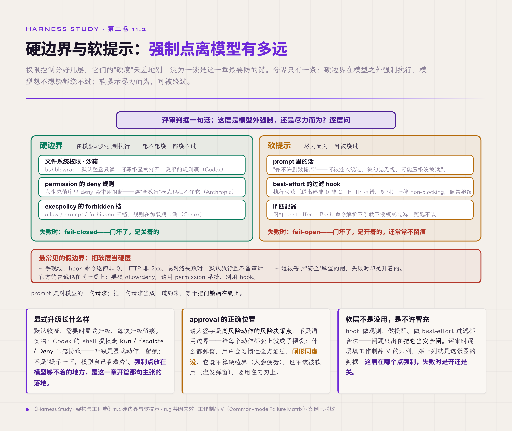
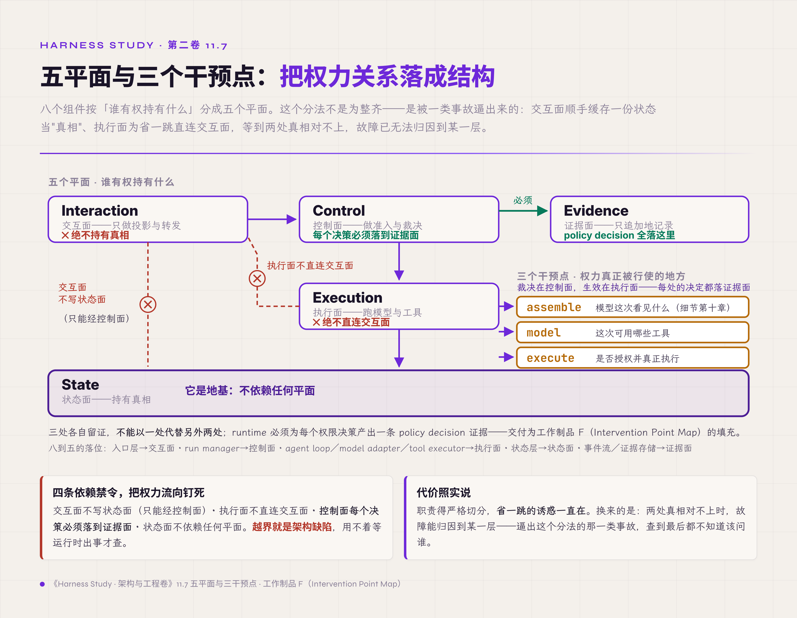

# 十一、权限、身份与运行时隔离

> v1.0 · 2026-07-23 · 依据 SPEC.md §十八 章 spec（权限章·authority lifecycle 收口：prompt 不是安全边界＋硬软层级＋principal/delegation＋隔离四类＋common-mode failure＋authority 不随状态恢复＋五平面）· 四维评审四路已落实，待用户审
> （本版本注与"审稿日志""引用来源"两节同属编辑工作区，出版前整体删除。）

前面几章一路把欠条堆到了这里。第七章立过一条铁律没展开——state continuity 推不出 authority continuity；第九章挂起恢复时碰到它一次，只立了接口；第十章问了一句"压缩、写 memory、删除，谁有权做"，也留给了本章。这些欠条是同一个问题的不同切面：一个 agent 能做什么、这份权力从谁来、到什么时候为止、崩溃或分叉之后还算不算数。

先拆掉一个最常见的错觉。不少系统的"安全"是在 prompt 里写的——"你不许删数据库""这些文件只读"。这不是安全边界。prompt 是对模型的一句请求，模型可能被注入的指令绕过、可能幻觉着无视、可能压根没读到那句话；把一句请求当成一道约束，等于把门锁画在纸上。本章的主张压成一句：**权限是运行时在模型之外强制的机制，不是 prompt 里的话**;而且授权有期限——恢复状态不等于恢复授权。读完本章，手里应当多一张分清硬边界与软提示的表、一张授权生命周期矩阵。

## 11.1 谁在行使权力，权力从谁来

问"谁有权"之前，先得说清"谁"。一次动作背后的行使者（principal）不止一个：**user**（真正的权力源头）、**agent**（替用户干活的）、**subagent**（agent 派出去的分身）、**tool/service**（被调用的外部服务）、**operator**（运维/管理员）。搞混他们，权限就无从谈起——一个 subagent 以 user 的全权去动手，和它以被收窄过的分身身份去动手，是两回事。

权力在这些 principal 之间传递，靠的是委托链（delegation chain）。每一次委托要记清五件事：谁授的、授了什么范围（scope）、到什么时候（期限）、能不能再往下转授（再委托）、怎么收回（撤销）。这里藏着一个基本判断——agent 到底是"用户的代理"还是"独立的身份"？答案决定权力的边界：作为用户代理，它的权力是用户权力的一个子集，不能超过用户；作为独立身份，它有自己的账号和授权边界，越权就是它自己的越权。principal 清单与委托记录，交付为工作制品 T（Principal & Delegation Registry，主体与委托登记）。

## 11.2 硬边界与软提示

权限控制分好几层，它们的"硬度"天差地别，混为一谈是这一章最要防的错。分两类：**硬边界**在模型之外强制执行，模型想不想绕都绕不过——文件系统权限、沙箱、permission 的 deny 规则；**软提示**是尽力而为、可被绕过的——prompt 里的话、best-effort 的过滤 hook。

业界的实现把这条线画得很清楚。Anthropic 的权限体系有一个六步求值序，deny 规则命中即阻断、连"全放行"模式也拦不住它——deny 是硬边界；而 hook 是软的：它执行失败——退出码非 0 非 2、HTTP 非 2xx、连接失败或超时——官方一律记为 non-blocking error，动作照常继续；连 `if` 匹配器都只算 best-effort，Bash 命令解析不了就不按模式过滤、照跑不误。所以官方直接告诫：要硬 allow/deny，请用 permission 系统、别用 hook【规范/官方文档】。

OpenAI Codex 的 execpolicy 把命令分三档——allow / prompt / forbidden，规则自带 match/not_match 并在加载期自测；它的 shell 提权走 Run / Escalate / Deny 三态协议，升级是显式动作、留痕【厂商实践】。这些实例的共同形态，就是本章开篇那句主张的落地：把强制点放在模型够不着的地方。

反过来，把软层当硬层是最常见的假边界。hook 静默 fail-open 就是一例——配套中继服务的一次审计里，hook 命令返回非 0、HTTP 非 2xx、或网络失败时，默认放行且不留审计【经验】：一道被寄予"安全"厚望的闸，失败时却是开着的。approval（请人签字）也要摆正位置：它是高风险动作的风险决策点，给每个动作都套上就成了摆设——什么都弹窗，用户会习惯性全点通过，闸形同虚设。硬软层级收进工作制品，评审时逐层问"这层是模型外强制、还是尽力而为"。

*图 11.2 · 硬边界与软提示：强制点离模型有多远*

## 11.3 默认收窄，显式升级，分身不继承全权

权力的默认值应该是"最少"。两条相关的最小化：**最小权限**（least privilege，能完成任务的最小权限集）和**最小自主**（least agency，完成任务所需的最低自主度）——一个只需要读三个文件的任务，不该拿到整盘写权；一个只需要建议的步骤，不该拿到直接执行权。默认收窄、需要时显式升级、每次升级留痕，是权限工程的基本姿态，Codex 那个"整盘默认只读、可写根显式打开"的沙箱就是这条的实现（11.4 节展开）。

分身尤其要收窄。subagent 的权限默认必须比父窄，且绝不自动继承父的"全放行"。这里有一个典型陷阱：subagent 继承父进程的 bypass 权限、又无法逐个覆盖，等于给分身发了全系统的钥匙——这个"继承且无法逐个覆盖"的细节由 Anthropic 官方文档明标为风险点【规范/官方文档】。与它相邻、方向却相反的另一种失效是授权用完不回收——一篇预印本把这种毛病命名为 Lingering Authority（残留授权）：为某个子目标临时开出的资源/副作用能力，在那个子目标关闭之后仍挂在 planner 的接口上（arXiv:2606.22504）【预印】。两者都是权力比需要的多，一个错在委派时没收窄，一个错在用完没收回。配套中继服务里有个同族的实物：一个 skill 的激活状态，注释声称是会话级作用域，实际却按项目路径缓存、跨会话共享——声明的 scope 和真实的 scope 对不上，权限就在没人察觉的地方蔓延了【经验】。作用域是声明出来的，更得是可验证的：注释说了不算，得能查。收窄也有代价：收过头，subagent 每做一步都得回父进程要权限，任务被升级请求切成碎片；要卡的刻度是"完成这个子任务所需的最小集"，一味求窄反而添乱。

## 11.4 隔离的四个面

权限决定"能不能做"，隔离决定"就算做了，能波及多远"。四类隔离接口各管一面：**文件系统**（能读写哪些路径）、**进程**（能不能起子进程、起了归谁管）、**网络/出口**（能不能对外发请求，即 egress）、**密钥**（secret 能不能进到执行环境里）。

文件系统隔离的一个成熟形态是 Codex 用的 bubblewrap 沙箱：默认把整个文件系统只读绑定，可写的根用显式规则一层层打开，`.git`、`.codex` 这些即便落在可写根下也重新以只读绑定保护起来；分层覆盖按路径特异性生效，更窄的规则赢——可写目录里能再抠出一个只读子目录【厂商实践】。默认拒绝、显式放行，和权限的姿态是同一条。

出口隔离最容易被漏，因为它藏在一个想当然里：把工具分成"只读"和"写"，以为只读的无害。配套中继服务的审计推翻了这个假设——它的"只读"工具集合里混着 web 搜索、网页抓取、图像分析，而这些跑在权限门禁之前【经验】。问题不只是执行顺序错了："只读"挡的是写，可把数据发出去、把内部信息带出边界同样是副作用——信息外流也归 egress 面管。正确的准入顺序是先取 run 租约、锁定不可变的运行上下文、过 policy，然后才允许任何对外调用。

密钥隔离同理，还有一个跨请求的坑：一个处理隐私数据的引擎若做成单例、持有可变的映射表，并发请求就会互相污染、互相清空对方的映射——修法是把映射表按请求隔离，规则和配置可以共享，映射表不能共享【经验】。四类隔离的边界登记，交付为工作制品 D（Runtime Trust Boundary，运行时信任边界）的填充。隔离的代价是摩擦：默认整盘只读，意味着每条合法写入路径、每次正当对外调用都得显式报备打开，配置成本压在开发者身上——这是拿"默认安全"换"默认能用"，值不值取决于被攻破的代价有多高。四面里进程隔离这一面本章素材最薄——起子进程、归谁管、父退出后孤儿进程谁回收，配套中继服务里尚无对应事故落账，照实记为待补格（第十四章工单），不硬凑案例。

外来内容还要带信任标签。tool output、读到的文件、抓来的网页、memory 里的旧记忆——这些默认都不可信，尤其网页和工具返回，是 prompt 注入的入口。信任是分级的：自己写的系统约束最可信，外来内容最不可信，中间按来源排。

## 11.5 纵深防御的前提：几层要真的独立

"我们有四层防御"听着让人安心，可它可能是四层纸。纵深防御（defense-in-depth）只在一个前提下才成立：各层的执行点和失效模式足够独立。四层防御若共享同一个解析器、同一个分类器，那个共享件一坏，四层一起塌——这叫共因失效（common-mode failure），是"有四层"这句话最大的谎。

所以光数层数没用，要给每一层记清六件事：它在哪个点强制（enforcement point）、它坏起来是什么样（failure mode）、它依赖什么共享件（shared dependency）、失败时是开还是关（fail-open / fail-closed）、有没有兜底（fallback）、留不留证据（evidence）。前面那个 hook fail-open 就是这张表里最危险的一格：失败时默认开，还不留证据。把这六列填出来，才知道四层里有几层是真的、有几层共命。这张表交付为工作制品 V（Common-mode Failure Matrix，共因失效矩阵），也是本章给评审的一件利器——不接受"我们有多层防御"这种说法，只认逐层填出的六列。

## 11.6 恢复状态，不等于恢复授权

现在收前面各章的欠条。authority lifecycle 这条线，从第五章的租约、第六章的三生命周期分离一路铺到这里，核心就一句话：**授权不随状态自动恢复**。

resume、fork、replay 三种操作重建的是状态与执行，绝不能顺手把旧的授权一起复活——已经批过的 approval、只在那个会话里有效的 permission、委托 token、credential，都不许随状态静默回来。第七章 7.8 节立的铁律（state continuity 推不出 authority continuity）、第九章 9.8 节挂起三天后恢复要重验授权、第六章 Lifetime Matrix 里 approval 行"恢复即重验"那条、第八章 committed_under 在提交点复核当刻的执行权——四处欠条，在这里收成一条完整规则。第十章那句"压缩、写 memory、删除谁有权做"也在这里落地：答案由发起这些动作的 principal 的授权范围与委托链决定（11.1 节），同样受"恢复不携带授权"约束。

规则的正面形态：确需跨恢复保留的授权，必须显式列进契约（不是默认带着走），并且在上下文、主体、版本任一变化后重新验证。反面就是那个最常见的事故——checkpoint 忠实地把三天前的授权一起恢复了回来，而批准它的人权限早已被收回。这条规则的代价压在恢复的顺滑上：一律重验，意味着挂起三天后的自动恢复可能卡在"原批准人得重新签一次"，无人值守的恢复被打断——但这正是要的，宁可恢复慢一步，不让旧授权蒙混过关。授权的完整生命周期——谁授、什么范围、到何时、随什么失效、恢复时怎么重验——登记为工作制品 U（Authority Lifecycle Matrix，授权生命周期矩阵）。这张矩阵是主线五的落点：状态可以回卷，授权不能白搭车。

## 11.7 把权力关系落成结构：五平面

前面讲的是权力的规则，最后把它落成结构。这个分法不是为整齐——是被一类事故逼出来的：交互面顺手缓存一份状态当"真相"、执行面为省一跳直连交互面，等到两处真相对不上，故障已无法归因到某一层。八个组件按"谁有权持有什么"分成五个平面：**Interaction**（交互面，只做投影与转发）、**Control**（控制面，做准入与裁决）、**Execution**（执行面，跑模型与工具）、**State**（状态面，持有真相）、**Evidence**（证据面，只追加地记录）。每个平面配一张"绝不持有"清单——交互面绝不持有真相，执行面绝不直连交互面——把"谁不准碰什么"钉死在架构层，用不着等运行时出事才查。代价是职责得严格切分，省一跳的诱惑一直在，靠 review 守住底下四条禁令。

平面之间有四条依赖禁令：交互面不写状态面（只能经控制面）、执行面不直连交互面、控制面的每个决策必须落到证据面、状态面不依赖任何平面（它是地基）。这四条禁令把权力的流向钉死，越界就是架构缺陷。

权力真正被行使的地方是三个干预点——assemble（组装 context，决定模型看见什么，细节第十章）、model（决定这次可用哪些工具）、execute（是否授权并真正执行）——三处各自留证，不能以一处代替另外两处。runtime 必须为每个权限决策产出一条 policy decision 证据（这类决策并入事件流，不单列表）。三干预点交付为工作制品 F（Intervention Point Map，干预点图）的填充，五平面到组件的落位表随正文交付、另供第十五章评审取用。

*图 11.7 · 五平面与三个干预点：把权力关系落成结构*

## 破坏实验：越权、投毒、过期、共命四场景

按四步测量协议执行，四场景共用观测点：policy decision 事件、principal 与 scope、授权重验记录、剩余硬边界的 fail-closed 行为。

1. **subagent 越权 / 恶意 tool result**：给 subagent 一个超出其 scope 的动作；或让一个工具返回带注入指令的结果。判定：通过＝subagent 动作被按收窄后的 scope 拒绝、落 policy decision;工具返回内容带不可信标签、不被当指令执行。失败＝分身以父的全权动手，或注入内容被当命令跑。
2. **过期 delegation 后 resume/fork**：高风险授权批准后，撤销授予者的权限，再 resume 或 fork 这个 run。判定：通过＝旧授权不随状态复活、恢复时重验失败即拒；失败＝三天前的授权静默生效。
3. **secret 进 sandbox**：让一个密钥进入本不该拿到它的执行环境。判定：通过＝密钥隔离拦下、留证；失败＝secret 泄进沙箱。
4. **关闭共享件**：关掉多层防御共同依赖的那个分类器/解析器。判定：通过＝剩余的硬边界仍 fail-closed 兜住；失败＝共享件一关，多层一起失守（共因失效坐实）。

复跑 N=3。实证状态照实分层【经验】：四场景均为思想实验，判定口径先立——参考实现与完整矩阵是第十四章工单；配套中继服务的审计已把三个真实缺口（"只读"工具藏外发、隐私映射表跨请求共享、hook 静默 fail-open）定为修复项，路线与本章口径一致，是场景 1/3/4 的现实近亲。

## L 级自检

按第一章的成熟度尺（L1 能跑、L2 能看，全表见第一章 1.3 节）。本章机制的 L2 底线：每个权限决策都要落一条 policy decision 证据——principal、规则、输入摘要、决定、依据、enforcement point 六样齐，否则"这个动作谁批的、凭什么放行"事后查不到。套第一章那条假落地诊断：系统里有 permission 配置（L1 在），可 trajectory 里查不到 policy decision 事件（L2 缺），按未接线嫌疑处理——最容易缺的是"放行"的记录，因为拦截往往留痕、放行常被当默认而无声。

四问落位：可观测由 policy decision 落账兑现；可控是本章主场——硬边界在模型外强制、软层不冒充硬层，这一格全押在"权限是运行时机制不是 prompt"上；稳定兑现在隔离与共因分析——共享件一关、剩余硬边界仍 fail-closed;闭环的一环在授权重验上成形——触发点是恢复事件本身（resume/fork/replay 一律触发），重验时比对当前授予者权限、上下文、版本是否仍与当初一致（检测），不一致即拒绝（纠正），拒绝或放行都落 policy decision（验证）。这条环靠"恢复必重验"兜底，不依赖对授权失效的实时监测——监测做不到全，恢复点做得到必过。

坐标系落位补一句：本章守的是权限契约——第八章管"副作用怎么记账"、本章管"这次副作用谁批准的、他现在还有权批吗"。第一章 1.2 节六类契约表里权限契约那格问"谁以谁的身份、在什么边界内行动"，在本章收窄成"谁批的权限、现在还有效吗"，由 principal/委托/授权生命周期三件共同接住。配套中继服务现状照实记账：本章机制整体还在 L1 与 L2 之间——permission 配置在（L1），但 policy decision 完整落账、"放行"记录、common-mode 六列都还没接齐（L2 缺），不粉饰成半格；三个缺口已定修复项、尚未全部实施，补格工单第十四章。

## 交付物

1. **Principal & Delegation Registry**（工作制品 T，11.1 节）——principal 五类＋委托记录（授予者/scope/期限/再委托/撤销）；
2. **Authority Lifecycle Matrix**（工作制品 U，11.6 节）——授权的授予/范围/期限/失效条件/恢复重验，主线五收口；
3. **Common-mode Failure Matrix**（工作制品 V，11.5 节）——每层防御的六列（强制点/失效模式/共享件/fail-open·closed/兜底/证据）；
4. **Runtime Trust Boundary**（工作制品 D 填充，11.4 节）＋ **Intervention Point Map**（工作制品 F 填充，11.7 节）＋五平面落位表；
5. **permission fixture**（第十四章工单）——四场景破坏实验的可执行验证。

近道读者可单取工作制品 V 作评审尺——数一遍被评系统的多层防御共享几个 parser/classifier，共享的那个就是纵深防御的假底。

## 立即可做的一个动作（五分钟）

builder 版本：列出系统里所谓的"多层防御"，给每一层填三格——它在哪个点强制、失败时是开还是关、它和别的层共享哪个解析器或分类器。填完看两件事：有没有哪层失败时默认开（fail-open）、有没有两层以上共享同一个件。两样都没有才叫纵深，否则是叠床架屋。

assessor 版本：问被评团队一个问题——"高风险操作批准之后，如果那个 run 崩溃重启、或者被复制成一个分支，原来的批准还算数吗？"答"还算数"或"没想过"的，按本章的账记：授权随状态静默复活，是记在账上的越权隐患。

## 下一章

单个 agent 的权限守住了：谁有权、从谁来、到何时、恢复时重验。可一旦 agent 派出分身、多个 agent 并行协作，新问题就来了——父子之间权限怎么收窄和传递、几个 agent 抢写同一份 artifact 怎么办、一个子任务失败怎么不拖垮全局，尤其是：subagent 回传的结果，凭什么因为它来自"内部"就更可信？多 agent 协调，第十二章。

## 审稿日志

> （编辑工作区：本节与"引用来源"节出版前整体删除。）

| 轮 | 检查 | 命中与修改 |
|---|---|---|
| 版本史 | — | v1.0（2026-07-23）：依 SPEC §十八 spec 首写。大纲条目映射：11.1-11.13 收拢为 11.1（principal/委托，含大纲 11.1/11.2/11.3）、11.2（硬软层级，含 11.5/11.6/11.10）、11.3（最小权限+subagent 收窄，含 11.4/11.8）、11.4（隔离四类+信任标签，含 11.7/11.9）、11.5（common-mode，11.11）、11.6（authority 不随状态恢复，11.12）、11.7（五平面+三干预点，11.0 下沉件，位置后移作结构收束）；11.13 供应链/多租户→卷三。六张授权欠条收口：第五章租约、第六章 6.11 三生命周期+Lifetime Matrix approval 行、第七章 7.8、第八章 committed_under、第九章 9.8、第十章授权接口 |
| 章级验收自测 | SPEC §十八 清单 | 正文表格 0（登记表全住工作制品 T/U/V/D/F，正文只散文＋列点）＋配图占位 0;新概念实计约 13（principal 五类、委托链、硬边界/软提示、最小权限/最小自主、subagent 收窄、隔离四类、信任标签、common-mode、authority lifecycle、五平面、四依赖禁令、三干预点、policy decision 证据——≤14 达标）；前向引用约 6 处/4 章（第十二/十三/十四/十五＋卷三——≤8 达标）；一手证据 3 处（"只读"藏外发／PII vault 跨请求共享／hook fail-open／skill scope 泄漏——桌面案例侧素材强）；外部权威 ≥4（Anthropic permission 六步序/hooks best-effort／Codex execpolicy+bubblewrap／Lingering Authority 论文）；业界对照带失效点 ✓（hook fail-open＋subagent 继承 bypass）；破坏实验四场景四步协议＋实证分层 ✓;L 级自检＋坐标系落位 ✓;双读者动作 ✓;文字化引用零 § ✓;工作制品引用带名称（T/U/V/D/F 首现带括注）✓ |
| R1 grep 红线 | 首稿自查＋评审后复跑 | "你"系 0;元叙述 0;模糊词首稿 2 处（"很多系统/很多层"）→"不少/好几层"，复跑 0;显式禁形——章主张两处（"权限是机制不是 prompt 里的话"＋"恢复状态不等于恢复授权"，节标题 11.6 带主张对比不计配额）；评审后清掉卫星对比 4 处（首稿"信任不是有无是分级"、style 抓 L22"是决策点不是通用边界"/L36"read-only 不等于无副作用"、落实时新引入 L60"而不是等出事再查"）→全改陈述，复跑仅余章主张；整句加粗——L28"绝不自动继承父全放行"去粗（style），余仅章主张＋短标签词；语域（"叠罗汉→叠床架屋""戳破→推翻""麻木地→习惯性""PII vault→隐私映射表"已清）；体量落实后正文约 104 行 |
| 四维评审 | **四路已跑齐并全部落实（2026-07-23，均用 opus）：technical B+→A-（节号＋§11.12 传播清零）／style 有条件通过→A-（对比配额＋整句加粗清零）／cybernetic B+→A-（代价末环＋收口欠条清零，方法论比例实测约 76%）／business B+→合规达标（脱敏＋裁决状态清零），零 P0** | technical P1：11.6 坐标系落位第一章权限契约节号 1.5→1.7＋原格措辞"谁以谁的身份、在什么边界内行动"（1.5 实为六级实体链）；P2（同一根因）：大纲 11.12→11.6 收拢未传播干净——grep 全库补齐 I/A/H/L 四表＋第六章 6.6/第七章恢复表/WRITING-PLAN 共 7 处 §11.12→§11.6（U 表与 I 表当场打架、指向不存在节）；P3：引用来源节号同步、工作制品 D 命名 Boundary Map→Runtime Trust Boundary、L50 引号附会"效力不随 resume/fork 延续"→"恢复即重验"。cybernetic P1：subagent 收窄/隔离四面/authority 重验三处补代价末环（第九/十章同型复发）、11.7 五平面补失效由来（被事故逼出、非为整齐）、主线五收口漏第十章"压缩/memory/删除谁有权做"欠条→11.6 补归位句；P2：闭环"检测腿"改诚实口径（恢复事件触发的无条件重验，非实时监测）、process 隔离面素材最薄照实标待补、L 级半格改"整体在 L1 与 L2 之间、不粉饰半格"。style P2：L22"是决策点不是通用边界"倒序藏对比＋L36"read-only 不等于"卫星对比清、L28 整句加粗去粗、L36 过载段（六件事）拆两段；P3：L20/L58 拆段、麻木地→习惯性、戳破→推翻。business P2：Lingering Authority 预印本被写成"学术上叫/被论文点名"→降级"一篇预印本命名/分析"＋"无法逐个覆盖 bypassPermissions"细节归还 Anthropic 文档、破坏实验正文"PII vault"→"隐私映射表"脱敏统一；P3：A 表裁决注"待 §十一裁决"状态过期→已裁决、U 表补评审用法、README checklist 补 v2.2-v2.5 新增行 |
| 终稿回核清单 | — | Codex execpolicy 三档/shell-escalation 三态/bubblewrap 分层（回核 research/07）；Anthropic permission 六步序与 hooks exit 码语义（回核 research/03）；Lingering Authority arXiv:2606.22504 论文结论；Howpot 条 24-27 脱敏口径 |

## 引用来源

> （编辑工作区：本节出版前整体删除。）

- 【规范/官方文档】Anthropic — Configure permissions（六步求值序、deny 恒胜、bypass 拦不住 deny、subagent 继承 bypassPermissions）＋ Hooks reference（32 事件、exit 2 阻断、其余非 0 退出码与 HTTP 非 2xx/连接失败/超时一律 non-blocking error 且执行继续、`if` 匹配器 best-effort 且解析失败时 fail open、"硬 allow/deny 请用 permission 系统"告诫）（11.2/11.3；终稿前回核）。指针 research/volume2/03。
- 【厂商实践】OpenAI Codex — execpolicy 三档 allow/prompt/forbidden＋规则加载期自测、shell-escalation Run/Escalate/Deny 三态、bubblewrap 默认整盘只读＋分层覆盖＋.git/.codex 只读绑定、macOS Seatbelt（11.2/11.3/11.4；终稿前回核）。指针 research/volume2/07。
- 【预印】Lingering Authority（arXiv:2606.22504，单作者，2026-06）——子目标关闭后未回收的临时资源/副作用能力，是时间维的残留；与 subagent 继承父 bypass（委派维未收窄）是两类失效，论文全文不涉 subagent/继承（11.3）。终稿前回核论文结论与编号。
- 【经验】配套中继服务与桌面案例项目审计：hook 静默 fail-open（11.2/common-mode）、skill 激活状态跨会话按 projectPath 泄漏（11.3）、"只读"工具集藏 web 外发跑在 policy 前（11.4）、PII vault 跨请求共享可变映射（11.4）——admission 顺序 run lease→不可变 RunContext→policy→外呼。指针 research/volume2/11 条 24/25/26/27。
- 回指素材：第一章 1.2 节（权限契约那格"谁以谁的身份、在什么边界内行动"）、硬控制走模型外总纲（第二章 T4 落点）；第四章 4.8 节（五平面/干预点下沉标位）；第五章（租约）；第六章 6.11 节（三生命周期分离）、工作制品 I Lifetime Matrix（approval/lease/token/credential 行）；第七章 7.8 节（state continuity 推不出 authority continuity）；第八章 8.3 节（committed_under、提交点验执行权）、工作制品 B policy_decision_ref;第九章 9.8 节（挂起恢复授权重验）；第十章（压缩/memory/删除的授权接口）；工作制品 C（policy.decided 事件）、D（Runtime Trust Boundary）、F（Intervention Point Map）。
