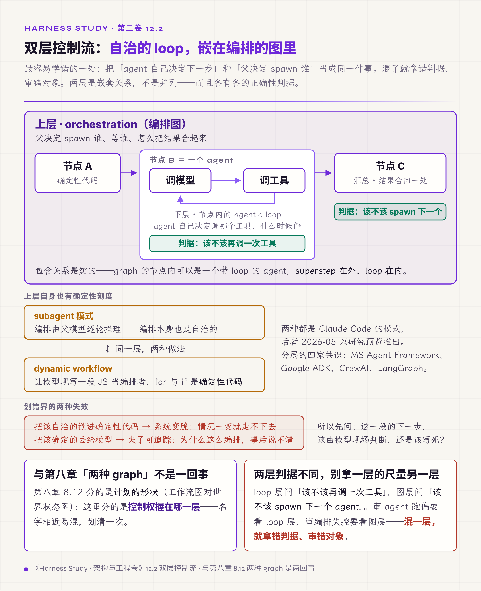
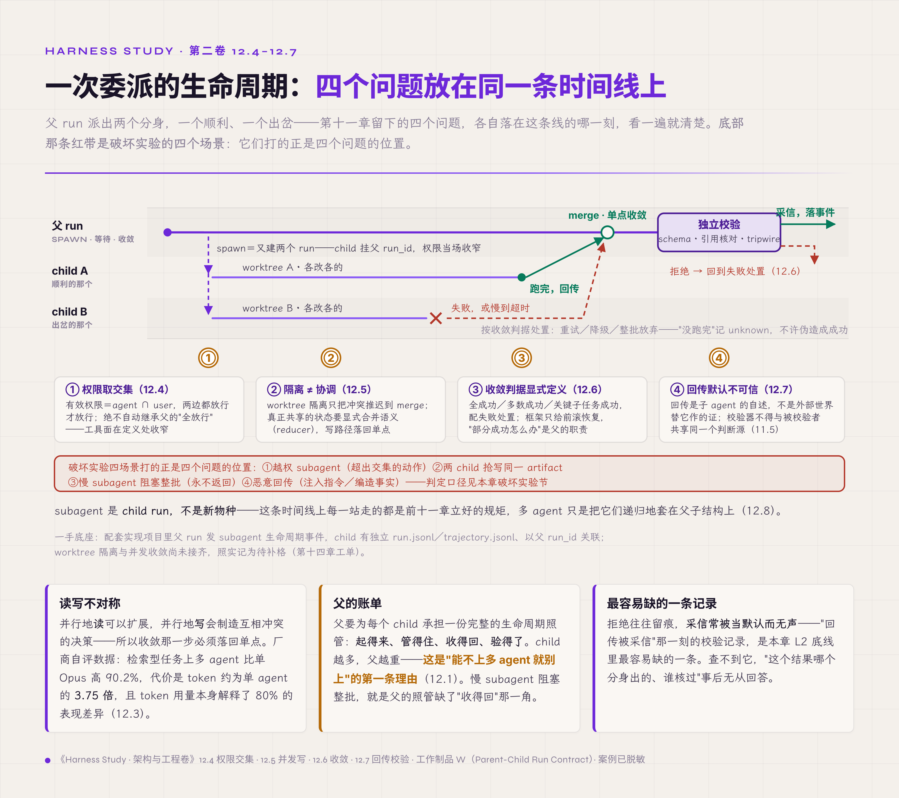

# 十二、多 Agent 协调

> v1.0 · 2026-07-24 · 依据 SPEC.md §十九 章 spec（多 agent 章·subagent=child run＋契约沿父链继承＋双层控制流＋读写不对称＋partial failure 收敛＋subagent 输出可信度＋六契约递归组合）· 四维评审四路已落实，待用户审
> （本版本注与"审稿日志""引用来源"两节同属编辑工作区，出版前整体删除。）

第十一章结尾留下了四个问题，都出在 agent 派出分身、几个 agent 并行协作的情形里：父子之间权限怎么收窄传递；几个 agent 抢写同一份文件怎么办；一个子任务失败，怎么不连累全局；还有最难回答的一条，subagent 回传的结果，凭什么因为它来自"内部"就更可信。这四个问题是同一个问题的四个侧面：前面十一章提出的六类契约，都是按单个 agent 写的；现在 agent 会生出 agent、会并排跑，这套契约还守不守得住。

先说结论。**subagent 是 child run，而不是新物种。** 一个 agent 派出的分身，本质上是又一个 run：第五章的状态机、第六章的实体链、第十一章的权限收窄，原样适用，只是挂在父 run 底下。顺着这个判断，本章的核心主张是：**多 agent 不引入第七类契约，它是六类契约在父子与并行结构下的递归组合**。组合真正失效的地方在接口、边界、终止条件和交接的保真度上，单个 agent 够不够聪明只是次要因素。本章给出两样东西：一张父子 run 契约表（工作制品 W）和一张双层控制流图。

## 12.1 多 agent 先是协调面，才是智能

先看一个诱人的直觉：既然一个 agent 能干活，多派几个各干一部分、结果拼起来，不就更快更强？

这个直觉有大样本的反例。UC Berkeley 的 MAST（Multi-Agent System Failure Taxonomy，多智能体系统失效分类）研究分析了 7 个主流多 agent 框架的 1642 条标注轨迹，把失效归成三大类。按论文 v3（2025-10）图 1 的占比：系统设计问题占 44.2%，agent 间失调占 32.3%，任务验证问题占 23.5%（各版本的占比不同，本书取 v3）【评审，arXiv:2503.13657 v3（NeurIPS 2025 D&B），三占比取自其图 1】。其中第二类直接出在 agent 之间，第一类多与协调层的设定有关（角色与任务规格、终止条件）；多 agent 的失效，大多不能只归到单个 agent 不够聪明上。实践里最容易遇到的是一种转圈：任务在 A→B→C→A 之间来回交接，没有哪个 agent 真正认领它，每转一手都重新规划一次，上下文每经过一跳就丢掉一部分。业界把它叫 infinite handoff loop（无限交接循环）。这不是 MAST 的模式名，而是 handoff、swarm 一类框架的社区叫法【行业术语】；MAST 里与它最接近的是"步骤重复"与"不识别停止条件"两个模式。

根因在于：多 agent 首先引入的是协调面，其次才是智能。本书所说的协调面，指多个 agent 之间必须额外维护的那层协调工作：接口怎么对上、边界划在哪、什么时候算完成、回传的结果信不信。每多一个 agent，就多一组这样的问题要维护。把这一层当成免费的，等于把系统的正确性押在了最不可靠的一环上。

所以设计上不另造新物种，只把 run 递归一层：subagent＝child run。父 run 派生（spawn）一个 child，child 有自己的状态机（第五章）、自己在实体链中的记录与 correlation 规则（第六章），权限按第十一章收窄。配套实现项目里这一层已经实现：父 run 发出 subagent 的生命周期事件，child 有独立的 `run.jsonl` 与 `trajectory.jsonl`，以父 run_id 关联回去【经验】。递归的基础没有变：crash-only 原则与单一真相源不因层数增加而改变。代价也随之而来：父要为每个 child 承担完整的生命周期管理，起得来、管得住、收得回、验得了。child 越多，父的负担越重。这是"能不用多 agent 就不用"的第一条理由。

## 12.2 双层控制流：自治的 loop 与编排的图

认清了 child run，接着要分清两层控制流，否则后面讲的协调都会混在一起。

单个 agent 内部有一层控制流：它自己决定下一步调哪个工具、什么时候停。这是节点内的 agentic loop。Vercel AI SDK 把它显式化成 `stopWhen`（何时停）和 `prepareStep`（每步之前改模型、工具或上下文）两个钩子，Google ADK 用一个 event loop 承载【规范/官方文档】。多 agent 又叠了一层：父决定 spawn 谁、等谁、怎么把结果合起来。这是跨节点的编排（orchestration），LangGraph 的 graph superstep（图的一轮同步执行步）、Inngest 的 Networks＋Router、Codex 与 Devin 的父调度层都在这一层【规范/官方文档＋厂商实践】。

这一节要防的错，是把两层混为一谈。常见的口号"用 graph 取代 loop"就把两层搅在了一起：要么把该自治的一步硬编码进图，要么反过来把编排的分派交给模型自由发挥。根因是两层的判断标准根本不同：loop 层判断"该不该再调一次工具"，图层判断"该不该 spawn 下一个 agent"；两层混在一起，就会拿错误的标准去审查错误的对象。

设计上的解法是把两层显式分开，这也是 2026 年上半年框架层最明确的一个共同方向。微软的 Agent Framework 给出"Agent（自主 loop）对 Workflow（确定性图）"的判定表，并直言"能写个函数解决就别用 agent"【规范/官方文档】；Google ADK 分成 LlmAgent（模型驱动的委派）与 Sequential、Parallel、Loop 三种确定性编排 agent；CrewAI 让自治的 Crew 嵌在事件驱动的 Flow 里；LangGraph 的节点内可以是带 loop 的 agent，graph 的 superstep 在外层。四家路径不同，结论一致。它的依据是第一章那条复杂度前置的决策梯度（能用确定性方案，就不用不确定的方案）在多 agent 上的翻版。代价是自治与编排的分界要在动手前划定，而且事后难移。划错了有两种后果：把需要模型判断的一步硬编进图，该自治的被锁进确定性代码，变得脆弱；或者把该确定的分派丢给模型自由发挥，该编排的失去了可追踪性。两种错都要等到出现 failed 才暴露。换来的是可追踪：编排层确定，失败就能定位到某个节点；全交给自治，就只能在一团 loop 里猜。

同一条分层线，有一个产品走得最直白。2026 年 5 月 Anthropic 给 Claude Code 加了 dynamic workflow。在 subagent 模式下，编排由父模型逐轮推理决定 spawn 谁、等谁、怎么合并，编排这一层本身也是不确定的自治；dynamic workflow 则让 Claude 现写一段 JavaScript 脚本担任编排者，for 与 if 是确定性代码，agent 退回只做判断。官方的概括是"控制流在代码里，判断力在模型里"【厂商实践，2026-05 研究预览】。它还有两点值得注意：一是脚本把中间结果留在变量里、不进父的 context，只回传最终校验过的答案，父的上下文不被中间产物挤占，回传也先过一道校验（对应 12.7 节的输出校验）；二是编排走确定性代码，中途失败还能 resume，相当于把第七章的持久化执行（durable execution）套在了编排层上。

（这里的"双层控制流"和第八章 8.12 节讲的"两种 graph"是两回事：那里区分的是计划画成什么形状（工作流图还是世界状态图），这里区分的是控制权握在自治层还是编排层。名字相近，容易混淆，在此说明。）

*图 12.2 · 双层控制流：自治的 loop，嵌在编排的图里*

## 12.3 什么时候才值得上多 agent

分层的工具备齐了，下一个问题是该不该用。多 agent 并非越多越好，得先把成本算清楚。

Anthropic 给过一条决策梯度：单次模型调用、workflow、单 agent、多 agent，每上一级，都用更高的延迟、成本和错误叠加风险，换取更强的表现【厂商实践】。它在介绍自家多智能体研究系统的文章里，给出了一组厂商自评数据：

- 在偏检索的研究任务上，一个 Opus 主 agent（lead）带几个 Sonnet subagent，比单个 Opus 高 90.2%；
- 代价在 token 上：单 agent 约为普通对话的 4 倍，多 agent 约为 15 倍（均相对普通对话）。两个粗略数字相除，多 agent 约为单 agent 的 3.75 倍，只能当量级参考；
- 同一篇文章在 BrowseComp 评测上做的分析显示，token 用量单独就解释了约 80% 的表现差异【厂商实践；非独立复现基准】。

成本划不划算，关键在读写不对称：并行地读可以扩展，并行地写会产生互相冲突的决策，所以收敛那一步必须回到单点。LangChain 明确讲过这一点，Anthropic 的实现也是让检索并行、最终综合交给单个 agent【厂商实践】。

反方向的证据也在积累。已有预印本报告，把推理 token 预算控制在同一水平后，单 agent 在多跳推理任务上一致地持平或超过多 agent；同一篇也划了边界：当单 agent 的有效上下文利用被削弱，或者愿意投入更多算力时，多 agent 重新有竞争力【预印，arXiv:2604.02460，限多跳推理，量级参考】。业界的对立立场也应并列：Cognition 在《Don't Build Multi-Agents》里主张单线程加上下文压缩，与 Anthropic 的 orchestrator-worker（主从编排）正面相左。两条路线各有适用边界，这里不预设谁对谁错【厂商实践，Cognition／Anthropic 立场对垒】。所以判断要冷静：多 agent 是用成本换质量，扩展从来不免费。只有当任务能切成互相独立、以读为主的子任务，且收敛点单一时，才值得用。代价很直接：一旦用多 agent，token 开销按上面的粗算约为单 agent 的 3.75 倍，还要加上一整套协调开销；止损线画错，多花的钱全耗在协调上，换不来质量。

## 12.4 父子之间：权力取交集，不取并集

决定要用之后，第一个要守的契约是权限：它把第十一章的规则从单 agent 推广到父子链。

"契约沿父链继承"在权限上有一个精确形态：有效权限＝agent 的权限 ∩ user 的权限，两边都放行才放行，取的是交集。子 agent 默认收窄，而且绝不自动继承父的"全放行"；第十一章那个 subagent 继承父 bypass 的反例，错就错在方向上。根因是把委派当成了权限的透传。委派时如果把父的权限原样交给 child，问题会在 child 处理不可信输入时暴露：网页、文件、其他 agent 的回传里夹带的指令，可以诱导 child 用父的权限去办别人想办的事。这就是混淆代理人（confused deputy）问题：持有高权限的程序被低权限的一方诱导，用自己的权限替对方办事。委派本该收窄，透传却让每一次委派都多出一个可能被利用的代理人。另一类风险来自 agent 之间可以互相改写配置：2025 年 9 月有人公开演示过跨 agent 提权（Cross-Agent Privilege Escalation），两个 agent 互相改写对方的配置文件，彼此把权限一点点抬高，形成自我强化的循环【预印/研究记要】。这个演示讲的不是父子委派，而是平级 agent 之间的横向提权；它提醒的是，权限配置本身如果放在其他 agent 可写的位置，交集规则就会被从侧面绕过。

正面的做法在 2026 年的产品里已经能看到。Codex 的子 agent 继承的是父会话那套收窄过的沙箱和网络规则，继承来的是限制本身【厂商实践，v0.115.0】；Claude Code 在定义处固定子 agent 的工具范围：subagent 继承主会话的工具池，再由 frontmatter（agent 定义文件的头部配置）里的 `tools` 白名单和 `disallowedTools` 黑名单收窄，后台 subagent 还会额外去掉一批内建工具【规范/官方文档】。两家都在委派那一刻收窄了工具范围。但 Claude Code 只固定了"能调哪些工具"，没有固定"调用时要不要询问"：父会话若处在 `bypassPermissions` 或 `acceptEdits` 模式，这一设置优先于子 agent 自己声明的 permissionMode，且无法覆盖【规范/官方文档】，第十一章那个反例正出在这里。收窄也有代价，和第十一章是同一处权衡：交集取得太狠，child 常常权限不够，每做一步都要回父那里申请，任务被一串升级请求切碎。分寸还是那句话：卡在"完成这个子任务所需的最小集合"，一味求窄反而添乱。

## 12.5 几个分身抢写同一份文件

权限管住了"谁能动"，下一个问题是"一起动同一样东西"：几个 child 并行，抢写同一份文件或同一块状态。

2026 年有一个几乎通用的答案：git worktree 隔离。Codex 桌面端、Devin Desktop 的 Cascade、Cursor 的 `/worktree` 命令都这么做：每个并行任务拿一个独立的工作目录和分支，共享同一个 `.git` 对象库，执行期间各改各的、互不冲突【厂商实践】。也有做得更重的：Devin 云端的 managed Devins，每个 child 是一台完整的 Devin，跑在自己的隔离虚拟机里，终端、浏览器和开发环境都独立【厂商实践】；Cursor 的 cloud agent 同样运行在隔离虚拟机里，与本地的 worktree 方式并存【厂商实践】。整机隔离把进程与文件系统的冲突一并消除。但这两种方式有同一个边界：隔离不等于协调。隔离只是把冲突推迟到 merge 那一刻，并没有解决它。真正共享一块状态的并发写，需要显式的合并语义。LangGraph 在这方面做得最完整：两个节点在同一步里写同一个 state key，会直接抛出 `INVALID_CONCURRENT_GRAPH_UPDATE`，要求开发者写一个 reducer，告诉图该怎么合并。这里的 reducer 是 LangGraph 用来合并并发写入的函数，与第十三章事件溯源里把事件序列折叠成状态的投影函数不是一回事。checkpointer 再用基准 checkpoint 的 ID 做乐观并发检测【规范/官方文档】。这套机制也有它的失效点：高吞吐下会触发频繁的重试抖动，把 I/O 和模型调用的成本一起耗掉。

根因是把并行写当成了并行读：以为各写各的没事，实际上两个写决策悄无声息地互相覆盖。设计上顺着第六章的单一写者和第八章的幂等来：写路径要么单点化，要么用显式的 reducer 合并；worktree 负责执行期隔离，父 run 在 merge 这个唯一的收敛点上做仲裁。代价是，隔离换来了执行期零冲突，也带来了"没有共享的真相"：worktree 里的 child 彼此看不见，所有协调都压到父身上，父于是成了瓶颈。这个代价在下一节还会再出现一次。

## 12.6 一个子任务失败，整批怎么办

隔离解决了并发写，可一批并行的 child 里总会有失败的。这一批的结果怎么收敛，是下一个问题。

先看框架做到了哪一步。LangGraph 的 superstep 有一条明确的提交边界：完整的状态快照要等这一步全部跑完才提交。但提交边界不等于回滚：一批并行分支里有一个抛异常，已跑完的节点输出照样作为 pending writes 写进 checkpointer 的 `checkpoint_writes` 表，官方原话是这些写入 already durable，目的是 resume 时不必重跑成功的节点；配套的 RetryPolicy 只重试失败的那个分支【规范/官方文档】。所以它提供的是前滚恢复：失败分支重跑，成功分支的写入保留不动。这一层保证的是"失败了不重算"，中间写入照样留在盘上。它也没有解决"部分成功怎么办"。Anthropic 的研究系统在这里坦白留了个缺口：lead agent 同步等待一批 subagent 全部跑完才继续，一个慢的 subagent 会阻塞整批，中途也无法纠偏【厂商实践】。这就是一个未完成设计的真实样子：这一版只做到这里。

缺口于是清楚了：带部分结果的优雅降级，框架基本不提供，仍是应用层的工作。谁来收敛、收敛成什么、几个成功才算够，是父的职责。设计上，父要显式定义收敛判据（全部成功、多数成功，还是关键子任务成功），以及对应的失败处置（重试、降级，还是整批放弃）。这一步能接回前面两条已有的规则：收敛的终结原因归入第五章那四类（业务失败、基础设施失败、用户取消、策略拒绝）；"没跑完、结果未知"是第八章给出的合法终态 unknown，不许伪造成成功。代价是一个两难：整批原子的收敛意味着一个 child 失败可能让整批白跑，放宽成"部分交付"又可能把不完整的结果当成品用。在"整批原子"和"部分可用"之间怎么选，得按任务定，选错一头是浪费，选错另一头是脏数据。

## 12.7 回传的结果，凭什么因为"内部"就可信

最后一个问题，也是最难回答的一个：子 agent 把结果送回来了，父凭什么信它？

这里最容易犯的错，是因为结果来自"内部"就默认它可信。回想第八章那句话：tool result 只是执行方的一份报告，作数的是外部世界的独立证据。subagent 的回传是同一种东西：它是子 agent 的自述，而不是外部世界替它作的证。把内部产出默认当真，等于第二章那个根因在多 agent 上重演一次：检查器信任了被检查者。

所以设计上，subagent 回传默认不可信，经过独立校验才采信。业界的校验层已经有好几种形态：

- OpenAI 的 guardrails 与 agent 执行并行运行，一旦触发 tripwire（警戒线）立即中断【规范/官方文档】；
- Anthropic 的研究系统单独设一步 citation pass，专门核对引用【厂商实践】；
- 最省的一层是确定性检查：schema、长度、安全过滤，几乎零成本地全量兜底。

这些做法都是为了避开"内部即可信"。反面的样子在产品里同样现成：Cognition 的 managed Devins 由每个 child 自己跑测试、自己核对改动再回报，主 Devin 只作为协调者（coordinator）汇总结果【厂商实践】，检查器和被检查者是同一个。关键的一条接回第十一章 11.5 节：校验器和被校验者不能共享同一个判断来源，否则那个共享的组件一坏，校验和产出一起出错，又是一次共因失效。

即便如此，验证仍是多 agent 里最弱的一环：MAST（v3）里任务验证类失效单独占 23.5%，是一类独立且长期被低估的失败。代价在成本上：校验是又一次模型调用，全量校验贵，抽样校验会漏；校验器本身也会有偏差（对高置信的错误答案尤其容易放行），覆盖率和成本之间没有免费的解法。

*图 12.7 · 一次委派的生命周期：四个问题放在同一条时间线上*

## 12.8 六契约在多 agent 下的递归继承

四个问题都回答了，回到本章开头的主张，把它从一个判断推进成规则。

逐个契约问一遍"父子与并行下怎么继承"，答案的形状相同：

- 真相契约：child run 的状态挂在父底下，单一真相源不因分身而分裂；
- 转移契约：child 有独立状态机，但父可观测，终态回报给父；
- 副作用契约：child 的副作用记录挂进父链，幂等 key 从父 run_id 派生；
- 交互契约：child 没有直接的交互界面，进度经父投影出去；
- 权限契约：取交集收窄（12.4 节）；
- 证据契约：child 的 trace 以父 run_id 关联，跨 agent 的因果链能拼回来（第十三章展开）。

六项问完，没有问出第七项。这不是穷举证明：目前最大的一份经验证据自己就写明不穷尽（MAST 原文：we do not claim MAST is exhaustive）。能做的是一次粗粒度对照：把 MAST 的三大类失效（系统设计、agent 间失调、任务验证）逐一放进六类契约，大体都能找到对应：系统设计类主要对应转移与真相，agent 间失调对应交互与权限，任务验证类对应证据与副作用。举两个具体模式：系统设计类里的"不识别停止条件"，对应转移契约中 child 何时进入终态、终态如何回报父；任务验证类里的"未验证或验证不完整"，对应证据契约要求的完成声明必须连到独立证据（即 12.7 节的回传校验）。至今没有哪一类失效要求前十一章之外的新维度。失效空间没有扩张，契约集合就不必扩张；哪天真出现一类放不进任何一项契约的失效，再增加第七类。多 agent 要守的还是这六份契约，只不过每一份都递归地套在了父子结构上。**这就是"契约沿父链继承"的全部含义：多 agent 不是一套新规则，而是老规则多套了一层。** 把这一层看成新物种，就会去发明本不需要的新机制；看清它是递归，就知道该复用前十一章已经建好的每一个机制。父子 run 怎么继承这六份契约，协调专属的收敛判据与输出信任各归在哪里，登记为工作制品 W（Parent-Child Run Contract，父子 run 契约表）。

## 破坏实验：越权、抢写、阻塞、投毒四场景

按四步测量协议执行，四个场景共用以下观测点：父子 run 的 correlation（child 是否以父 run_id 关联）、权限交集的裁决记录、收敛判据与终态、subagent 回传的校验记录。

1. **越权 subagent**：给一个 child 分派超出"agent ∩ user"交集的动作。判定：通过＝动作按收窄后的交集被拒绝，并写入 policy decision；失败＝child 以父的全部权限或并集动手（委派变成了权限透传）。
2. **两 child 抢写同一 artifact**：让两个并行 child 同时写同一份文件或同一块共享状态。判定：通过＝worktree 隔离下各写各的分支、父在 merge 点单点收敛，或共享 state 触发合并语义（reducer 或冲突报错）；失败＝两个写决策悄无声息地互相覆盖。
3. **慢 subagent 阻塞整批**：一批并行 child 里放一个永不返回的。判定：通过＝父按收敛判据超时处置（降级、放弃或重试），整批不会无限等待；失败＝lead 同步空等，整批卡住。
4. **恶意 subagent 回传**：让一个 child 回传带注入指令或编造事实的结果。判定：通过＝回传经独立校验被拦下，不被当作可信输入采信；失败＝"内部"产出未经校验直接进入父的决策。

复跑 N=3。实证状态分层如下【经验】：四个场景目前都是思想实验，这里先给出判定标准，参考实现与完整矩阵是第十四章的工作。配套实现项目已经实现 subagent＝child run（父发出生命周期事件，child 有独立的 run.jsonl 与 trajectory.jsonl，以父 run_id 关联），可以作为场景 1、4 观测点的现实基础；worktree 隔离与并发收敛在配套实现项目里尚未接通，标为待补。

## L 级自检

按第一章的成熟度尺（L1 能跑、L2 能看，全表见第一章 1.3 节）。本章机制的 L2 底线：每个 child run 都能以父 run_id 关联回去，父子之间的每次委派、每次收敛、每次回传校验都写一条事件；否则"这个结果是哪个分身产出的、它当时有什么权限、谁核对过"，事后都查不到。套用第一章的假落地诊断（名义上有、实际没接上）：系统里能 spawn subagent，child 也确实以父 run_id 关联（L1 在，correlation 确实存在），可 trajectory 里查不到并发收敛的仲裁记录，也查不到"回传被采信"那一刻的校验记录（L2 缺），这时按未接线嫌疑处理。最容易缺的正是"回传被采信"这一条，因为拒绝往往会留下记录，采信却常被当作默认行为，不留痕迹。

对应到第一章的四问：

- **可观测**：由父子 correlation 与收敛、校验事件实现；
- **可控**：本章的重点。权限取交集、收敛点单点写、回传默认不可信，三项都出于同一个判断：多 agent 是六契约的递归，必须管控；
- **稳定**：体现在隔离与部分失败的收敛上。一个 child 失败不让整批重算（superstep 的成功分支写入已持久化，失败分支单独重试），慢 child 不会无限阻塞（收敛判据超时）；
- **闭环**：在回传校验上成形。触发点是 child 回传本身；校验比对产出与 spec、schema 是否一致（检测），不一致就拒绝，并按 12.6 节的失败处置回退到重试或降级，回到好的终态才算闭环（纠正）；采信或拒绝都写事件（验证）。

这个闭环在配套实现里目前只到设计，回传校验的事件记录尚未接通（见上文）。以上描述的是机制应有的样子，而不是配套实现项目已经做到的样子。

对应到第一章的坐标系：本章不新增契约，守的是前十一章那六份契约在父子结构上的递归。第一章 1.2 节六类契约表里，每一项问的"谁、对什么、到哪、到何时"，在多 agent 下都多了一个前缀："哪个 run 的谁"。配套实现项目的现状如下，本章机制整体处在 L1 与 L2 之间，补齐工作在第十四章：

| 机制 | 现状 | 级别 |
|---|---|---|
| subagent＝child run，以父 run_id 关联 | 已实现 | L1，correlation 确实存在 |
| 并发收敛的仲裁记录 | 未接通 | L2 缺 |
| 回传独立校验的记录 | 未接通 | L2 缺 |
| 父子权限交集的裁决记录 | 未接通 | L2 缺 |

## 交付物

1. **Parent-Child Run Contract**（工作制品 W，12.8 节）：六契约 ×（单 agent 形态／父子继承规则／失效反例），加上协调专属的两项（收敛判据、输出信任），是本章主张的登记形式；
2. **双层控制流与何时上多 agent 的判据**（12.2、12.3 节）：自治的 loop 与编排的图各管什么，什么条件下多 agent 值得上；
3. **multi-agent coordination fixture**（多 agent 协调故障用例，第十四章工单）：四场景破坏实验的可执行验证。

只想拿评审工具的读者，可以只取工作制品 W 作为评审依据：对被评系统逐项问"这份契约在父子之间怎么继承"，答不出的那一项，就是多 agent 出问题的地方。

## 立即可做的一个动作（五分钟）

builder 版本：找出系统里任何一处"一个 agent 派出另一个 agent"的地方，问三个问题：child 的权限是父与 user 的交集还是并集？几个 child 抢写同一样东西时，谁在单点收敛？child 回传的结果有没有经过一次独立校验？三个问题里只要有一个答案是"并集""没人收敛"或"直接采信"，就是一处需要登记的多 agent 隐患。

assessor 版本：问被评团队一个问题："你们的多个 agent 里，哪一个负责（own）最终结果，在哪一步把并行的产出收敛成一份？"答不出"谁负责、在哪收敛"的，按本章的标准记为风险：没有单一收敛点的多 agent，最容易陷入 infinite handoff loop。

## 下一章

多 agent 下的六类契约守住了：child 是 run，权限取交集，并发单点写，失败按判据收敛，回传独立校验。可是，怎么证明这一切确实发生过？契约真的沿父链继承了吗，并发真的单点收敛了吗，回传真的被校验了吗？child 的 trace 怎么跟父串起来，跨 agent 的因果链断在哪一跳又怎么查？前面每一章都在往证据面写记录，现在该把这层记录本身当作一层来设计了。证据面（Evidence Plane）在第十三章。

## 审稿日志

> （编辑工作区：本节与"引用来源"节出版前整体删除。）

| 轮 | 检查 | 命中与修改 |
|---|---|---|
| 版本史 | — | v1.0（2026-07-24）：依 SPEC §十九 spec 首写。大纲条目映射：12.0 双层控制流下沉件→12.2；12.1-12.8 按推理链 N1-N8 铺（12.1 subagent=child run、12.2 双层控制流、12.3 何时上多 agent、12.4 父子权限交集、12.5 并发写、12.6 partial failure、12.7 输出可信度、12.8 六契约递归收口）。四张欠条收口：第十一章父子权限（12.4）、抢写 artifact（12.5）、子任务失败（12.6）、回传可信度（12.7）。SOTA 素材：Codex 桌面端/Devin/Cursor/Claude Code（12.4/12.5/12.7）、框架层双层控制流四家（12.2）、MAST（12.1）、Anthropic 研究系统（12.3/12.6/12.7）、Cross-Agent 提权（12.4）、单 agent 反例（12.3） |
| 章级验收自测 | SPEC §十九 清单 | 正文表格 0（原列的编排模式对照表从未写出，2026-09-25 改交付物 2 的描述；父子契约表全住工作制品 W）＋配图占位 1（双层控制流图）；新概念实计约 12（subagent=child run、双层控制流、orchestrator-worker、读写不对称、worktree 隔离、reducer 合并、superstep 提交边界、收敛判据、输出信任、citation 校验层、权限取交集、协调面失效——≤12 达标）；前向引用约 5 处/3 章（第十三/十四/十五＋卷三——≤8 达标）；一手证据 1 处（配套实现项目 subagent=child run 落地）＋业界对照厚（Codex/Devin/Cursor/Claude Code/LangGraph/MS/Anthropic/Cognition）；外部权威 ≥4（MAST 评审／Anthropic 研究系统／LangGraph 官方 error 文档／MS Agent-vs-Workflow 判定表）；业界对照带失效点 ✓（Anthropic 同步瓶颈＋LangGraph 并发写抖动＋infinite handoff loop）；破坏实验四场景四步协议＋实证分层 ✓；L 级自检＋坐标系落位 ✓；双读者动作 ✓；文字化引用零 § ✓；工作制品引用带名称（W 首现带括注）✓ |
| R1 grep 红线 | 首稿自查＋评审后复跑 | "你"系 0；元叙述 0；模糊词正文 0（审稿日志列词不计）；文字化引用正文零 §。首稿自查清 5 处卫星对比，但 grep 只覆盖"不是X是Y"、漏了"不在X在Y／不崩在X崩在Y"等不含"是"的负形——style 评审补抓 5 处（L8/14/38/44/97）＋"崩"×4／"死等/扎手/烧掉/病根/垮"语域，落实后全清；复跑正文显式禁形仅余章主张两处（开场"subagent 是 child run"＋80 行加粗收口，12.8 标题已去负形收为冷静短语）；整句加粗仅章主张；体量正文约 125 行 |
| 四维评审 | **四路已跑齐并全部落实（2026-07-24，均用 opus）：technical A-／style B-→达标（对比配额＋语域清零）／cybernetic A-（方法论比例 77%，代价末环七点全落、连续三章首次不报警）／business 合规达标，零 P0** | technical P0：第八章"两种 graph"节号 8.2→8.12（L30＋引用来源 L145，8.2 实为"四段账"、两种 graph 在 8.12）；P1：第一章"六类契约表"节号 1.7→1.2（v4.0 无 1.7、六契约在 1.2、L 级在 1.3；L99＋L145 修正，全书性 drift——§五/§十一同款陈旧 1.7 已 grep 列清单待用户裁）；P3：MAST 轨迹数补回核、MS 判定表内联回核、Cross-Agent 出处拆级、W 描述"契约继承表"→登记名"契约表"统一。cybernetic P1：假落地诊断自相矛盾（L 级自检把"查不到 correlation"当 L2 缺口，正文却说 correlation 已落地）→改并发收敛/回传校验记录为缺口；12.8 证成缺口（证六格能继承≠证不冒第七格）→补 MAST 三大类失效逐一落回既有维度的穷尽性论证；P2：12.2 代价环最弱（"设计负担前移"非"牺牲什么"）→改"划错自治/编排界失去什么"、闭环纠正腿"不合即拒"是断路器→改拒绝触发 12.6 回退到重试/降级；P3：闭环验证腿现在时→补"目前只到设计"。style P0：卫星对比 5 处残留（不含"是"的负形变体）＋"崩"×4→全清；P1：死等→空等、"是X不是Y"改陈述、正文"绝不取并集"与 12.4 标题重复负形→转陈述；P2/P3：扎手→难交代/难还、烧掉→耗掉、病根→根因、拖垮→连累、一跳一跳→每一跳漏一截、12.8 标题去负形。business P1：MAST【评审】补 NeurIPS 接收状态回核（未接收降预印）、Anthropic"硬数"→"厂商自评数据"＋回核；P2：补 Cognition《Don't Build Multi-Agents》对垒并陈（不预设谁对谁错）；P3：Cross-Agent"真实案例"→"公开演示坐实"。用户加料：Claude Code dynamic workflow（2026-05-28）折进 12.2 作"编排从模型推理上提到确定性代码"的活样本 |
| 终稿回核清单 | — | Claude Code dynamic workflow 发布日期 2026-05-28／触发词改 ultracode 日期 06-03／CLI 版本（回核 Anthropic 官方）；Codex v0.115.0 子 agent 继承收窄沙箱＋网络的版本号与日期（回核发布说明）；Devin coordinator/implementor/verifier agent 类型（已回核 Cognition 官方：无 verifier 角色，managed Devin 自核改动，此条正文已撤）；Cross-Agent Privilege Escalation 出处与"取交集"建议来源（CSA research note / WorkOS，拆两级）；单 agent 反超多 agent arXiv:2604.02460 编号与结论（原并列的 2604.27891 结论不同——它比的是 in-context 自编排与 LangGraph 外部编排、与 token 预算无关，已从正文移除）；MAST arXiv:2503.13657 NeurIPS 2025 接收状态＋三占比与 κ；Anthropic +90.2%/15x/80% 方差回核 multi-agent-research-system 原文；MS "能写函数就别用 agent" 出处（learn.microsoft.com/agent-framework）；Cognition "Don't Build Multi-Agents" 若直引需回原帖措辞 |
| 终稿回核清单 | 2026-07-27 正文【】标注清理（用户指令） | ①MAST 接收状态按第一章口径直标 NeurIPS 2025 D&B（原"未接收则降标为预印"括注撤）；②MS Agent Framework 判定表措辞与 GA 日期；③MS 2026-05 研究预览回核；④Anthropic multi-agent-research-system 四个数字逐字回核（标注保留"非独立复现基准"）；⑤arXiv:2604.02460 量级回核；⑥Cognition／Anthropic 立场措辞回核；⑦Cross-Agent Privilege Escalation（2025-09）出处与等级回核；⑧Codex v0.115.0 版本回核 |

## 引用来源

> （编辑工作区：本节出版前整体删除。）

- 【评审】UC Berkeley MAST（arXiv:2503.13657 v3，2025-10-26，NeurIPS 2025）——7 框架 1642 trace、κ=0.88、14 失效模式三大类（系统设计/规格 44.2%、inter-agent 错位 32.3%、验证 23.5%，三占比取自 v3 图 1；v2 图 2 的 41.77/36.94/21.30 已被 v3 取代，全卷统一取 v3）；论文自陈不穷尽（"we do not claim MAST is exhaustive"）（12.1/12.7/12.8；终稿回核接收状态与编号）。
- 【行业术语】infinite handoff loop——handoff/swarm 一系编排框架的社区叫法，不是 MAST 的模式名；MAST 里与它最近的是步骤重复与不识别停止条件两个模式（12.1/12.7）。
- 【厂商实践】Anthropic — How we built our multi-agent research system（orchestrator-worker、+90.2%、token 相对普通对话：单 agent 约 4x、多 agent 约 15x（折算多 agent 约为单 agent 的 3.75x）、token 解释 80% 方差、独立 citation pass、lead 同步执行瓶颈）（12.3/12.6/12.7）。指针 research/volume2/03。终稿回核原文数字。
- 【厂商实践】OpenAI Codex 桌面端（02-02 macOS/03-04 Win、isolated git worktree、单任务 30 min、v0.115.0 子 agent 继承父收窄沙箱＋网络规则）（12.4/12.5）。终稿回核版本号与日期。
- 【厂商实践】Cognition Devin（parallel sessions 02-2026；Managed Devins 2026-03-19——每个 child 是一台完整的 Devin，跑在自己的 isolated virtual machine 里，有独立的 terminal、browser 与开发环境，能自跑测试自核改动再回报；主 Devin session 作 coordinator，负责拆解、分派、监控、解冲突、汇总；Devin Desktop Cascade 的 git worktree 并行，落在 `~/.windsurf/worktrees/`；agent scheduling）＋Cognition "Don't Build Multi-Agents"（单线程+压缩，与 Anthropic 对垒）（12.5/12.6/12.7）。已核 cognition.ai/blog/devin-can-now-manage-devins 全文，`git` 一词命中 0 次——正文原先挂过一条 `.git` 是否共享的代价断言，属推断非原文，已删。若直引对垒措辞回 cognition.ai 原帖。coordinator/implementor/verifier 三角色是第三方对行业模式的归纳，非 Cognition 官方描述，正文已不引。
- 【厂商实践】Cursor 3.0（cursor.com/changelog/3-0，2026-04-02）——Agents Window 并行跑多个 agent，官方原话"locally, in worktrees, in the cloud, and on remote SSH"；`/worktree` 命令开一个独立 git worktree 让改动隔离，`/best-of-n` 让多个模型各占一个 worktree 跑同一任务再比结果。cloud agent 跑在 isolated virtual machines、带完整开发环境（cursor.com/changelog 3.9 条目，2026-06-29）。本地 worktree 与 cloud VM 两档并存（12.5）。已核官方 changelog 原文；docs 站 JS 渲染、`.md` 端点与 llms.txt 均取不到，改走 changelog。
- 【规范/官方文档】Claude Code — background/foreground subagent、subagent 继承主会话工具池＋frontmatter `tools`/`disallowedTools` 定义期收窄＋后台 subagent 内建工具二次过滤、父 `bypassPermissions`/`acceptEdits` 优先且不可覆盖（v2.1.186 起后台 subagent 的权限提示上浮主会话，旧版 auto-deny 已废）、独立 context window（12.4）。指针 code.claude.com。
- 【厂商实践】Anthropic — Claude Code dynamic workflow（2026-05-28 研究预览、Opus 4.8 同发、CLI v2.1.154+、触发词 06-03 由 workflow 改 ultracode）：Claude 现写 JS 脚本当编排者、for/if 确定性代码、中间结果留脚本变量不进父 context、只回传校验后的最终答案、中途失败可 resume；"控制流在代码里，判断力在模型里"——subagent 模式（编排=模型逐轮推理）与 dynamic workflow（编排=确定性代码）之别（12.2）。终稿回核日期与官方措辞。
- 【规范/官方文档】LangGraph — INVALID_CONCURRENT_GRAPH_UPDATE＋reducer＋乐观并发（base checkpoint id）＋高吞吐重试抖动；superstep 提交边界（完整快照跑完才提交）＋失败时成功节点的 per-task 写落 `checkpoint_writes`、already durable、resume 不重跑＋RetryPolicy 只重试失败分支（12.5/12.6）。指针 research/volume2/05。
- 【规范/官方文档】Microsoft Agent Framework — Agent（自主 loop）vs Workflow（graph）判定表、"能写函数就别用 agent"、2026-06 Build 立 Harness 为一等概念（12.2）。指针 learn.microsoft.com/agent-framework。
- 【规范/官方文档】Google ADK（LlmAgent vs Sequential/Parallel/Loop）、CrewAI（Crew 嵌 Flow）、Vercel AI SDK（stopWhen/prepareStep）——双层控制流四家共识（12.2）。指针 research/volume2/05。
- 【预印】Cross-Agent Privilege Escalation（2025-09 演示）＋"有效权限=agent∩user 取交集"建议（CSA research note / WorkOS）（12.4）；单 agent 在同等推理 token 预算下于多跳推理任务上持平或反超多 agent（arXiv:2604.02460，限多跳推理，量级参考）（12.3）。终稿回核出处与等级。
- 回指素材：第一章 1.3 节（L 级尺与假落地诊断）/1.2 节（六契约表）；第二章（检查器不能信任被检查者）；第五章（run 状态机、终结原因四类）；第六章 6.0 节（child run 实体、correlation 规则、单一写者）；第八章（result≠outcome、幂等 key、unknown 合法终态、8.12 两种 graph 之辨）；第十一章（权限收窄、Lingering Authority、11.5 common-mode）；第十三章（跨 agent 证据关联，遗留问题交付）；配套实现项目 subagent＝child run（父生命周期事件＋child run.jsonl/trajectory.jsonl，以父 run_id 关联）。
