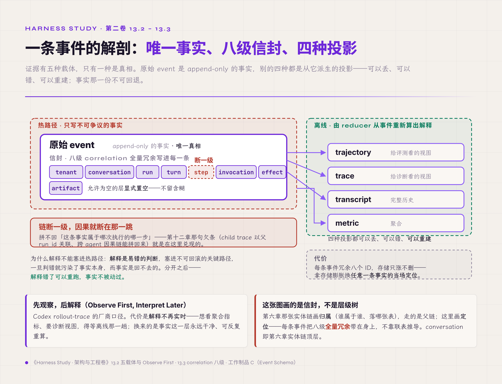
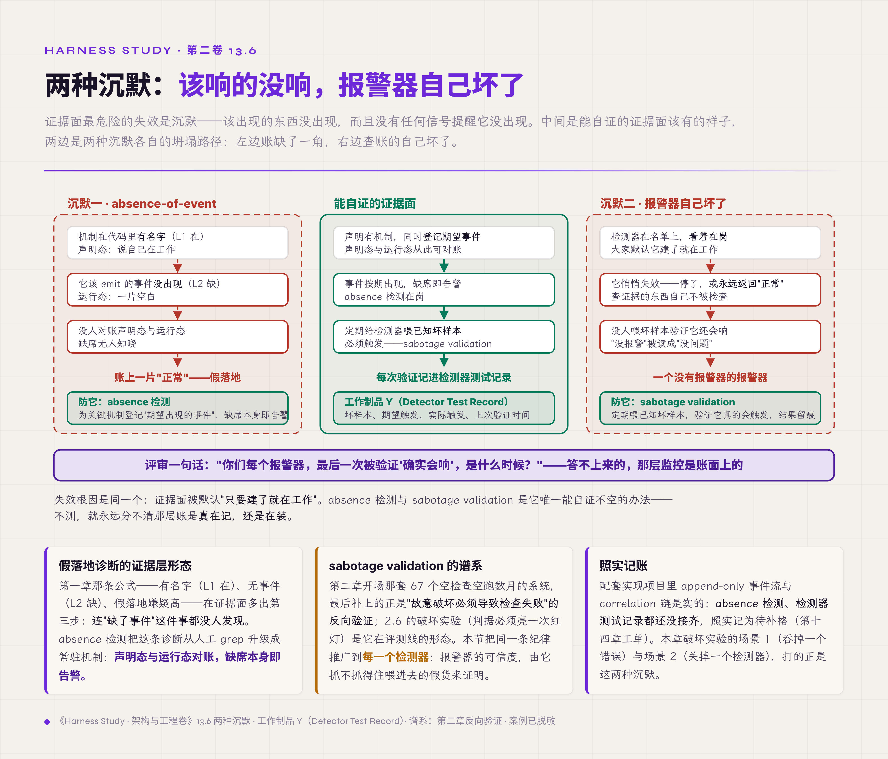
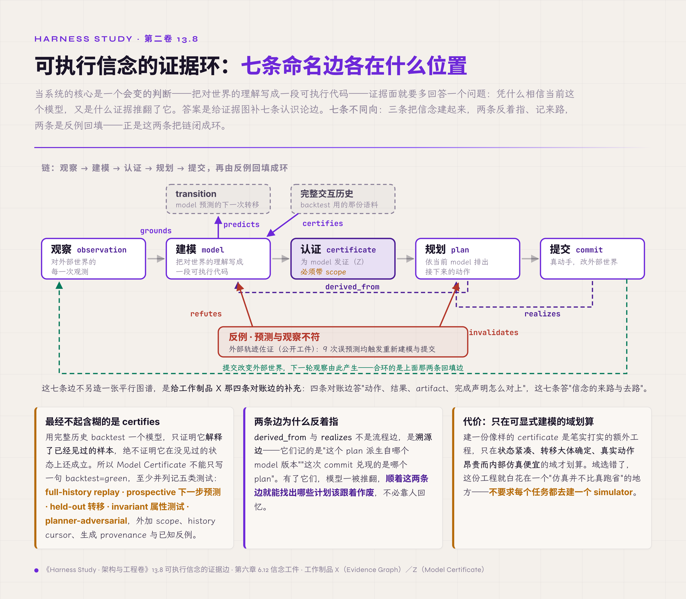

# 十三、Evidence Plane

> v1.0 · 2026-07-24 · 依据 SPEC.md §二十 章 spec（证据面章·只追加＋全量关联链＋事实/解释分账＋correlation 八级＋两类沉默失败＋content 敏感＋认识论七边与 Model Certificate scope）· 四维评审四路已落实，待用户审
> （本版本注与"审稿日志""引用来源"两节同属编辑工作区，出版前整体删除。）

第十二章结尾问了一句：契约真沿父链继承了吗、并发真单点收敛了吗、回传真被校验了吗——怎么证明这一切发生过？不止第十二章。前面每一章立完机制，末尾都落着同一个动作：记一条事件、留一份账、写一次决定。第五章的状态转移、第八章的四段账、第九章的交互事件、第十章的压缩边界、第十一章的每一次 policy decision、第十二章的 child 关联父——它们全往同一个地方记。这个地方，本章给它正式立起来：证据面。

问题从一句话开始：出事之后，拿什么把过程讲清楚？主张压成一句：**证据面＝只追加＋全量关联链**——证据是一层独立平面，原始事件只追加、correlation 贯穿全链、解释离线重建。但这层账本身会说谎：该记的可能没记，查账的东西自己可能坏了。所以本章还有另一半——**检测器必须证明自己会触发**，否则那层账看起来在、其实是空的。读完本章，手里应当多一张证据五载体与 correlation 链的图、一份检测器测试记录的模板。

## 13.1 证据面是一层被设计的平面

先分清两个常被混用的东西：日志，和证据。

最朴素的做法，是把它们当一回事——出了事去翻日志、临时加几行 print、读对话记录还原现场。第三章那场事故的十帧时序，最后就是这么重构出来的：靠人一行行读代码倒推，因为该在动作发生那一刻写下的事件，当时根本没写。这里有三处失效叠在一起：日志是给人读的散文，逐条对账它给不了；对话记录只是投影（第六章立过）；而最关键的事件，是事后补不出来的——没在热路径写下，就永远缺了。

失效根因是：把"给人看的日志"当成了"可追溯的证据"，证据面从来没有作为一层被设计出来。设计出场顺着本卷的架构分层——证据面是其中独立的一层（五平面的完整划分见第十一章 11.7 节，本章只承接其中的证据面），只装不可争议的事实、只追加、与执行面切开。它的根基是第六章立的两件事：append-only 的事件溯源，和单一真相源。代价直接摆在这儿：每个关键动作都要多一次写，存储只涨不删，热路径省不掉这一步。这是拿"永远多一笔开销"换"出事时讲得清"——省了这笔，第三章的事故现场就得靠读代码重来一遍。

## 13.2 写事实，离线再解释

证据面立起来了，接着要分清它里面装的东西哪些是事实、哪些是解释。

证据有五种载体，只有一种是真相。原始 event 是 append-only 的事实，别的四种都是从它派生的投影：trajectory 是给评测看的视图，trace 是给诊断看的视图，transcript 是完整历史，metric 是聚合。真相只有 event 一份，其余可以丢、可以错、可以重建。

由此引出一条纪律——先观察，后解释（Observe First, Interpret Later，Codex rollout-trace 的厂商口径）。热路径上只写不可争议的事实，解释放到离线，由 reducer 从事件重新算出来。为什么不在热路径顺手解释了？因为解释是易错的判断，把它塞进不可回滚的关键路径，一旦判错就污染了事实本身，而事实是回不去的。分开之后，解释错了可以重跑，事实不被动过。代价是解释不再实时——想看聚合指标、想要诊断视图，得等离线那一趟；换来的是事实这一层永远干净、可反复重算。

## 13.3 一条断在哪里，因果就断在哪里

事实写下了，下一个问题是：一条孤立的事件，怎么知道它属于哪次执行的哪一步？

靠 correlation——一条八级的关联链，全量冗余地写进每一条事件：tenant、conversation、run、turn、step、invocation、effect、artifact，允许为空的层显式置空（conversation 即第六章统一语言里实体链的顶层，Claude Code 侧称 session）。这正是第十二章那句欠条的兑现："child trace 以父 run_id 关联、跨 agent 的因果链能拼回来"，落到实处就是每条 child 事件都带着父的 run_id。反过来看它的脆弱：这条链断一级，因果就断在那一跳。第十二章的 infinite handoff loop 之所以查不清谁 own 任务，根子就在 correlation 没有贯穿——少了那一环，账上就只剩一堆认不出亲缘的孤立事件。设计上就一句：每条事件带全链（工作制品 C（Event Schema，事件信封与类型表）升 v2 后的信封字段规定了这些）。代价是每条事件冗余八个 ID，拿存储的膨胀，换"任意一条事件都能当场定位到它属于哪个 run 的哪一步"。

*图 13.2 · 一条事件的解剖：唯一事实、八级信封、四种投影*

## 13.4 只追加：能改的证据等于没有

关联链解决了"这条事实属于谁"，下一条纪律管"这条事实能不能动"。

答案是不能。工作制品 C（Event Schema）的四条纪律，第一条最硬：append-only，永不 UPDATE；记错了，追加一条 correction.appended 指向原事件，不回去改那一行。理由很简单——证据一旦能改，就不再是证据，能改的证据等于没有。另外三条配套：其一，粒度到 step 或消息完成，不逐 token（token delta 走流式投影通道，没有恢复价值，不入账）；其二，append-only 和 crash-safe 是两件事——进程可能在写半行事件的当口崩溃，恢复时按最后一个完整事件截断、丢掉那半行尾，这不算数据损坏，两层保证分开立；其三，内部 schema 稳定优先——OpenTelemetry（OTel）的 GenAI semantic conventions 截至 2026-07 仍是 Development 状态，只做导出映射、不做内部依赖【规范/官方文档，终稿回核】。代价是记错的也得留着、再追加更正，历史因此臃肿——但换来的是不可抵赖：任何一条账都动不了，事后谁都改不了口径。

## 13.5 决策与完成，都要留证

事实层立稳了，往上一层是判断——每一次权限决策、每一个完成声明，也要在证据面留下痕迹。

三样接进来。其一，policy.decided：谁在何时、因哪条规则、允许还是拒绝——第十一章那套权限证据在这里成链，一次放行和一次拦截都留证。其二，被拒的写入落成 zombie trace——第八章那条"被拒动作也要可见"的欠条，消费点就在这里。其三，也是最要紧的一条：completion claim 必须连到 outcome evidence——一个动作声称做完了，得有外部世界的独立证据接住，不能只凭它自己说。这是第八章"result 不等于 outcome"在证据层的形态，也是第二章那句"检查器不能信任被检查者"又一次现身：完成声明不连 outcome，就是拿自述当事实。代价是这三样都往证据面多压一笔账——尤其每个完成还要额外连一份外部取证、慢一步——账因此更重；换来的是"声称完成"和"真的完成"这两件事从此不再混为一谈，一次放行、一次拦截、一次拒动作也都各自留了痕。

## 13.6 两种沉默：该响的没响，报警器自己坏了

前面几节都在往证据面里加东西。可证据面最危险的失效是沉默：该出现的东西没出现，而且没有任何信号提醒它没出现。这是本章最要紧的一节。

沉默有两种。第一种，absence-of-event：该发生的事件没发生。这正是第一章那条假落地诊断的证据层形态——机制在代码里有名字（L1 在），可 trajectory 里查不到它该 emit 的事件（L2 缺）。查它的办法是声明态与运行态对账：系统声明有这个机制，就该有它的事件流，缺席本身即告警。第二种更隐蔽：检测器自己失效，报警器坏了不会响。查证据的东西自己不被检查，是第二章"判据会说谎、报警器就是判据本身"在证据面的终极形态——一个没有报警器的报警器。

失效根因是同一个：证据面被默认当成"只要建了就在工作"，可它和别的机制一样会悄悄断线。设计出场两件：absence 检测，为关键机制登记"期望出现的事件"，缺席即报；sabotage validation，定期给检测器喂一个已知的坏样本，验证它真的会触发，把每次验证的结果记进检测器测试记录（工作制品 Y）。代价是要专门花力气去测两样最不直观的东西——"没发生的事"和"检测器还活着"——这是额外一层验证开销；但这是证据面唯一能自证不空的办法。不测，就永远分不清那层账是真在记，还是在装。

*图 13.6 · 两种沉默：该响的没响，报警器自己坏了*

## 13.7 证据里的内容，默认是敏感数据

证据面记得越全，越撞上另一条线：里面的内容本身是隐私。

证据里的 content——对话、工具的输入输出、抓回来的网页——默认都要按敏感数据处理。这一点有厂商实践作参照。Anthropic 多 agent 生产 tracing 监控的是决策模式与交互结构，单次对话的内容一概不监控，理由就是保用户隐私。Codex rollout-trace 走的是另一条路：不设 CODEX_ROLLOUT_TRACE_ROOT 就不写，写也只落本地 bundle、从不上传，bundle 里的 prompt、响应、工具输入输出一律按敏感数据处置——一句"tracing is not telemetry"把追溯用的证据和遥测统计用的数据分成两条线（两家都是厂商实践、非中立基准，本章借其口径不借其背书）。失效根因是：证据面为了可诊断，最顺手的做法就是把所有 content 原样全收，收全了就是一处隐私隐患。所以这里划一条界，采集与保留的完整治理移交第三卷，本章只立接口。代价是隐私换可观测的深度——想留细粒度的 content 去深挖，就得显式授权、按敏感数据的规矩管，不能默认全收。

## 13.8 为什么信这个模型：可执行信念的证据边

前面七节管的是"发生过什么"的证据。还有一类系统，它的核心是一个会变的判断——可执行的 Belief/World Model（第六章 6.12 立的：agent 把当前对世界的理解写成一段可执行代码）。对这类系统，证据面要多回答一个问题：系统凭什么相信当前这个模型，又是什么证据推翻了它？

这靠给工作制品 X 的四条对账边补七条认识论边、不另造一张平行图谱：observation 为 model 提供依据（grounds）、model 预测某个 transition（predicts）、完整历史为 model 背书（certifies）、反例推翻 model（refutes）、plan 从某个 model 版本派生（derived_from）、commit 兑现 plan（realizes）、预测与观察不符则废止剩余计划（invalidates）。四条对账边回答"动作、结果、artifact、完成声明怎么对上"，这七条边补上"信念的来路与去路"。入门卷 §8.4 那十条边登记的是跨件、跨 cell 的可观测关系，与本卷这两组互补，不是同一张图。

其中最经不起含糊的一条是 certifies 必须带 scope。用完整历史 backtest 一个模型，只证明它解释了已经见过的样本（retrodictive consistency），绝不证明它在没见过的状态上还成立（generalization）。所以 Model Certificate（工作制品 Z）不能只写一句 backtest=green，至少要并列记五类测试——full-history replay、prospective 下一步预测、held-out 转移、invariant 属性测试、planner-adversarial（让 planner 主动去找模型漏洞）——外加 scope、history cursor、生成 provenance（模型／提示／工具版本）和已知反例，正好补齐第六章 6.12 给信念工件规定的那四件随身证据。一个公开的 model-based harness 项目的保留轨迹佐证这套机制确有其事：逐行统计里，9 次误预测均触发了重新建模与提交流程（1:1 先后对应属推断，终稿回核）【厂商实践／项目自述，只引轨迹统计、不引其自述分数】——"预测错即计划失效"可从公开工件复算、非独立受控消融。这一节把观察→建模→认证→规划→提交这条链，加上反例回填这条返回边，合成一个可验证的反馈环。代价是建一份像样的 certificate 是笔实打实的额外工程，且只在"可显式建模"的域才划算——状态紧凑、转移大体确定、真实动作昂贵而内部仿真便宜；域选错了，这份工程就白花在一个"仿真并不比真跑省"的地方，所以不要求每个任务都去建一个 simulator。

*图 13.8 · 可执行信念的证据环：七条命名边，三条建、两条溯源、两条回填*

## 破坏实验：吞错误、关检测器、成功无 artifact、模型漏洞四场景

按四步测量协议执行，四场景共用观测点：event 是否 append-only 落账、correlation 链是否贯穿、absence 检测与检测器测试记录是否报、completion 与 outcome 是否对账、certificate 的 scope 是否被尊重。

1. **吞掉一个错误**：让某处 catch 住异常、不 emit error.raised。判定：通过＝absence 检测发现"该有的 error 事件缺席"并告警；失败＝错误被静静吞掉、账上一片正常。
2. **关掉一个检测器**：把一个检测器停掉，看多久有人发现。判定：通过＝sabotage validation 的定期坏样本喂进去、检测器不触发即暴露（检测器测试记录留痕）；失败＝检测器停了、无人知晓，报警器成了摆设。
3. **成功但无 artifact**：让一个动作声称完成、却不产出对应 artifact 或 outcome 证据。判定：通过＝completion-outcome 对账拦下这条无证据的完成声明；失败＝自述的"完成"被当成事实收下。
4. **注入历史外的新转移＋模型漏洞**：喂一个完整历史里没出现过的转移，并埋一个 planner 会利用的模型漏洞。判定：通过＝certificate 的 scope 挡住"把 backtest 绿当全局正确"、counterexample 事件吊销该模型与剩余计划（第八章 Plan Lease 接线）；失败＝历史拟合被误当泛化、planner 拿着不可执行的"最优解"去提交。

复跑 N=3。实证状态照实分层【经验】：四场景均为思想实验，判定口径先立——参考实现与完整矩阵是第十四章工单；配套实现项目已有 append-only 事件流与 correlation 链的落地，是场景 1/3 观测点的现实底座；absence 检测、sabotage validation、Model Certificate 在配套实现项目里尚未接齐，照实记为待补格。model-based 四场景（4）以公开轨迹统计佐证机制存在，非本地实跑。

## L 级自检

按第一章的成熟度尺（L1 能跑、L2 能看，全表见第一章 1.3 节）。本章是"能看"这条尺的主场，L2 底线也因此更高：不光每个机制要 emit 事件，证据面自己还要能证明该 emit 的都 emit 了、检测器都活着。套第一章那条假落地诊断，在证据面有个递归的版本——系统里有事件类型的定义（L1 在），可 trajectory 里查不到某类事件、也没有 absence 检测去发现这个缺席（L2 缺），按未接线嫌疑处理；最容易缺的，恰是"检测器测试记录"这一条，因为验证"报警器会响"最不直观、最容易被跳过。

四问落位：可观测是本章主场——五载体分事实与解释、correlation 贯穿全链，整章都在把"看得见"做成机制；可控押在 append-only 与 completion-outcome 对账——证据不可改、完成要连外部证据；稳定兑现在两类沉默失败的防护——absence 检测兜住"该响没响"、sabotage validation 兜住"报警器自己坏了"；闭环的一环在可执行信念上方法论最完整——观察（检测）到反例推翻模型与废止计划（纠正）到重新建模、认证后再提交（验证），检测、纠正、验证三样在设计上都到位（第八章 Counterexample 接线）；但要照实说清：这个环目前只到设计与外部轨迹佐证，配套实现里 absence 检测、sabotage validation、Model Certificate 都还没接齐，还没在本地完整跑通过一圈。

坐标系落位补一句：本章守的是证据契约——第八章管副作用怎么记账、第十一章管谁批的权限，本章管"这一切怎么留下可对账、可自证的痕迹"。第一章 1.2 节六类契约表里证据契约那格问"结论有没有证据"，在本章收窄成"证据自己有没有证据——该记的记了吗、报警器会响吗"。配套实现项目现状照实记账：本章机制在其中整体在 L1 与 L2 之间——append-only 事件流与 correlation 是实的（L1，且事件类型已登记），但 absence 检测、检测器测试记录、Model Certificate 都还没接齐（L2 缺），不粉饰成半格；补格工单第十四章。

## 交付物

1. **Event Schema v2**（工作制品 C 升级，13.1-13.5 主场）——correlation 八级补全、补 detector 与 certificate 相关事件类型；
2. **Evidence Graph**（工作制品 X 新增，13.8 节）——对账边（动作/结果/artifact/完成声明）＋认识论七边（grounds/predicts/certifies/refutes/derived_from/realizes/invalidates），两组均本卷新立，与入门卷十边互补；
3. **Detector Test Record**（工作制品 Y 新增，13.6 节）——每个检测器的 sabotage 测试记录：喂什么坏样本、期望触发、实际触发、上次验证时间；
4. **Model Certificate**（工作制品 Z 新增，13.8 节）——五类测试＋scope／history cursor／生成 provenance（模型／提示／工具版本）／已知反例，不接受只写 backtest=green；
5. **Counterexample Event**（回指工作制品 N，第八章交付）；detector/certificate fixture（第十四章工单）。

近道读者可单取工作制品 Y（Detector Test Record）作评审尺——问被评系统一句"你们每个报警器，最后一次被验证'确实会响'是什么时候？"答不上来的，那层监控就是账面上的、未经自证的。

## 立即可做的一个动作（五分钟）

builder 版本：挑系统里一个最受信任的检测器或告警，把它临时关掉（或让它永远返回"正常"），然后什么都不告诉任何人，看多久有人发现。没人发现，就说明这个报警器一直是摆设——它的"没报警"从来不代表"没问题"。

assessor 版本：问被评团队两个问题——"哪些关键事件，如果它没发生，你们会收到告警？"和"你们的检测器，最近一次被喂已知坏样本验证过会触发，是什么时候？"两个都答不上来的，按本章的账记：这套证据面只证明了"记下来的东西存在"，没证明"该记的都记了、该响的会响"。

## 遗留问题

到这里，六契约立全了、五平面分清了、证据面也自证了——纸上的推导走到了尽头。可纸上讲得通，不等于造得出来。把前十三章的机制拼成一个能跑、崩溃能恢复、能自证的最小完整 runtime，还缺一次从零到一的实做。从零构造一个最小但完整的 runtime，第十四章。

## 审稿日志

> （编辑工作区：本节与"引用来源"节出版前整体删除。）

| 轮 | 检查 | 命中与修改 |
|---|---|---|
| 版本史 | — | v1.0（2026-07-24）：依 SPEC §二十 spec 首写。大纲条目映射：13.1→13.1（证据面立层）、13.2/13.4→13.2（五载体＋Observe First Interpret Later）、13.3→13.3（correlation 八级）、13.x 四纪律→13.4、13.5/13.6/13.10→13.5（policy/zombie/completion-outcome）、13.8/13.9→13.6（两类沉默失败）、13.7→13.7（content 敏感）、13.11/13.12→13.8（认识论七边＋Model Certificate）。欠条收口：第八章 zombie trace（13.5）、第十一章 policy decision（13.5）、第十二章 child 关联父/跨 agent 因果链（13.3）、第六章 6.12 Belief/World Model（13.8）；收口主线：第二章"检查器不能信任被检查者"→13.5/13.6 终极形态。素材：工作制品 C（主场）、rollout-trace（13.2/13.7）、Schema Harness 轨迹统计（13.8，匿名口径）、Anthropic 生产 tracing 隐私口径（13.7）、OTel GenAI 2026-07 Development（引用来源） |
| 章级验收自测 | SPEC §二十 清单 | 正文表格 0（五载体/correlation/认识论边全住工作制品 C/X，正文散文＋列点）＋配图占位 0；新概念实计约 12（evidence plane、五载体、Observe First Interpret Later、correlation 八级、correction 事件、absence-of-event、sabotage validation、completion-outcome 对账、认识论七边、Model Certificate scope、tracing≠telemetry、MODA 闭环载体——≤12 达标）；前向引用约 5 处/2 章（第十四/十五＋卷三——≤8 达标）；一手证据 1 处（配套实现项目 append-only 事件流＋correlation）＋业界对照（rollout-trace/OTel GenAI/Anthropic tracing/model-based harness 轨迹）；外部权威 ≥4（OTel GenAI semantic conventions／rollout-trace tracing≠telemetry／Anthropic 生产 tracing／WorldCoder 等 model-based 前史）；业界对照带失效点 ✓（OTel GenAI 仍 Development 不可内部依赖＋backtest 绿≠泛化）；破坏实验四场景四步协议＋实证分层 ✓；L 级自检＋坐标系落位 ✓；双读者动作 ✓；文字化引用零 § ✓；工作制品引用带名称（C/X/Y/Z/N 首现带括注）✓ |
| R1 grep 红线 | 首稿自查＋评审后复跑 | "你"系病灶 0（assessor/builder 动作段"你们/你"为对被评团队/读者提问的第二人称指令，沿 §十二 惯例保留）；元叙述 0；模糊词 0；文字化引用正文零 §。首稿自查清 7 处（6 卫星对比＋1 "你最"＋"能崩"语域）；style 评审补抓反向卫星对比（不含"是"的"是X不是Y"变体）L14 两处/L56 三重叠加、"硬核""最要命"语域滑词，落实后全清；复跑正文显式禁形仅余"不等于"两处（result≠outcome、讲得通≠造得出来，技术等价否定、援 §十一 先例，style 判可接受），章主张两句用 ＝ 号不占配额；整句加粗仅章主张；工作制品 C 首现（13.3）已补名称（technical P2）；体量正文约 127 行 |
| 四维评审 | **四路已跑齐并全部落实（2026-07-24，均用 opus）：technical B+→A-（四条纪律补全＋session→conversation）／style A-（反向卫星对比＋语域清零）／cybernetic A-（方法论比例约 80%、代价末环八点全落、§十二 老毛病保持治住）／business 合规达标（Schema 引用铁律全守，零 P0）** | technical P1：13.4"四条纪律"只列 2 条→补纪律 4（内部 schema 稳定优先／OTel GenAI 2026-07 仍 Development，把 OTel 现状拉进正文不再只在删除区）；P1：13.3 correlation"session"→"conversation"（与第六章冻结实体链顶层／工作制品 C 信封 conversation_id 对齐，SPEC §二十 N3 同步）；P2：工作制品 C 首现补名称、五平面归属改第十一章 11.7（非第四章 4.8 仅标位）、"9 次每一次都"→"均触发（1:1 属推断）"对齐第八章降精度、"现有 Evidence Graph"→入门卷已立（工作制品 X 继承对账边）。cybernetic P1：四问闭环句完成时态"三腿俱全"→就地限定"设计上到位、配套实现未接齐、没跑通一圈"（§十二 同款复现，此处措辞更强）；P2：Model Certificate 收 6.12 四件随身证据漏 provenance→补"生成 provenance（模型/提示/工具版本）"并点名兑现 6.12；P2：13.5 代价只覆盖 completion-outcome→扩到 policy/zombie 三样；P3：13.8 代价"额外工程"近"设计负担前移"→补"域选错白花在仿真不比真跑省的地方"。style P1：13.7 content 敏感三重否定叠加→拆并归厂商；P2：L14 两反向对比转陈述、"硬核"→"最要紧的一节"、"最要命"→"最经不起含糊"、MODA"五层"列 6 项→"五层（观/建/认/规/提）＋反例回填返回边"；P3："留"三连、"三腿"（腿）→改。business P1：13.7"业界成熟口径"把 Anthropic＋Codex 升为中立共识→归还厂商实践、标"非中立基准"；P2："业界 rollout-trace"→"Codex rollout-trace 厂商口径"；P3：L 级"桌面案例"与底座"配套实现项目"化名混用→统一、"坐实...实机制"→"佐证...确有其事（可复算、非独立受控消融）" |
| 终稿回核清单 | — | OTel GenAI semantic conventions 截至发稿的稳定度（回核 research/07 §3，是否仍 Development）；rollout-trace "Observe First, Interpret Later"／"tracing is not telemetry" 出处（回核 research/07 §2）；Anthropic 生产 tracing"监控决策模式不监控内容"出处（回核 research/03）；model-based harness 轨迹统计 78/17/2/15/9/15（回核 research/10，匿名口径、实名待第六章终稿裁决）；Schema Harness 分数四限定纪律（若终稿引分数）；WorldCoder（NeurIPS 2024）等 model-based 前史编号 |

## 引用来源

> （编辑工作区：本节出版前整体删除。）

- 【规范/官方文档】OpenTelemetry GenAI semantic conventions（截至 2026-07 仍 Development 状态，内部 schema 稳定优先、只做导出映射不做内部依赖）（13.2/13.7；工作制品 C 纪律 4）。指针 research/volume2/07 §3。终稿回核稳定度。
- 【厂商实践】Codex rollout-trace README——"Observe First, Interpret Later"（热路径写事实、离线 reducer 解释）＋"tracing is not telemetry"（追溯证据与遥测统计分开、content 按敏感处理）（13.2/13.7）。指针 research/volume2/07 §2。终稿回核措辞。
- 【厂商实践】Anthropic 多 agent 研究系统——生产全量 tracing 监控 agent 决策模式与交互结构、不监控对话内容以保隐私；把工作流拆成应发生状态变更的离散 checkpoint（13.7/13.6）。指针 research/volume2/03。
- 【厂商实践／项目自述】一个公开的 model-based harness 项目（Schema Harness，实名待第六章终稿裁决）——公开 retained trajectories 逐行统计 78 action_taken／17 run_backtest／2 run_bfs／15 commit_actions／9 model_mispredicted／15 turn，证"预测错即计划失效"是实机制；认识论七边（grounds/predicts/certifies/refutes/derived_from/realizes/invalidates）扩展 Evidence Graph；certifies 带 scope、backtest 绿≠泛化；Model Certificate 五类测试（13.8）。指针 research/volume2/10。**引用纪律：不引自述分数 98.98%／95.35%／42.83%（若终稿引必带"项目自述/Public/fallback portfolio/未获 ARC Prize 独立验证"四限定）、不写"runtime 已开源"（仅公开 retained trajectories 与静态站点）、无 license 不复制其代码**。
- 【评审】WorldCoder（NeurIPS 2024）等 model-based LLM agent 用可执行程序表达世界知识、planner 与交互修正的前史（13.8 背景，不写"首次发明可执行世界模型"）。指针 research/volume2/10 §五。终稿回核编号。
- 【经验】配套实现项目：append-only 事件流＋correlation 链已落地（13.3/13.4 一手底座）；absence 检测/检测器测试记录/Model Certificate 未接齐（13.6/13.8，照实半格）。
- 回指素材：第一章 1.2 节（证据契约那格"结论有没有证据"）/1.3 节（L 级尺与假落地诊断）；第二章（检查器不能信任被检查者、判据自欺）；第三章（事故十帧靠事后重构、证据缺席）；第十一章 11.7 节（五平面定义，证据面是其中一层；第四章 4.8 仅标位）；第六章（append-only 事件溯源、单一真相、6.12 Belief/World Model）；第八章（result≠outcome、zombie trace、工作制品 N Counterexample/Plan Lease）；第十章（artifact lineage）；第十一章（policy.decided 权限证据）；第十二章（child trace 关联父、跨 agent 因果链＝correlation 兑现）；工作制品 C（Event Schema，主场）、K（Belief/World Model Registry）。
