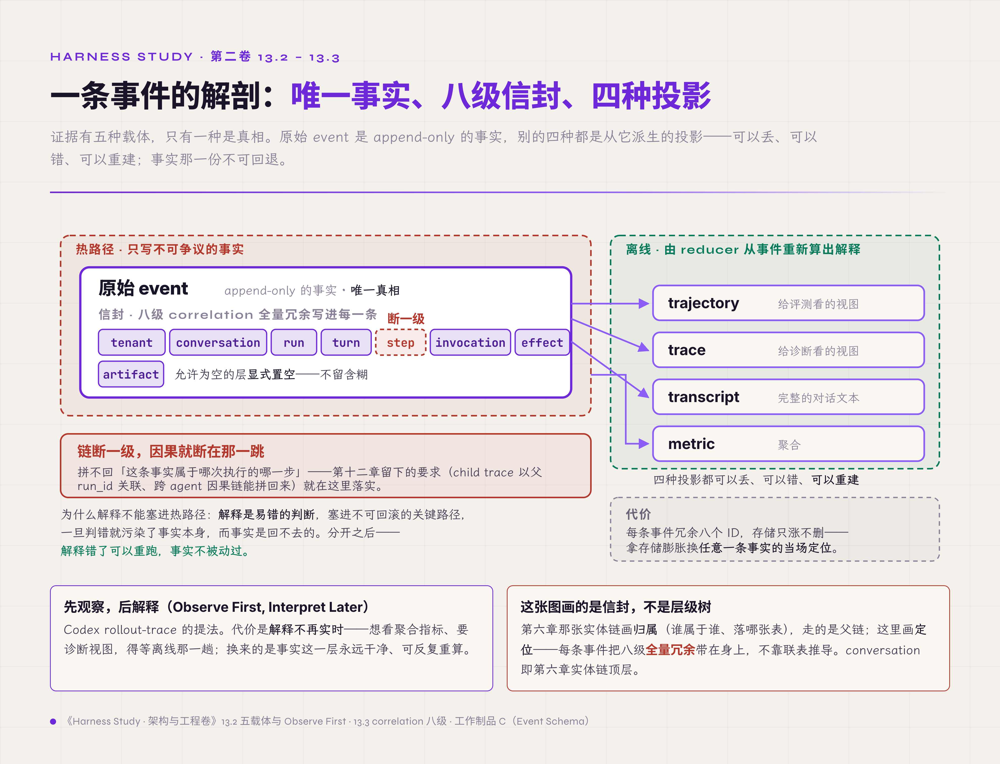
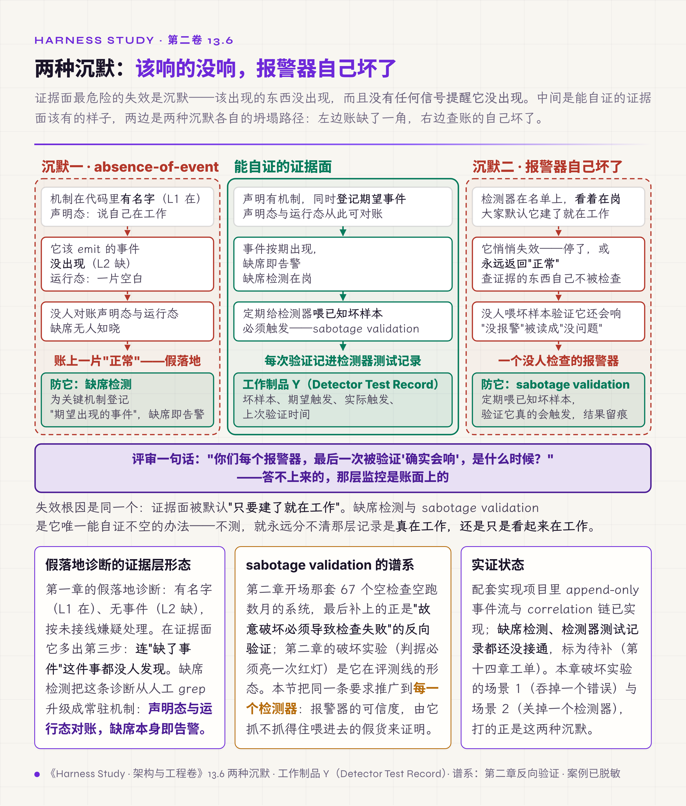
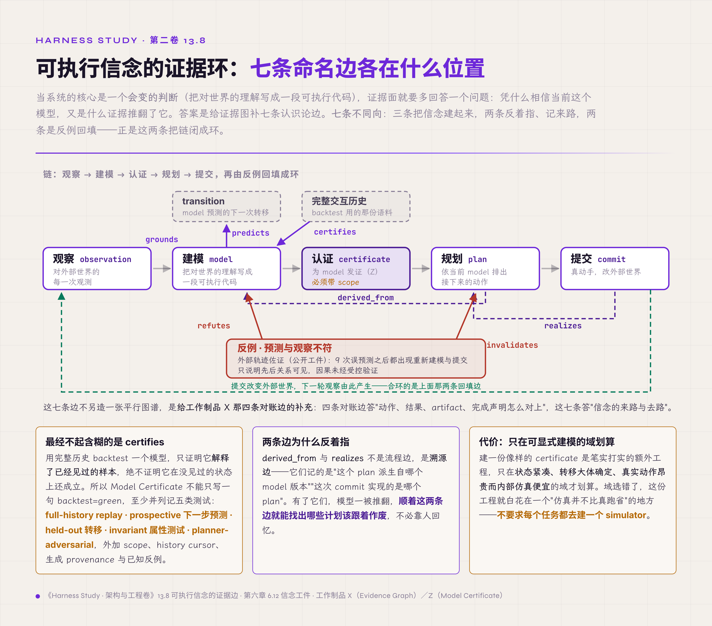

# 十三、Evidence Plane

> v1.0 · 2026-07-24 · 依据 SPEC.md §二十 章 spec（证据面章·只追加＋全量关联链＋事实/解释分账＋correlation 八级＋两类沉默失败＋content 敏感＋认识论七边与 Model Certificate scope）· 四维评审四路已落实，待用户审
> （本版本注与"审稿日志""引用来源"两节同属编辑工作区，出版前整体删除。）

第十二章结尾问了一句：契约真的沿父链继承了吗，并发真的单点收敛了吗，回传真的被校验了吗，怎么证明这一切发生过？不止第十二章。前面每一章提出机制之后，末尾都落到同一个动作：记一条事件，留一份记录，写下一次决定。第五章的状态转移、第八章的四段账、第九章的交互事件、第十章的压缩边界、第十一章的每一次 policy decision、第十二章 child 与父的关联，全都记到同一个地方。本章正式把这个地方作为一层来设计：证据面（Evidence Plane），即系统为事后核查留下的全部记录，作为一层专门设计的部分。

问题从一句话开始：出事之后，拿什么把过程讲清楚？本章的核心主张是：**证据面＝只追加＋全量关联链**。证据是一层独立的平面，原始事件只追加，correlation 贯穿全链，解释离线重建。但这层记录本身也会出问题：该记的可能没记，负责检查的检测器自己可能坏了。所以本章还有另一半：**检测器必须证明自己会触发**，否则那层记录看起来在，其实是空的。本章给出两样东西：一张证据五载体与 correlation 链的图，一份检测器测试记录的模板。

## 13.1 证据面是一层被设计的平面

先分清两个常被混用的东西：日志和证据。

最朴素的做法是把它们当成一回事：出了事去翻日志，临时加几行 print，读对话记录还原现场。第三章那场事故的十帧时序，最后就是这么重构出来的：靠人一行行读代码倒推，因为该在动作发生那一刻写下的事件，当时根本没写。这里有三处失效叠在一起：

- 日志是给人读的散文，没法逐条对账；
- 对话记录只是由历史派生的视图（第六章讲过的投影）；
- 最关键的事件事后补不出来，没在热路径上写下，就永远缺了。

根因是把"给人看的日志"当成了"可追溯的证据"，证据面从来没有作为一层被设计出来。设计上顺着本卷的架构分层：证据面是其中独立的一层（五平面的完整划分见第十一章 11.7 节，本章只承接其中的证据面），只装不可争议的事实，只追加，与执行面分开。它的基础是第六章给出的两点：append-only 的事件溯源（event sourcing），以及单一真相源。代价直接摆在这里：每个关键动作都要多写一次，存储只增不删，热路径省不掉这一步。这是用"持续多一笔开销"换"出事时讲得清"；省掉这笔开销，第三章的事故现场就得再靠读代码重来一遍。

## 13.2 写事实，离线再解释

证据面建起来了，接着要分清里面装的东西哪些是事实、哪些是解释。

证据有五种载体，只有一种是真相。原始 event 是只追加的事实，其余四种都是由它派生的视图（投影）。这几个词在业界各有常见含义，本书的用法与之有差别，逐一说明：

- **trajectory（轨迹）**：给评测看的视图。强化学习与评测文献里的 trajectory 指状态、动作（、观察）组成的序列；本书指持久化的执行事件流，以及由它整理出的视图。
- **trace（追踪）**：给诊断看的视图。OpenTelemetry 里的 trace 是由埋点直接产出的 span 树；本书的 trace 也包括由事件派生出来的诊断视图。
- **transcript（对话记录）**：完整的对话文本。它看起来最全，但按消息组织，只记说了什么，不记 policy 决策、副作用的对账结果和关联 ID；它是从事件整理出的一种视图，与事件不一致时以事件为准，所以不能当真相源。
- **metric（指标）**：聚合统计。

真相只有 event 一份，其余可以丢、可以错、可以重建。

由此引出一条原则：先观察，后解释（Observe First, Interpret Later，这是 Codex rollout-trace 的提法）。热路径上只写不可争议的事实，解释放到离线，由 reducer 从事件重新算出来。这里的 reducer 是事件溯源里的投影函数（fold），把事件序列从头折叠成状态或视图；它与第十二章 LangGraph 用来合并并发写入的 reducer 不是一回事。为什么不在热路径上顺手把解释做了？因为解释是容易出错的判断，把它塞进不可回滚的关键路径，一旦判错就污染了事实本身，而事实是回不去的。分开之后，解释错了可以重跑，事实不被改动。代价是解释不再实时：想看聚合指标、想要诊断视图，得等离线那一趟；换来的是事实这一层始终干净，可以反复重算。

## 13.3 一条断在哪里，因果就断在哪里

事实写下了，下一个问题是：一条孤立的事件，怎么知道它属于哪次执行的哪一步？

靠 correlation：一条八级的关联链，完整、冗余地写进每一条事件：tenant、conversation、run、turn、step、invocation、effect、artifact，允许为空的层显式置空（conversation 即第六章统一语言里实体链的顶层，Claude Code 里叫 session）。业界常说的关联标识（correlation ID）通常是贯穿一次请求的单个 ID；本书扩大了 correlation 的含义，用它统称这一组层级 ID，常见的 correlation ID 只是其中一个，传播方式类似 W3C Trace Context。第十二章留下的要求"child 的 trace 以父 run_id 关联，跨 agent 的因果链能拼回来"，在这里落实为：每条 child 事件都带着父的 run_id。反过来看它的脆弱之处：这条链断一级，因果就断在那一跳。第十二章的 infinite handoff loop 之所以查不清谁负责任务，根源就在 correlation 没有贯穿；少了那一环，记录里就只剩一堆认不出归属的孤立事件。设计上只有一句话：每条事件带全链（工作制品 C（Event Schema，事件信封与类型表）升级到 v2 后的信封字段规定了这些）。代价是每条事件冗余八个 ID，用存储的膨胀换"任意一条事件都能当场定位到它属于哪个 run 的哪一步"。

*图 13.2 · 一条事件的解剖：唯一事实、八级信封、四种投影*

## 13.4 只追加：能改的证据等于没有

关联链解决了"这条事实属于谁"，下一条规则管"这条事实能不能改"。

答案是不能。工作制品 C（Event Schema）有四条规则，第一条最硬：append-only，永不 UPDATE；记错了，追加一条 correction.appended 指向原事件，不回去改那一行。理由很简单：证据一旦能改，就不再是证据。另外三条是配套规则：

- 粒度到 step 或消息完成，不逐 token（token delta 走流式投影通道，没有恢复价值，不写入事件表）；
- append-only 和崩溃安全（crash-safe）是两回事：进程可能在写半行事件时崩溃，恢复时按最后一个完整事件截断，丢掉那半行尾巴，这不算数据损坏，两层保证分开规定；
- 内部 schema 稳定优先：OpenTelemetry（OTel）的 GenAI 语义约定（semantic conventions）截至 2026-07 仍是 Development 状态，只做导出映射，不做内部依赖【规范/官方文档】。

代价是记错的也得留着、再追加更正，历史因此臃肿；换来的是历史不被应用层覆写，事后没人能在应用层悄悄改掉一条记录。需要说明，这只是应用层的约定；要真正防篡改，还需要哈希链或 WORM（一次写入、多次读取）存储。

## 13.5 决策与完成，都要留证

事实层确定了，往上一层是判断：每一次权限决策、每一个完成声明，也要在证据面留下痕迹。

接进来的有三样：

- **policy.decided**：谁在何时、依据哪条规则、允许还是拒绝。第十一章那套权限证据在这里连成链，一次放行和一次拦截都留证据。
- **zombie trace**：被拒的写入也写成事件。第八章提出的"被拒动作也要可见"，就在这里使用。
- **completion claim 连到 outcome evidence**：这是最要紧的一条。一个动作声称做完了（完成声明），得有外部世界的独立证据（结果证据）接住，不能只凭它自己说。这是第八章"result 不等于 outcome"在证据层的形态，也是第二章"检查器不能信任被检查者"又一次出现：完成声明不连 outcome，就是拿自述当事实。

代价是这三样都往证据面多写一笔，尤其每个完成声明还要额外连一份外部取证，慢一步，记录因此更重；换来的是"声称完成"和"真的完成"从此分开，一次放行、一次拦截、一次被拒的动作也都各自留下了痕迹。

## 13.6 两种沉默：该响的没响，报警器自己坏了

前面几节都在往证据面里加东西。可证据面最危险的失效是沉默：该出现的东西没出现，而且没有任何信号提醒它没出现。这是本章最要紧的一节。

沉默有两种。第一种是事件缺席（absence-of-event）：该发生的事件没发生。这正是第一章假落地诊断（名义上有、实际没接上）在证据层的形态：机制在代码里有名字（L1 在），可 trajectory 里查不到它该发出的事件（L2 缺）。查它的办法是把声明状态与运行状态对账：系统声明有这个机制，就该有它的事件流，缺席本身就要告警。第二种更隐蔽：检测器自己失效，报警器坏了不会响。负责查证据的东西自己不受检查，这是第二章"判据会说谎，报警器就是判据本身"在证据面的极端形态：一个没人检查的报警器。

根因是同一个：证据面被默认为"只要建了就在工作"，可它和别的机制一样会悄悄断线。设计上做两件事：

- **缺席检测**：为关键机制登记"期望出现的事件"，缺席就报警。思路类似 dead man's switch（定期收不到信号就触发）或 Prometheus 的 absent() 查询。
- **检测器自检（sabotage validation）**：定期给检测器喂一个已知的坏样本，确认它真的会触发，并把每次结果记进检测器测试记录（工作制品 Y）。思路与运维中的合成探测（synthetic probe）、测试领域的变异测试（mutation testing）相同：主动制造一个应当被发现的问题，看检查手段能不能发现它。

代价是要专门花力气去测两样最不直观的东西，"没发生的事"和"检测器还有效"，这是额外一层验证开销；但这是证据面证明自己不是空的唯一办法。不测，就永远分不清那层记录是真在工作，还是只是看起来在工作。

*图 13.6 · 两种沉默：该响的没响，报警器自己坏了*

## 13.7 证据里的内容，默认是敏感数据

证据面记得越全，越会碰到另一个问题：里面的内容本身是隐私。

证据里的内容（content），包括对话、工具的输入输出、抓回来的网页，默认都要按敏感数据处理。这一点有厂商实践可以参照。Anthropic 在多 agent 系统的生产 tracing 中监控的是决策模式与交互结构，不监控单次对话的内容，理由是保护用户隐私。Codex rollout-trace 走的是另一条路：不设 CODEX_ROLLOUT_TRACE_ROOT 就不写；写也只写到本地 bundle，从不上传；bundle 里的 prompt、响应、工具输入输出一律按敏感数据处理。它用一句"tracing is not telemetry"，把追溯用的证据和遥测统计用的数据分成两条线（两家都是厂商实践，不是中立基准，本章借用其做法，不借其背书）。根因是：证据面为了便于诊断，最顺手的做法就是把所有内容原样全收，收全了就是一处隐私隐患。所以这里划一条界：采集与保留的完整治理移交第三卷，本章只定义接口。代价是用可观测的深度换隐私：想保留细粒度的内容去深挖，就得显式授权，按敏感数据的规矩管理，不能默认全收。

## 13.8 为什么信这个模型：可执行信念的证据边

前面七节管的是"发生过什么"的证据。还有一类系统，核心是一个会变的判断：可执行的 Belief/World Model（第六章 6.12 定义的信念工件：agent 把当前对世界的理解写成一段可执行代码）。对这类系统，证据面要多回答一个问题：系统凭什么相信当前这个模型，又是什么证据推翻了它？

做法是在工作制品 X 的四条对账边之外，再补七条认识论边，而不另造一张平行的图：

- observation 为 model 提供依据（grounds）；
- model 预测某个 transition（predicts）；
- 完整历史为 model 背书（certifies）；
- 反例推翻 model（refutes）；
- plan 从某个 model 版本派生（derived_from）；
- commit 实现 plan（realizes）；
- 预测与观察不符时，废止剩余计划（invalidates）。

四条对账边回答"动作、结果、artifact、完成声明怎么对上"，这七条边补上"信念从哪来、被什么推翻"。入门卷 8.4 节那十条边登记的是机制之间、harness 单元（包括子 harness）之间的可观测关系，与本卷这两组边互补，不是同一张图。

其中最不能含糊的一条是：certifies 必须带适用范围（scope）。用完整历史回测（backtest）一个模型，只证明它解释了已经见过的样本（retrodictive consistency，回溯一致性），并不证明它在没见过的状态上仍然成立（generalization，泛化）。所以 Model Certificate（工作制品 Z）不能只写一句 backtest=green，至少要并列记录五类测试：

- full-history replay（完整历史重放）；
- prospective 下一步预测；
- held-out（留出样本）转移；
- invariant 属性测试；
- planner-adversarial（让 planner 主动去找模型漏洞）。

此外还要记录 scope、history cursor、生成来源（provenance：模型、提示、工具版本）和已知反例，正好补齐第六章 6.12 给信念工件规定的四项随附证据。一个公开的 model-based harness 项目的保留轨迹显示，这套机制在实际运行中出现过：逐行统计里有 9 次误预测，之后都出现了重新建模与提交的流程【厂商实践／项目自述，只引轨迹统计、不引其自述分数】。这只说明两者的先后关系可见，"预测错即计划失效"的因果关系没有经过受控验证；这些统计可以从公开工件复算，但不是独立的受控消融。这一节把观察、建模、认证、规划、提交这条链，加上反例回填这条返回边，合成一个可以验证的反馈环。代价是做一份像样的 certificate 需要实实在在的额外工程，而且只在"可以显式建模"的领域才划算：状态紧凑、转移大体确定、真实动作昂贵而内部仿真便宜。领域选错了，这份工程就白花在"仿真并不比真跑省"的地方，所以不要求每个任务都去建一个 simulator。

*图 13.8 · 可执行信念的证据环：七条命名边，三条建、两条溯源、两条回填*

## 破坏实验：吞错误、关检测器、成功无 artifact、模型漏洞四场景

按四步测量协议执行，四个场景共用以下观测点：event 是否只追加写入、correlation 链是否贯穿、缺席检测与检测器测试记录是否报警、completion 与 outcome 是否对账、certificate 的 scope 是否被遵守。

1. **吞掉一个错误**：让某处 catch 住异常，不发出 error.raised。判定：通过＝缺席检测发现"该有的 error 事件没有出现"并告警；失败＝错误被悄悄吞掉，记录上一切正常。
2. **关掉一个检测器**：把一个检测器停掉，看多久有人发现。判定：通过＝检测器自检定期喂入的坏样本没有触发告警，问题随即暴露（检测器测试记录留痕）；失败＝检测器停了却无人知晓，报警器成了摆设。
3. **成功但无 artifact**：让一个动作声称完成，却不产出对应的 artifact 或 outcome 证据。判定：通过＝completion-outcome 对账拦下这条没有证据的完成声明；失败＝自述的"完成"被当成事实接受。
4. **注入历史外的新转移＋模型漏洞**：喂一个完整历史里没出现过的转移，并埋一个 planner 会利用的模型漏洞。判定：通过＝certificate 的 scope 挡住"把 backtest 通过当成全局正确"，counterexample 事件吊销该模型与剩余计划（接第八章的 Plan Lease）；失败＝历史拟合被误当成泛化，planner 拿着不可执行的"最优解"去提交。

复跑 N=3。实证状态分层如下【经验】：四个场景目前都是思想实验，这里先给出判定标准，参考实现与完整矩阵是第十四章的工作。配套实现项目已经实现 append-only 事件流与 correlation 链，可以作为场景 1、3 观测点的现实基础；缺席检测、检测器自检、Model Certificate 在配套实现项目里尚未接通，标为待补。model-based 场景（场景 4）只有公开轨迹统计作佐证，说明机制存在，没有在本地实跑。

## L 级自检

按第一章的成熟度尺（L1 能跑、L2 能看，全表见第一章 1.3 节）。本章是"能看"这一级的重点章节，L2 底线也因此更高：不光每个机制都要发出事件，证据面自己还要能证明该发出的都发出了、检测器都还有效。第一章的假落地诊断在证据面有一个递归的版本：系统里有事件类型的定义（L1 在），可 trajectory 里查不到某类事件，也没有缺席检测去发现这个缺席（L2 缺），这时按未接线嫌疑处理。最容易缺的恰是"检测器测试记录"这一条，因为验证"报警器会响"最不直观，也最容易被跳过。

对应到第一章的四问：

- **可观测**：本章的重点。五种载体区分事实与解释，correlation 贯穿全链，整章都在把"看得见"做成机制；
- **可控**：依靠 append-only 与 completion-outcome 对账，证据不可改，完成要连外部证据；
- **稳定**：体现在两类沉默失败的防护上，缺席检测兜住"该响没响"，检测器自检兜住"报警器自己坏了"；
- **闭环**：在可执行信念上方法最完整。观察到反例（检测），推翻模型、废止剩余计划（纠正），重新建模、认证后再提交（验证），三步在设计上都齐了（接第八章的 Counterexample）。

但要说清楚：这个闭环目前只有设计和外部轨迹佐证，配套实现里缺席检测、检测器自检、Model Certificate 都还没接通，还没有在本地完整跑通过一圈。

对应到第一章的坐标系：本章守的是证据契约。第八章管副作用怎么记录，第十一章管权限由谁批准，本章管"这一切怎么留下可对账、可自证的痕迹"。第一章 1.2 节六类契约表里，证据契约问的是"结论有没有证据"，在本章收窄成"证据自己有没有证据：该记的记了吗，报警器会响吗"。配套实现项目的现状如下，本章机制整体处在 L1 与 L2 之间，补齐工作在第十四章：

| 机制 | 现状 | 级别 |
|---|---|---|
| append-only 事件流与 correlation 链 | 已实现，事件类型已登记 | L1 |
| 缺席检测 | 未接通 | L2 缺 |
| 检测器测试记录（检测器自检） | 未接通 | L2 缺 |
| Model Certificate | 未接通 | L2 缺 |

## 交付物

1. **Event Schema v2**（工作制品 C 升级，主要在 13.1–13.5 节）：补全 correlation 八级，补充检测器与 certificate 相关的事件类型；
2. **Evidence Graph**（工作制品 X 新增，13.8 节）：对账边（动作、结果、artifact、完成声明）加认识论七边（grounds、predicts、certifies、refutes、derived_from、realizes、invalidates），两组都是本卷新提出的，与入门卷的十条边互补；
3. **Detector Test Record**（检测器测试记录，工作制品 Y 新增，13.6 节）：每个检测器的自检记录，包括喂入什么坏样本、期望触发、实际是否触发、上次验证时间；
4. **Model Certificate**（工作制品 Z 新增，13.8 节）：五类测试，加上 scope、history cursor、生成来源（模型、提示、工具版本）和已知反例，不接受只写 backtest=green；
5. **Counterexample Event**（回指工作制品 N，第八章交付）；检测器与 certificate 的故障用例（fixture，第十四章工单）。

只想拿评审工具的读者，可以只取工作制品 Y（Detector Test Record）作为评审依据：问被评系统一句"你们每个报警器，最后一次被验证'确实会响'是什么时候？"答不上来的，那层监控只是名义上存在，没有经过自检。

## 立即可做的一个动作（五分钟）

builder 版本：挑系统里一个最受信任的检测器或告警，把它临时关掉（或让它永远返回"正常"），然后不告诉任何人，看多久有人发现。没人发现，就说明这个报警器一直是摆设：它的"没报警"从来不代表"没问题"。

assessor 版本：问被评团队两个问题："哪些关键事件，如果它没发生，你们会收到告警？""你们的检测器，最近一次用已知坏样本验证过会触发，是什么时候？"两个都答不上来的，按本章的标准记为风险：这套证据面只证明了"记下来的东西存在"，没有证明"该记的都记了、该响的会响"。

## 下一章

到这里，六类契约都已给出，五平面已经分清，证据面也能自检了，纸面上的推导走到了尽头。可纸上讲得通，不等于造得出来。把前十三章的机制拼成一个能跑、崩溃能恢复、能自证的最小完整 runtime，还需要一次从零到一的实际构建。这是第十四章的内容。

## 审稿日志

> （编辑工作区：本节与"引用来源"节出版前整体删除。）

| 轮 | 检查 | 命中与修改 |
|---|---|---|
| 版本史 | — | v1.0（2026-07-24）：依 SPEC §二十 spec 首写。大纲条目映射：13.1→13.1（证据面立层）、13.2/13.4→13.2（五载体＋Observe First Interpret Later）、13.3→13.3（correlation 八级）、13.x 四纪律→13.4、13.5/13.6/13.10→13.5（policy/zombie/completion-outcome）、13.8/13.9→13.6（两类沉默失败）、13.7→13.7（content 敏感）、13.11/13.12→13.8（认识论七边＋Model Certificate）。欠条收口：第八章 zombie trace（13.5）、第十一章 policy decision（13.5）、第十二章 child 关联父/跨 agent 因果链（13.3）、第六章 6.12 Belief/World Model（13.8）；收口主线：第二章"检查器不能信任被检查者"→13.5/13.6 终极形态。素材：工作制品 C（主场）、rollout-trace（13.2/13.7）、Schema Harness 轨迹统计（13.8，匿名口径）、Anthropic 生产 tracing 隐私口径（13.7）、OTel GenAI 2026-07 Development（引用来源） |
| 章级验收自测 | SPEC §二十 清单 | 正文表格 0（五载体/correlation/认识论边全住工作制品 C/X，正文散文＋列点）＋配图占位 0；新概念实计约 12（evidence plane、五载体、Observe First Interpret Later、correlation 八级、correction 事件、absence-of-event、sabotage validation、completion-outcome 对账、认识论七边、Model Certificate scope、tracing≠telemetry、MODA 闭环载体——≤12 达标）；前向引用约 5 处/2 章（第十四/十五＋卷三——≤8 达标）；一手证据 1 处（配套实现项目 append-only 事件流＋correlation）＋业界对照（rollout-trace/OTel GenAI/Anthropic tracing/model-based harness 轨迹）；外部权威 ≥4（OTel GenAI semantic conventions／rollout-trace tracing≠telemetry／Anthropic 生产 tracing／WorldCoder 等 model-based 前史）；业界对照带失效点 ✓（OTel GenAI 仍 Development 不可内部依赖＋backtest 绿≠泛化）；破坏实验四场景四步协议＋实证分层 ✓；L 级自检＋坐标系落位 ✓；双读者动作 ✓；文字化引用零 § ✓；工作制品引用带名称（C/X/Y/Z/N 首现带括注）✓ |
| R1 grep 红线 | 首稿自查＋评审后复跑 | "你"系病灶 0（assessor/builder 动作段"你们/你"为对被评团队/读者提问的第二人称指令，沿 §十二 惯例保留）；元叙述 0；模糊词 0；文字化引用正文零 §。首稿自查清 7 处（6 卫星对比＋1 "你最"＋"能崩"语域）；style 评审补抓反向卫星对比（不含"是"的"是X不是Y"变体）L14 两处/L56 三重叠加、"硬核""最要命"语域滑词，落实后全清；复跑正文显式禁形仅余"不等于"两处（result≠outcome、讲得通≠造得出来，技术等价否定、援 §十一 先例，style 判可接受），章主张两句用 ＝ 号不占配额；整句加粗仅章主张；工作制品 C 首现（13.3）已补名称（technical P2）；体量正文约 127 行 |
| 四维评审 | **四路已跑齐并全部落实（2026-07-24，均用 opus）：technical B+→A-（四条纪律补全＋session→conversation）／style A-（反向卫星对比＋语域清零）／cybernetic A-（方法论比例约 80%、代价末环八点全落、§十二 老毛病保持治住）／business 合规达标（Schema 引用铁律全守，零 P0）** | technical P1：13.4"四条纪律"只列 2 条→补纪律 4（内部 schema 稳定优先／OTel GenAI 2026-07 仍 Development，把 OTel 现状拉进正文不再只在删除区）；P1：13.3 correlation"session"→"conversation"（与第六章冻结实体链顶层／工作制品 C 信封 conversation_id 对齐，SPEC §二十 N3 同步）；P2：工作制品 C 首现补名称、五平面归属改第十一章 11.7（非第四章 4.8 仅标位）、"9 次每一次都"→"均触发（1:1 属推断）"对齐第八章降精度、"现有 Evidence Graph"→入门卷已立（工作制品 X 继承对账边）。cybernetic P1：四问闭环句完成时态"三腿俱全"→就地限定"设计上到位、配套实现未接齐、没跑通一圈"（§十二 同款复现，此处措辞更强）；P2：Model Certificate 收 6.12 四件随身证据漏 provenance→补"生成 provenance（模型/提示/工具版本）"并点名兑现 6.12；P2：13.5 代价只覆盖 completion-outcome→扩到 policy/zombie 三样；P3：13.8 代价"额外工程"近"设计负担前移"→补"域选错白花在仿真不比真跑省的地方"。style P1：13.7 content 敏感三重否定叠加→拆并归厂商；P2：L14 两反向对比转陈述、"硬核"→"最要紧的一节"、"最要命"→"最经不起含糊"、MODA"五层"列 6 项→"五层（观/建/认/规/提）＋反例回填返回边"；P3："留"三连、"三腿"（腿）→改。business P1：13.7"业界成熟口径"把 Anthropic＋Codex 升为中立共识→归还厂商实践、标"非中立基准"；P2："业界 rollout-trace"→"Codex rollout-trace 厂商口径"；P3：L 级"桌面案例"与底座"配套实现项目"化名混用→统一、"坐实...实机制"→"佐证...确有其事（可复算、非独立受控消融）" |
| 终稿回核清单 | — | OTel GenAI semantic conventions 截至发稿的稳定度（回核 research/07 §3，是否仍 Development）；rollout-trace "Observe First, Interpret Later"／"tracing is not telemetry" 出处（回核 research/07 §2）；Anthropic 生产 tracing"监控决策模式不监控内容"出处（回核 research/03）；model-based harness 轨迹统计 78/17/2/15/9/15（回核 research/10，匿名口径、实名待第六章终稿裁决）；Schema Harness 分数四限定纪律（若终稿引分数）；WorldCoder（NeurIPS 2024）等 model-based 前史编号 |
| 终稿回核清单 | 2026-07-27 正文【】标注清理（用户指令） | 13.2 事件纪律段【规范/官方文档】出处终稿回核 |

## 引用来源

> （编辑工作区：本节出版前整体删除。）

- 【规范/官方文档】OpenTelemetry GenAI semantic conventions（截至 2026-07 仍 Development 状态，内部 schema 稳定优先、只做导出映射不做内部依赖）（13.2/13.7；工作制品 C 纪律 4）。指针 research/volume2/07 §3。终稿回核稳定度。
- 【厂商实践】Codex rollout-trace README——"Observe First, Interpret Later"（热路径写事实、离线 reducer 解释）＋"tracing is not telemetry"（追溯证据与遥测统计分开、content 按敏感处理）（13.2/13.7）。指针 research/volume2/07 §2。终稿回核措辞。
- 【厂商实践】Anthropic 多 agent 研究系统——生产全量 tracing 监控 agent 决策模式与交互结构、不监控对话内容以保隐私；把工作流拆成应发生状态变更的离散 checkpoint（13.7/13.6）。指针 research/volume2/03。
- 【厂商实践／项目自述】一个公开的 model-based harness 项目（Schema Harness，实名待第六章终稿裁决）——公开 retained trajectories 逐行统计 78 action_taken／17 run_backtest／2 run_bfs／15 commit_actions／9 model_mispredicted／15 turn，证"预测错即计划失效"是实机制；认识论七边（grounds/predicts/certifies/refutes/derived_from/realizes/invalidates）扩展 Evidence Graph；certifies 带 scope、backtest 绿≠泛化；Model Certificate 五类测试（13.8）。指针 research/volume2/10。**引用纪律：不引自述分数 98.98%／95.35%／42.83%（若终稿引必带"项目自述/Public/fallback portfolio/未获 ARC Prize 独立验证"四限定）、不写"runtime 已开源"（仅公开 retained trajectories 与静态站点）、无 license 不复制其代码**。
- 【评审】WorldCoder（NeurIPS 2024）等 model-based LLM agent 用可执行程序表达世界知识、planner 与交互修正的前史（13.8 背景，不写"首次发明可执行世界模型"）。指针 research/volume2/10 §五。终稿回核编号。
- 【经验】配套实现项目：append-only 事件流＋correlation 链已落地（13.3/13.4 一手底座）；absence 检测/检测器测试记录/Model Certificate 未接齐（13.6/13.8，照实半格）。
- 回指素材：第一章 1.2 节（证据契约那格"结论有没有证据"）/1.3 节（L 级尺与假落地诊断）；第二章（检查器不能信任被检查者、判据自欺）；第三章（事故十帧靠事后重构、证据缺席）；第十一章 11.7 节（五平面定义，证据面是其中一层；第四章 4.8 仅标位）；第六章（append-only 事件溯源、单一真相、6.12 Belief/World Model）；第八章（result≠outcome、zombie trace、工作制品 N Counterexample/Plan Lease）；第十章（artifact lineage）；第十一章（policy.decided 权限证据）；第十二章（child trace 关联父、跨 agent 因果链＝correlation 兑现）；工作制品 C（Event Schema，主场）、K（Belief/World Model Registry）。
