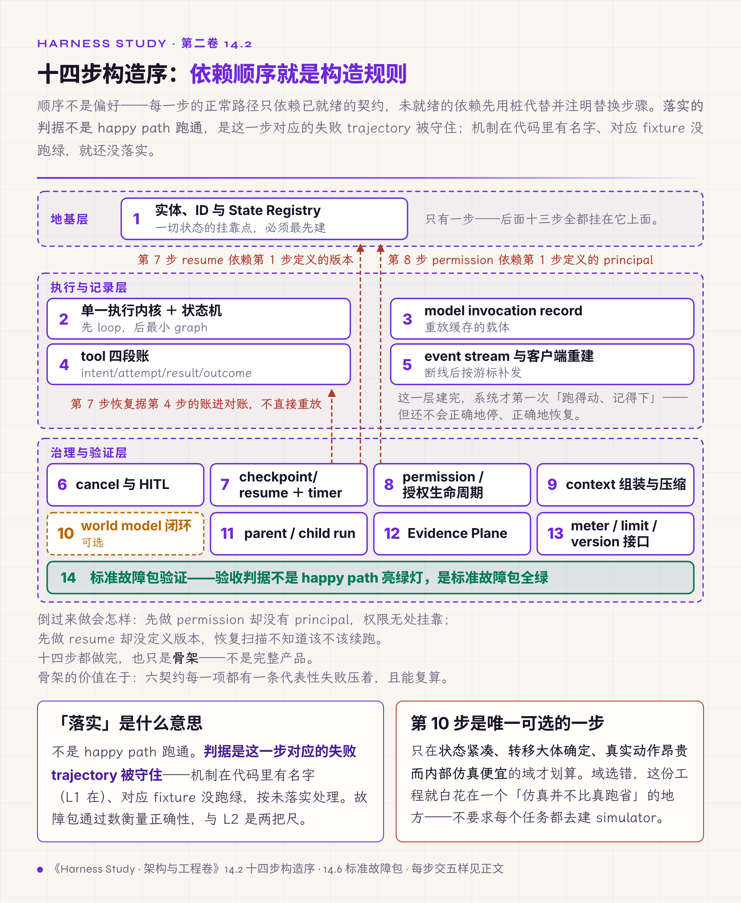
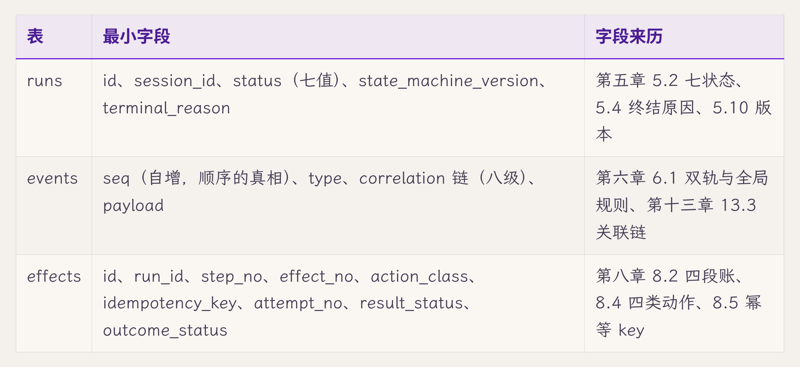
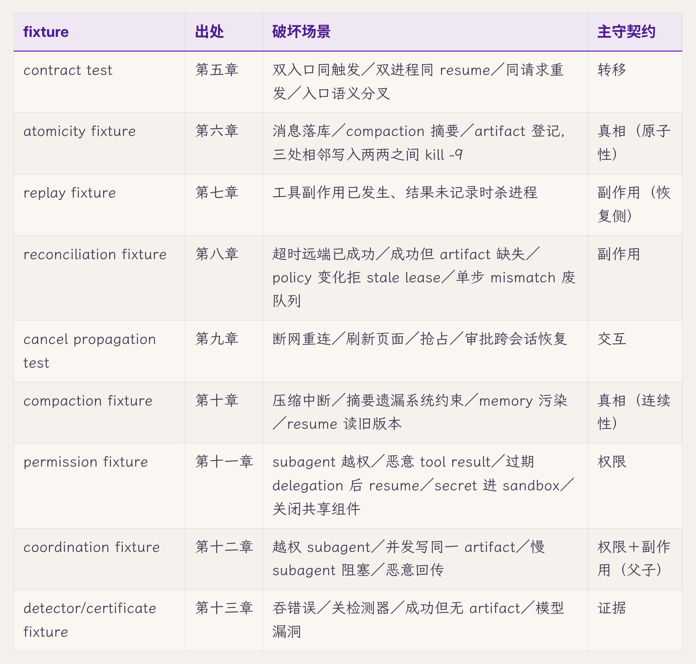

# 十四、从零构造一个最小但完整的 Runtime

> v1.0 · 2026-07-24 · 依据 SPEC.md §二十一 章 spec（构造章·可运行骨架逐步点亮六契约＋依赖顺序构造＋点亮判据＝失败 trajectory＋标准故障包＝九 fixture 汇编验收 SSOT＋executable spec 底线/reference impl 加分）· 四维评审四路已落实，待用户审
> （本版本注与"审稿日志""引用来源"两节同属编辑工作区，出版前整体删除。）

第十三章结尾撂下一句：纸上讲得通，不等于造得出来。前十三章给出了六契约、五平面、证据面，可它们从没合在一起跑过一次。一份契约单看都对，十几份拼到一起，常在集成那一刻相互冲突：permission 挂在还没建的 principal 上，resume 去读一个还没定义版本的 checkpoint，subagent 想关联一个还没有 correlation 的事件流。全卷那条根本主张"部件正确加不出系统正确"在这里最后一次出现，这也是本章要过的坎。

本章的主张是：**用一个可运行的骨架，逐步落实六契约**。三个词各有讲究：骨架，指的不是完整产品；逐步，指按依赖顺序一步步来；落实，标准不是 happy path 跑通，而是每份契约对应的失败场景被守住。本章给出一张十四步构造序和一份标准故障包。

## 14.1 集成才是最后一道坎

先说清楚为什么把十三章的契约各自做完还不够。

最朴素的做法，是把前十三章的机制各自实现、拼到一起，happy path 一跑通就算完成。这条路的失效出在接缝上：各契约单独成立，合起来相互妨碍。失效根因有两个：一是没把依赖顺序当成构造的规则，谁先谁后随手排，于是有的机制挂在还没实现的前提上；二是没把失败场景当成完成标准，只演正常路径，就把"不出错时能跑"误当成了"契约守住了"。

设计上合并两条老做法：写一个测一个（每个可测单元完成即验证），加上破坏一次（全卷每章都跑的破坏实验协议）。用到构造上，就是按依赖顺序逐步推进，每一步交五样东西：最小数据结构、关键伪代码、一条正常 trajectory、一条失败 trajectory、验证证据。代价是从零走一遍比在现成系统上改要慢；但慢换掉的，是集成期才暴露、最难定位的契约冲突。那种"每块单测都绿、合起来就错"的排查，比慢启动贵得多。

## 14.2 构造顺序就是依赖顺序

先把第一条规则具体化：十四步的排序不是随意的。原则是：**每一步的正常路径只依赖已就绪的契约**；尚未就绪的依赖，先用恒放行的桩（stub）代替，并注明在第几步替换；失败路径可以前向依赖后面的步骤，但要注明依赖哪一步。

顺序分三层。地基层：（1）实体、ID 与 State Registry，一切状态的挂靠点，必须最先建。执行与记录层：（2）单一 Execution Kernel 与 run 状态机、（3）model invocation record、（4）tool 的 intent/attempt/result/outcome 四段账、（5）event stream 与客户端重建。治理与验证层：（6）cancel 与 HITL、（7）checkpoint/resume 与 durable timer、（8）permission/sandbox 与 authority lifecycle、（9）context assembly 与 compaction、（10）可显式建模案例的 world model 闭环、（11）parent/child run、（12）Evidence Plane、（13）runtime 的 meter/limit/version 接口、（14）标准故障包验证。

按这条原则，序列里有三处要用桩或前向依赖，逐一注明：

- 第四步的执行顺序要过 policy 与 approval 两站，而 HITL 审批在第六步、permission 在第八步。第四步先接两个恒放行的桩，把调用顺序和事件位置留好；第六步换上真实的审批，第八步换上真实的权限判定。
- 第四步的失败 trajectory（结果落盘前杀进程）要靠恢复流程收场，而恢复在第七步。第四步只验证账上留下了有 intent、无 result 的那一行；完整的恢复判定前向依赖第七步。
- 第十一步的 parent/child run 要把子 run 的事件关联回父 run，而完整的 correlation 在第十二步的 Evidence Plane 里。第十一步先只记父 run ID 这一层关联，并在事件信封里预留 correlation 字段，第十二步再补全。开篇那个"subagent 关联不上事件流"的反例，说的正是没做这层预留、到集成时才发现缺字段的情形。

倒置真正的前提就会落空：permission（第八步）没有 principal（第一步）就无处挂靠，resume（第七步）没有版本（第一步的 State Registry 里定义）就不知道该不该续跑。所以这份序列本身就是一张依赖拓扑：每一步正常路径的前提都排在它前面，桩和前向依赖都明确标出。代价是顺序被锁死，想先做看得见的功能（漂亮的工具、能演示的 UI）得等地基先打好；但地基不打，那些功能就是空中楼阁，第一次真出故障就塌。

*图 14.2 · 十四步构造序：依赖顺序决定构造顺序*

## 14.3 一份契约算不算落实，看它的失败 trajectory

第二条规则更反直觉：一份契约算不算落实，标准是它的失败场景被守住，正常场景跑通不作数。

每一步都要交五样：最小数据结构（够用就行，不为假想的未来预支灵活性）、关键伪代码、一条正常 trajectory、一条失败 trajectory、验证证据。前四样里，失败 trajectory 是分水岭。只演正常路径，证明的仅仅是"不出错时它能跑"，可契约存在的全部理由，就是应对出错。失效根因在这里：把 demo 当成了验收，happy path 的绿灯给了一种"已经守住"的错觉。

设计上，每一步都配一条注入了该契约对应扰动的失败 trajectory，并写明判定标准。做副作用的那一步（第四步），失败 trajectory 就是"工具已执行、结果未落账时把进程杀掉"：第四步先把这一行记成有 intent、无 result 的未决状态；到第七步恢复时，才依据它进入对账，而不是不加判断地重放。代价是每一步都要额外写失败场景，工作量比只写 happy path 多一倍；但这多出来的一倍，正是"落实一份契约"和"做一个能演示的 demo"之间的全部差别。

光说五样太抽象，拿两步完整交一遍：构造序的第 2 步和第 4 步。一步落实转移契约，一步落实副作用契约；这两步也是配套实现项目里底座已经实现、结构可以如实引用的两步【经验】。其余十二步照此仿写，五样的全文放在规格里（见 14.7），这里示范"交齐五样"长什么样。

**示范一，第 2 步：run 状态机（转移契约）。**最小数据结构两张表，字段与来历见下图：runs 行记七状态与版本，events 行记每一次转移。没有优先级列、没有标签列，不为假想需求预支一个字段。

关键伪代码是一个函数，也是全系统改 run.status 的唯一路径：

1. transition(run_id, event, actor)：读当前 status；
2. 查转移表（工作制品 H），当前状态×这个事件，有没有合法行；
3. 验这一行的 guard（例如"旧 run 半轮已落盘"）；
4. 同一事务里写新 status、追加一条 run.* 事件，payload 带触发事件、guard 结论、发起者；
5. 表外转移直接拒绝，记一条 error.raised。

正常 trajectory，一次顺利跑完：run.created → run.state_changed（queued 到 running）→ 若干 step 事件 → run.finalized（completed）。判读要点只有一条：每次状态变化都有事件，事件里带发起者。

失败 trajectory，注入本契约对应的扰动：生成中途新意图抢占。新意图到达，transition 查到"抢占"行，guard"旧 run 半轮已落盘"未满足，等待收尾；半轮写入终态后，记下 run.finalized（cancelled，terminal_reason=preempted）。判定标准：trajectory 里必须能查到这条带发起者的 preempted 事件。第三章帧 7 那次没有事件的抢占，在这条 trajectory 上就是红灯。

验证证据：同场景 N=3，事件序列一致；再 grep 全库直接写 status 的代码路径，transition 之外应为零。这一步就是第一章 PR 四问里"生产路径接通点"在构造阶段的对应做法。

**示范二，第 4 步：工具四段账（副作用契约）。**最小数据结构是一张 effects 表（同见上图）：action_class 与 idempotency_key 防止重复，result_status 与 outcome_status 分列，报告与实况分开记（第八章 8.10）。

关键伪代码是执行顺序本身，顺序错了结构就错了：

1. 开事务写 intent，账上先记下"想做这件事"；
2. 过 policy 与 approval 两站（这一步里两站都是恒放行的桩，第六步换上真实审批，第八步换上真实权限判定）；
3. 执行工具，每次尝试记 attempt_no；
4. 写 result，即工具的报告，成功、失败、超时各是一种；
5. 独立取证写 outcome：读回文件、查对端，不信第 4 步的一面之词。

正常 trajectory：intent、attempt、result（success）、outcome（verified）四段各记一条 effect 事件（类型名以工作制品 C 为准）。

失败 trajectory，注入扰动：工具把文件写完、result 落盘之前 kill -9。这条失败路径前向依赖第七步的恢复流程：重启走第七章的七步，启动扫描认领孤儿 run，事件表定位截断点，账上这一行有 intent、无 result，标 unknown 进入调和，不自动重放。第四步交付时先验证账上确实留下了这一行，第七步就绪后再跑完整恢复。判定标准：外部世界恰好一份副作用，且账上有调和记录；把动作再做一遍（两份文件），或把这一行静默标成成功，都是红灯。

验证证据：三类工具（本地写文件、幂等 API、非幂等 API）各 N=3，判定标准同第八章破坏实验场景一。

两步示范顺带把 14.2 的顺序原则演示了一遍：示范二那条失败 trajectory 里，"启动扫描认领"用的是示范一建好的状态机，"定位截断点"用的是它写下的事件表，都是第 2 步已经就绪的地基；完整的恢复判定前向依赖第 7 步，也按原则注明了。"正常路径只依赖已就绪的契约，失败路径的前向依赖写明出处"，在这两步之间就是这个样子。

## 14.4 双层控制流的最小骨架

前面的步骤里，第二步的执行内核值得单独展开：第十二章的双层控制流，在这里从原则变成骨架。

先实现 node-local loop：单个 agent 内部那圈"调工具、看结果、决定下一步"的自治循环。再在它之上加一个含 branch 与 join 的最小 graph workflow：跨节点的编排层，决定 spawn 谁、等谁、怎么合。两层都要有，但顺序是先自治层、后编排层，因为编排层调度的是一个个已经能自己跑起来的 node。失效形态就是第十二章讲过的那种混层：把本该由模型判断的一步硬编进图（该自治的被锁死在确定性代码里，变得脆弱），或把本该确定的分派丢给 loop 里的模型自由发挥（该编排的失去了可追踪性）。

代价是这个最小 graph 也是一层实打实的实现，单 agent 的任务根本用不上它；但没有这层骨架，多 agent 协作就没有挂靠点，等真需要并行时再从 loop 里硬长出编排层，比一开始留好接口要难得多。

## 14.5 可显式建模的那一步

第十步是个例外，得说清它的适用边界，免得被误当成通用要求。

在一个状态紧凑、转移可观察的案例里，实现一条完整闭环，共五步加一条返回边：

1. 观察：收集状态与转移；
2. 建模：写出 world model；
3. 认证：用完整历史做 replay certificate；
4. 规划：在模型里 search 或 dry-run（只演练不执行）；
5. 提交：只让 guarded commit 触碰真实世界。

返回边是：预测与观察不符，就生成 counterexample 并重新规划（replan）。这正是第十三章 13.8 那条模型闭环（观察→建模→认证→规划→提交，加反例回填）的可运行形态，本章把它从纸面变成一条能跑的代码路径；它也是第十三章那七条认识论边、第六章 6.12 那份信念工件从纸面到可运行的一次示范。

关键是把边界划清：这条路径是显式可建模任务的扩展，适用面只到这里，普通 agent 任务无需配一套完整 simulator。代价也正在于此：建一个像样的 simulator 投入很大，只有当任务的状态紧凑、转移大体确定、真实动作昂贵而内部仿真便宜时才划算（这条领域边界第十三章已经给出）；领域选错了，这笔投入就白花在一个仿真并不比真跑省的地方。所以本章把它放进构造序，同时明说它可选。

## 14.6 标准故障包：验收不看能跑，看它全绿

到最后一步，本章最要紧的方法问题浮出来：这套 runtime 到底验收什么。

答案不是"能跑"。前面有九个深入章在章末给第十四章留了一个 fixture。验收这套 runtime，就是逐项问六契约在故障下守没守住；第五至十三章这九章的 fixture 汇编成的标准故障包（一组预设的故障用例，用于逐项判定 runtime 是否满足契约），正是那张逐项验收表：

六契约每一项都有对应的故障场景：转移、副作用、交互、真相、权限、证据，无一漏空。验收标准从此改为标准故障包全绿，happy path 亮绿灯不再作数。失效根因还是全卷开篇批评过的那句老话"能跑就不要动"，在构造层就表现为拿 happy path 交差。设计上，标准故障包是规格和参考实现共用的同一套验收，谁跑都是这一包。代价是维护一套故障包是持续开销，改一处机制要回归整包；但它是"六契约每一项的代表性失败都被守住"唯一可复算的证据。全绿证明的是每项有一条失败场景被挡住，不是契约被穷尽守护；省了它，连这条代表性证据都没有，"守住了"就只是一句口头声明。

## 14.7 底线交付一份规格，参考实现是加分

交付什么，首先是方法论选择，其次才是工程选择。

底线交付是一份语言无关的规格：数据结构、状态转移、事件 schema、标准故障包的判定标准，都写成不绑定任何语言的条文，任意语言都能照着实现。这份规格要做到每一条都能逐条执行判定；更进一步，最好把它写成可运行的一致性测试（conformance test），那才是严格意义上的可执行规格（executable specification）。加分交付才是一个可运行的参考实现。这么分层有个明确理由：方法要能迁移，一份语言无关的规格谁都能照着造；参考实现是加分的验证，它证明规格可实现，却不等于规格本身。把规格定为底线，成书就不会被某一种实现的进度卡住，第三卷的接口清单也以这份规格为准。代价是写一份严谨的语言无关规格，比直接敲代码更费神，很多在代码里能含糊过去的边界，在规格里必须写死；但换来的是这套方法不被绑在一种技术栈上，任何团队都能照着它造自己的 runtime。

## 14.8 先单机跑对，再谈规模

最后是部署形态。这一步的原则是：逻辑架构和部署规模解耦。

先建单机基线：SQLite、单例、进程内跑任务、进程内广播事件。它看着像个玩具，但它的价值正是把"逻辑对不对"和"规模够不够"分成两个可以先后回答的问题。规模是后一个问题，靠一组明确的切换信号触发迁移。迁移时逻辑契约不变，多实例所需的 fencing 等字段事先在契约里预留：

代价是单机基线在能撑住真实流量之前，确实只是个骨架；但先在单机上把六契约和标准故障包跑对，再按信号逐个换组件，比一上来就上分布式、在规模和正确性两个维度同时挣扎，要稳得多。

业界的一个对照正好在这里（回指第七章）：checkpoint 类框架容易把"存档点"当成 durable execution 的全部。按 Diagrid 的公开比较（Diagrid 自身是 durable-execution 竞争方，这是其厂商立场，不是中立结论），这类框架不管失败检测、恢复触发与跨实例协调三件事；本章第七步的 checkpoint/resume 也只是存档点。把这三件事补回来的分别是：失败检测靠第二步 run 状态机里的启动扫描与看门狗（第五章 5.8）；恢复触发靠进程壳层重启后接上第七步的恢复流程；跨实例协调靠第五章 5.8 的双重认领与 fencing，在本节的切换信号出现、走向多实例时启用。

## 破坏实验：标准故障包本身

本章不另设破坏实验，标准故障包就是它。九个 fixture 各自定义了一套"破坏、观测、判定、N 次复跑"的流程；逐一执行就是验收协议，这并不代表已经跑过。判定标准已在各自出处章给出（第五至十三章的破坏实验节）。

实证状态分层说明【经验】：九个 fixture 目前都以规格中的判定标准存在：每个 fixture 写明破坏动作、观测点、判定与 N 次复跑要求，属于思想实验层面、可逐条执行判定的规格；参考实现的实跑覆盖是加分项。配套实现项目当前已实现的是 append-only 事件流、run 状态机、correlation、intent/result 记录这几项底座，够给 contract test 与 replay/reconciliation 三个 fixture 搭实跑接线；但包括这三个在内，九个 fixture 都还没跑绿，fixture 级的实跑尚未接齐。整包实跑覆盖是本章加分交付的待办项，既不能说成"已部分实跑"，也不能说成"整包已实跑绿"。

## L 级自检

按第一章的成熟度尺（L1 能跑、L2 能看，全表见第一章 1.3 节）。先说清一点：标准故障包跑绿证明的是正确性，不能算作 L2；L2 看的是 trajectory 里有没有事件。本章借用成熟度尺的思路，另用"故障包通过数"衡量构造进度：一套 runtime 走到哪一步，不看它有多少机制有名字，看标准故障包里通过了几个 fixture。两把尺分开用，套第一章那条假落地诊断的构造版：十四步里某一步的机制在代码里有名字（L1 在），可它对应的那个 fixture 从没跑绿过、甚至没写，这一步就按未落实处理：有骨架，没经过故障验证。

对应到第一章的四问：可观测靠每步的验证证据与 Evidence Plane（第十二步）实现；可控取决于依赖顺序与单一执行内核，构造被顺序锁死，执行只有一个内核入口；稳定由标准故障包检验，九类扰动逐一注入，整包全绿才算稳；闭环在本章是方法层面的：构造本身就是一个"建机制、跑故障包、哪项红补哪项"的反馈环，检测（故障包）、纠正（补机制）、验证（重跑包）三环在设计与规格的判定层都已具备。但要说清：配套实现里故障包只有 contract test 与 replay/reconciliation 三个 fixture 搭好了接线，而且还没有一个跑绿，这个环还没在本地完整走完过一圈。这仍是全卷四问第一次用在"造一套系统"这件事本身上，只是停在方法层，还没到已跑通的实现层。

再对照全卷的坐标系补一句：全卷那条根本主张"部件正确加不出系统正确"在这里得到正面回答。部件要加成系统，靠的是三件事合在一起：依赖顺序让每个部件不挂在还没建的前提上，逐份落实让每个部件经得起自己的失败场景，标准故障包全绿证明它们合起来仍同时成立。本章不新守某一份契约，它守的是这三件事叠出来的集成正确性。

配套实现项目的现状：本章机制整体在 L1 与 L2 之间。骨架的几步（State Registry、状态机、事件流、correlation、intent/result）是实的（L1）；按故障包通过数衡量则还是零：标准故障包的完整实跑、规格的完整成文都还没做完。补齐是本卷实现部分的收尾工程，也是第三卷生产化的起点。

## 交付物

1. **语言无关的规格**（底线交付）：十四步的数据结构、状态转移、事件 schema、标准故障包判定标准，不绑定语言，可逐条执行判定，最好写成一致性测试；成书不被实现进度阻塞，第三卷接口清单以它为准；
2. **可运行参考实现**（加分交付，当前仅骨架几步实现，整包实跑待补）：证明规格可实现，与规格共用同一套标准故障包验收；
3. **标准故障包**（正文表，验收的唯一依据）：九个 fixture × 破坏场景 × 主守契约，六契约每项都有对应故障场景；第十五章评审直接取用。

只想拿走评审工具的读者，可以单独取用标准故障包作评审尺：不看被评系统的功能清单，只问它六契约的每一项有没有一个能跑绿的故障场景；答不出的那一项，就是它还没落实的那份契约。

## 立即可做的一个动作（五分钟）

builder 版本：从标准故障包里挑一个最贴近自己系统的 fixture（比如"工具已执行、结果未记录时杀进程"），在系统上手动制造这个故障，看它恢复后是把那个动作送进对账，还是不加判断地重放一遍。跑绿了，这一项契约就落实了；跑红或压根没法跑，记下来：这是 runtime 上一个具体、可指认的缺口。

assessor 版本：问被评团队一个问题："你们的验收，是 happy path 全过，还是有一套固定的故障场景每次回归都要全绿？"答"happy path 全过"的，按本章的标准记：这套系统只被证明过"不出错时能跑"，它在故障下守不守得住六契约，从来没被验收过。

## 下一章

从零造出一套能跑、能扛故障、能自证的 runtime，方法齐了。可现实里，从零开始是少数，更多时候是接手一个已经在线上跑、来历不明、没人说得清它守没守住哪几份契约的系统。面对这样一个既成系统，怎么在有限时间里审出它的残余风险？第十五章把全卷方法压缩成一套能带走的评审工具。

## 审稿日志

> （编辑工作区：本节与"引用来源"节出版前整体删除。）

| 轮 | 检查 | 命中与修改 |
|---|---|---|
| 版本史 | — | v1.0（2026-07-24）：依 SPEC §二十一 spec 首写。大纲十四步构造序→14.2；主张"可运行骨架逐步点亮六契约"贯穿。方法论主轴四条：依赖顺序＝构造纪律（14.2）、点亮判据＝失败 trajectory 非 happy path（14.3）、标准故障包＝验收 SSOT（14.6）、executable spec 底线/reference impl 加分（14.7）。下沉件：双层控制流最小实现（14.4，回指第十二章）、可显式建模案例（14.5，回指第十三章/第六章 6.12）、部署基线切换信号（14.8，部署原属 §一、大纲 v5.4 下沉本章，§一 v4.0 无 3.9 节）。欠条汇编：八个"第十四章工单"fixture（第五 contract test/第七 replay/第八 reconciliation/第九 cancel/第十 compaction/第十一 permission/第十二 coordination/第十三 detector）→标准故障包表。收口全卷主线："部件正确加不出系统正确"（第一章）在集成层正面收尾。2026-07-25 修订：标准故障包由八格扩至九格，补入第六章 atomicity fixture（三处相邻写入两两 kill -9，守真相契约的原子性一面），第六章章末欠条销账；全章 fixture 计数与出处章列表同步改口（SPEC §二十一、README §十四 行待主控同步）。 |
| 章级验收自测 | SPEC §二十一 清单 | 正文表格 2（标准故障包 fixture×契约＋部署切换信号；十四步构造序以列点呈现不占表）＋配图占位 0；新概念实计约 9（可运行骨架、依赖顺序构造、五样/点亮判据＝失败 trajectory、最小 graph workflow、标准故障包、executable spec vs reference impl、部署基线切换信号、集成正确性——≤10 达标）；前向引用约 4 处/1 章（第十五章＋卷三——≤6 达标）；一手证据 1 处（配套实现项目骨架几步落地）＋大量回指前十三章；业界对照带失效点已入正文（14.8 checkpoint 三缺＋Diagrid 竞争方框定）；破坏实验＝标准故障包九 fixture＋实证分层（executable spec 判定 vs 参考实现底座、九 fixture 均未跑绿）✓；L 级自检＋坐标系落位（本章＝全卷 L 级收敛点）✓；双读者动作 ✓；文字化引用零 § ✓；工作制品/fixture 回指带出处章 ✓ |
| R1 grep 红线 | 首稿自查＋评审后复跑 | "你"系病灶 0（builder 段已清"你"、assessor"你们"沿惯例）；元叙述 0；模糊词 0；文字化引用正文零 §。首稿自查清语域"打架/踩脚/散架"＋反向卫星对比 1 处；style 评审补抓卫星对比 5 处（L24 清单/L48 simulator/L69 节标题/L71 交付/L118 遗留，均"是X不是Y"反向变体、grep 单向漏）＋"四件套"名实不符（列 5 项）→"五样"，落实后全清；复跑正文显式禁形仅余 2 处章主张（14.3 点亮判据＋14.6 验收，对比式主张）＋技术等价"不等于"；整句加粗仅开场章主张一句；"骨架"经 style 判为 scaffold 承重义可留；体量正文约 135 行 |
| 四维评审 | **四路已跑齐并全部落实（2026-07-24，均用 opus）：technical B+→A-（fixture 口径＋混层层向＋业界对照补正文）／style B+→A-（卫星对比 5＋四件套清零）／cybernetic A-（方法论比例约 85%、代价末环 8/8 全落）／business 合规达标（脱敏/Diagrid 竞争方框定/实跑口径未粉饰，零 P0）** | technical P0：第九章 cancel fixture 场景走样（重复连接/工具忽略 cancel→断网重连/刷新/抢占/审批跨 session，补漏抢占）；P1：14.4 混层示例层向讲反（loop=自治非确定、graph=确定非自由发挥）对齐第十二章 12.2；P1：SPEC 强制业界对照正文缺席→14.8 补 checkpoint 三缺对照带 Diagrid 竞争方框定；P2：步 4 四段账补 attempt、"每一章"→"各深潜章/八章"、permission fixture 补恶意 tool result、副作用第四步失败判定依赖第七步说清；P3：开篇那句"部件正确加不出系统正确"去逐字引用框（第一章 v4.0 无原句）、引用来源 checkpoint 收窄 LangGraph、§一 3.9 失效编号（v5.4 下沉本章）。cybernetic P0：四问闭环句完成时态就地限定（3 fixture 搭接线、尚无跑绿、环未闭合一圈）；P1：全卷主线收口从声明改证成（依赖顺序＋逐份点亮＋故障包全绿三件叠出集成正确性）；P1：14.6"全绿=真守住六契约"充分性过声→"代表性失败被守住、非穷尽"（对齐 §十三 scope 纪律）；P2：四件套→五样（SPEC N1 同步）、标题工程报告题副题留终稿；P3：14.5 补 MODA 五层回指、L 级自检拆 3 段。style P0：14.7 节标题"是X不是Y"→陈述、自评计数订正；P1：卫星对比 5 处拆、14.6 表前补桥接句；P2：十四步加三层分组脊柱治流水账；P3：撑不住三重比喻收。business P1：实跑口径"部分实跑"→"八 fixture 均未跑绿、底座可搭接线"、业界对照自检对空补正文；P2：破坏实验"逐一跑"→"逐一执行即协议非已跑过"、终稿回核补实跑状态；P3：参考实现加"仅骨架几步落地"限定 |
| 终稿回核清单 | — | 十四步构造序与大纲 §十四 步骤对齐（回核大纲）；九 fixture 破坏场景与各出处章破坏实验节口径一致（回核第五/六/七/八/九/十/十一/十二/十三章）；部署切换信号四条与大纲 §十四 首段一致（部署 v5.4 下沉本章、§一 v4.0 无 3.9 节）；checkpoint 框架三缺出处回指第七章 Diagrid 批评（竞争方立场）；executable spec vs reference impl 分层与大纲交付物一致；标准故障包实跑覆盖（哪些 fixture 实跑到什么程度、是否跑绿）与配套项目 results 对账回核、防实跑口径漂移；replay fixture 主守契约副作用恢复侧/转移侧（第七章）接缝一句说明待补；标题工程报告题的大纲/README 副题待终稿定 |
| 终稿增补 | 2026-07-27 用户裁决（Build 章细节不足） | 14.3 增两示范步（第 2 步 run 状态机／第 4 步四段账），每步交齐五样；新增嵌入表 tb-14-3；SPEC §二十一「每步给五样」由宣布改为示范兑现（示范 2/14，全文归 executable spec）；正文表格计数 2→3 |

## 引用来源

> （编辑工作区：本节出版前整体删除。）

- 【经验】配套实现项目：State Registry、run 状态机、append-only 事件流、correlation、model invocation/tool intent-result 记录几件已落地（14.3/14.6/L 级一手底座）；标准故障包完整实跑与 executable spec 完整成文未接齐（照实半格）。
- 【厂商实践】checkpoint 类框架（以 LangGraph 为代表；CrewAI/Google ADK 的双层控制流对照在第十二章、非此处 checkpoint 批评）只给存档点、不给失败检测/恢复触发/跨实例协调——三缺恰是第五章启动扫描/看门狗/fencing 与本章标准故障包要补的（14.8 正文对照，回指第七章 Diagrid 批评，竞争方厂商比较、非中立结论）。指针 research/volume2/05。
- 回指素材：第一章（根主张"部件正确加不出系统正确"＝SPEC 卷级根主张、第一章 v4.0 正文未逐字、终稿若补入原句则回指、1.3 节 L 级尺与假落地、"能跑就不要动"反格言；部署原属 §一、大纲 v5.4 下沉本章 14.8，§一 v4.0 已无 3.9 节）；第五章（run 状态机、contract test fixture）；第六章（State Registry、实体链、6.12 信念工件、atomicity fixture）；第七章（checkpoint/resume/durable timer、replay fixture、Diagrid 三缺）；第八章（四段账、reconciliation fixture）；第九章（cancel/HITL、cancel propagation test）；第十章（context/compaction fixture）；第十一章（permission/authority、五平面、permission fixture）；第十二章（双层控制流、parent/child、coordination fixture）；第十三章（Evidence Plane、认识论七边、detector/certificate fixture）；工作制品 A–Z 全套（本章构造序逐步点亮、第十五章评审取用）。
