# 工作制品汇编 · 全卷登记表的单一真相源

> 本汇编收录全卷各章引用的登记表，随各章内容更新，变更记录见文末。
> 正文各章都引用这里的表，不各自另开表。本文件以表格为主体，因为它是评审时直接取用的登记表，而不是供通读的正文。
> **引用方式**：正文引用一律写"工作制品＋节号＋名称"，例如"工作制品 H（Run 状态转移表）"。
> **编排顺序**：各节以字母编号，但排列不是严格的 A→Z：L 之后先接 Q、R、S，再回到 M、N、O、P，然后从 T 排到 Z。这是各节随章节写作先后增补形成的顺序；为不影响全卷的引用，节号保持不变，查找时以下方节号目录为准。

## 节号目录

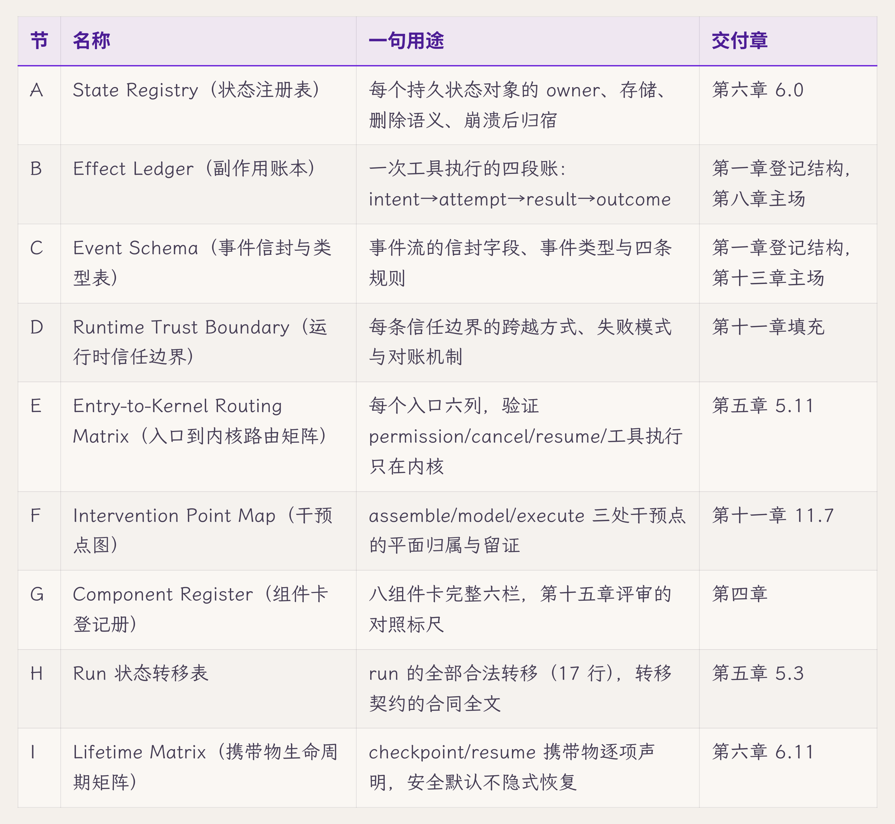

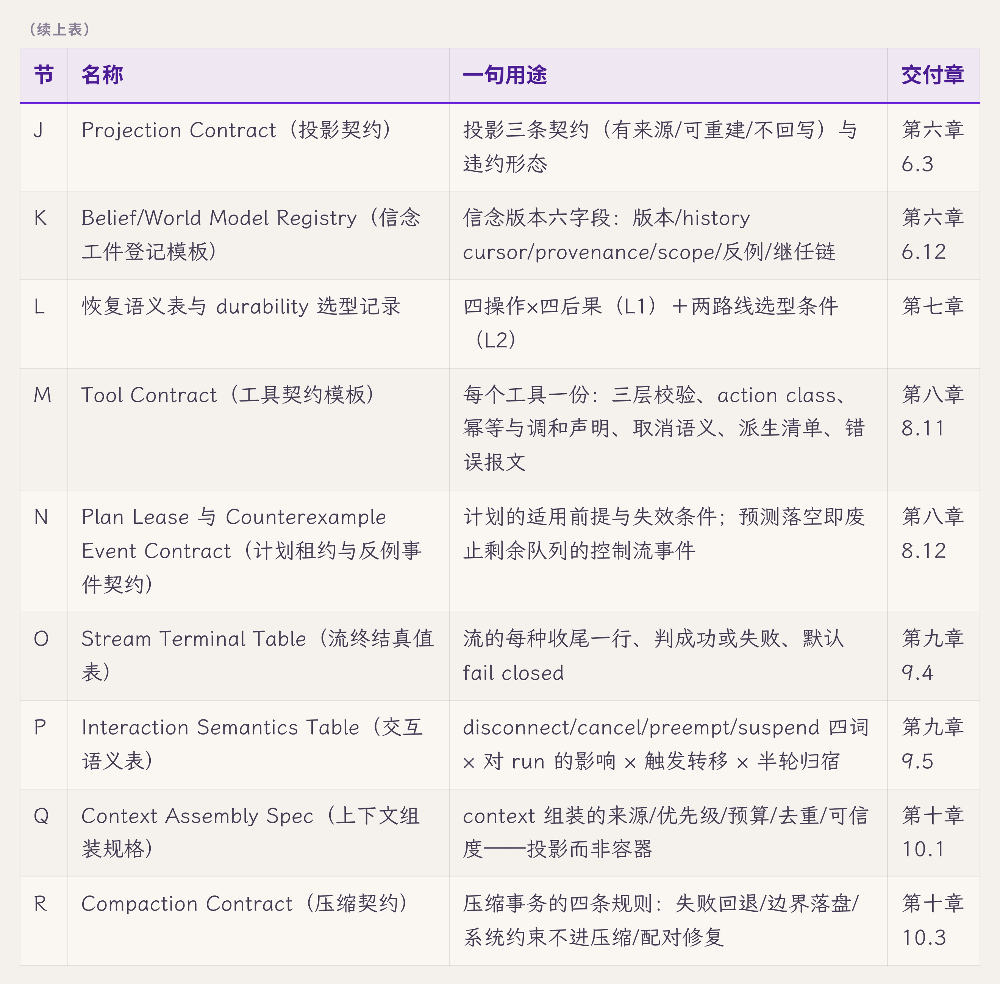

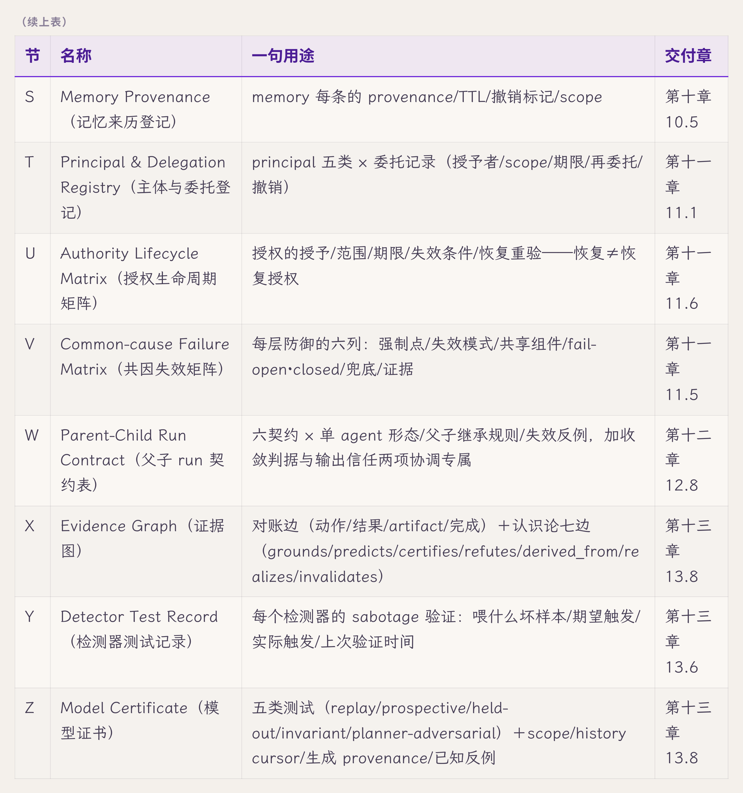

## A. State Registry

用法：每个持久状态对象一行。评审时逐行问四个问题：还有谁在写它？版本字段在哪？删除它意味着什么？进程在写它的半路被杀，重启后它处于什么状态？答不出的单元格就是缺口。

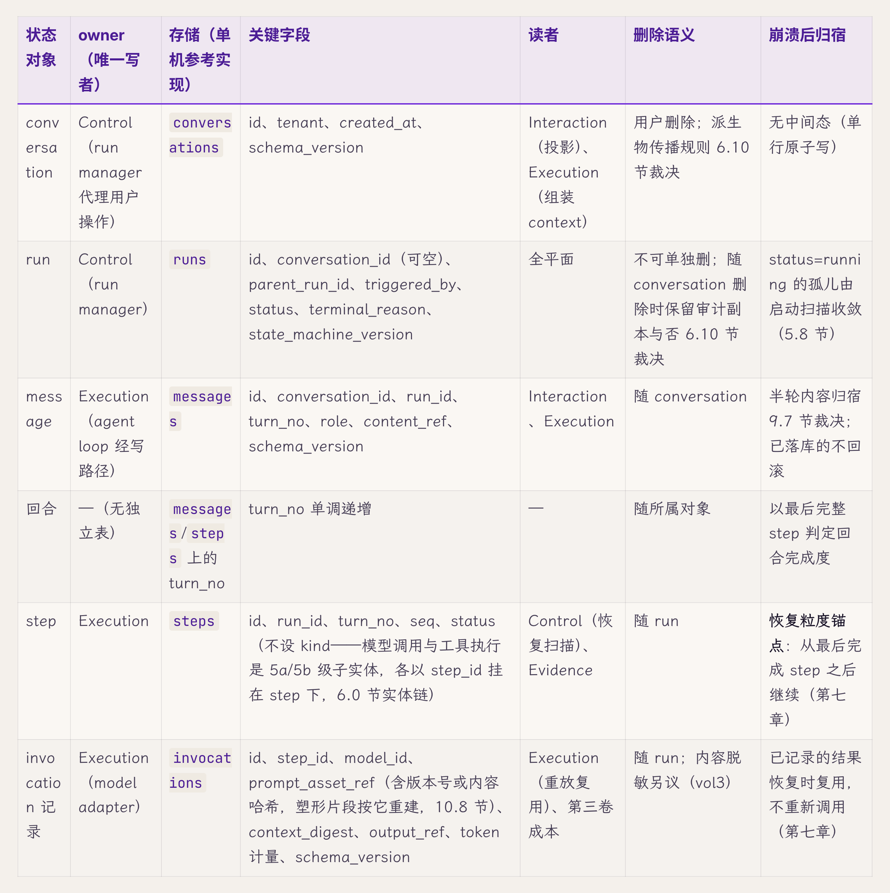

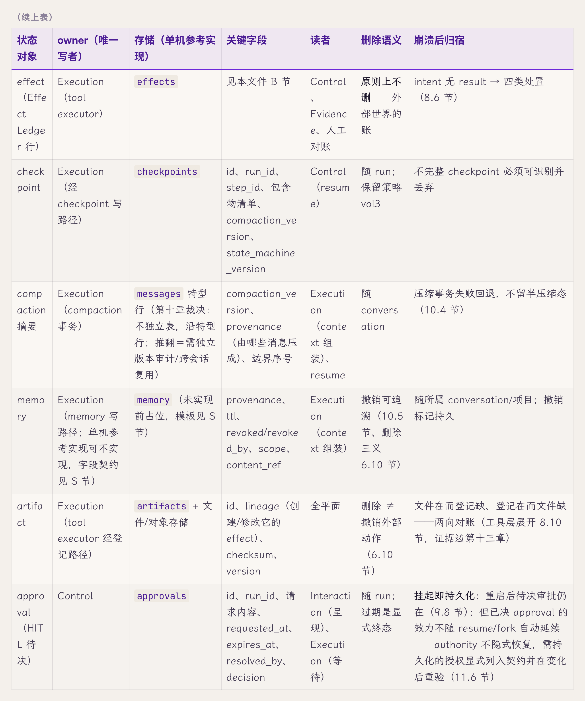

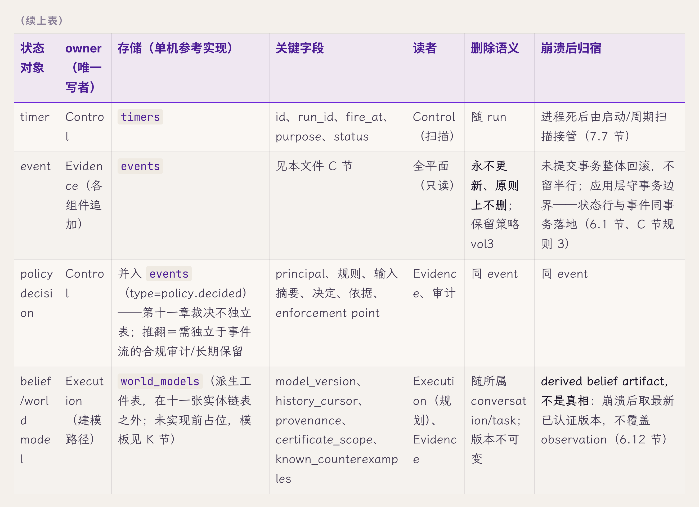

适用于全表的三条规则：

1. 每行记录一律带 `schema_version`。
2. 除顶层（conversation）外，每行带完整的父链外键，允许为空的层级显式置空；event 行由全量冗余的 correlation 字段承载（C 节）。
3. 每行登记 **scope**（会话/项目/全局）。作用域是归属的一部分，只在注释里说明不算数（6.2 节）。

三条设计决定（6.0 节）：

1. attempt 不设独立实体。模型侧的 invocation 行就是 attempt（失败的调用也记一行），工具侧由 effects.attempt_no 承载；出现跨层共享的重试预算（retry budget）时，再升格为独立实体。
2. turn、compaction 摘要、policy decision 三者不设独立表：turn 由字段承载；compaction 摘要是 messages 表中的特殊类型行（第十章沿用这一做法）；policy decision 由第十一章决定并入 events，见本表 policy decision 行。
3. lease（执行权）是进程内的授权对象，不入本表（6.0 节、第八章）。

## B. Effect Ledger

每行记录一次工具执行（Tool Execution）。四段模型：intent → attempt → result → outcome。

**字段**：

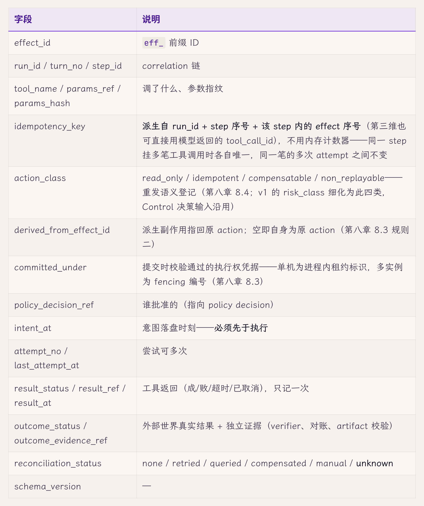

**状态机**：`intended → attempting → result_recorded → outcome_verified`；异常有两个分支：`intended/attempting → unknown →（对账）→ 调和终局`（intent 有、result 无，8.6 节）；`result_recorded →（outcome 与 result 不符）→ 对账事件 → 调和终局`（8.10 节）。调和终局记入 reconciliation_status（retried/queried/compensated/manual 之一）。

**八条不变量**（1–5 为初版已有，6–8 随第八章新增）：

1. 先写 intent 再执行副作用。写账本与改世界分属两个系统，无法一次原子提交，这个结构就是双写（dual-write），换哪个顺序都躲不掉。intent 先行消除不了两次写入之间的崩溃窗口，它决定的是崩溃之后还有没有线索：先执行后记账，世界变了而账上空白，连"曾经想做"都查不出来（第八章 8.2 节）。
2. attempt 可以多次，result 只能记录一次；重试产生新 attempt_no，不覆盖旧 result。
3. outcome 需要独立证据，不允许从 result 抄写。工具返回成功，不等于外部世界里真的成功（8.10 节）。
4. `unknown` 是合法状态而非缺失值：超时且远端不可查时，如实标为 unknown 交给对账，不假装可以自动回滚。
5. ledger 行是状态（可更新），每次状态转移同时向 `events` 追加对应事件（可信历史）。行与事件不一致时，以事件序列重建为准。
6. 执行权在副作用的提交点校验，只在入口校验不够：await、确认框与 I/O 会在检查与提交之间制造窗口。多实例部署时，写入携带 fencing 编号（围栏令牌），状态层拒绝旧编号（第八章 8.3）。
7. 派生副作用归属原 action：登记 derived_from_effect_id，纳入同一 barrier 与同一执行权校验，禁止发出后不管（fire-and-forget）（第八章 8.3）。
8. 执行权收回后到达的旧写入必须拒绝，并写一条 zombie trace 事件，拒绝本身就是证据（第八章 8.3；第十三章消费）。

**四类处置表**（Reconciliation Table：intent 有、result 无 时的调和处置，即第八章 8.6 正文表的登记版）：

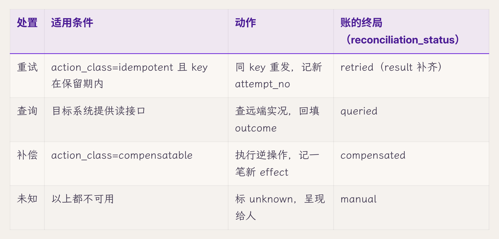

## C. Event Schema

**信封字段**（每条事件必带）：

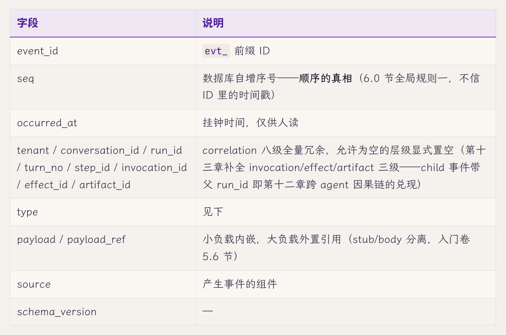

**事件类型 v1**（按对象分组；`*` 号是恢复扫描的关键锚点）：

- run：`run.created` / `run.state_changed`* / `run.finalized`*
- step：`step.started` / `step.completed`*
- invocation：`invocation.requested` / `invocation.recorded`
- effect：`effect.intended`* / `effect.attempted` / `effect.result_recorded`* / `effect.outcome_verified` / `effect.reconciled`
- message：`message.appended`
- checkpoint / compaction：`checkpoint.created`* / `compaction.started` / `compaction.committed`* / `compaction.aborted`
- approval / timer：`approval.requested` / `approval.resolved` / `approval.expired` / `timer.set` / `timer.fired` / `timer.cancelled`
- 控制与异常：`policy.decided` / `error.raised` / `correction.appended`
- 检测器与证书（第十三章补）：`detector.probed`（检测器自检结果，记入工作制品 Y）／ `absence.detected`（期望事件缺席告警）／ `certificate.issued`（Model Certificate 签发，进工作制品 Z）／ `model.refuted`（反例推翻模型，回指工作制品 N Counterexample Event）

**四条规则**：

1. append-only，永不 UPDATE；记错了追加 `correction.appended` 指向原事件，不改历史。
2. 事件粒度到 step/消息完成，不逐 token。token delta 走流式投影通道，没有恢复价值，不入账（第六章的持久化粒度规则）。
3. 崩溃容忍按载体分。DB 型事件表由事务原子性兜底，不出半行；应用层要守住的是事务边界：状态行与事件在同一事务中写入（6.1 节）。文件型事件日志（入门卷 6.3 节的 JSONL）才有半行问题：进程可能死在写半行时，恢复按最后一个完整事件截断，丢掉尾行不算数据损坏。只追加（append-only）不等于崩溃安全（crash-safe），两者要分开保证。
4. 内部 schema 稳定优先；OTel GenAI semantic conventions 截至 2026-07 仍为 Development 状态【规范/官方文档】，只做导出映射不做内部依赖（第十三章、第三卷 17.2 节）。

## D. Runtime Trust Boundary

每条信任边界一行，登记四项内容。评审用法：逐行问"跨这条边界时信任怎么变、失败会怎样、拿什么对账"。

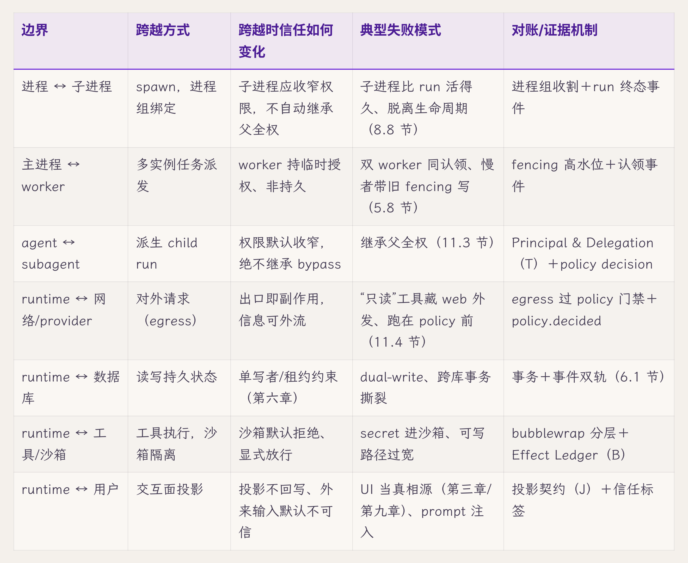

## E. Entry-to-Kernel Routing Matrix

规则：后四列只要有一列不指向内核（run manager / Execution Kernel），就是入口绕过内核的缺口。评审用法：拿被评系统逐行填写，出现空格或"入口自实现"，即为语义分叉；第五章破坏实验场景 4 的 contract test 按本表逐行验证（同一 cancel 从每个入口发起，必须路由到转移表同一行）。

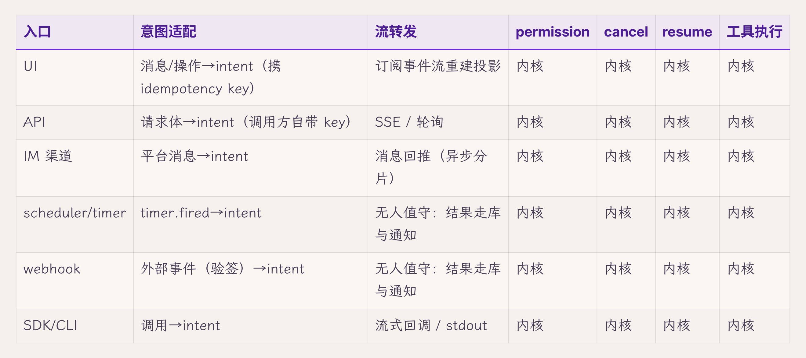

## F. Intervention Point Map

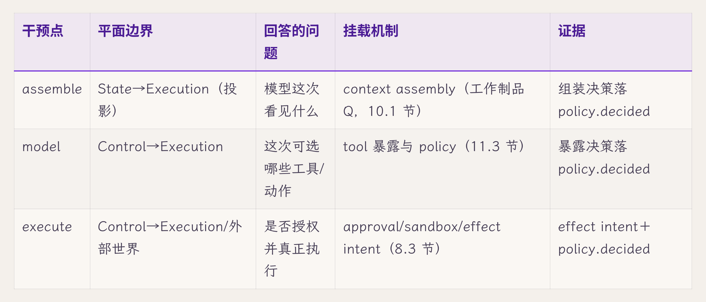

三处分别留证，不能以一处代替另外两处。

## G. Component Register

八个组件卡的完整六栏。正文（第四章）只展开示例卡与取舍，本表是登记全文；后续各章深入讨论某个组件时，更新本表对应行。
用法（评审侧）：逐行问三个问题：这张卡在被评系统里叫什么？它的职责有没有唯一 owner？违约在 trajectory 里有没有事件？答不出的行就是缺口，记入评审的残余风险清单（第十五章）。

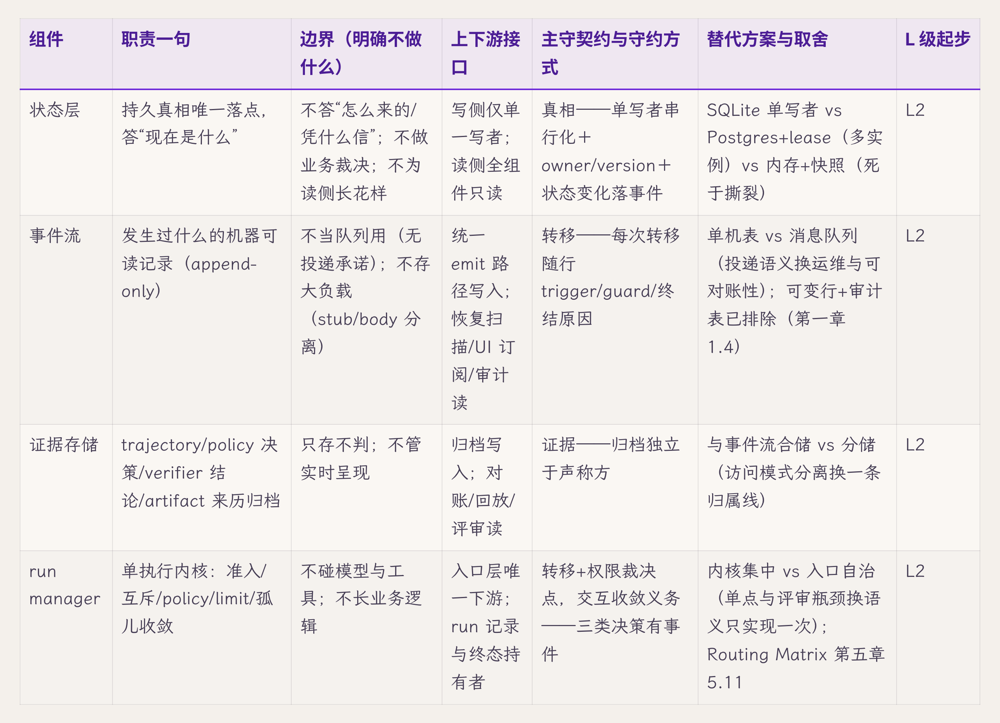

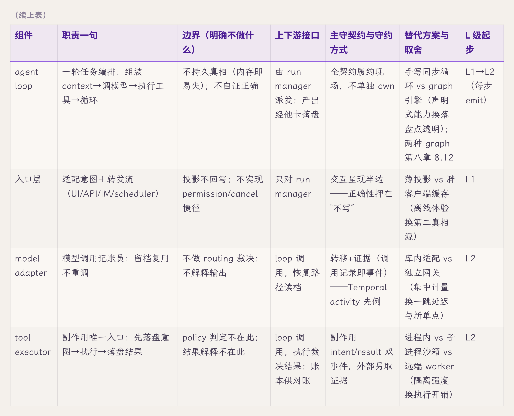

## H. Run 状态转移表

用法：代码中改 `run.status` 的唯一路径（内核 transition 函数）按本表执行；表外转移一律拒绝，并写一条 `error.raised`。触发事件用语义名，写入时一律使用 C 节的 `run.*` 事件类型，payload 携带 trigger/guard/actor/terminal_reason。评审时逐行问：这条转移在被评系统里由哪段代码执行，事件写在哪里。

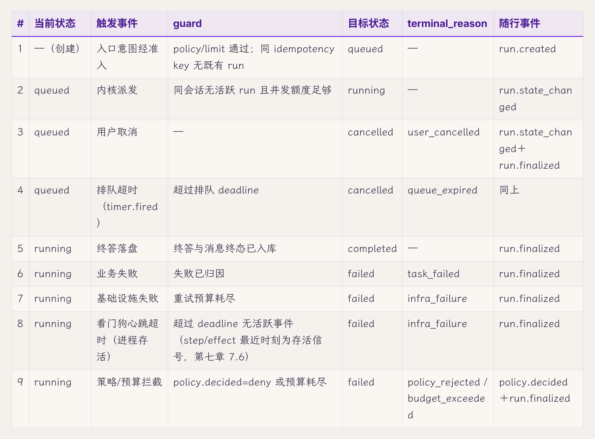

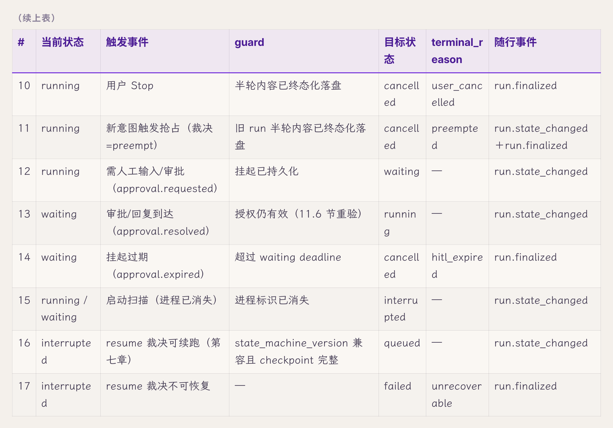

四条表级规则：

1. 终态（completed/failed/cancelled）之间没有任何转移行：终态不许互转，判错时追加更正事件。
2. terminal_reason 逐值标明类别（第五章 5.4）：task_failed 归业务失败；infra_failure、unrecoverable 归基础设施失败；user_cancelled 归用户取消；policy_rejected、budget_exceeded、queue_expired、hitl_expired 归策略拒绝，其中后两个值属于时限耗尽，终态为 cancelled（被拦下的是继续等待，与 run 出错分开）。preempted 按新意图的发起者归类，发起者记在转移事件里：用户重问、用户从另一个入口发起新意图而触发的抢占，归用户取消；scheduler、webhook 这类无人值守入口触发的抢占，归策略拒绝。
3. 本表变更即 schema 变更，随 state_machine_version 迁移（第五章 5.10）。
4. waiting 崩溃后不回到 waiting：它经 row 15 进入 interrupted，出边只有 row 16（→queued）与 row 17（→failed）。表里有意不设 interrupted→waiting 回路：回到 queued 重跑到审批点、再次挂起，等于让审批重来一次，旧授权不跨崩溃延续，恢复即重新验证（第十一章 11.6）。

另有两点说明。其一，抢占（running→cancelled，terminal_reason 为 preempted）分两步完成（第五章 5.5）：内核先向旧 run 发出 abort，等待它把半轮内容落盘，这段时间旧 run 仍记为 running，事件里标记 cancel_requested；落盘完成后才执行这条转移，guard 检查"旧 run 半轮已落盘"，转移完成后新 run 才接手会话。其二，看门狗（row 8：进程还在、run 卡死，直接进入终态）与启动扫描（row 15：进程已经消失、run 可能还能救，进入 interrupted 交给恢复裁决）是两条不同的行，不得合并。

## I. Lifetime Matrix

规则：未列入本表的携带物默认"不保存、不恢复"；新增携带物先登记再实现。安全默认值是不隐式恢复。

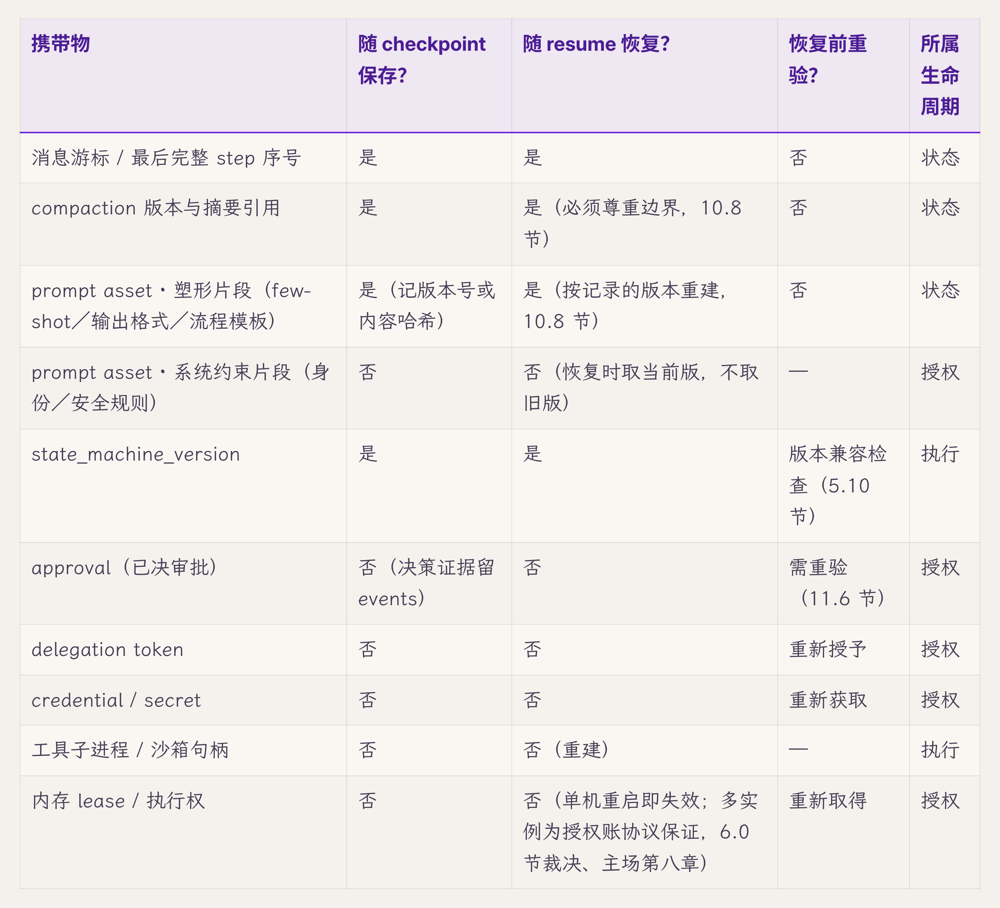

## J. Projection Contract

适用对象：context（给模型的投影）、UI（给人的投影）、导出视图（trajectory/trace 的读侧）。

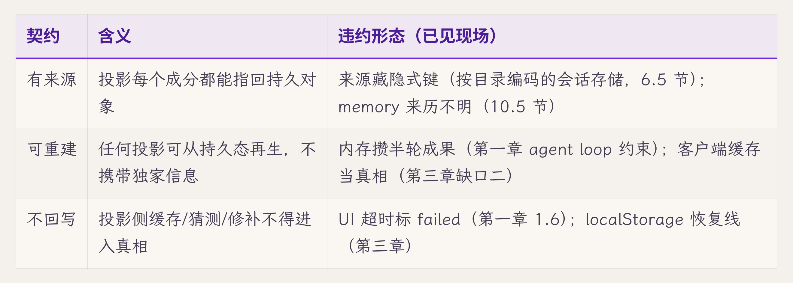

## K. Belief/World Model Registry

规则：belief 是派生工件（derived belief artifact），任何版本都不覆盖 observation；反例必须能触发状态表示与转移规则的共同修订（6.12 节破坏实验的判定标准）。

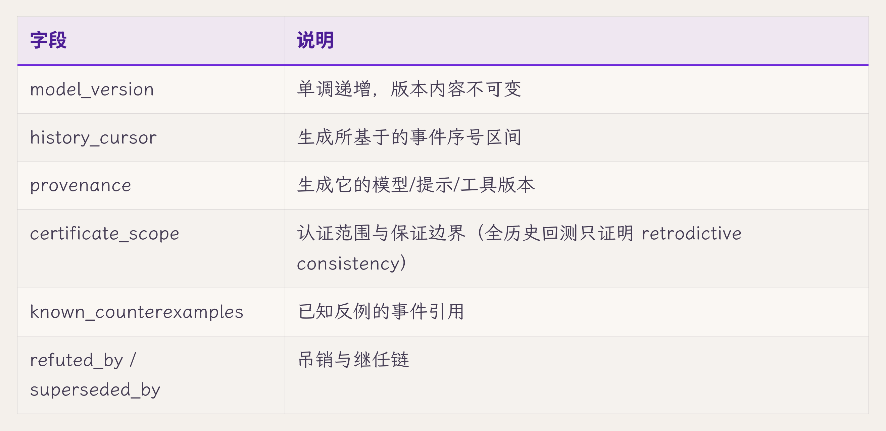

## L. 恢复语义表与 durability 选型记录

### L1. 四操作×四后果

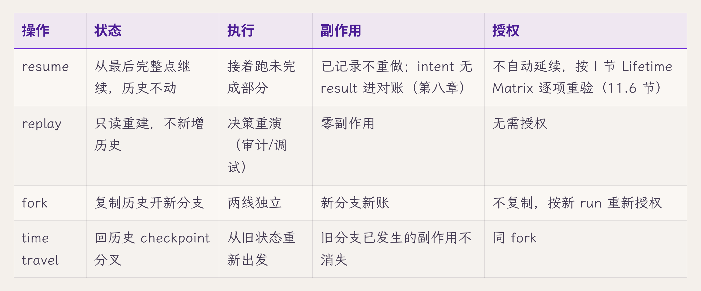

### L2. durability 选型记录

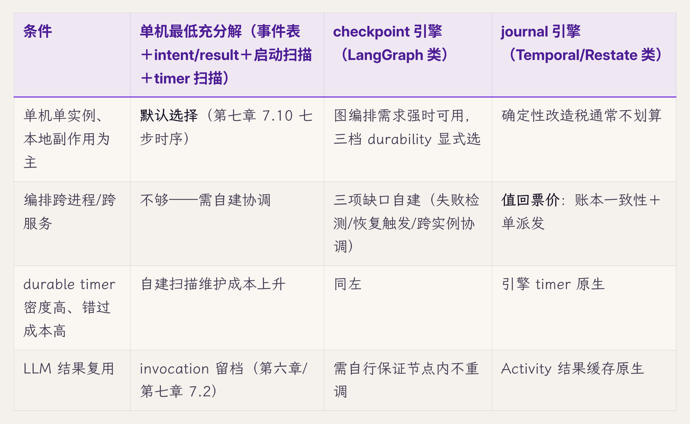

两条规则：任何一条路线都必须回答 Diagrid 提出的三个问题（失败检测、恢复触发、跨实例协调），框架不管的部分自己建；恢复过程本身也要写事件（第七章 L 级自检的要求）。

## Q. Context Assembly Spec

用法：一次 invocation 的 context 不是把历史塞进去，而是按本规格组装出的一份投影（由持久状态派生的只读视图）。评审用法：对被评系统的 context 组装逐条问：每个成分能指回哪个持久对象？按什么排序？总量控制在多少预算内？

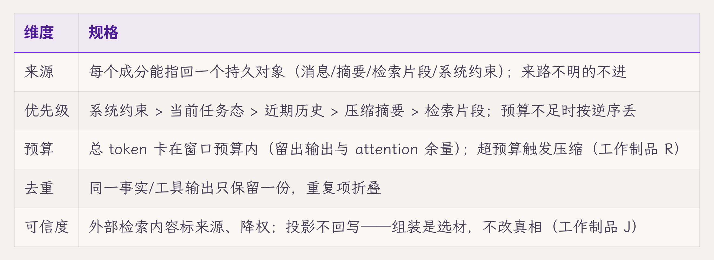

规则：组装是确定性过程，同样的持久态与同样的 policy 组装出同样的视图（resume 可重建，10.8 节）。两类时变成分不在这套版本坐标里：带 TTL 的 memory 随时间失效，JIT retrieval 拉进来的外部正文随源头改动。它们不参与 replay 一致性："同一份"承诺的范围，是版本坐标覆盖得到的那部分。系统约束不进可压缩段（工作制品 R 第三条规则）。

## R. Compaction Contract

用法：压缩是一个事务，而不只是一次摘要。四条规则逐条可检查，缺一条就会留下一类难查的错误。

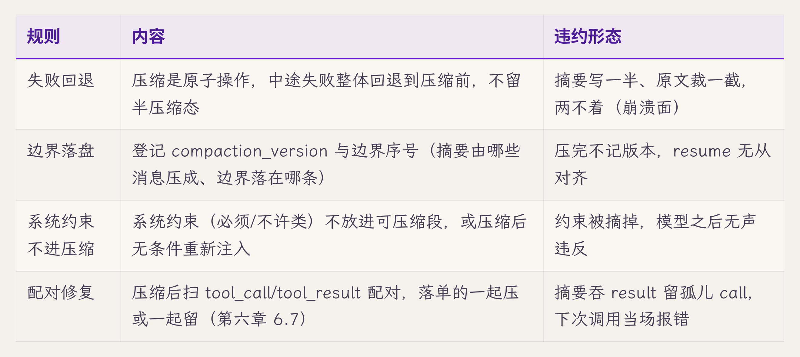

三方耦合（10.3 节）：压缩改动前缀，会打断提示词缓存（prompt cache），影响成本；resume 必须认准同一个 compaction_version（10.8 节）；压缩中途崩溃，由失败回退规则兜底。压缩只改上下文，不改历史（第六章 6.6；事务提交之前不裁剪 transcript 原文）。

## S. Memory Provenance

规则：memory 是跨会话的长期记忆，来历不明的 memory 是没人认领的真相源（附录主线二"投影不是真相"）。每条 memory 带四项信息，缺少来历的就是污染源。单机参考实现可以不实现 memory，本表是"如果做 memory，必须带什么"的契约。

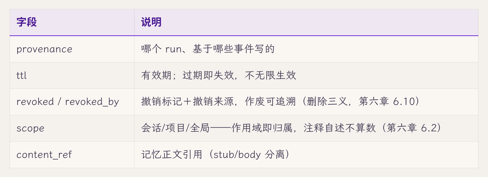

## M. Tool Contract

用法：每个有副作用的工具一份契约，填不出的栏就是缺口。本表也登记三层校验：schema 层管结构（在工具入口）、语义层管前置条件（在工具实现里）、编排层管时机（在内核）。校验放错了层，就会留下漏洞。

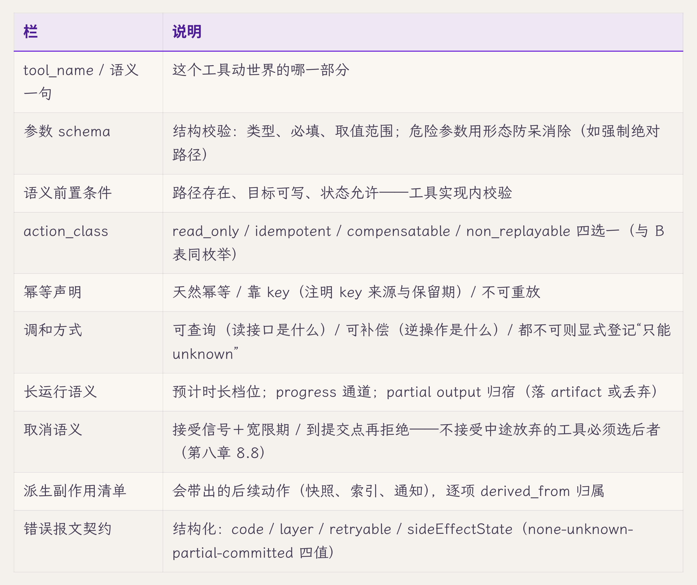

## N. Plan Lease 与 Counterexample Event Contract

规则：多步计划自带适用前提，前提失效，计划随之失效。这里借用"租约（lease）"一词，但 Plan Lease 没有过期时间，按前提是否仍然成立而失效，作用接近乐观并发校验。resume、重试、实例迁移时，不得只恢复动作队列而漏掉这项校验（第七章恢复语义）。

### N1. Plan Lease

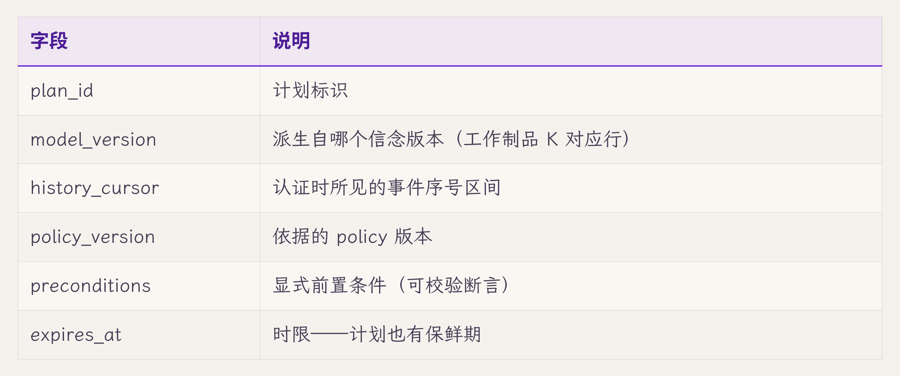

失效条件三条：任一真实 observation 与预测不符；history cursor 前移而模型未重新认证；policy/authority 变化。任一命中即废止剩余动作队列，不逐步降级执行。

### N2. Counterexample Event

信封沿用工作制品 C（事件信封）；专属字段：

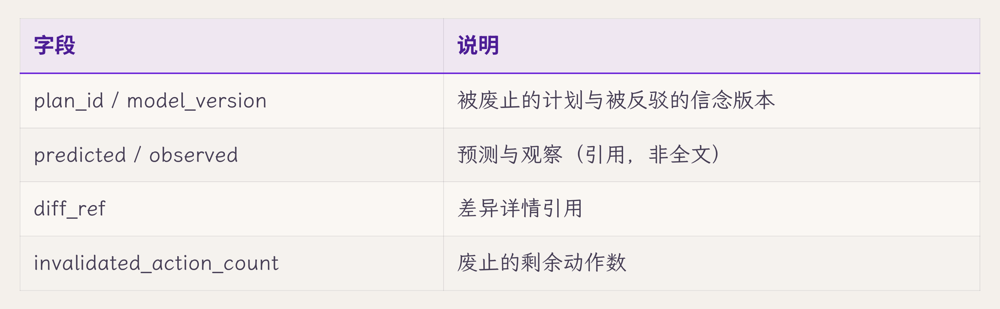

两条消费规则：反例写入工作制品 K 的 known_counterexamples 栏，可触发 refuted_by 吊销链；反例是控制流事件：写入的同时触发计划废止与重新建模，只记日志、不改控制流视为违约（第十三章的证据边会用到它）。

## O. Stream Terminal Table

用法：流式响应的每一种收尾方式一行，判"成功交付"还是"失败关闭"。规则：默认失败拦截（fail-closed），没有明确读到"成功结束"信号的，一律判失败；`finish_reason` 是模型停止原因，不是传输成功提交点，不得单凭它判成功。评审用法：拿被评系统的流逐行填写，判为成功的单元格必须指出"成功在哪一刻、凭什么信号提交"。

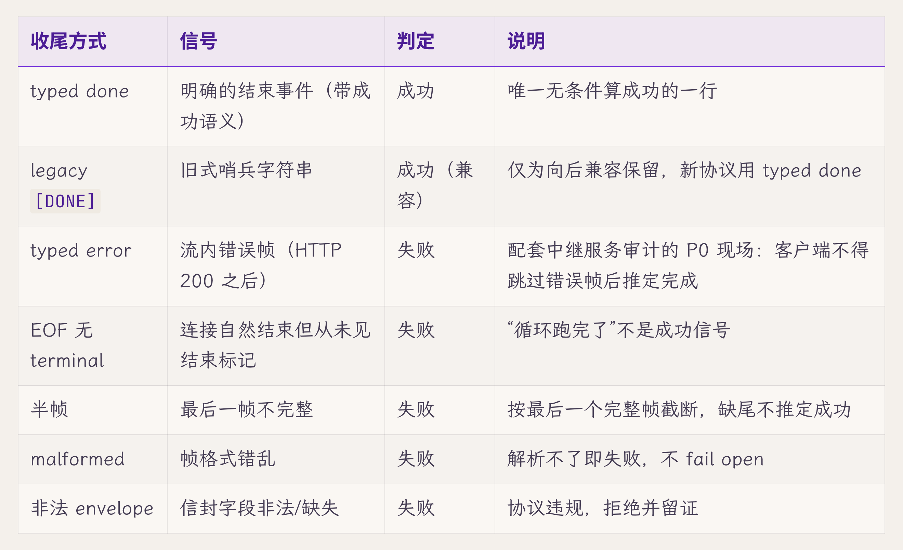

配套一条提交点规则（9.4）：传输"成功"在完整内容写入下游之后提交，不在响应头（2xx）到达时提交；熔断许可带世代号（作用即 fencing token），半开（half-open）状态只发单个探测请求。这与工作制品 B 的提交点规则、第五章 5.7 的租约（工作制品 I 的 lease 行）同构。

## P. Interaction Semantics Table

用法：四个常被混用的词各一行，写清它对 run 做什么、走第五章转移表哪一行、半轮内容去哪里。规则：disconnect 不触碰 run 状态（不进转移表）；其余三个词各对应唯一一条转移；四个词不得互相替代。

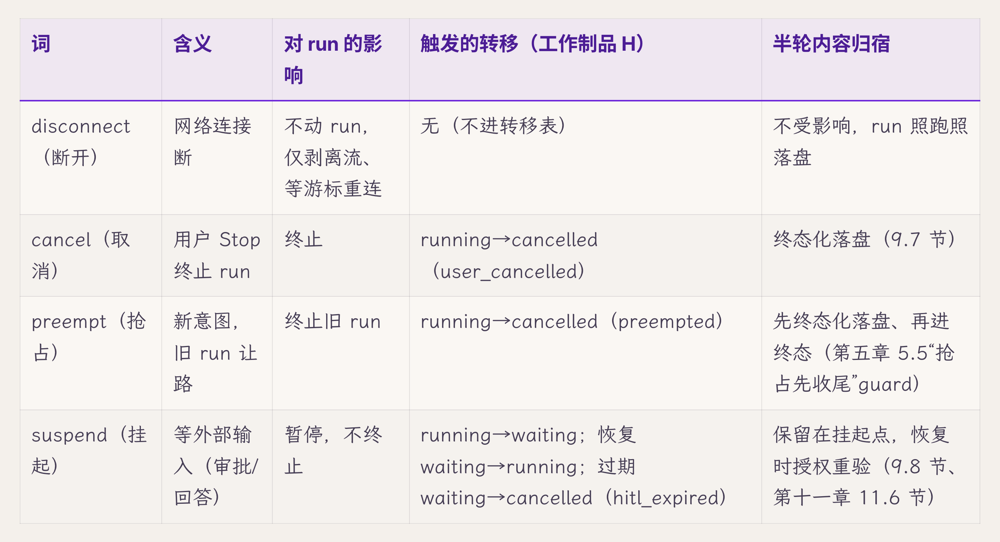

## T. Principal & Delegation Registry

用法：登记谁在行使权力、权力从谁委托来。评审用法：拿被评系统的每个动作问"哪个 principal 发起、scope 多大、谁授的、到期没"。

**principal 五类**：

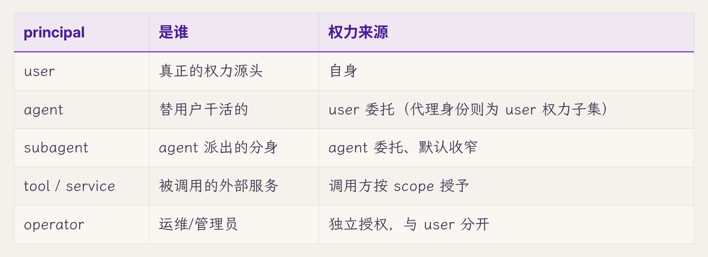

**委托记录**（每次委托一行）：

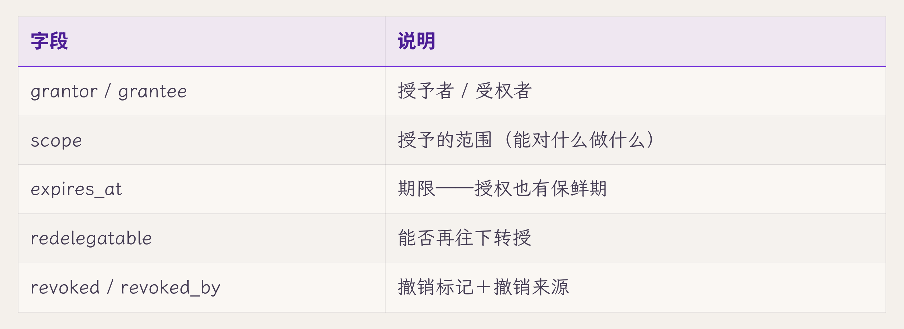

## U. Authority Lifecycle Matrix

规则：授权不随状态自动恢复。resume/fork/replay 重建状态与执行，绝不悄悄恢复旧授权；确需跨恢复保留的，显式列入本表并在变化后重验。与工作制品 I（Lifetime Matrix）的授权行同源，本表补授予与失效语义。评审用法：拿被评系统每一项跨恢复保留的授权，逐条问"它显式列进契约了吗、resume/fork 后重新验证了吗"。没列进契约、却在恢复后仍然生效的授权，就是跟着状态"搭便车"恢复的授权。

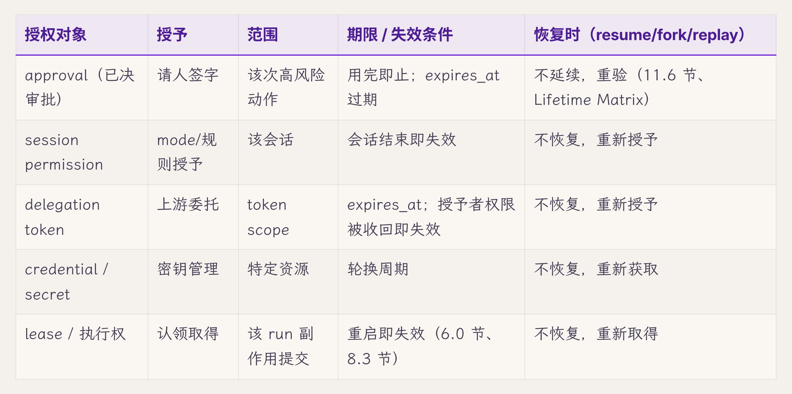

一句话概括：状态可以回滚，授权不能跟着搭便车（7.8 节：状态连续推不出授权连续）。

## V. Common-cause Failure Matrix

规则：纵深防御只在各层的执行点与失效模式相互独立时成立。本表考察的是共因失效（common-cause failure），即多层因同一个原因同时失效。逐层填写六列，共享同一个组件的层不算独立的层。评审用法：数一数被评系统的多层防御共享了几个 parser/classifier，被共享的那个就是形同虚设的底线。

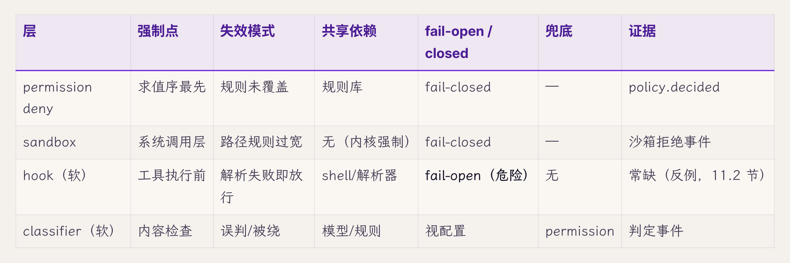

填法：标为失败放行（`fail-open`）且共享依赖不为空的层，是纵深防御里最先该补的薄弱环节。

## W. Parent-Child Run Contract

规则：subagent 就是 child run，不是一种新东西。多 agent 不引入第七类契约，而是前十一章那六份契约在父子与并行关系下的递归组合。本表逐份契约给出单 agent 形态、父子继承规则、失效反例，再补上协调专属的两项（收敛判据、输出信任）。评审用法：拿被评系统逐个单元格问"这份契约在父子之间怎么继承"，答不出的那一项，就是多 agent 下出问题的地方。

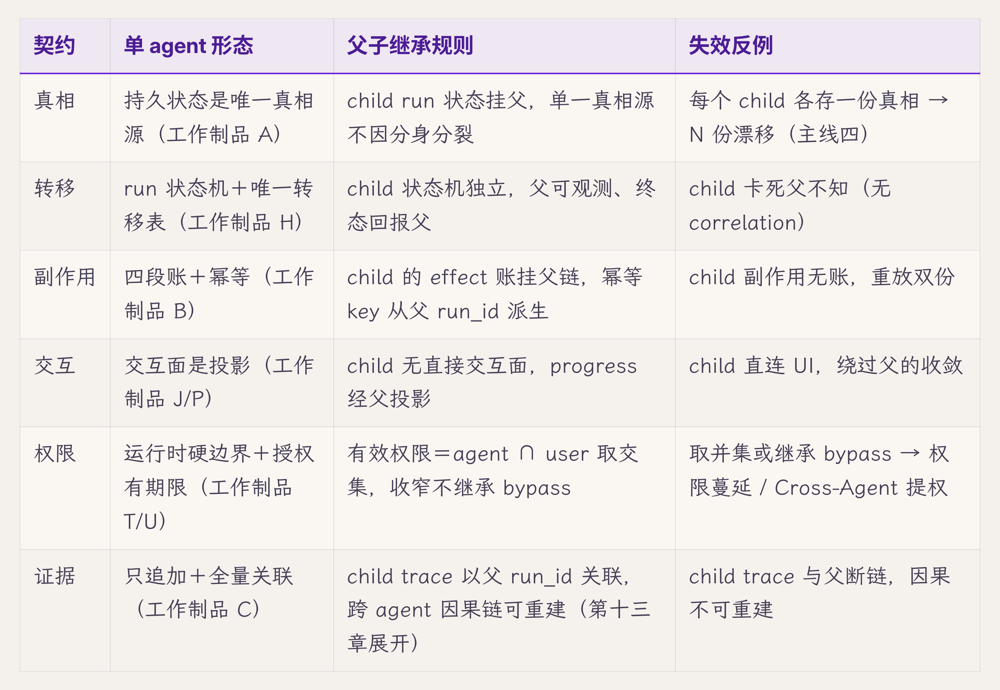

协调专属两项：

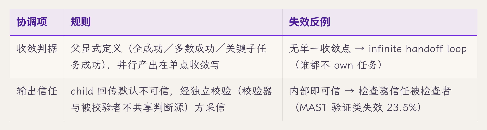

填法：六契约行中任一单元格答不出"父子怎么继承"，或协调两项缺少"单点收敛"与"独立校验"，就是多 agent 的缺口。双层控制流（节点内自治的 loop 与跨节点编排的 graph，第十二章 12.2）是本表的前提：编排层确定了，父才谈得上"可观测、可收敛、可校验"。

## X. Evidence Graph

规则：证据面是一张图。对账边回答"动作、结果、artifact、完成声明怎么对上"；认识论七边回答"系统为什么相信当前模型、什么证据推翻了它"。后者服务于可执行的 Belief/World Model（工作制品 K），不另造平行的图谱。评审用法：拿被评系统的完成声明，沿边反查到 outcome 证据；拿它的模型判断，沿边反查到 grounds 与 certifies，问 certifies 有没有 scope。

对账边（本卷新定义，不沿用入门卷的边定义）：`action --produces--> result`、`result --verified_by--> outcome`、`effect --writes--> artifact`、`claim --substantiated_by--> evidence`。入门卷 8.4 节那十条边（prompts/calls_tool/produces/verifies/scores/blocks/repairs/hands_off/supports/contradicts）登记的是跨组件、跨 cell 的可观测关系，与这四条互补；同名的 produces 在本卷收窄为 action→result，端点类型与入门卷的"组件→artifact 类型"不同。

认识论七边（用于可执行信念，即第六章 6.12 节那类把对世界的理解写成可执行程序的系统）：

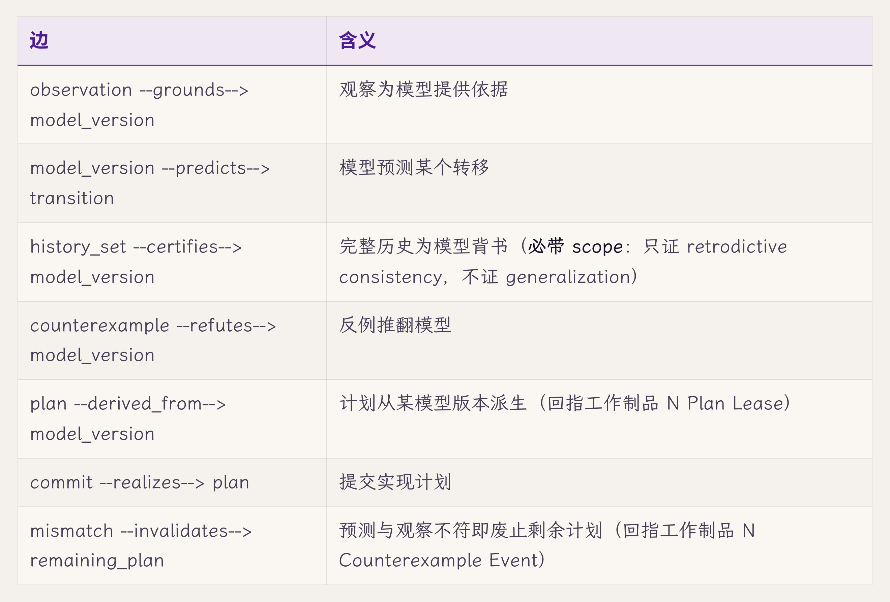

## Y. Detector Test Record

规则：报警器坏了不会响，这是证据面最隐蔽的失效。每个检测器登记一条检测器自检（sabotage validation）记录：定期喂给它已知的坏样本，验证它真的会触发。评审用法：问被评系统每个报警器"最后一次被验证确实会响是什么时候"，答不上来的按未自证处理。

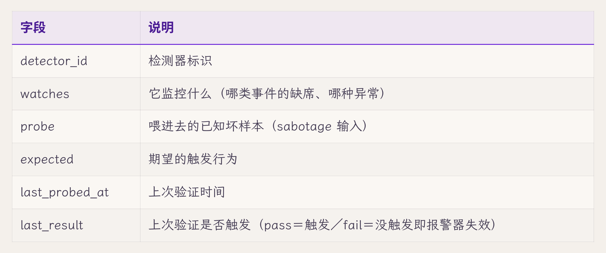

配套的缺席检测（absence detection）：为关键机制登记"期望出现的事件"，声明态与运行态对账，缺席即告警（`absence.detected` 事件，工作制品 C）。

## Z. Model Certificate

规则：用完整历史做 backtest，只能证明模型解释了已见样本（retrodictive consistency），不能证明它在未见状态上的泛化（generalization）。certificate 不接受只写 backtest=green，至少要并列五类测试＋scope。评审用法：拿被评系统的模型证书，查它有没有 held-out 与 planner-adversarial 两栏。只有 full-history replay 的证书，是把历史拟合当成了泛化。

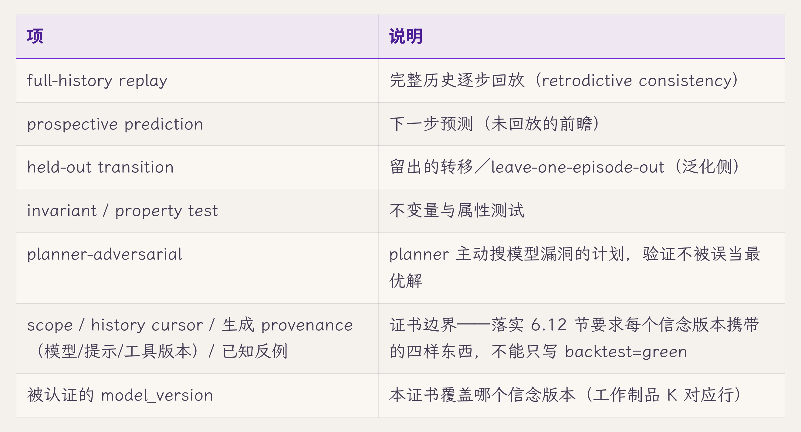

素材：一个公开的 model-based harness 项目，其公开保留的轨迹（retained trajectories）里有一个体量很大的最终 world model 和多份针对具体关卡（level-specific）的候选程序。这说明把模型写成代码带来了可检查性（inspectability），却不会自动带来最简描述或泛化能力。本书只引用该项目的公开轨迹，不引用其自述分数。

## 变更记录

| 版本 | 日期 | 变更 | 依据章节 |
|---|---|---|---|
| v1 | 2026-07-17 | 初版：Registry 15 行、Ledger 四段模型、Event 信封+24 类、Boundary 模板 | §一（原 §三，2026-07-19 架构前移重排） |
| v1.1 | 2026-07-19 | 大纲 v5.2 对齐：approval 行补 authority 不隐式恢复语义；新增 E（Entry-to-Kernel Routing Matrix）、F（Intervention Point Map）模板 | §一、§十 |
| v1.2 | 2026-07-20 | 大纲 v5.4 归属调整（§一瘦身下沉）：A 归 §五、E 归 §四、F 归 §十；文中"六不变量"表述一律读作"六契约承诺句"（行内编号为 v5.4 旧编号，v5.5 后读作：A 归 §六、E 归 §五、F 归 §十一） | 大纲 0.3/0.4、§一下沉表 |
| v1.3 | 2026-07-21 | 补记：新增 G（Component Register v1，八卡六栏＋评审用法行，随 §四 v1.0 产出） | §四 |
| v1.4 | 2026-07-21 | 新增 H（Run 状态转移表 v1，17 行＋三条表级规则；四维评审后看门狗自启动扫描行拆出为独立 failed(infra_failure) 行）；E 升 v1（意图适配/流转发两列填齐、新增 webhook 行、补 contract test 用法） | §五 |
| v2 | 2026-07-23 | A 升 v2：belief/world model 行、scope 全表规则（第三条）、三条裁决注（attempt 不设实体/三样不设表/lease 不入表）；新增 I（Lifetime Matrix v1）、J（Projection Contract v1）、K（Belief/World Model Registry v0 模板） | §六 |
| v2.1 | 2026-07-23 | 新增 L（恢复语义表 L1 四操作×四后果＋L2 durability 选型记录） | §七 |
| v2.2 | 2026-07-23 | B 升 v2：新增 action_class（v1 risk_class 细化）/derived_from_effect_id/committed_under 三字段、不变量 5→8（提交点校验/派生归属/zombie trace）、四类处置表并入（Reconciliation Table 归此）；新增 M（Tool Contract v1）、N（Plan Lease 与 Counterexample Event Contract v1）。四维评审后修正：reconciliation_status 枚举补 queried 并与处置表终局列统一、状态机补"result 与 outcome 不符"第二异常分支、A 表 artifact 行两向对账指针补 §8.10 主场 | §八 |
| v2.3 | 2026-07-23 | 新增 O（Stream Terminal Table v1，流终结真值表七行＋提交点规则）、P（Interaction Semantics Table v1，四词×对 run 影响×转移×半轮归宿）；A 表 message/approval 两行的 §9.7/§9.8 裁决在第九章正文落实 | §九 |
| v2.4 | 2026-07-23 | 新增 Q（Context Assembly Spec v1）/R（Compaction Contract v1，四规则）/S（Memory Provenance v1）；A 表 compaction 摘要行裁决不独立表＋补 compaction_version 字段、memory 行由占位实化为契约形态（owner/字段/撤销语义，指向 S 节） | §十 |
| v2.5 | 2026-07-23 | 新增 T（Principal & Delegation Registry v1）/U（Authority Lifecycle Matrix v1，主线五收口）/V（Common-mode Failure Matrix v1）；D 填充（Runtime Trust Boundary v1，七边界）、F 填充（Intervention Point Map v1，三干预点＋证据列）；A 表 policy decision 行裁决并入 events、补 principal＋enforcement point 字段 | §十一 |
| v2.6 | 2026-07-24 | 新增 W（Parent-Child Run Contract v1，父子 run 契约表：六契约×单 agent 形态/父子继承规则/失效反例＋收敛判据与输出信任两项协调专属），即 subagent=child run、契约沿父链继承的登记形态 | §十二 |
| v2.7 | 2026-07-24 | C 升 v2：correlation 八级补全（信封加 invocation_id/effect_id/artifact_id，child 事件带父 run_id ，落实第十二章的跨 agent 因果链）＋新增 detector/certificate 事件（detector.probed/absence.detected/certificate.issued/model.refuted）；新增 X（Evidence Graph v1，对账边＋认识论七边）/Y（Detector Test Record v1，检测器 sabotage 验证）/Z（Model Certificate v1，五类测试＋scope，backtest 绿≠泛化） | §十三 |
| v2.8 | 2026-07-26 | I 表补 prompt asset 两行：塑形片段随 checkpoint 记版本号或内容哈希、按记录版本重建（状态生命周期），系统约束片段不保存不恢复、恢复时取当前版（授权生命周期）；A 表 invocation 行 prompt_asset_ref 相应补版本要求。落实 §10.8 新列的第三类时变成分处置 | §十 |
| v2.1 | 2026-07-27 | 出版清理：26 个节标题剥离编辑过程括注（交付章/升版史/大纲下沉）与 v0/v1/v2 版本后缀，L1 小节同款；交付章与版本信息由节号目录（tb-90-1）与各章正文承载；tb-90-1 交付章列同步去"（v5.4 自第一章下沉）"编辑语 | 用户 2026-07-27 裁决（附录标题含审核内容与版本） |
