# 附录 · 第二卷速查与图解

> 本附录是查阅型速查工具，供按需翻查，不替代正文讲解。与 `90-artifacts.md` 分工：那份是给评审直接取用的**登记表/合同全文**（工作制品 A–Z，字段级），本附录是给读者的**导览与线索**：方法论主线怎么串、术语什么意思、探针盯哪个字段、哪张图回答哪个问题。
> 覆盖范围：一、概念主线索引与五、配图导览覆盖全卷；二、术语速查的图片表收录第一至九章，第十至十五章以文字表补充；三、探针与观测点、四、字段字典导览目前收录到第九章。

---

## 一、概念主线索引

这本书的许多论点不在单章里，而在贯穿多章的线上。正文里这些线以前后呼应的句子散落在各章：第五章会写"第一章在语义层见过同样的问题，这里是它在转移层的版本"，第八章会写"第一章的'重试无害'默认假设，落到工具层就是这三条共同作用的结果"。顺着读时它们是散点，本节把散点连成线。每条线给出一句主张、它在各章的位置，以及一句要点。

读法：查一条线，看它在你正在读的这一章处于什么位置、上游从哪来、下游往哪去。

### 主线一 · 写了 ≠ 接通 ≠ 生效（假落地）

> 要点：**项目里有名字（L1 在），trajectory 里没事件（L2 缺），假落地嫌疑高**。能观测到才算真正实现，L2 只认事件记录，不认口头声明。

这是全书的元方法：所有"机制到底做没做到"的判断都回到这条线。它也是卷级坐标系中"可观测"一项的具体操作方法。它从第一章的一条诊断公式出发，到第十三章 13.6 变成了两项运行时机制：缺席检测（期望的事件没出现就告警）和检测器自检（定期喂坏样本，确认报警器还会响）。六条线里，只有这一条从"判断方法"变成了"机制"。

### 主线二 · 投影不是真相

> 要点：**真相一份，投影任意多份，多出来的每一份"真相"都是未来的事故**（第六章 6.3）。

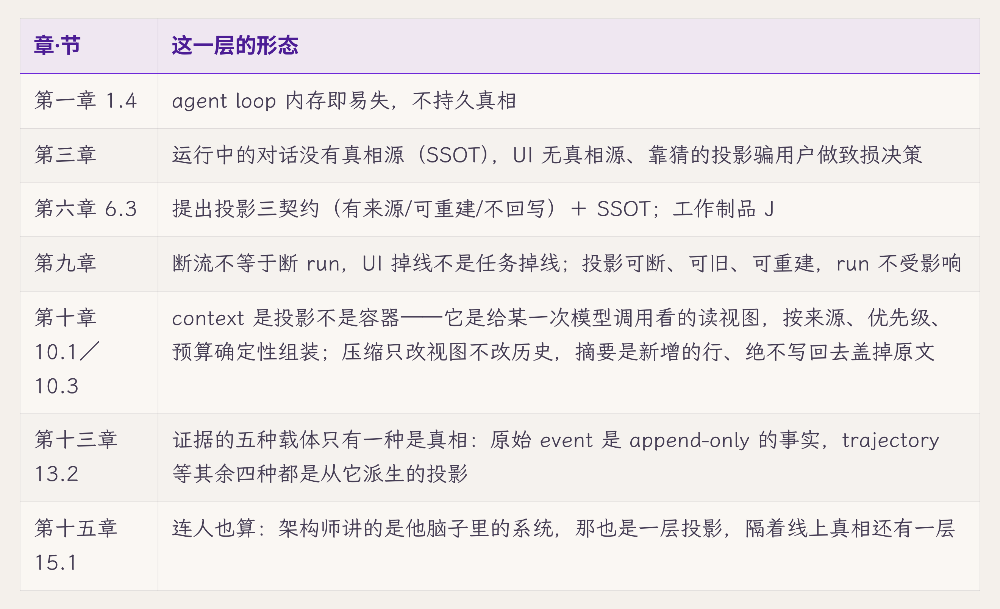

这条线是真相契约的核心，从"状态记在哪"（第六章）一路铺到"交互面怎么不破坏真相"（第九章）、"压缩怎么不把投影改成真相"（第十章）、"哪一种证据载体才算事实"（第十三章），最后连评审时架构师的口头介绍也被看作一种投影（第十五章）。

### 主线三 · 成功在哪一刻算数（提交点与独立证据）

> 要点：**成功的提交点要往后挪，挪到有独立证据为止**（第九章 9.4）。

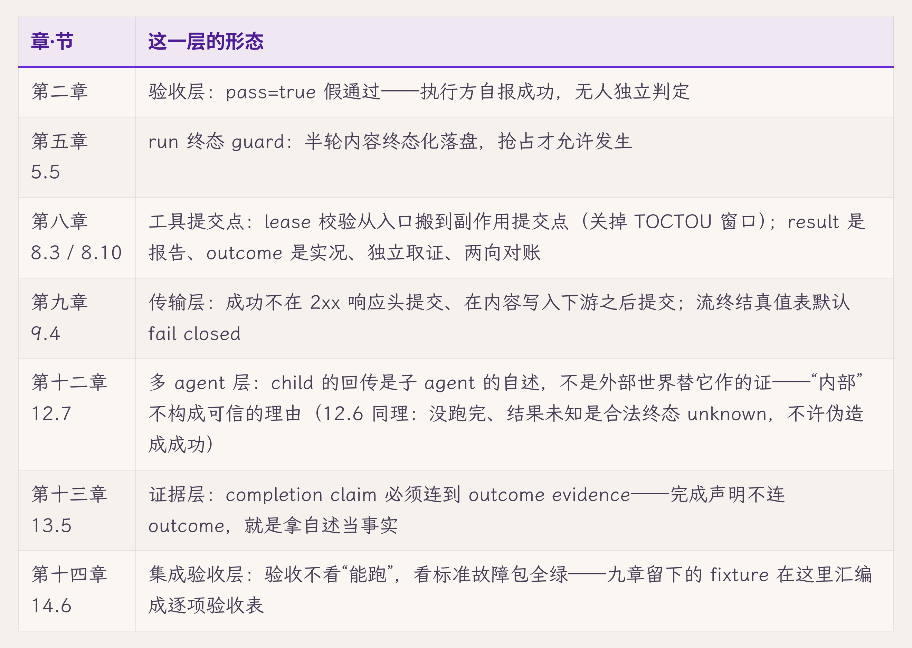

同一个道理在七个层面重复出现：验收、转移、工具、传输、多 agent、证据、集成验收。谁报告成功都不算数，要往后挪到有独立证据的那一刻才提交。这条线贯穿转移、副作用、证据三份契约。

### 主线四 · 同一语义实现 N 份就漂移成 N 种（单写者/唯一路径）

> 要点：**每种语义只实现一次，收进唯一路径**（第一章 1.4"同一种语义实现了 N 份，就会漂移成 N 种"）。

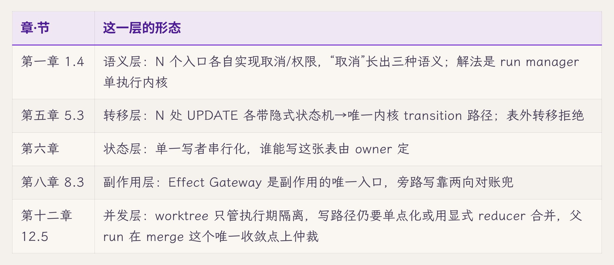

这是卷级坐标系中"可控"一项在结构上的体现：控制点集中到一处，机制才只有一份，只需验证一次。并发把这条原则推到了极限：第十二章要求父 run 作为唯一的汇合点，父因此成了瓶颈。到这里，"集中到一处"本身第一次带来了明显的代价。

### 主线五 · 状态连续推不出授权连续（authority lifecycle）

> 要点：**恢复状态不等于恢复授权，授权要重新验证**（第七章 7.8"state continuity 推不出 authority continuity"）。

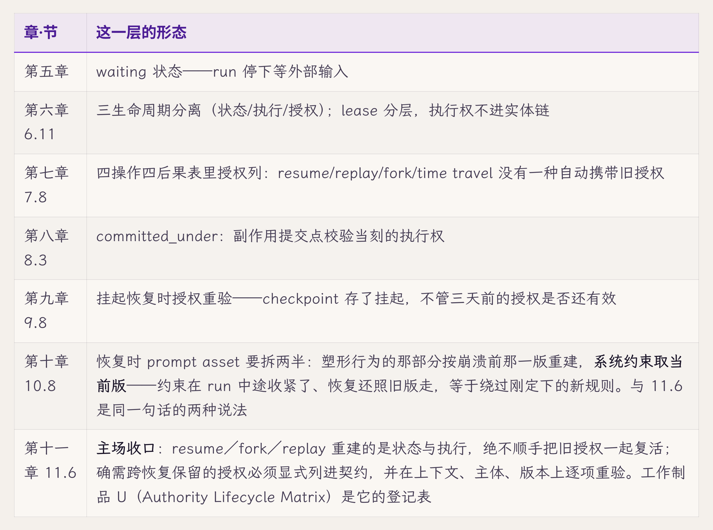

这条线针对的是"崩溃、挂起、分叉之后恢复时，把旧授权一起恢复"这一类缺陷。第七章 7.8 提出这条原则，第十一章 11.6 做完整处理，其余五章各补上一个恢复入口。

### 主线六 · "重试无害"默认值的失效（副作用与幂等）

> 要点：**跨出进程边界，重试就可能重复；幂等从基础设施的赠品变成每一步的显式义务**（第一章 1.1）。

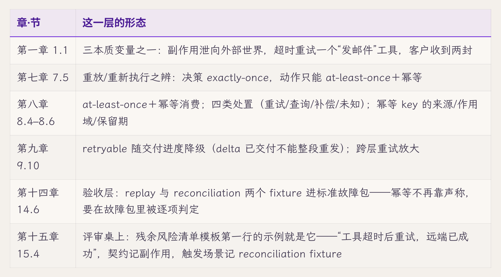

从提出变量（第一章），到副作用账本的实现（第八章）、传输层降级（第九章）、进入标准故障包逐项判定（第十四章），最后成为评审清单的第一行（第十五章）。这是同一个默认值失效后的完整补救链，到了链的末端，别人已经可以拿它去评审系统。

并不是每章都落在每条线上。例如第十一章不在主线四上，第十二章不在主线一上，下图中对应位置留空。

*图 附.1 · 六条概念主线各自穿过哪几章：有站的是形态，空着的是没经过*

---

## 二、术语速查

概念词的一句定义＋定义所在章＋关联。**代码/schema 字段级的完整定义在 `90-artifacts.md`**（本节"关联"列指过去），这里只给"是什么、在哪章定义"。按主题分组，组内按出现顺序排列。

**坐标系与方法（第一至三章）**

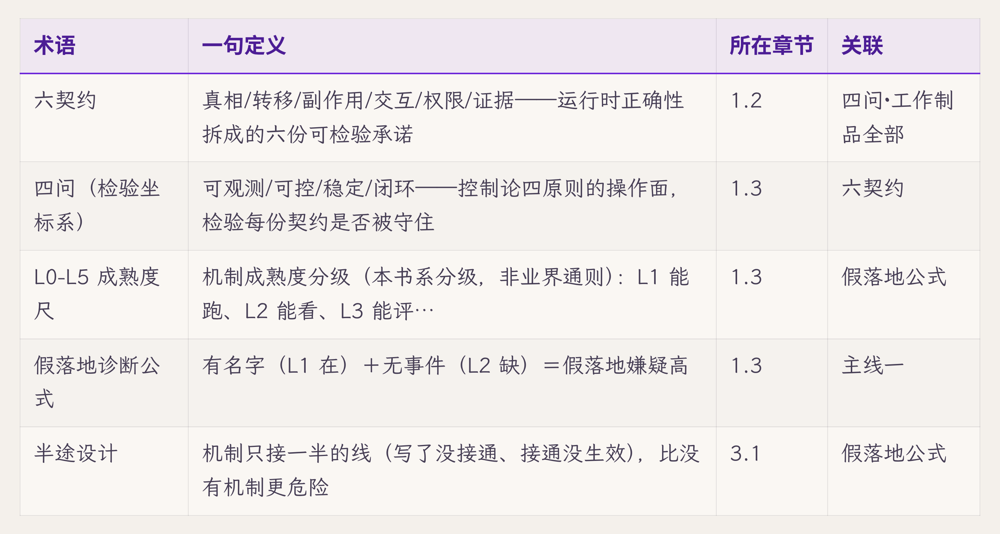

**状态与持久化（第五至六章）**

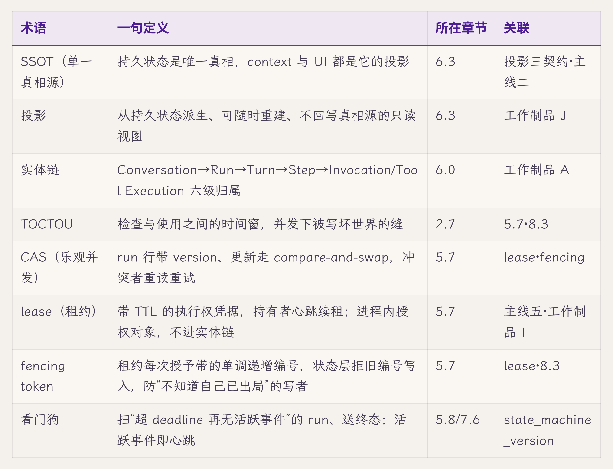

**执行、副作用与恢复（第七至八章）**

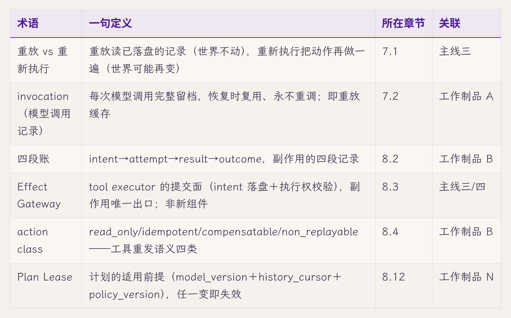

**交互（第九章）**

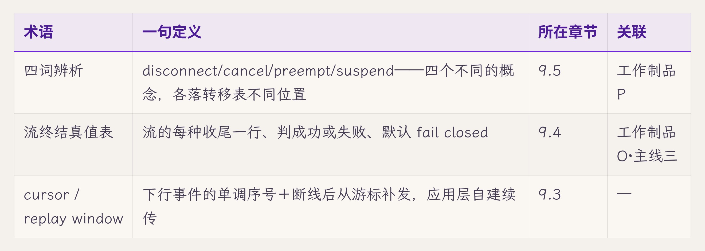

**第十至十五章术语补充**

| 概念 | 一句定义 | 所在章节 |
|---|---|---|
| 压缩契约（Compaction Contract） | 把 compaction 当作事务处理：要么完整生效，要么完整回退；四条规则为失败回退、边界落盘、系统约束不入压缩、tool_call 与 tool_result 配对不拆 | 第十章 10.3、10.4；工作制品 R |
| memory 来历（Memory Provenance） | 每条跨会话记忆必须带四项：provenance（哪个 run、基于什么事件写的）、TTL、撤销标记、scope；来历不明的记忆是没人认领的真相源 | 第十章 10.5；工作制品 S |
| 五平面 | 八个组件按"谁有权持有什么"分成交互面、控制面、执行面、状态面、证据面，每个平面配一张"绝不持有"清单，平面之间有四条依赖禁令 | 第十一章 11.7 |
| 协调面 | 多 agent 首先带来的协调工作：接口怎么对、边界在哪、什么时候算完、回传的结果信不信；它先于"更多智能"出现，也是多 agent 失效的主要来源 | 第十二章 12.1 |
| subagent＝child run | 子 agent 按一次子 run 处理：有自己的状态机、实体链中的记录与 correlation 规则，权限按第十一章收窄，以父 run_id 关联回父 run | 第十二章 12.1 |
| 双层控制流 | 节点内由 agent 自治的 loop（决定下一步调哪个工具、何时停），与跨节点由父编排的图（决定 spawn 谁、等谁、怎么合并结果）；两层的判断标准不同，不能混为一层 | 第十二章 12.2；工作制品 W |
| 证据面（Evidence Plane） | 系统为事后核查留下的全部记录，作为架构中单独设计的一层：只装不可争议的事实，只追加，与执行面分开 | 第十三章 13.1 |
| 先观察，后解释（Observe First, Interpret Later） | 热路径上只写不可争议的事实，解释放到离线，由 reducer 从事件重新计算；解释错了可以重跑，事实不被改动 | 第十三章 13.2 |
| correlation（本书用法） | 一组八级层级 ID（tenant、conversation、run、turn、step、invocation、effect、artifact），全量冗余写进每条事件，允许为空的层显式置空；业界常说的 correlation ID 通常只是其中一个 | 第十三章 13.3；工作制品 C |
| reducer（两义） | ① 事件溯源中的投影函数（fold），把事件序列折叠成状态或解释，第十三章 13.2 用此义；② LangGraph 的合并 reducer，合并并发写入同一状态的函数，第十二章 12.5 用此义 | 第十二章 12.5、第十三章 13.2 |
| 缺席检测（absence detection） | 为关键机制登记"期望出现的事件"，把声明态与运行态对账，事件缺席即告警 | 第十三章 13.6；工作制品 C、Y |
| 检测器自检（sabotage validation） | 定期给检测器喂已知的坏样本，验证它真的会触发，结果记入检测器测试记录 | 第十三章 13.6；工作制品 Y |
| 认识论七边 | 可执行信念的七条证据边：grounds（依据）、predicts（预测）、certifies（背书）、refutes（推翻）、derived_from（派生）、realizes（实现计划）、invalidates（废止计划） | 第十三章 13.8；工作制品 X |
| Model Certificate | 可执行信念模型的证书：不能只写 backtest=green，至少并列五类测试（full-history replay、prospective 下一步预测、held-out 转移、invariant 属性测试、planner-adversarial），外加 scope、history cursor、生成溯源信息与已知反例 | 第十三章 13.8；工作制品 Z |
| 标准故障包 | 第五至十三章各章破坏实验留下的预置故障用例（fixture）汇编成的一套验收，逐项判定 runtime 在故障下是否守住六契约；验收看它是否全绿，而不是 happy path 能不能跑 | 第十四章 14.6 |
| 残余风险清单 | 评审的产出物：每条风险记清踩的是哪份契约、在哪个场景下暴露、谁负责补、什么时候补；它替代"通过/不通过"的二元判决 | 第十五章 15.4 |

三卷共用的术语约定（译名、借用术语的本书用法、自造概念的定义）见仓库根目录的 [`术语对照表.md`](../术语对照表.md)。

---

## 三、探针与观测点

"想验证某个机制、该盯哪个字段/事件"的集中表。三类合一，按用途分类：

- **破坏实验探针**：每章破坏实验的观测点（破坏动作→盯什么→判定）。
- **诊断/复现探针**：事后查案、复现事故用（第三章"探针测试"一路）。
- **运行时探针**：生产可观测点，即各机制 emit 的事件（即 L2"能看"所要求的事件，全量事件类型见工作制品 C）。

> 破坏实验探针表覆盖第五至九章；诊断与运行时两类探针只给说明与示例。

**破坏实验探针**

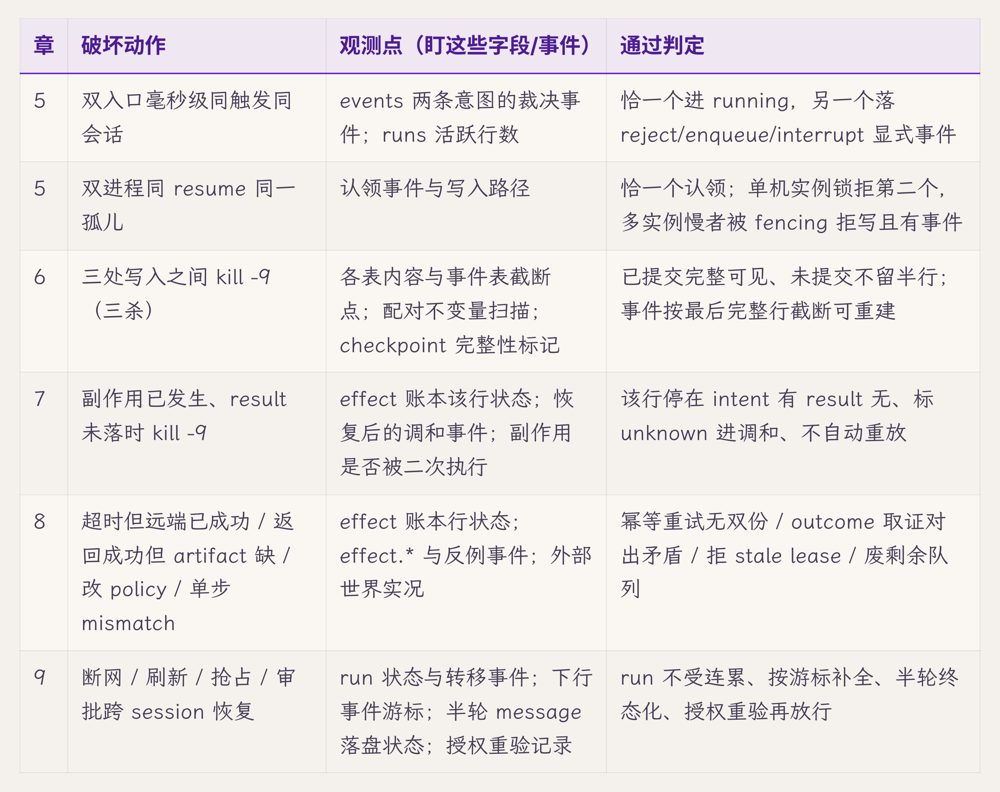

**诊断/复现探针**：系统当时没记的东西，事后靠读代码推演＋探针测试复现（第三章十帧表即如此重构）。查案的依据是**缺失证据清单**，即事故调查需要、系统当时给不出的字段（第三章列了五条：意图落盘记录、抢占事件、跳过持久化的痕迹、导航/断开事件、内容快照）。这类探针的产物应当反过来变成运行时探针的需求（第十三章详细讨论）。

**运行时探针**：即各机制在正常运行时发出（emit）的事件，如 run.state_changed、step.completed、effect.intended/result_recorded、approval.requested 等，恢复扫描的关键锚点带 `*`。全量事件类型与信封字段见工作制品 C（Event Schema）。L2"能看"的底线就是这些探针齐全。

---

## 四、字段字典导览

字段级的**完整定义已在 `90-artifacts.md`**，本节只做导览，指明去处，不复制内容。查某个字段是什么，按下表跳转对应工作制品。

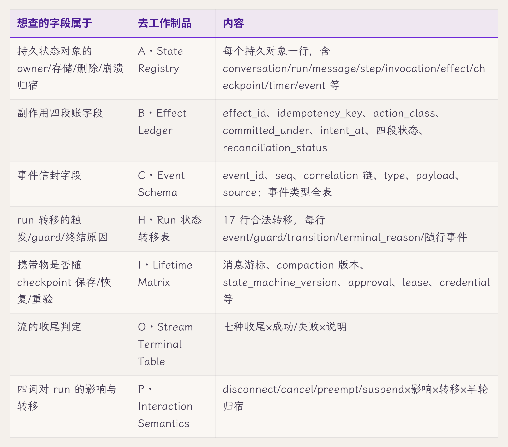

跨表通用字段（每个登记表都带）：`schema_version`（每行必带）、correlation 父链外键（除顶层外每行带、允许为空的层显式置空）、`scope`（会话/项目/全局，作用域即归属）。这三条是工作制品 A 的三条全表规则，适用于所有登记表。

---

## 五、配图导览

全卷三十四张图，按出场顺序排。这张表不给页码，页码见书前的图目录；这里给的是**每张图替你回答了什么、它对应哪个工作制品**，需要某个答案时可以直接翻到那一张。

分两类：**核心**是每章最该记住的那张图，每章一张；**补充**是同一章里为某个难点单独画的图，略过不影响主线。

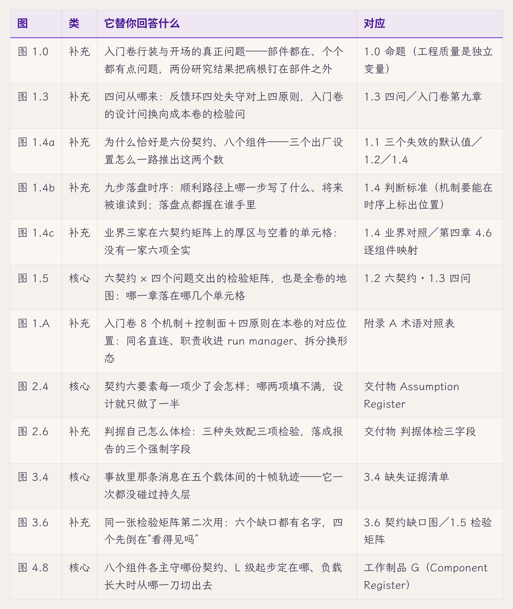

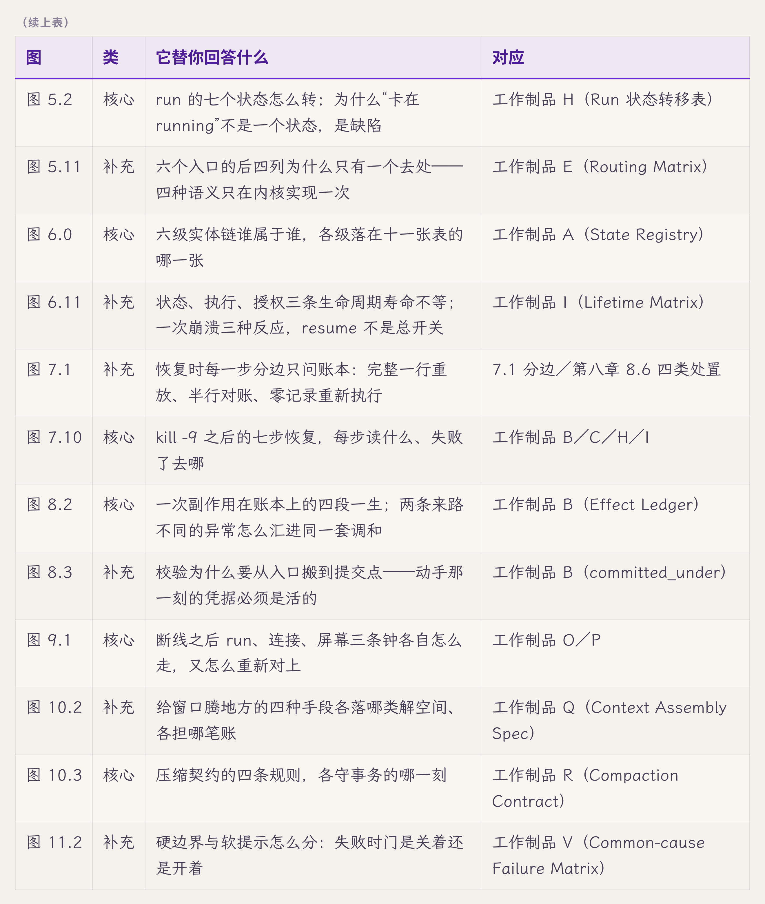

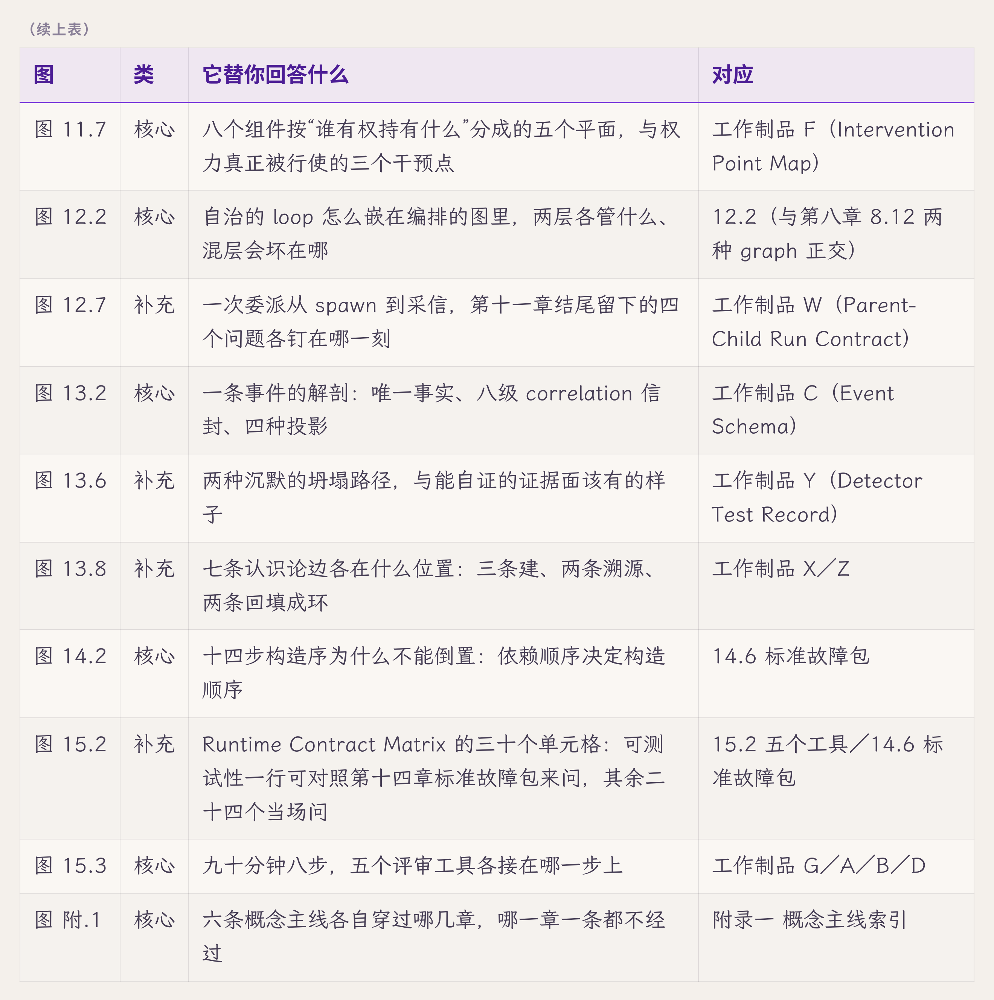

有两处"表本身就是图"，不另画：9.4 流终结真值表、9.5 交互语义表。它们的价值在于逐行填写，画成图反而没法这样用。

---

## 变更记录

| 版本 | 日期 | 变更 |
|---|---|---|
| v1（骨架） | 2026-07-23 | 建卷二参考附录。一、概念主线索引（六条，落点核准）＋五、图表清单（第一至九章配图占位全表）做全；二、术语速查／三、探针与观测点／四、字段字典导览立形态＋样张＋维护规则，待用户审形态后批量填满第一至九章、并随第十至十五章增量 |
| v2 | 2026-07-26 | 用户裁决两批。**一、概念主线索引回填至全卷**（第十至十五章共 14 站；主线五原"第十一章 主场（前向）"实指成 11.6 收口＋工作制品 U；六条收敛句尾同步扩写；维护规则加"落不上就照实留空"），并新增图 附.1 六条主线穿章图。**五、图表清单按方案 B 换工作，改名"五、配图导览"**：原节是出图前的工单形态（"正文各章的图当前均为（配图占位）""供成稿时统一制作"＋一条自指的 jimi-ink 清除指令），h2 之后的引用块管线剥不到、会原样印给读者；且与 PDF 自动图目录重复。改为逐图的用途索引——图号／档（核心 vs 补充）／它替你回答什么／接哪件工作制品，共 17 行；顺带修掉旧表的 1.0 挂节、1.4 作废行、4.8"数据流向"、8.2 `outcome_verified` 四处失真。L3 自我描述"图在哪"→"哪张图答哪个问题"，覆盖声明同步 |
