# 附录 · 卷二速查与图解

> 本附录是查阅型速查工具，供按需翻查，不替代正文讲解。与 `90-artifacts.md` 分工：那份是给评审直接取用的**登记表/合同全文**（工作制品 A–Z，字段级），本附录是给读者的**导览与线索**——方法论主线怎么串、术语什么意思、探针盯哪个字段、哪张图答哪个问题。
> 覆盖范围：随各章过审增量维护。**一、概念主线索引与五、配图导览已覆盖全卷**（2026-07-26 回填／改形态）；二、术语速查／三、探针与观测点／四、字段字典导览目前收到第九章（维护规则见各节末）。
> 出版形态：书末附录，排在工作制品汇编之后。
> **概念图解形态（2026-07-23 定）**：卷二核心概念用"图＋前因后果（场景／症结／机制／结果）"的卡片呈现，形态样张见 `concept-diagram-sample.html`（投影不是真相／四段账／fencing 编号三例）。**PDF 出版阶段**按此把核心概念逐个图解化、统一细化；markdown 写作阶段不铺开画图。下方"二、术语速查"是同批概念的文字索引版，与图解卡片以概念为单位对应。

---

## 一、概念主线索引

这本书的许多论点不在单章里，而在贯穿多章的线上。正文里这些线以"接力句"的形式散落——第五章会写"第一章在语义层见过同款病，这里是它的转移层版本"，第八章会写"第一章的'重试无害'默认值，落到工具层就是这三条的合谋"。顺读时它们是散点，本节把散点连成线。每条线给一句主张、各章的落点、一句收敛。

读法：查一条线，看它在你正读的这章落在哪一格、上游从哪来、下游往哪去。

### 主线一 · 写了 ≠ 接通 ≠ 生效（假落地）

> 收敛：**项目里有名字（L1 在），trajectory 里没事件（L2 缺），假落地嫌疑高**。能观测才算落地，L2 的账不认口头声称。

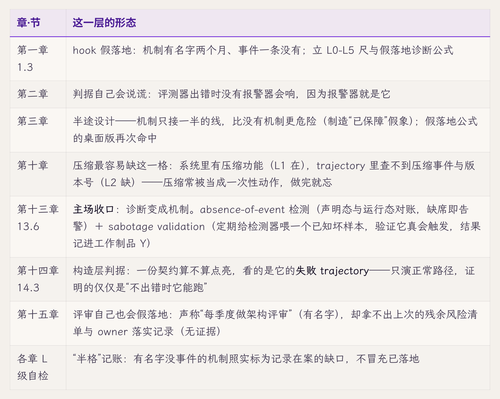

这是全书的元方法：所有"机制到底做没做到"的判断都回到这条线。它也是卷级坐标系"可观测"格的操作化。从第一章的一条诊断公式，到第十三章 13.6 把它做成两台机器——这是六条线里唯一一条从"判断法"变成"机制"的。

### 主线二 · 投影不是真相

> 收敛：**真相一份，投影任意多份，多出来的每一份"真相"都是未来的事故**（第六章 6.3）。

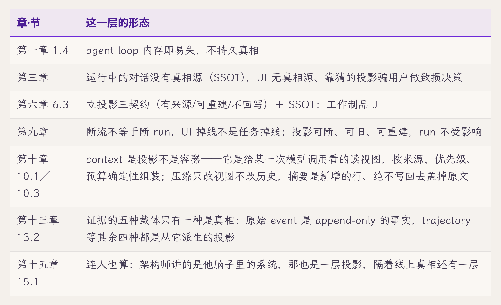

这条线是真相契约的核心，从"状态记在哪"（第六章）一路铺到"交互面怎么不破坏真相"（第九章）、"压缩怎么不把投影改成真相"（第十章）、"哪一种证据载体才算事实"（第十三章），最后连评审桌上那位架构师的口述也被归了位（第十五章）。

### 主线三 · 成功在哪一刻算数（提交点与独立证据）

> 收敛：**成功的提交点要往后挪，挪到有独立证据为止**（第九章 9.4）。

同一个道理在七个层面复演——验收、转移、工具、传输、多 agent、证据、集成验收：谁报告成功都不算数，往后挪到有独立证据的那一刻才提交。这条线统摄转移、副作用、证据三份契约。

### 主线四 · 同一语义实现 N 份就漂移成 N 种（单写者/唯一路径）

> 收敛：**每种语义只实现一次，收进唯一路径**（第一章 1.4"同一种语义实现了 N 份，就会漂移成 N 种"）。

这是卷级坐标系"可控"格的结构形态：控制点收敛到一处，机制才只有一份、只需验一次。并发把它逼到最紧的一档——第十二章那个唯一收敛点让父成了瓶颈，这条线到这里第一次要为"收敛"本身付账。

### 主线五 · 状态连续推不出授权连续（authority lifecycle）

> 收敛：**恢复状态不等于恢复授权，授权要重新过一遍**（第七章 7.8"state continuity 推不出 authority continuity"）。

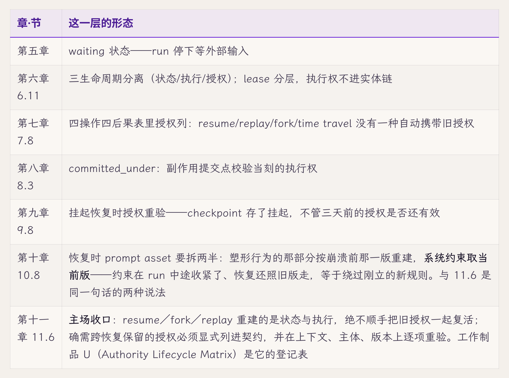

这条线专治"崩溃/挂起/分叉恢复后把旧授权一起搭车恢复"这一族缺陷。第七章 7.8 立铁律、第十一章 11.6 收口，其余五站各补一个恢复入口。

### 主线六 · "重试无害"默认值的失效（副作用与幂等）

> 收敛：**跨出进程边界，重试就可能重复；幂等从基础设施的赠品变成每一步的显式义务**（第一章 1.1）。

从"变量提出"（第一章）到"账法落地"（第八章）、"传输层降级"（第九章）、"进故障包被逐格判定"（第十四章），最后落到评审清单的第一行（第十五章）——同一个默认值失效后的完整补救链，末端已经能被别人拿去审。

**维护规则**：新过审的章，逐条问它有没有落在以上六条线的某一格——有则补一行（章·节＋该层形态）；若它开出一条前六条容纳不下的新贯穿线（≥3 章承重），才新增一条主线，不为单章现象立线。**不是每章都落在每条线上**，落不上就不补——2026-07-26 回填第十至十五章时，第十一章没有落在主线四、第十二章没有落在主线一，都照实留空。

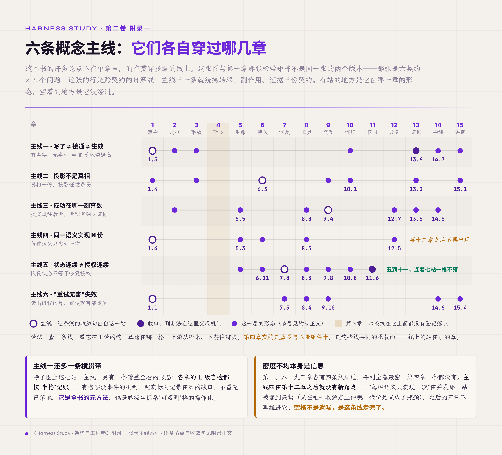

*图 附.1 · 六条概念主线各自穿过哪几章：有站的是形态，空着的是没经过*

---

## 二、术语速查

概念词的一句定义＋定义所在章＋关联。**代码/schema 字段级的完整定义在 `90-artifacts.md`**（本节"关联"列指过去），这里只给"是什么、哪章立的"。按主题分组，组内按出场序。

> 形态样张（覆盖第一至九章核心术语；全量填充待用户确认形态后批量补）。

**坐标系与方法（第一至三章）**

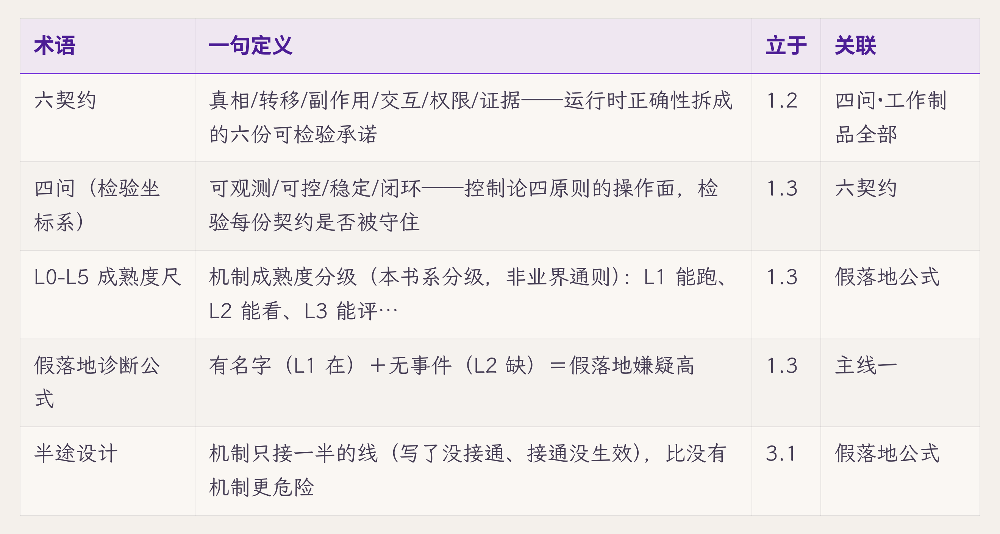

**状态与持久化（第五至六章）**

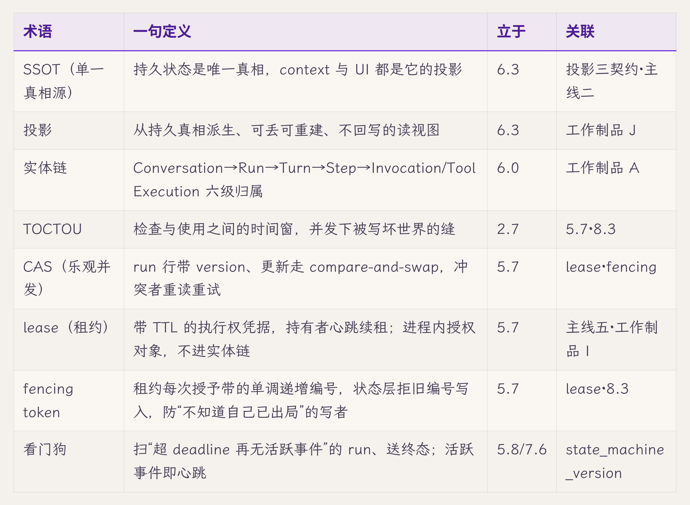

**执行、副作用与恢复（第七至八章）**

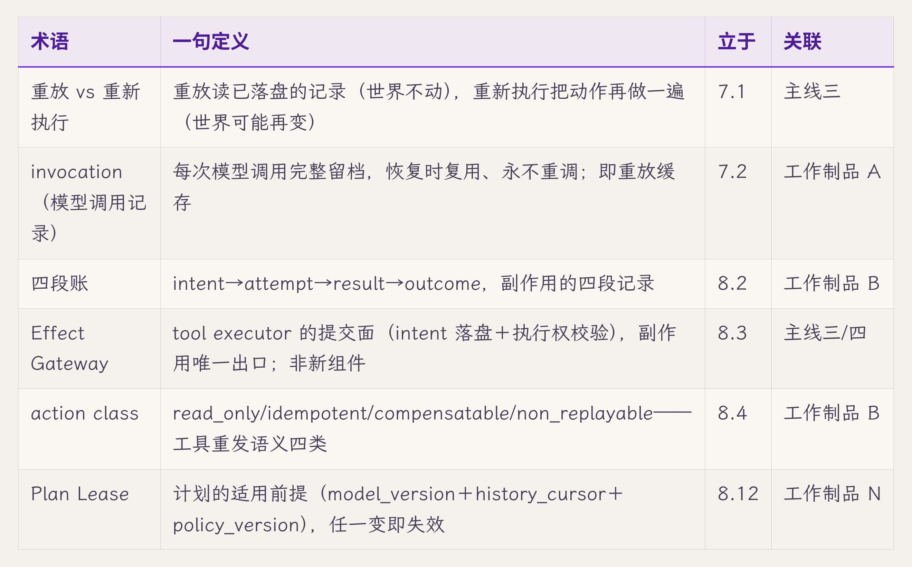

**交互（第九章）**

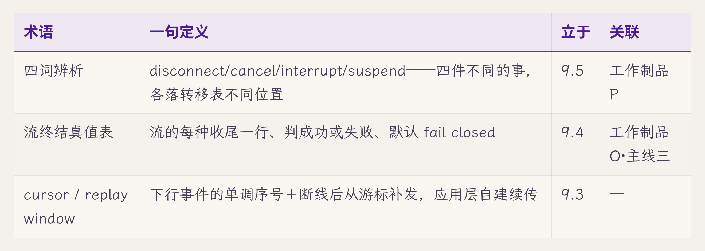

**维护规则**：每章过审后，把该章"新概念自测"里列的概念逐条补入（定义句压到一行、指定义节、连关联术语/工作制品）；与入门卷已有译法冲突时，"中文名"沿入门卷 99-appendix H 节。

---

## 三、探针与观测点

"想验证某个机制、该盯哪个字段/事件"的集中表。三类合一，按用途分类：

- **破坏实验探针**：每章破坏实验的观测点（破坏动作→盯什么→判定）。
- **诊断/复现探针**：事后查案、复现事故用（第三章"探针测试"一路）。
- **运行时探针**：生产可观测点，即各机制 emit 的事件（L2"能看"的落点，全量事件类型见工作制品 C）。

> 形态样张（破坏实验探针已可覆盖第五至九章，原料齐；诊断与运行时两类给说明＋样张）。

**破坏实验探针**

**诊断/复现探针**：系统当时没记的东西，事后靠读代码推演＋探针测试复现（第三章十帧表即如此重构）。查案的锚是**缺失证据清单**——事故调查想要、系统当时给不出的字段（第三章列了五条：意图落盘记录、抢占事件、跳过持久化的痕迹、导航/断开事件、内容快照）。这类探针的产物应反向变成运行时探针的需求（第十三章主场）。

**运行时探针**：即各机制在正常运行时 emit 的事件——run.state_changed、step.completed、effect.intended/result_recorded、approval.requested 等，恢复扫描的关键锚点带 `*`。全量事件类型与信封字段见工作制品 C（Event Schema）。L2"能看"的底线就是这些探针齐全。

**维护规则**：每章过审后，把该章破坏实验的观测点补入破坏实验探针表（一行：破坏动作＋盯什么＋判定）；新增的运行时事件类型同步进工作制品 C，本表只做导览不复制全量。

---

## 四、字段字典导览

字段级的**完整定义已在 `90-artifacts.md`**——本节是导览，指路，不复制。查某个字段是什么，按下表跳转对应工作制品。

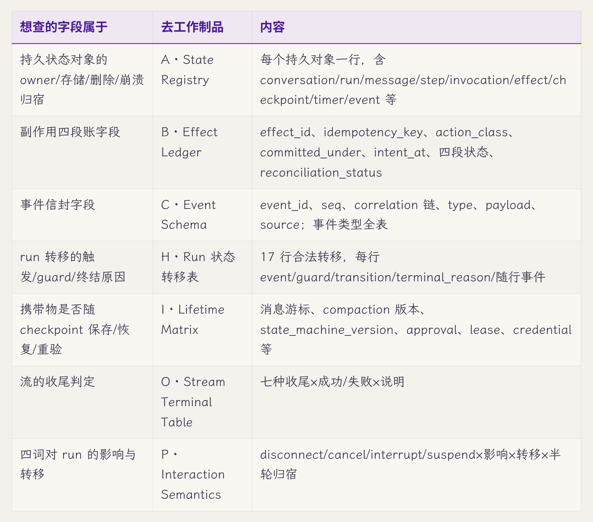

跨表通用字段（每个登记表都带）：`schema_version`（每行必带）、correlation 父链外键（除顶层外每行带、允许为空的层显式置空）、`scope`（会话/项目/全局，作用域即归属）。这三条是工作制品 A 的三条全表规则，适用于所有登记表。

**维护规则**：本节只随新工作制品的增加而加行（指路），不复制字段全文；字段本身的增改在对应工作制品里做。

---

## 五、配图导览

全卷三十四张图，按出场顺序排。这张表不给页码——页码在书前的图目录里；这里给的是**每张图替你回答了什么、它接哪件工作制品**，需要某个答案时可以直接翻到那一张。

分两档：**核心**是"读完这一章，手里该多的那张图"，每章一张；**补充**是同一章里为某个难点单开的图，略过不影响主线。

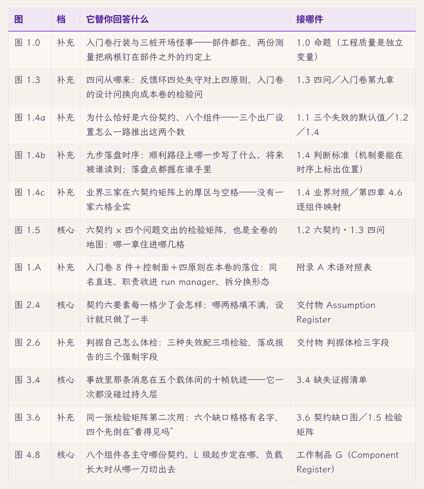

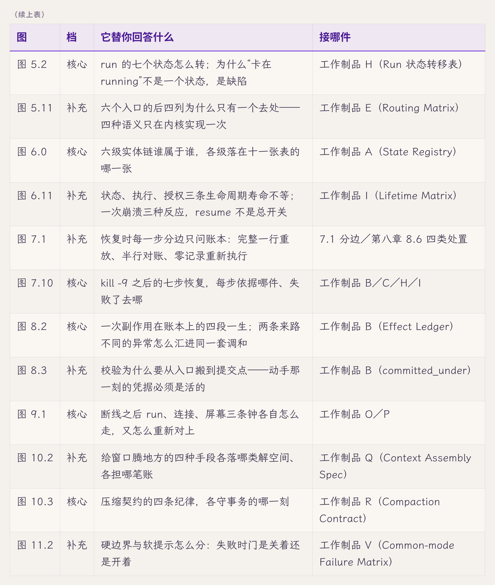

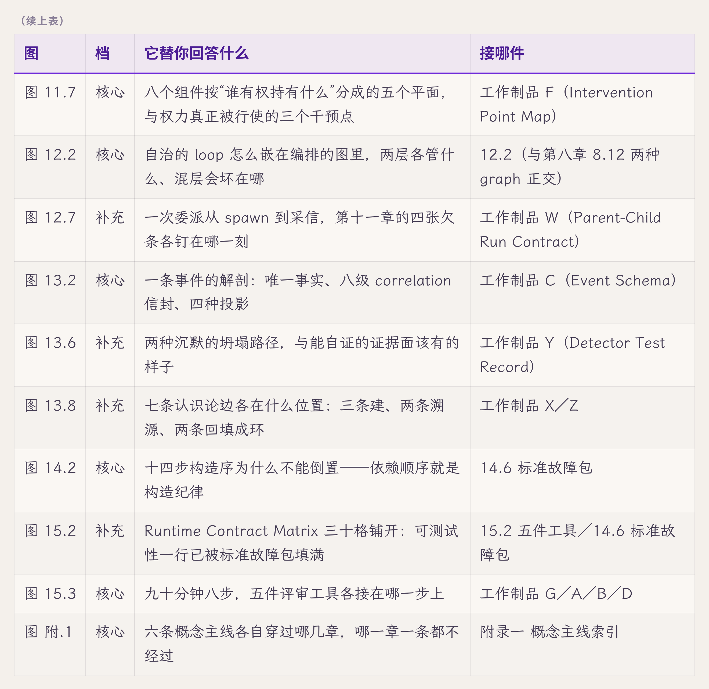

两处"表本身就是图"，不另画：9.4 流终结真值表、9.5 交互语义表——它们的价值在逐行照填，画成图反而毁掉用法。

**维护规则**：每出一张图，加一行（图号＋档＋它替你回答什么＋接哪件）。某一节有意不配图的，也登记一行、写明理由——否则后来的人分不清"确实不需要"和"还没轮到"。

---

## 变更记录

| 版本 | 日期 | 变更 |
|---|---|---|
| v1（骨架） | 2026-07-23 | 建卷二参考附录。一、概念主线索引（六条，落点核准）＋五、图表清单（第一至九章配图占位全表）做全；二、术语速查／三、探针与观测点／四、字段字典导览立形态＋样张＋维护规则，待用户审形态后批量填满第一至九章、并随第十至十五章增量 |
| v2 | 2026-07-26 | 用户裁决两批。**一、概念主线索引回填至全卷**（第十至十五章共 14 站；主线五原"第十一章 主场（前向）"实指成 11.6 收口＋工作制品 U；六条收敛句尾同步扩写；维护规则加"落不上就照实留空"），并新增图 附.1 六条主线穿章图。**五、图表清单按方案 B 换工作，改名"五、配图导览"**：原节是出图前的工单形态（"正文各章的图当前均为（配图占位）""供成稿时统一制作"＋一条自指的 jimi-ink 清除指令），h2 之后的引用块管线剥不到、会原样印给读者；且与 PDF 自动图目录重复。改为逐图的用途索引——图号／档（核心 vs 补充）／它替你回答什么／接哪件工作制品，共 17 行；顺带修掉旧表的 1.0 挂节、1.4 作废行、4.8"数据流向"、8.2 `outcome_verified` 四处失真。L3 自我描述"图在哪"→"哪张图答哪个问题"，覆盖声明同步 |
